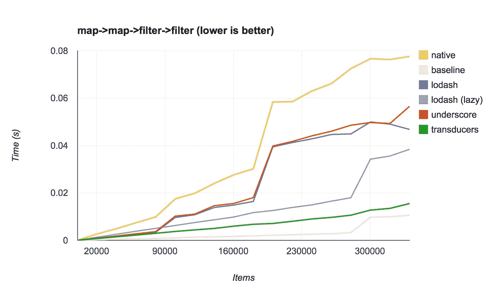

# 如何提升 JavaScript 运行时性能

> 原文：<https://javascript.plainenglish.io/improving-javascript-runtime-and-load-performance-5062dded907a?source=collection_archive---------4----------------------->

## 第 1 部分:减少应用程序启动时间的高级策略

有很多建议，但当涉及到高级性能策略时，建议似乎越来越少。我读了那些文章，但不是太模糊，就是太宽泛，或者只是我已经做过的基本东西。关于性能的更高级的文章在哪里，最重要的是，为什么我们不将技术结合起来，谈论堆叠实现？

这是我在现实世界中的经验，我使用的工具或策略。喜欢网页表现，有点痴迷。这些想法可能有点古怪或抽象，可能有更好的方法来处理 perf。

也就是说…

# 基础知识

让我们把这些说出来，大部分是常识和典型的 perf 建议。

*   使用 Brotli
*   使用 http2
*   使用 webp 和可以动态调整大小并提供最有效格式的 CDN
*   对您的应用进行代码拆分
*   利用边缘网络
*   不要预加载视频，不要自动播放视频，直到交叉点观察器被激活。
*   使用 CSS 和 JS 优化
*   调整 webpack 分块以减少重新部署时的缓存未命中
*   修剪标签管理器，将真正静态的代码移入你自己的

## **用交叉点观察器惰性加载图像**

响应图像、延迟加载和交叉点观察器。

该组件可以加快加载速度。尤其是当一个页面包含多个图像时，即使是很小的图像。图像请求会阻塞网络优先级。我尽量不延迟加载第一张图片，这取决于它在文件夹中的位置。您希望在使用交叉点观察器时留出一些余量，以便在查看之前有足够的滚动时间来加载资源

[](https://github.com/bluebill1049/react-simple-img) [## bluebill1049/react-simple-img

### 智能反应延迟加载图像与 IntersectionObserver API，优先提示和动画加速初始页面加载…

github.com](https://github.com/bluebill1049/react-simple-img) 

需要注意的是，IntersecionObserver v1 不能确定不透明度或高度:0 是否仍然隐藏，所以要确保显示没有折叠的内容，这些内容在技术上仍然在视图中，高度为 0。这同样适用于 z-index。

## **针对第三方域名使用资源提示**

大多数生产环境中都有许多第三方标签。预连接域名和预加载关键标签通常会减少 HTTP 握手和 RTT。HTTPS 和 DNS 解析可能需要 200 毫秒。

我很确定这个回购协议有问题。但是类似这样的东西对于动态创建资源提示非常有用。这在与其他性能策略结合时特别有用，如[门](https://medium.com/p/d03454965962)

[](https://github.com/ScriptedAlchemy/dynamic-resource-hints) [## ScriptedAlchemy/动态资源提示

### 按需在浏览器中注入资源提示。这个插件使你能够预连接，提督，dns 预取…

github.com](https://github.com/ScriptedAlchemy/dynamic-resource-hints) 

# 先进的战术

简要概述了一些基本的性能改进。让我们看看其他一些性能改进。

## 对任何繁重的任务使用 requestIdleCallback。

在空闲时间执行代码是减少运行时开销的好方法。我会经常把`componentDidMount`或者`componentDidUpdate`包在`idleCallback`里。尤其是当装入的代码执行任何繁重的任务时，如 objectFitImages polyfills 或事件处理程序回调。

空闲回调将后台执行安排在不久的将来。通常在创建后的几毫秒内。这是减少长时间运行的函数时间的有效方法。一些代码可以在不阻塞事件循环的情况下运行。

当与其他性能策略结合使用时，空闲回调非常有用，也有很多空闲回调聚合填充可以利用。

## **使用网络空闲回拨**

当网络被确定为空闲时，运行繁重的操作，类似于 TTI 回调。自从 TTI 满足了我的大部分需求后，我就再也没有尝试过。

[](https://github.com/pastelsky/network-idle-callback) [## pastel sky/网络-空闲-回拨

### networkIdleCallback 的工作方式类似于 requestIdleCallback，检测并通知您网络活动何时空闲…

github.com](https://github.com/pastelsky/network-idle-callback) 

## **预热**

预热有几种方式。核心概念是将代码加载与其执行分开。在必须立即从网络、解析、编译到执行之前，给环境一个“预热”的机会。

```
const modulesToHeat = [
      () => require("react-dom"),
      ()=> require('moment'),
      ()=>require('heavyvendor'),
      ()=>require('./App')
    ]
function getInSequence(array, asyncFunc) {
  return array.reduce((previous, current) => (
    previous.then(accumulator => (
      asyncFunc(current).then(result => accumulator.concat(result))
    ))
  ), Promise.resolve([]));
}getInSequence(modulesToHeat,(warm)=>new Promise((resolve)=>{
  requestIdleCallback(()=>{
    resolve(warm())
  })
)).then(()=>{
  // you could use the library in the promise. But if App contained the mount and render function as well. 
 const ReactDOM = require('react-dom')
 const App = require('./App')
 ReactDOM.hydrate(App,DOMNode)
})
```

这种策略缩短了初始绘制和渲染时间，因为主线程不会立即被同一节拍的请求和执行代码所困扰。预热可以让你的绘画和渲染时间低于 50 毫秒。

这种策略可以改进为第三方标签。预热将使用动态资源提示，然后在`idleCallback` ticks 中创建一个脚本标签。当与 [Gate](https://medium.com/p/d03454965962) 如何阻止解锁第三方标签结合使用时，这种机制效果最佳

在使用**模块联合时，我使用了类似的策略。**

```
function preloadComponent(scope, module) {
  return async () => {
    // Initializes the share scope. This fills it with known provided modules from this build and all remotes
    await __webpack_init_sharing__("default"); const container = window[scope]; // or get the container somewhere else
    // Initialize the container, it may provide shared modules
    await container.init(__webpack_share_scopes__.default);  
    // the chunk is downloaded 
    const factory = await window[scope].get(module); return factory;
  };
}const preload = preloadComponent(scope,module)setTimeout(()=>{
  preload.then(factory=>{
    // the factory is called, which returns module.exports const Module = factory()
    Module.default('someData') })
},100)
```

IdleCallback 可以实现，但是由于在这种实现下模块联合是异步的，所以您应该在应用程序生命周期中更高的地方预加载未来的模块。结合交叉点观察器，您可以在调用模块之前执行预加载。

## **重新排列第三方代码的优先级**

[](https://medium.com/@ScriptedAlchemy/increase-app-performance-tame-tag-managers-and-take-back-control-from-third-parties-d03454965962) [## 提高应用性能—驯服标签管理器，从第三方手中夺回控制权

### Javascript 应用程序的性能可能很棘手，即使应用程序已经针对速度进行了很好的调整——有一个很大的…

medium.com](https://medium.com/@ScriptedAlchemy/increase-app-performance-tame-tag-managers-and-take-back-control-from-third-parties-d03454965962) 

分开读一下。Gate 是我见过的最大的性能改进。

## **部分和惰性水合作用**

您可以通过只对应用程序的一部分进行水合来显著提高内部应用程序的性能。因为你通常只需要页面的一部分是交互式的，比如在折叠内容上面。其他的都可以作为 SSR 的静态标记。然后，我们可以用交叉点观察器、空闲回调或根本不使用来合成附加的 react 组件——让标记保持静态。

反应水合可以是广泛操作。我们前期需要水合的越少，水合过程将完成得越快。

当结合闸门生命周期挂钩时，我们可以在达到 TTI 后对低优先级组件进行水合。

一个好的连击是在可见或 TTI 计算上。TTI 是通过监控性能 API 和 CPU 活动周期在客户端计算的。它也适用于所有浏览器。用户体验不会受到影响，因为水合作用会发生在组件可见之前(使用交叉点观察器)，否则，如果用户不看它，我们就没有理由在 CPU 持续空闲时水合应用程序的这些区域。

TTI 回调的优点是 lighthouse 不会测量在 TTI 之后执行的代码。虽然 TTI 本身的权重已经不重要了，但它是改进 lighthouse 和 RUM 指标的一个非常有用的方法。所以我用它来减少像 react hydration 这种长时间运行的功能的时间。并发模式将来可能会改善函数的执行时间。

[](https://github.com/hadeeb/react-lazy-hydration) [## hadeeb/react-lazy-水合作用

### 服务器渲染反应组件的惰性水合作用 npm i 反应-惰性水合作用或纱线添加反应-惰性水合作用基于…

github.com](https://github.com/hadeeb/react-lazy-hydration) [](https://github.com/LukasBombach/next-super-performance) [## LukasBombach/next-超级性能

### 使用 Preact X 为 Next.js 进行部分水合。解释:在 spring，我们正在为报纸创建网站，我们…

github.com](https://github.com/LukasBombach/next-super-performance) 

## 适应性计算

与 TTI 事件类似，您也可以获得设备容量和网络速度。根据网络或内存条件的不同，我可以积极地偷懒或卸载更多的供应商代码。您还可以调整图像质量和分辨率。

[](https://github.com/GoogleChromeLabs/react-adaptive-hooks) [## Google chrome labs/react-adaptive-hooks

### 提供最适合用户设备和网络限制的体验(实验性)这是一套反应…

github.com](https://github.com/GoogleChromeLabs/react-adaptive-hooks) [](https://medium.com/@roderickhsiao/sophisticated-adaptive-loading-strategies-7118341fcf91) [## 复杂的自适应加载策略

### 性能现在是现代 web 应用的核心价值之一。大多数用户将网络浏览器体验从…

medium.com](https://medium.com/@roderickhsiao/sophisticated-adaptive-loading-strategies-7118341fcf91)  [## 网络信息 API poly fill MattSnider.com

### 浏览器正在慢慢实现许多新的 HTML5 APIs，其中之一是网络信息 API。它暴露了…

mattsnider.com](https://mattsnider.com/network-information-api-polyfill/) [](https://github.com/Zizzamia/perfume.js) [## Zizzamia/perfume.js

### 页面速度是一个特性，为了实现它，我们需要了解许多因素和基本限制…

github.com](https://github.com/Zizzamia/perfume.js) 

## 使用更快的环路和数据传感器。

像 map、reduce、forEach、filter 这样的本机循环函数对于批量操作来说很糟糕，并且不能很好地管理内存堆。



下面列出的项目非常适合更快的迭代和数据突变。它们通常优于大型数据集

[](https://github.com/jlongster/transducers.js) [## jlongster/transducers.js

### 一个用于数据通用转换的小型库(受 Clojure 的 transducers 的启发)- jlongster/transducers.js

github.com](https://github.com/jlongster/transducers.js) [](https://github.com/selfrefactor/rambda) [## 自重构/rambda

### Rambda 是流行的函数式编程库 Ramda 的更小更快的替代方案。-文档您可以…

github.com](https://github.com/selfrefactor/rambda) 

## 使用记忆

记忆在反应中应该被更多地使用。尤其是在必须执行大量渲染或具有大量生命周期挂钩的组件上。

反应式代码库有一个坏习惯，就是在渲染周期中执行大量代码。

工程师们也被吸引到最容易放置代码的地方，在 render 方法中。我们也经常在渲染方法中映射数组。用大量渲染来记忆一些旧的遗留代码是一个快速的解决方法。在 URL 解析器之类的实用函数中应用记忆化也可以节省时间，特别是如果它们被多次执行，产生相同的结果

[](https://github.com/theKashey/memoize-state) [## Kashey/memoize 国家

### 缓存(也叫记忆化)是一种非常强大的优化技术——但是它只有在维护…

github.com](https://github.com/theKashey/memoize-state) 

## **使用更精密的预压**

结合 TTI 的试镜。惰性预加载链接可能是有益的。

[](https://github.com/ibrahimcesar/react-quicklink) [## Ibrahim Cesar/react-快速链接

### ⚡️通过在空闲时间预取视口内链接来加快后续页面加载

github.com](https://github.com/ibrahimcesar/react-quicklink) [](https://github.com/GoogleChromeLabs/quicklink) [## Google chrome labs/快速链接

### 通过在空闲时间预取视窗内链接来加快后续页面加载速度快速链接尝试进行导航…

github.com](https://github.com/GoogleChromeLabs/quicklink) 

## **利用多线程**

以无缝方式配置工作池并不容易。

使用`workerpool`和 **Webpack 5 的模块联盟**，我们可以在 Webpack 5 中使用先进的架构模式和尖端技术。

联邦工作线程允许你使用主机自己的远程作为一种方式来移交和工作到另一个线程，它与 MF 无缝地这样做，这种方法可以工作在服务器端或客户端(稍作修改)。我将尽快写关于通用工作池的文章，因为我有动力完成它。

这是设置的样子:

1.  我需要配置 ModuleFederationPlugin

```
plugins: [
  new ***webpack***.***container***.ModuleFederationPlugin({
    name: "dashboard",
    filename: "static/runtime/remoteEntry.js",
    exposes: {
      "./utils": "./lighthouse/utils",
    },
    remotes: {
      dashboard:
        "dashboard@http://localhost:3000/_next/static/runtime/remoteEntry.js",
    },
  }),
],
```

2.我将创建一个工人文件，只是为了更有效的移交(避免函数的序列化)

```
//worker.js
const federatedWorkerImport = async (containerPath, shareInit) => {
  const ***path*** = require("path");

  ***global***.__webpack_require__ = require(***path***.join(
    ***process***.cwd(),
    ".next/server/webpack-runtime.js"
  ));
  const {
    initSharing: __webpack_init_sharing__,
    shareScopes: __webpack_share_scopes__,
  } = shareInit();
  // initialize any sharing, unlikely in a worker
  await __webpack_init_sharing__("default");
  // require container
  const container = require(containerPath).dashboard;
  // Initialize the container, it may provide shared modules
  await container.init(__webpack_share_scopes__.default);
  return (request) => {
    return container.get(request).then((factory) => factory());
  };
};

module.exports = federatedWorkerImport;
```

3.我需要创建一个助手函数来生成一个工人

```
const createWorker = async (data, request, moduleExport) => {
  if (!***process***.browser) {
    const path = __non_webpack_require__("path");
    // could also make this an external, then just use "require"
    const initRemote = __non_webpack_require__(
      // needs webpack runtime to get __webpack_require__
      // externally require the worker code with node.js This could be inline,
      // but i decided to move the bootstapping code somewhere else. Technically if this were not next.js
      // we should be able to import('dashboard/utils')
      // workers/index.js was in this file, but its cleaner to just move the boilerplate
      path.join(***process***.cwd(), "workers/index.js")
    );

    // essentially do what webpack is supposed to do in a proper environment.
    // attach the remote container, initialize share scopes.
    // The webpack parser does something similer when you require(app1/thing), so make a RemoteModule
    const federatedRequire = await initRemote(
      path.join(***process***.cwd(), ".next/server/static/runtime/remoteEntry.js"),
      () => ({
        initSharing: __webpack_init_sharing__,
        shareScopes: __webpack_share_scopes__,
      })
    );
    // the getter, but abstracted. This async gets the module via the low-level api.
    // The remote requires utils (basically this file lol) and i pull toFixed off its exports.
    // alternatively i could copy paste, but MF provides me the power to import the current file as an entrypoint
    const RemoteModule = await federatedRequire(request);
    return RemoteModule[moduleExport](data);
  }
};
```

4.现在创建一个函数，将数据处理交给工作线程池中的一个线程

```
const generateScatterChartData = async (data) => {
  if (!***process***.browser) {
    return pool
      .exec(createWorker, [data, "./utils", "generateScatterChartProcessor"])
      .then(function (result) {
        return result;
      })
      .catch(function (err) {
        ***console***.error(err);
      })
      .then(function (result) {
        return result;
      });
  }

  return {};
};
```

5.现在我们在`getInitialProps`中使用这个函数

```
Report.getInitialProps = async ({ query }) => {
  const { meta, ...report } = await fetch(
    hostname + "api/get-report?report=" + query.report
  ).then((res) => res.json());   const [
    scatterChartData, 
    whiskerChartData,
    multiSeriesChartData,
  ] = await ***Promise***.*all*([
    generateScatterChartData(report), //worker thread
    generateWhiskerChartData(report), //worker thread
    generateMultiSeriesChartData(report), //worker thread
  ]);
  return {
    scatterChartData,
    whiskerChartData,
    multiSeriesChartData,
    meta,
    appKeys: ***Object***.keys(report),
    query,
  };
};
```

我使用`workerpool`在节点和客户机上创建通用工人。

[](https://github.com/josdejong/workerpool) [## josde Jong/工人村

### 提供了一种简单的方法来创建一个工人池，用于动态卸载计算以及管理池…

github.com](https://github.com/josdejong/workerpool) 

这样做让我的应用内性能和服务器响应时间提升了 400%

其他选项，我没有尝试过——比如 parallel.js

[](https://github.com/parallel-js/parallel.js) [## 并行-js/parallel.js

### 用 Javascript Parallel.js 实现简单的并行计算是一个库，用于使 Javascript 中的并行计算变得简单…

github.com](https://github.com/parallel-js/parallel.js) 

我还在试验从 Web workers 内部授予 dom 访问权限的方法，如果他们中的一些人能够在带有 shimmed DOM API 的 worker 内部工作，这可能会减少供应商的影响

[](https://github.com/ampproject/worker-dom) [## ampproject/worker-dom

### 相同的 DOM API 和框架，但是在 Web Worker 中。- ampproject/worker-dom

github.com](https://github.com/ampproject/worker-dom) 

## **在模块级别监控性能。**

这种方法对于寻找应该进行代码分割或预热的重型模块非常有用。然后，您可以返回并追溯工作，以改善最糟糕的违规模块。

[](https://github.com/SinaMFE/perf-module-webpack-plugin) [## Sina mfe/perf-module-web pack-plugin

### webpack 捆绑的所有模块的插件计算时间，并显示花费自己的前 N 个模块的列表…

github.com](https://github.com/SinaMFE/perf-module-webpack-plugin) [](https://github.com/bfrost2893/user-timing-plus) [## BF rost 2893/用户计时加

### 增强的用户计时 API。通过在 GitHub 上创建帐户，为 bfrost2893/user-timing-plus 开发做出贡献。

github.com](https://github.com/bfrost2893/user-timing-plus) 

## **伟大的监控厂商**

虽然模块级和用户计时是有帮助的——但是建立一个 Kibana 仪表板来绘制所有这些数据可能需要更多的努力。尤其是朗姆酒信息。

[**蓝三角**](https://www.bluetriangle.com/) **说到性能，是我最喜欢的**厂商之一。我喜欢的**核心特性有:**

*   实时 RUM 数据
*   关于核心网络生命指标的报告
*   你可以运行合成样本
*   他们可以准确地计算出因业绩不佳而错失的收入机会
*   与 Gate 类似，Blue Triangle 能够在客户端用 RUM 计算 TTI。
*   它有一个很棒的数据科学引擎，我用它来诊断特定互联网交换节点的特定问题。
*   它很强大
*   工作人员很好共事，并且在那里支持他们的客户。
*   该公司非常重视用户的意见

RUM 信息有助于了解您的代码对用户设备的影响。多亏了 blue triangle，我能够将实验性的性能增强部署到生产中。然后可以看看朗姆酒数据。在 5 分钟内，我通常会得到我的答案，他们要么合并到主分支，要么重新部署主分支，继续我的实验，直到我看到我预期的影响。

您还可以将自定义测量时间发送回 BTT

我希望 Blue Triangle 在产品上有一些**方面的改进**。

*   将您的 RUM 测量函数公开为回调事件。
    因为 BT 已经向其服务器报告了所有这些 RUM 数据。如果有像`window.btt.events.isInteractive(myCallback`和`window.btt.networkType // returns [3G,WIFI,LTE]`这样的东西，那将是令人惊奇的，不仅 BT 能够测量朗姆酒，而且实际上提供了帮助工程师改进的回调。如果你知道一个设备的网络速度/质量，这将是一个惊人的信息。我可以建立由朗姆酒数据支持的适应性系统
*   报告标准的`performance.mark`用户计时 API。我希望能够在不使用自定义标记的情况下绘制组件级性能的图形。

[**哨兵**](https://sentry.io/) 是另一个值得投资的关键厂商。

您需要知道是否存在标准回归和 QA 中没有发现的竞争条件。错误报告和快速部署管道让您可以更快地移动和快速回滚。

花时间探索 sentry APIs 和可用的 webhook 选项将是非常有价值的。我计划使用 Sentry、Blue Triangle 和仍在测试中的**联邦仪表板**来利用**模块联邦**和命令控制系统，这些系统将能够自动适应如何以及什么版本的联邦代码被附加到主机。我将发表一篇单独的文章，讨论一个被设计成自我修复和自我调节的架构是什么样子的。好消息是。像这样的系统并不太难制造，因为我拥有使它成为可能的工具。

## **格拉马纳和基巴纳**

制作图表和消费大量数据的神奇工具。
这些是我在以前的公司的秘诀——拥有数据是无价的。有数据就可以卖任何主动权。

这篇文章(与这些天的模块联合相比有点老)深入探讨了我绘制的数据，以及这些 graphana 仪表板如何让我们超越后端片段缓存

[](https://levelup.gitconnected.com/micro-frontend-architecture-replacing-a-monolith-from-the-inside-out-61f60d2e14c1) [## 微前端架构:从内到外取代整体架构

### 如何利用微前端技术实现遗留应用的现代化

levelup.gitconnected.com](https://levelup.gitconnected.com/micro-frontend-architecture-replacing-a-monolith-from-the-inside-out-61f60d2e14c1) 

使用这些仪表板工具，你可以获得大量高分辨率的数据。尤其是在前端。我使用一个代理来根据我将发送到端点的 POST 请求发出日志。绘制任何和所有前端指标是您保持在线和稳定的方式。

I 良好的监控策略是将事件附加到业务关键流。比如，加入购物车。通过绘制点击和成功调用的图表，您可以创建一个移动平均值，然后任何指标低于标准移动平均值，就会触发警报并向 slack 发送通知。

我依靠这个来定位糟糕的部署问题。Graphana 也节省了一些可观的收入。在亚马逊更新他们的状态之前，我能够对著名的东海岸 AWS 中断做出反应。当 AWS 状态页面显示东海岸停电时。我们已经将生产转移到欧洲的备份数据中心。

## **考虑使用低热量水来加快初始启动。**

这个方法的工作原理是用轻量级的东西替换 ReactDOM。它可以帮助初始水合时间，使应用程序部分或完全互动。你也可以使用一个更小的 dom 库来处理最初的水合作用。然后在空闲时间用 ReactDOM 重新水合

[](https://github.com/dai-shi/react-hooks-worker) [## 戴氏/反应钩-工人

### React 为网络工作者定制钩子。Web Workers 是浏览器中主线程的另一个线程。我们可以负重奔跑…

github.com](https://github.com/dai-shi/react-hooks-worker) [](https://github.com/alewin/useWorker) [## alewin/useWorker

### 运行昂贵的函数而不阻塞 UI(显示实时 gif)支持承诺模式而不是事件消息大小:…

github.com](https://github.com/alewin/useWorker) [](https://github.com/LukasBombach/next-super-performance) [## LukasBombach/next-超级性能

### 使用 Preact X 为 Next.js 进行部分水合。解释:在 spring，我们正在为报纸创建网站，我们…

github.com](https://github.com/LukasBombach/next-super-performance) [](https://github.com/jiayihu/react-tiny-dom) [## 胡佳艺/反应小王国

### react-tiny-dom 是 react-dom 的最小实现，作为使用 React 16 官方渲染器 API 的自定义渲染器。的…

github.com](https://github.com/jiayihu/react-tiny-dom) [](https://github.com/web-perf/react-worker-dom) [## web-perf/react-worker-dom

### 使用 Web Workers 的 React 自定义渲染器。所有虚拟 DOM 协调都发生在 WebWorker 线程中。仅节点…

github.com](https://github.com/web-perf/react-worker-dom) [](https://github.com/NervJS/nerv) [## 神经/神经

### 反应极快的替代产品，兼容 IE8 和 React 16。-神经/神经

github.com](https://github.com/NervJS/nerv) [](https://github.com/sophiebits/react-dom-mini) [## sophiebits/react-dom-mini

### 来自我的 React Conf 2019 talk 的玩具 React 渲染器，“构建自定义 React 渲染器”解散 GitHub 是超过 50…

github.com](https://github.com/sophiebits/react-dom-mini) 

## 或者尝试去抖渲染 hoc

这是我正在尝试的一个新技巧(现在)

我的`Link`组件慢。孩子变了，道具变了。每次我都需要解析 URL 并判断它是内部路由器链接还是外部超链接。

虽然这不是最优化的解决方案，但在我测试的条件下非常有效。

解析 URL 大约需要 1 毫秒，整个组件大约需要 1-2 毫秒。总的来说，这是组件花费的时间(所有链接的总和)


每次渲染大约 50 毫秒！哎哟！

因为这篇文章促使我让 universal workers 开始运行。我决定看看如果我把 URL 解析移动到一个我一直使用的懒惰水合来改善时间的`workerpool`中，那么`link`会改善多少，但是我需要打开 PR 来启用没有包装组件的水合。

我将 URL 解析转移到一个 worker 中，然后创建一个`useEffect`钩子，一旦 worker 有响应就更新超链接，这让我可以在主线程之外并行处理所有链接。这将节省大约 200 毫秒。

```
const [match, setMatch] = React.useState({});
React.useEffect(() => {
  process.browser
  && requestIdleCallback(() => {
    pool
      .sendCommand('doesMatchRoute', [url, ***publicConfig***])
      .then((data) => {
        setMatch(data);
      })
      .catch((err) => {});
  });
}, [url]);
const { routeMatch, relativeURL } = process.browser
  ? match
  : doesMatchRoute(url);
```

我不希望发生闪烁，因为我不再拥有传递给它的子标记的属性。所以渲染可以闪烁，如果我`return null`直到工人完成。**这是 SSR** 所以保持最初的标记很重要。直到我回到懒惰的水化，我只是对待所有的环节是`<a>`

即使我去掉了闪烁——那些工作人员也不得不重新计算相同的 URL 几次，实际上没有什么重要的变化需要立即进行 50 毫秒的重新渲染。这让我想到去抖组件的重新渲染周期。如果道具改变了很多次，让我们去抖反应会有多快实际重新渲染。

[](https://github.com/podefr/react-debounce-render) [## pode fr/react-去抖-渲染

### react-debounce-render 是一个高阶组件，它包装 react 组件并对其渲染进行去抖。这个…

github.com](https://github.com/podefr/react-debounce-render) [](https://dev.to/botreetechnologies/how-can-we-debounce-render-a-react-component-with-example-33gj) [## 如何去抖渲染一个 React 组件？(举例)

### 根据 https://www.geeksforgeeks.org/debouncing-in-javascript/的说法，JavaScript 中的去抖是一种用来…

开发到](https://dev.to/botreetechnologies/how-can-we-debounce-render-a-react-component-with-example-33gj) 

```
export default (process.browser
  ? debounceRender(LinkGenerator, 0.1) : LinkGenerator
  : LinkGenerator);
```

这是一个相当花哨的解决方案。但是我不能否认所有这些结合在一起的结果。随着部分水化，我预计最初的渲染会有所改善，因为我仍然在打电话给`react.createElement`


> 不管是不是黑客，那都令人印象深刻！

## **最后的结果会是什么样子。**

我会避免去抖。因为我还在为第一次渲染付钱。

最终的解决方案将会是`react-lazy-hydration`，但是会有额外的修改。我想有能力在承诺的决议上水合。

这将允许我让 React 完全忽略标记，直到工人用更新来响应。一个有前途的能力也将让我选择水合物反应成分的基础上 TTI。我可以使用 Gate，它已经在监控芯片性能并阻止供应商标签，直到压力减小。

工人池需要合并到一个钩子或实用函数中，最重要的是——我希望这些工人池使用模块联合(通用)。我给工人的消息将作为工人内部 MF 的控制器。因为远程容器只有 5kb，所以 worker 的初始解析和启动时间要短得多。当我需要更多自己的代码库时，主机通过一个 worker 向远程发送消息，告诉它应该执行哪个模块，以及用什么参数来执行。

## **利用 GPU 进行数据处理**

CPU 能够执行任何计算任务。但是 GPU 在特定任务上速度更快——将工作转移到 GPU 可以导致更快的操作。但是 GPU 不像 CPU 那样通用，卸载随机函数可能不会产生预期的结果。因此，明智地选择并基准测试哪些应该驻留在 worker 中，哪些应该驻留在 GPU 线程中

[](https://github.com/gpujs/gpu.js) [## gpujs/gpu.js

### js 是一个 JavaScript 加速库，用于 Web 和…

github.com](https://github.com/gpujs/gpu.js) 

## **用更好的静态分析干燥代码**

删除代码仍然是最好的性能策略。不看 gzip 大小缩减，看未压缩文件大小。您可以删除 300kb 的代码——当应用 gzip 时，它最终可能是 5kb。但是浏览器仍然需要解压缩和解析完整的大小。仅仅因为它便于传输并不意味着它很容易 JIT 解析、编译和执行。删除代码是你最好的策略:)

[](https://github.com/rdgd/twly) [## rdgd/twly

### twly(读作“towel-E”)是一个静态分析工具，它可以帮助你保持代码干燥(不要重复自己)

github.com](https://github.com/rdgd/twly) 

## 暂时就这样吧！

这篇文章太长了。我会再写一篇，因为还有很多要说的。

第二部分将被推文，并添加到这个位置。

你知道在哪里能找到我。

推特: [ScriptedAlchemy](https://twitter.com/ScriptedAlchemy)

Github: ScriptedAlchemy