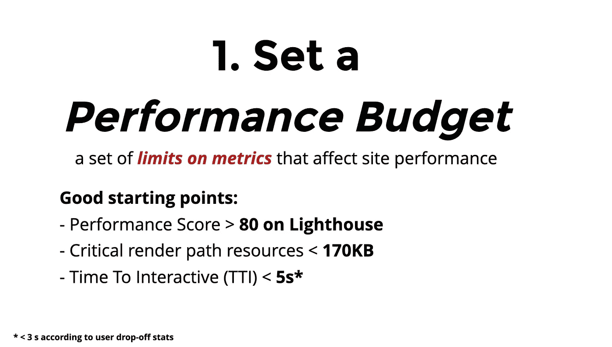
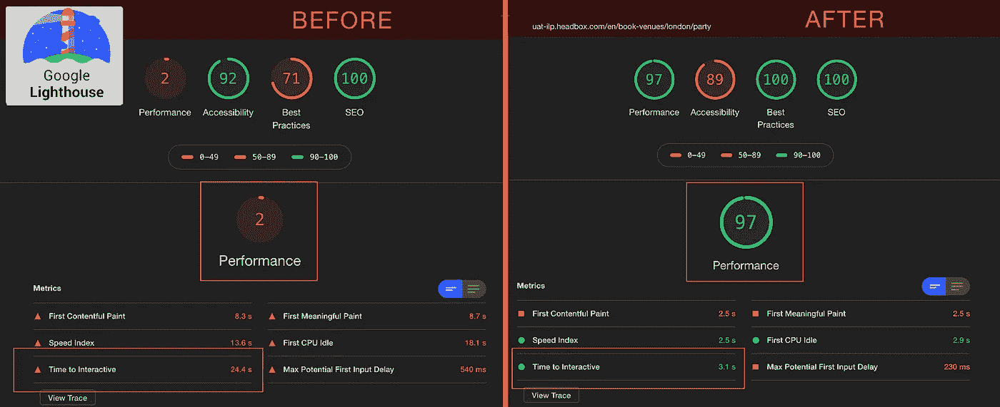
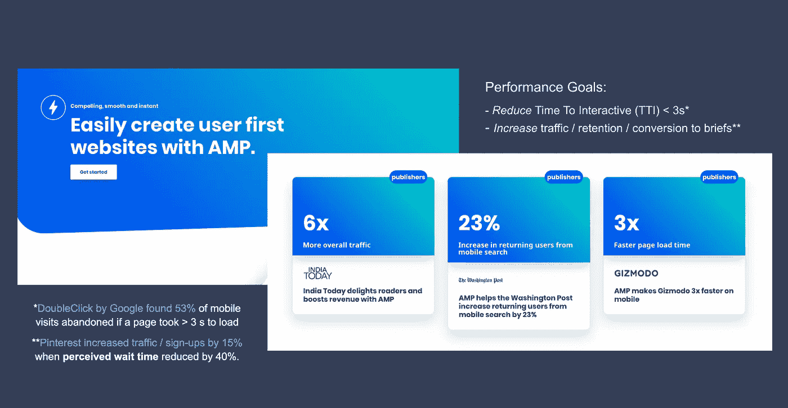

# 使用 Google 的加速移动页面和 Next JS 改进 SEO 和 UX

> 原文：<https://javascript.plainenglish.io/improving-seo-and-ux-using-googles-accelerated-mobile-pages-with-next-js-e22320bd331?source=collection_archive---------4----------------------->

## 当代绩效预期的一个注解(UX 和徐)

人们对搜索引擎的当代浏览体验和网站性能有一系列的期望。而谷歌报告称，如果网站加载时间超过 3 秒，用户流失率会达到 50%(TTI)😱搜索引擎也优先考虑那些显示出惊人的加载速度的网站(在一系列其他质量中)。

下面是一个关于站点性能的常见最低期望的例子

这里有一篇关于[将性能预算纳入构建的优秀文章](https://web.dev/incorporate-performance-budgets-into-your-build-tools/)，讨论了最佳实践和用户期望，以及帮助实现设定性能预算的技术。

还可以考虑看看[我为前端开发准备的这个演示文稿](https://slides.com/jolantajasiulion/performance-ptimisation-for-the-front-ends)，其中详细介绍了浏览器如何解析捆绑代码并将其转化为屏幕上的像素。这些区别有助于理解流程的哪些部分可以并且应该进行优化，以实现惊人的快速性能！

## 利用 AMP & Next JS 改进指标

这里有两个网站的例子，一个没有考虑到敏锐的性能优化(在左边)，它的继任者重建使用 [Next.js](https://nextjs.org/) 和 [Google 的 AMP 组件](https://amp.dev/about/how-amp-works/)开发。

请注意交互时间(TTI)和整体性能得分，它们表明用户体验的好坏以及搜索引擎对页面的排名有多高

[加速移动页面](https://amp.dev/documentation/components/) —谷歌为高性能应用开发的组件库是一个移动优先的 html 资源，可用于门户网站和移动网站。

用他们自己的话说，这是“节食的 HTML”，对各种功能有严格的限制，这样就不会牺牲网站的性能。它更适合登陆页面或其他类似静态的网站，不需要大量的交互或动画。

如果用例是正确的，你可以期待重大的统计改进，其他出版商报道。

本系列的下一篇文章将探讨提升性能和开发人员体验的下一个 JS 和 AMP 特性(与 React 相比)。