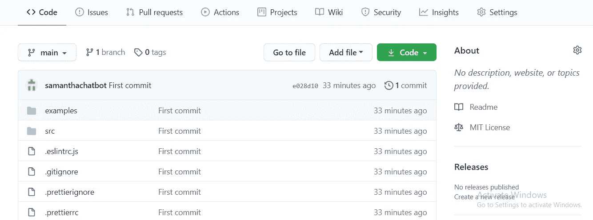

# 与 Gatsby 和 Netlify 一起构建和部署作品集网站

> 原文：<https://javascript.plainenglish.io/in-4-steps-you-can-build-and-deploy-a-portfolio-site-1c7792427bc2?source=collection_archive---------9----------------------->

## 在静态站点生成器 Gatsby 的帮助下，您可以快速构建一个 portfolio 站点，并使用 Netlify 部署它。


# **简介**

在这个数字世界里，不管你来自哪个领域，作品集都比简历更能给人留下深刻印象。它可以形象化你的服务，并以更好的方式展示作品。作品集提供了一个你自己的品牌，这将有助于更好地与你的客户打交道，或者作为一名求职者，帮助招聘人员有效地了解你的技能。

本文将指导您完成建立投资组合网站所需的所有步骤。它是为那些努力构建专业外观的投资组合的开发人员准备的；完成以下步骤后，你将拥有一份可以在简历或社交媒体上分享的专业作品集。

# **步骤**

1.  安装所需的软件
2.  自定义项目
3.  制作 GitHub 资源库
4.  部署到网络
5.  **安装所需软件**

为了建立投资组合网站，你必须安装一些软件工具，包括以下内容。

*   **Node.js:** 从他们的网站本身下载并安装最新版本的 [Node.js](https://nodejs.org/en/) ，这是我们建站所需的主要工具。安装 Node.js 以检查它是否已成功安装后，在终端或命令提示符下逐一键入以下命令。

```
node --version
npm --version
```

如果安装成功，终端将显示 Node.js 安装版本和 npm 安装版本。


Terminal view after Node.js installation

*   **Git:** 我们安装所有这些软件的最终目标是将 Gatsby 静态站点生成器环境设置到我们的系统中。Git 帮助 Gatsby 下载一些运行其环境所需的文件。Git 安装取决于您使用的操作系统；[访问该站点](https://git-scm.com/downloads)进行安装。您可以通过在终端中输入下面的命令来检查 Git 安装是否成功。

```
git --version
```


Terminal view after Git installation

*   **Gatsby CLI:** 由于我们的 portfolio 站点是使用 Gatsby 生成的，我们必须安装 Gatsby CLI，它可以通过在您的终端中键入以下命令来安装。

```
npm install -g gatsby-cli
```

安装后，键入以下命令检查 Gatsby CLI 是否已成功安装。

```
gatsby --help
```


Terminal view after Gatsby CLIinstallation

***注意:*** *安装完 Gatsby CLI 后，必须确保命令提示符或终端有上图所示的 Gatsby 命令。如果不是这样，您可能在安装过程中遗漏了一些东西或者没有正确安装。*

*   **Gatsby Starter:** 用于将投资组合项目提取到本地机器中。我们必须选择一个位置来放置项目源代码，通过终端导航到首选位置，然后键入下面的命令。

```
gatsby new my-gatsby-project [https://github.com/cobidev/gatsby-simplefolio](https://github.com/cobidev/gatsby-simplefolio)
```

*   **Visual Studio Code:** VSCode 是这里的一个代码编辑器，我们用来编辑通过 Gatsby Starter 获取的项目源代码。安装非常简单；从其[主页](https://code.visualstudio.com/download)下载最新版本。

2.**定制模板**

我们已经安装了定制项目所需的所有软件工具。现在启动 VSCode 编辑器，打开使用 Gatsby Starter 获取的项目 my-gatsby-project，然后在 VSCode 上，打开终端并键入下面的命令。

```
gatsby develop
```


Development server started message

编译完代码后，VSCode 终端将显示消息构建开发包，然后使用 URL[http://localhost:8000/](http://localhost:8000/)检查浏览器，您可以看到 portfolio 站点在端口 8000 上启动并运行。让我们按照我们的要求定制网站；转到项目结构中的/src/mock/data.js，您可以看到导出了七个对象，我们必须按照我们的要求填充每个值。


Screenshot of project structure

data.js 中的每个对象对应于项目组合站点中的每个部分；例如，用您的名字编辑第一个对象 headData 属性 title，并在 VSCode 中保存更改，然后刷新浏览器，您可以在标题栏上看到您的名字。每个对象的用法如下。

*   **headData:** 用于修改我们投资组合的标题；它有三个属性标题，lang，description。属性 title 是编辑浏览器选项卡上的标题栏名称；lang 指定了我们需要的首选语言，描述就是定义我们做什么。

```
export const headData = {title: 'Krishnanunny H',
lang: 'en',
description: 'Welcome too my websites', };
```

*   **heroData:** 用于修改登陆页面的内容；它有四个合适的标题、名称、副标题和 cta 填写这些值作为您的首选项。
*   **关于数据:**如果我们向下滚动一点，你会看到另一个标题为“关于我”的部分；aboutdata 对象用于编辑该部分。它具有 img、paragraphOne、paragraphTwo、paragraphThree 和 resume 等属性。第一段、第二段和第三段是描述你自己。将你的简历上传到 google drive 或你喜欢的存储设备上，并给出它的 URL 作为简历的属性值；然后，用户点击简历按钮，你的简历就会显示出来。属性 img 显示您的个人资料图片；您必须将您的个人资料图片放在 src/images/文件夹中，并提供图像名称作为属性值。


Screenshot of image folder structure

***注意:*** *站点上所有要渲染的图片都应该活在 src/images/文件夹里面；然后，盖茨比可以正确地显示图像。每次更新文件夹上的镜像，都要重启开发服务器；否则，将会出现错误。*

*   这是一个对象数组，你可以在数组中放置任意多的项目对象。每个对象都有 id、img、title、info、info2、url 和 repo 等属性。您不需要修改属性 id，因为当前值 nanoid()会自动生成一个唯一的 id。属性值的其余部分需要根据您的偏好来填充。
*   **contactData:** 这个对象有三个属性，cta、btn 和 email，并根据您的喜好填充这些属性。
*   **footerData:** 用于修改页脚部分，它是一个对象数组，您可以根据自己的喜好删除或添加社交媒体图标。
*   **githubButtons:** 该对象处理底部的 GitHub 相关按钮；您可以通过向 isEnabled 属性提供 false 值来隐藏它。

```
export const githubButtons = {isEnabled: false,};
```

因此，我们项目的定制已经完成，下一步是制作 GitHub 库并上传我们的项目。

3.**制作 GitHub 库**


要创建一个 GitHub 资源库，你必须创建一个 GitHub 账户，访问他们的[主页](https://github.com/)。完成 GitHub 账号后，做一个资源库。

选项你的资源库会引导你在 GitHub 上做一个资源库。

之后，您必须移除现有的。从本地项目文件夹中取出 git 文件；否则，最近创建的 git 可能会发生冲突。为此，请在您的本地项目终端中输入以下命令。

```
rm -rf .git
```

现在我们已经删除了现有的。git 文件，然后，我们需要初始化一个新的 git 到本地项目，按照下面的命令。

```
git init
```

下一步是将所有文件添加到新初始化的 git 中，以使用下面的命令。

```
git add .
```

提交您在本地存储库中暂存的文件。

```
git commit -m "First commit"
```

在 GitHub 存储库的快速设置页面顶部，点击复制远程存储库 URL。


Remote URL to copy

```
$ git remote add origin *remote repository URL*
```

我们需要从主分支切换到主分支

```
$ git branch -M main
```

最后，我们需要将所有本地更改推送到远程存储库。

```
git push -f origin main
```

如果一切顺利，您可以在选择主分支时看到 GitHub 远程存储库中的所有文件。



Main branch after pushing the changes

因此，我们成功地创建了一个 GitHub 存储库，并将所有文件推送到存储库中。最后一步是从 git 存储库部署我们的站点。

4.**部署到网络生活**

Netlify 使得部署过程非常简单，因为我们可以直接从 GitHub 库部署我们的站点。所以最后一步，我们必须在 [Netlify](https://www.netlify.com/) 上建立一个账户。


Netlify Dashboard

创建帐户后，在 Netlify dashboard 上点击来自 Git 的新站点。
从那里你会被导航到另一个标签，在那里有一个选项连接到 git 仓库，参考下面的截图更好地理解。


Netlify Git integration screenshot

然后 Netlify 会要求用你的 Github 帐户进行认证，然后选择你存放代码的库。下一步是单击 deploy site 按钮，Netlify 将自动构建静态站点并进行部署。


***注意:*** *确认分支部署，构建命令和发布目录输入如上图所示；不然路上出了问题。*


最后，我们已经部署了代码，我们可以通过 Netlify 提供的自定义 URL 访问该网站，通过单击该 URL，您将被导航到您的投资组合网站。

# 结论

这篇文章的目的是使一个投资组合网站尽可能简单。因此，如果你是一个正在找工作的学生或对 CSS 没有太多想法的开发人员，他们可以有一个专业的作品集来展示你的作品或服务。

您可能会在这些步骤中遇到一些错误，只需在 google 上搜索几下就能解决。