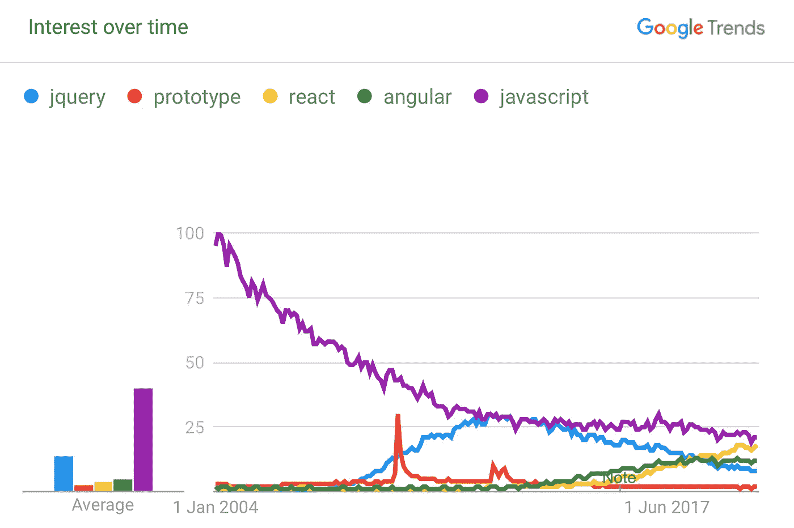

# 为 jQuery 辩护

> 原文：<https://javascript.plainenglish.io/in-defence-of-jquery-6dfe6dcfb5c?source=collection_archive---------4----------------------->

## 和其他过去的罪恶


Photo by [The New York Public Library](https://unsplash.com/@nypl?utm_source=medium&utm_medium=referral) on [Unsplash](https://unsplash.com?utm_source=medium&utm_medium=referral)

任何事情都有时间和地点——jQuery 的时代大约是 2012 年，这可能是为什么我的年轻同事对它的反感程度与他们对三列固定宽度表格布局的反感程度相同。

在 jQuery 的黄金时代，我是一名前端开发人员，远在 npm 成为我们安装库的方式之前。不久前，回想起来，我还在一个名为“functions.js”的文件中为整个网站编写 jQuery 代码。最终，这个文件变得太大了，以至于无法在我的 IDE 中轻松加载，有几千行。我的解决方案？创建“functions2.js”以分担负载。

我直觉告诉我这是错误的，就像未来的我在愤怒地呼喊过去的岁月，我天真的大脑不知何故意识到我会带着耻辱回顾这一天。他们说分享你的痛苦是一种宣泄，所以我在这里，告诉你我过去是如何写 JavaScript 的。

每个 jQuery 脚本都以相同的方式启动:

```
$(document).ready(function() {
    // Do the thing
});
```

这意味着装载顺序不再重要。你们这些年轻人可能会问“他说的装货顺序是什么意思，爷爷？”好吧，围过来让我告诉你。

# 我们过去如何获得 Javascript 依赖关系

你看，在我的时代，没有`require(that)`和`import thing from ‘somewhere’`。如今，您倾向于在页面中包含一个脚本标签，它可以抓取您需要的所有内容。大概是这样的:

```
<script src="./app.js" type="text/javascript"></script>
```

这可能会关闭并通过前面提到的`require`或`import`语句获取您的其他依赖项。它的美妙之处在于，这两种方法都允许您在需要时从另一个文件中获取所需的内容。很明显，如果你做了这样的事情，它就坏了:

```
console.log(data.toString()); // error: data is not defined
let data = require('data');
```

这时你说“哦，是的，我应该在使用它之前导入/要求它”。但是在过去，如果`data`在另一个文件中定义，它通常是全局声明的——即附加到`window`对象上。您没有将它从一个文件中导出并导入到另一个文件中。您将它附加到全局上下文中，并希望在尝试和使用它之前加载“data.js”。

您必须使用脚本标签来包含新的 JavaScript 功能。脚本标签，我告诉你！恐怖还没有结束。您的脚本标签可能描述了您想要实现的功能，但是它没有收集您需要的所有内容。如果该文件有依赖项，您也必须导入它们。重复直到精神错乱。

回到你的 HTML 中，你必须非常熟悉每一个脚本标签的用途，才能知道它们的加载顺序。如果你在“librarybhickendsona”之后加载“libraryA”*，你甚至可能不会马上知道哪里出了问题。*

或者你也可以，你知道，你一直等到“就绪”事件从文档中被触发，到那时所有的东西都被加载并准备好使用。这成了一种很常见的模式。这不是 jQuery 发明的，但是浏览器对“onLoad”事件的支持是零星的。document.ready 事件是我第一次看到这种模式被广泛使用。它在很大程度上解决了整个装载顺序问题。

然而，它没有解决在一个文件中为应用程序编写整个逻辑的问题。我记得当人们开始大声谈论 AngularJS(在它有 JS 后缀之前)并认为它不会流行起来的时候。我和我的 2000 行 jQuery 意大利面代码都很好，非常感谢。

当然，我错了。曾几何时，我不计后果地将页面拼凑在一起，并不关心架构或可维护性之类的概念。我也不太担心微优化。有更大的鱼要炸，就像我展示的原始大小为 200 像素的 3MB 图片。

# jQuery 包的大小

信不信由你，曾经有一段时间，网络由许多通过超链接连接在一起的页面组成。如今，一切都是单页应用，用简单换取速度，最大限度地减少需要下载两次的内容。那个标题，导航——你页面上所有的共享内容都是有代价的。如果你的请求重复了你以前见过的东西，你必须做的每一个额外的请求都有一个不可接受的开销。

jQuery 的一个经常被吹捧的弱点是它的包大小，好像 90kb 的迷你 JavaScript 将是你的网站，不，你的业务的终结。然而，为了获得相同的最终结果——一个显示内容的页面，我们欣然接受了 109kb 的 React + React-Dom。哦，是的，你可以用 React 做更多的事情，我听到了大众的呼声，但是在 jQuery 中你也可以做很多事情。这些千字节必须有所用途。

当然，Gzip 有助于将影响最小化，但关键是，即使在网速缓慢的时代，当我们的 56k 调制解调器在 HTML 的重压下颤抖时，文件大小也不是 jQuery 的批评者所说的那样可怕。追求更小的包裹尺寸可能更适合用来晒太阳或遛狗。

至于 jQuery 本身的大小，内容交付网络非常有效地解决了这个问题。

你看，jQuery 在某种程度上是 JavaScript 的同义词，这是前无古人后无来者的。每个人和他们的妈妈都在使用它，这意味着引用 CDN 托管的 jQuery 库可以节省成本。

## CDN 是什么鬼？

听起来像是开发商新闻网，不是吗？但事实并非如此，内容交付网络托管着流行的 JavaScript 和 CSS 库，鼓励你引用它们的拷贝，而不是将其上传到你的网站。有几个好处:

*   首先，你的浏览器会缓存结果，这意味着任何引用相同文件的网站都不必再次下载。曾几何时，jQuery 非常丰富，几乎每个人都在使用它，这意味着在您用户的浏览历史中，很有可能有人在使用与您相同的 CDN。您站点的用户可能根本不需要下载 jQuery。
*   其次，通过引用另一个域，您可以增加您的站点可以同时列出的文件数量。你看，浏览器从同一个域并行执行的请求有一个最大数量。一些网站把它们的图片放在一个子域上，就是为了应对这种情况。

当然，您可以通过从 CDN 加载现代框架来获得这些好处，但是像 WebPack 这样的工具的激增意味着您更有可能只是提供一个本地包，将所有脚本包含在一个文件中。这种方法对于复杂的站点更有效，因为它创建了一个高度优化的单一下载。但是这样的工具属于高级阵营。见鬼，作为一名前端开发人员，我有 13 年的经验，在一个好日子里努力配置 WebPack。jQuery 的美妙之处在于它既容易上手，又广受欢迎。

即使没有 WebPack，现代框架从 CDN 中获得的好处也不会比 jQuery 多，因为没有一个框架是如此的占主导地位，以至于每个人都在使用它。React、Angular、Vue——他们都与许多其他竞争对手共享舞台。过去，jQuery 唯一真正的竞争对手是 Prototype，即使是它，在过去十年的黎明也已经奄奄一息。

不相信我？让我们使用谷歌趋势的高度科学和可靠的艺术:


起初，我对 Prototype 框架兴趣的这种现象性的暂时上升感到困惑，直到我意识到 2009 年 6 月 Steam 和 XBox 360 上最畅销的游戏正是 Prototype。

然而，这确实使 jQuery 在上面的图表中占主导地位更加令人印象深刻。想想它的竞争对手——React、Angular、Prototype——所有这些都是常用词，可能会合理地出现在搜索中，而与 JavaScript 没有任何关系。你认为有多少人不小心夸大了 jQuery 搜索结果？

React 也许有一天会达到 jQuery 统治地位的巅峰，但是按照上面的标准，它目前只达到了三分之二。当您将“JavaScript”加入其中时，结果会更加令人印象深刻:



奇怪的是，自 2004 年以来，JavaScript 作为一个搜索词的受欢迎程度一直在下降——如果你能解释原因，可以在明信片上找到答案。也许是因为人们在搜索其他东西，但是 jQuery 直到 2006 年才出现。

无论如何，让我们放大一点，看看 2012 年到 2014 年之间发生了什么…


你看到了吗？当我说 jQuery 在某种程度上是 JavaScript 的同义词，这是前所未有的，这在很大程度上是夸张的。但是数字证明了这一点——有时，jQuery 甚至比 JavaScript 更容易被搜索到，因为许多开发人员不知道两者之间的区别。

我曾经认为“一些愚蠢的人不知道 JavaScript 和 jQuery 之间的区别”，但事实上，这证明了 jQuery 的巨大成功。有多少品牌希望自己能以这种方式称霸？它没有得到像谷歌或脸书这样的大公司的支持就做到了这一点。

在一个憎恨 jQuery 成为潮流的时代，它仍然保持着令人印象深刻的数字，这是一个不小的成就。当然，除非它被谈论得太多*，因为*它被如此诋毁。有点像唐纳德·特朗普(我可能已经疏远了我的许多读者，但你已经阅读了大部分文章，所以我不介意)。

在许多方面，jQuery 是一个先驱——在 React Native 或 Ionic 诞生之前很久，jQuery Mobile 就帮助开创了一个使用 JavaScript 开发移动应用程序的时代。Bootstrap 是 web 上最流行的 CSS 框架，它使用 jQuery 来支持它的许多组件。早在 CSS 解决这个特殊问题之前，jQuery 就将基于 JavaScript 的动画带给了大众。

更不用说连锁了。哦连锁。这是一种漂亮、优雅的代码编写方式。整个库基本上是一个返回 jQuery 对象的函数，其中包含了您需要的所有方法。当你调用其中一个方法时，它会返回另一个 jQuery 对象。我敢肯定它以前一定存在过——毕竟，jQuery 并没有为 JavaScript 语言增加新的特性，但是如果有人在 jQuery 之前就这样做了，他们也不会像 jQuery 那样为此赢得赞誉。

是的，它正在开辟一条道路，以便其他人可以跟随。

那么它有哪些做得不太好的地方呢？我一直称它为框架，但我认为它更像是一个库，一个只有像我这样迂腐的开发者才会关心的区别。但是作为一个库，它对一个典型的框架所需要的很多东西都不是很有主见:路由、状态管理、组件化(如果那是一个词的话)。它有一个模板语法，但是我不知道有多少人知道它的存在，更不用说使用它了。想做什么就做什么的自由意味着没有人真正认为这是一个完整的解决方案。不过话又说回来，React 也做着同样的事情，而且似乎欣欣向荣。

# 所以我应该重新开始使用 jQuery？

我不是这个意思。如果你看到这篇文章时，希望能得到一个连贯的观点，那你一定没有读过我的其他作品。这在很大程度上是一种思想流。但是请允许我试着从我混乱的头脑中阐明一个观点。

我的许多同行吐槽 jQuery 这个名字，好像它是一个骂人的词或者是一个特别有力的诅咒。我并不是说 jQuery 是当今重量级产品的现实替代品。我记得用 jQuery 构建了复杂的电子商务网站，但是一团糟。它的后继者解决了很多 jQuery 不太适合的问题。

但它仍有一席之地。如果你正在创建一个需要一点“活力”和“流行”的小网站，jQuery 可能就是你要找的东西。它很容易学习，大量的插件让你很容易获得视觉天赋，否则你可能不得不自己编写。是不是最有效率的选择？当然不是。但它能做很多事情。而像一个上了年纪的亲人，坚持给你讲那些光辉岁月的故事，是值得你尊敬的。

我们今天所知道的网络在很大程度上要归功于 jQuery，现代 JavaScript 的巨人是建立在它的成功背后，如果不是它的代码库的话。下一次，你需要快速组装一个动态前端，掸掉旧内存盒上的灰尘，重温辉煌的日子，哪怕只是一会儿。你可能会惊讶你有多喜欢它。

此外，我设法看完了整篇文章，没有用 jQuery 这个词开始一个句子，因此不得不在品牌和语法之间做出选择。不客气。