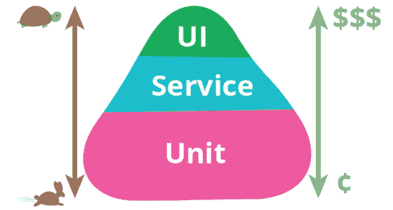
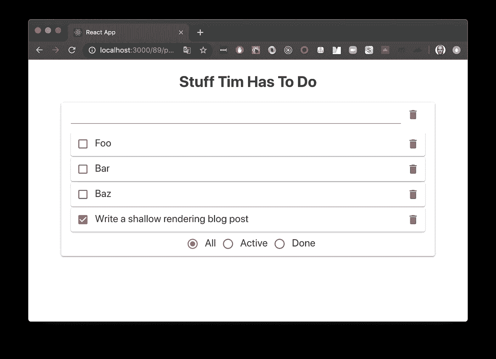

# 为浅渲染辩护

> 原文：<https://javascript.plainenglish.io/in-defense-of-shallow-rendering-5f627f7c155d?source=collection_archive---------0----------------------->


作为测试 React 组件的工具，浅层渲染最近受到了不少批评，但大多数批评是不公正的，或者是基于对浅层渲染旨在解决的问题的误解。

就在最近，我让一个开发人员再次提起 Kent C. Dodds 的这篇文章,解释他为什么在单元测试中使用 DOM 渲染。我钦佩 Kent，他继续为 JavaScript 社区做出巨大贡献，但在浅层渲染这个话题上，我们的观点不同。

*浅层渲染是一个直接针对 React 组件单元测试的工具。*

Kent 的文章避开了肤浅的渲染，这是很有意义的，因为他更喜欢集成测试而不是其他类型的测试。在这里，我的观点又一次不同，并且更接近传统智慧。

虽然集成(或服务)和端到端(或 UI)测试是必不可少的，但它们的成本、较慢的速度和固有的脆弱性应该导致相应的投入。经典的测试金字塔最好地说明了这一点。



[https://martinfowler.com/bliki/TestPyramid.html](https://martinfowler.com/bliki/TestPyramid.html)

根据这种方法，由于单元测试编写起来很便宜，运行起来也很快，所以你应该花更多的精力编写单元测试，而不是其他类型的测试。

然而，这并不能说明全部情况。测试不仅仅是验证你代码的正确性。测试过程本身能够——也应该——帮助提高代码的整体质量。

单元测试有助于确保您生成的代码由小的、模块化的、单一责任部分组成，这些部分可以重用并组合在一起以解决更大的问题。如果说软件开发社区学到了什么，那就是解决大型复杂问题的最佳方式是将它们分解成小而简单的解决方案，这些解决方案可以组合起来解决更大的问题。单元测试，尤其是[测试驱动开发](https://www.amazon.com/Test-Driven-Development-Kent-Beck/dp/0321146530)，[有助于确保这种方法](https://blogs.itemis.com/en/unit-tests-are-tests-of-modularity)。

本文的其余部分关注 React 组件的单元测试。除了浅层渲染，还有其他技术更适合测试金字塔的更高层。

# 测试反应组件

在测试 React 组件时，考虑 React 提供的抽象是有帮助的，主要是将用户界面建模为组件树。

从 React 文档中:

> React 组件允许您将 UI 分割成独立的、可重用的部分，并孤立地考虑每一部分。

这些组件中的每一个都是最终用户界面的一部分的抽象。

> 从概念上讲，组件就像 JavaScript 函数。它们接受任意输入(称为“props”)并返回描述屏幕上应该显示什么的 React 元素。与浏览器 DOM 元素不同，React 元素是普通的对象，创建起来很便宜。 **React DOM 负责更新 DOM 以匹配 React 元素。**

最后一点值得重复:

> **React DOM 负责更新 DOM 以匹配 React 元素。**

事实上，React 的设计反映了这种抽象。我们得到了一个名为`react`的包，其中包含核心组件抽象，以及一个名为`react-dom`的完全独立的包，它负责将 React 元素(普通对象)转换为 DOM 表示的实现细节。

**DOM 是一个实现细节**

这也是为什么，例如，我们可以使用基本的`react`包和`react-native`包——后者知道本地移动用户界面的实现细节。

# 反应元素

那么，如果一个 React 组件返回一个称为 React 元素的普通对象，那么它看起来像什么呢？

很高兴你问了。它看起来非常像这样:

您可能希望组件返回一个 DOM 元素，就像这样？

```
<h1>Hello Tim</h1>
```

但事实上，您得到的只是一个名为 React 元素的普通对象，您可以将它视为用于在以后生成实际 UI 的指令，以及目标 UI 所需的任何实现细节。

# 儿童

好吧，但是如果一个组件的子组件本身就是组件呢？

您将得到一个描述子组件的 React 元素，它具有与子组件相同的公共接口(props)

注意，描述子组件的 React 元素没有公开任何实现细节，它只是描述了一个`type`函数的子组件，有一个重要的属性叫做`props`。

*React 元素的概念对于理解 React 测试——实际上是 React 的一般工作方式——是如此的基础，以至于您应该在这里停下来，在继续之前重新阅读上面的所有内容。我是认真的，如果你没找到，就不要走。*

# 单元测试

单元测试是一种在与外部系统和依赖关系隔离的情况下测试单个代码单元的方法。在 React land 中，单元是 React 组件。

我们之前了解到，React 组件是 UI 的一个单独部分的抽象，将组件的抽象转换成 DOM 表示是一个实现细节。

此外，DOM 是一个独立于运行代码的 JavaScript 引擎的系统。DOM 由浏览器管理，虽然它为您的代码提供了一个 JavaScript API 进行交互，但它仍然是一个外部系统。这意味着，如果 JavaScript 代码单元在测试过程中与 DOM 交互，就不可能孤立地测试它。

测试中的最佳实践表明，我们不应该测试实现细节，而应该只测试测试对象的公共接口和行为。这是因为实现细节 ***可以******应该*** [经常变化](https://refactoring.com/)，而行为应该只在需求变化时变化。

综上所述，这些信息表明，如果我们发现单元测试 React 组件的想法令人信服，我们只能在不与 DOM 交互的情况下测试它们，此外，如果我们这样做，我们将测试实现细节。

# 为浅渲染辩护

有益的是，React 的工作人员也考虑到了这一点:

> 在为 React 编写单元测试时，浅层渲染会很有帮助。浅层呈现允许您呈现“一级深度”的组件，并断言其呈现方法返回的内容，而不用担心子组件的行为，因为子组件没有被实例化或呈现。这不需要 DOM。

这里的关键语句是，" ***断言其呈现方法返回的内容"***

我们之前了解到，React 组件返回 React 元素— *而不是 DOM 元素*——一个描述稍后将创建的 UI 的普通对象。

这意味着我们可以断言组件返回的 React 元素的正确性，而无需将其呈现到 DOM 中。

更重要的是，它让我们独立于外部系统(DOM)和它的任何子组件的实现细节来断言返回的对象 ***。***

***浅层渲染使我们能够对 React 组件进行真正的单元测试。***

React 团队发布了一个[浅层渲染器](https://reactjs.org/docs/shallow-renderer.html)和他们的“react-test-renderer”包。你在 JSX 和它说话，它会回答……你猜对了，简单的物体！

React 测试渲染器的浅层渲染器非常好用，但是文档继续说:

> 我们还建议查看 Enzyme 的浅层渲染 API。它在相同的功能上提供了更好的高级 API。

# 酶的浅层渲染器

由于它建立在 React 测试渲染器的浅层渲染器之上，所以毫不奇怪 Enzyme 的浅层渲染器也返回普通对象。

Enzyme 隐藏了 ShallowWrapper 对象的属性(通过在其原型的属性描述符上将 enumerable 设置为 false ),但是您可以用`Object.getOwnPropertyNames`将它们梳理出来

```
{
  length: 1,
  Symbol(enzyme.__root__): ShallowWrapper,
  Symbol(enzyme.__unrendered__): {…},
  Symbol(enzyme.__renderer__): {…},
  Symbol(enzyme.__node__): {…},
  **//…** }
```

Enzyme 的`ShallowWrapper`对象提供了比 React 的浅层渲染器丰富得多的 API，使我们能够简洁而轻松地做一些用基本渲染器很麻烦的事情。它带有一些警告和合理的批评，但让我们首先澄清它的目的。

## 浅层渲染是

*   浅层渲染对于单独测试单个组件提供的抽象很有用。

## 浅层渲染不是

*   浅层渲染对于测试最终用户体验没有用处。
*   浅层呈现对于测试 DOM 呈现或交互没有用。
*   浅层渲染对集成测试没有用。
*   浅层渲染对浏览器测试没有用。
*   浅层渲染对端到端测试没有用。

如果你没有发现单元测试 React 组件的价值，浅层渲染不适合你，但是我鼓励你在下定决心之前重读这篇文章，并查阅关于单元测试优点的现有文献。

# 该做的和不该做的

## 做

*   使用`shallow`进行单元测试
*   对断言使用不可知的方法:
*   。find() —按名称、实例、aria-\*属性等搜索组件。
*   。text()-返回当前渲染树的渲染文本字符串
*   。findWhere() —与结合。text()等。，用于灵活的、不可知的断言

*   。dive()——最多一两层——并且只针对由公共组件的源文件封装的子组件(不导出，但在同一个文件中)

## 不

*   搜索实现细节:避免。find()包含类名、id、特定的 DOM 类型 React 元素、结构细节等。
*   使用练习实现细节的实用程序:
*   。setState()
*   。实例()
*   。html()
*   。潜水()深度超过几层。

# 把所有的放在一起

下面这个浅显的渲染例子来自我的 [TDCD:测试驱动开发](https://www.youtube.com/watch?v=SDoq37lXHEw)演讲。你可以在这里克隆[代码。](https://github.com/timdoherty/tdcd)

假设我们正在构建一个 Todo 应用程序(因为以前没有人构建过这样的应用程序😉)并且我们想要对 Todos 组件进行单元测试——这个更高级别的组件包含 todo 组件列表和输入新组件的输入组件。



我们已经对子组件进行了单元测试，这里我们想做的是约束自己只测试 Todos 组件的功能。一个这样的测试可能是验证当用户输入一个新的 todo 时，它被添加到 todo 列表中。

换句话说，我们希望验证我们的新 todos 组件是否为输入组件提供了一个更新 Todos 列表内容的回调。该回调驻留在 Todos 组件中，并导致其返回值(一个 React 元素)发生变化。我们可以验证 Todo 组件返回的 React 元素的正确性，而无需实例化或呈现子组件。

我们新的 Todos 组件呈现了一个子组件 [TodoInput](https://github.com/timdoherty/tdcd/blob/5-app/src/TodoInput.jsx) (已经过单元测试),它将实际接收用户的输入，并在用户按下回车键时调用一个`onChange`回调(通过 props 传递)。

这里我们不需要模拟按回车键。我们甚至不需要渲染 TodoInput。请记住，组件的返回值只是一个称为 React 元素的普通对象，它的子元素也是如此:

TodoInput 子元素中没有 DOM 元素，没有按键事件，事实上除了一个普通的对象——React 元素之外什么都没有。

每个 React 元素都有一个名为`props`的特殊属性，表示传递给组件的输入。我们的 TodoInput 有一个名为`onChange`的`prop`，它是由我们新的 Todos 组件传递给它的。`onChange`的值是 Todos 组件内部的一个函数，名为`addTodo.`

`addTodo`是一个实现细节。我们之前了解到，我们不应该测试实现细节。相反，我们应该通过使用组件的公共接口来验证实现细节是否满足组件的预期行为。React 组件的公共接口是它的返回值——一个 React 元素。

那么我们该怎么做呢？我们只是调用作为普通对象上的`prop`属性公开的`onChange`函数，该对象表示我们的 TodoInput 子组件:

我们通过练习组件返回的 React 元素的公共接口`onChange`来练习`addTodo`实现细节。然后，我们通过验证组件的外部表示反映了组件的内部状态来断言返回的 React 元素的正确性。

你可以在这里看到完整的[测试套件](https://github.com/timdoherty/tdcd/blob/5-app/src/__tests__/Todos.test.js)。

# 结论

肤浅的渲染招致了很多不公正的批评，我认为很大程度上是因为误解了它旨在解决什么问题。与软件工程中的大多数选择一样，这一选择归结为为工作选择正确的工具。

浅层渲染是一种专门针对 ***单元测试 React 组件*** 的技术，它非常适合这个任务。理解浅层渲染的工作方式和原因——以及何时使用它——可以而且应该成为 React 技能集的重要组成部分。

浅层渲染不适用于测试金字塔更高层的其他类型的测试，例如集成和端到端测试。像酵素这样的工具。mount()和 React 测试库针对集成测试，而 Cypress 和 WebdriverIO 等工具则针对 E2E 测试。

为手头的工作使用合适的工具。编码快乐！