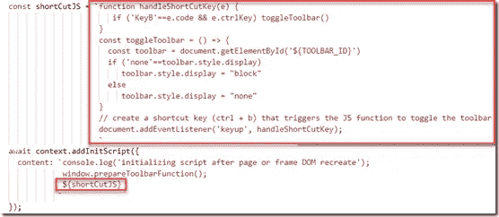
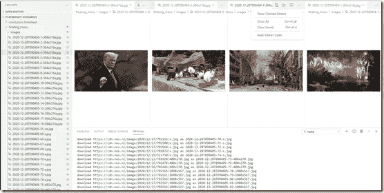

# 注入通用浮动工具栏到任何使用剧作家的网站

> 原文：<https://javascript.plainenglish.io/inject-generic-floating-toolbar-into-any-web-application-or-site-using-playwright-d26eb116153a?source=collection_archive---------11----------------------->

我追求的目标如下:我希望能够打开任何网站或 web 应用程序，并在网站内容的顶部拥有自己的浮动工具栏。当我浏览网站或应用程序时，我可以使用工具栏中的功能，例如拍摄当前页面状态的快照并将其保存到文件中，下载当前页面中的所有图像，使用预定义或随机值填写表单字段，并开始演示。


My own toolbar floating in the context of various well known web sites — injected through Playwright, ready for some action.

在以前的各种文章中，我已经讨论了剧作家——一个开源节点库(也可用于 Java、C#、Go、Python ),它提供了对嵌入式 web 浏览器的访问，可以从主机节点应用程序完全控制该浏览器。剧作家允许浏览器内容与应用程序进行交互，反之亦然。节点代码可以操作浏览器中的 DOM 和 JavaScript 上下文——添加或更改 DOM 元素和 JavaScript 函数和对象。节点代码可以捕获浏览器事件，也可以触发浏览器事件。如果你以前没有接触过剧作家，那么我建议你先阅读一下我之前的文章，了解一下它是什么以及它能用来做什么。

这次我想做的是:

*   使用 HTML 和 CSS 创建一个浮动、固定、半透明的工具栏
*   使用剧作家将此工具栏添加到加载到嵌入式浏览器中的网站或应用程序的顶部


Example: the toolbar embedded in Google search

*   确保当浏览器导航到一个新页面时，工具栏仍然存在(在页面刷新或从一个新的 URL 加载后，可能需要再次添加工具栏)
*   实现链接到工具栏选项的快照功能:当该选项被触发时，用于拍摄页面快照的剧作家功能被激活。注意:拍摄快照时，工具栏本身应该是隐藏的
*   使用快捷键组合显示和隐藏工具栏
*   添加用于将页面中的所有图像保存到本地文件的工具栏选项
*   和 web 应用程序(保存所有表单条目，记录当前选择的文本，从页面中删除所有图像，..)

注:本文所有代码均可在 GitHub 上获得:[https://GitHub . com/lucasjellema/剧作家-场景/tree/main/floating_menu](https://github.com/lucasjellema/playwright-scenarios/tree/main/floating_menu) 。

# 1.使用 HTML 和 CSS 创建浮动、固定、半透明的工具栏

我创建浮动工具栏的最好资源是 W3 Schools(【https://www.w3schools.com/howto/howto_js_navbar_sticky.asp】T4 和其他学校)。这是我创造的:


Bare Floating Toolbar — based on W3 Schools

每个项目都是一个链接。当点击链接时，可以触发一个动作。

HTML 和 CSS 相对简单。首先是 CSS:


以下是 HTML:

```
<ul class="toolbar">
  <li ><a>Reset</a></li>
  <li ><a>Pause</a></li>
  <li ><a>Next Step</a></li>
  <li style="float:right"><a class="active">Take Snapshot</a></li>
</ul>
```

# 2.将此工具栏添加到使用剧作家加载到嵌入式浏览器中的网站或应用程序的顶部

剧作家允许我们操纵在浏览器上下文中加载的页面。我们可以添加样式和 JavaScript——并执行 JAVAScript。


Code for running a Chromium browser from Node using Playwright and injecting the floating toolbar to whatever page is loaded in the browser

一旦创建了新的浏览器上下文，在节点上下文(准备工具栏)中定义的函数就会在浏览器中显示在窗口对象上(作为准备工具栏函数)。随后，使用 addInitScript()，设置了一个 JavaScript 命令——对 window.prepareToolbarFunction()的调用，实际上是对函数 prepareToolbarFunction()的调用。每当创建、重新加载或导航页面或页面中的 iframe 时，将执行此命令；这甚至适用于用户可以在浏览器中打开的附加选项卡。函数 prepareToolbar()做两件事:它创建了一个样式标记，定义了工具栏的 CSS(通过 addStyleTag())，并通过对 addHTML 的调用为页面中的工具栏创建了 HTML 元素。在 addHTML()中，DIV 元素作为 BODY 的直接子元素添加。这个元素是工具栏的容器。div 的 HTML 内容——工具栏本身——是在常量 *navBar* 中定义的，该常量在对 addHTML()的调用中被传递，并被设置为 DIV 元素的 innerHTML 属性。

工具栏作为 BODY 元素的子元素添加到 DOM 中。每当 DOM 被刷新并且 BODY 元素被丢弃时，工具栏也会随之消失。因为 initscript 是由剧作家在每一个可能破坏了 BODY 和工具栏的动作之后执行的，所以我们确保了每当浏览器导航到一个新的页面时，工具栏都会保留(==被重新创建)。

这段代码引用了两个常数，分别定义了 CSS 和 HTML 的 menuStyleTag 和 navBar:


# 3.实现链接到工具栏选项的快照功能

当*拍摄快照*选项被触发时，用于拍摄页面快照的剧作家功能被激活；这将创建一个 PNG 文件，其中包含浏览器内容在当前滚动位置的可见视口中的图像。注意:在拍摄快照时，工具栏本身应该是隐藏的。

工具栏选项*拍摄快照*链接到功能*窗口。*

```
<li style="float:right">
<a class="active" onclick="window.snapshotFunction('FloatingDemo')">Take Snapshot</a>
</li>
```

该函数通过以下调用被注入到窗口对象中:

```
await context.exposeBinding('snapshotFunction', snapshotter)
```

该函数是函数*快照*(在节点上下文中)的代理(在浏览器上下文中)。该功能定义如下:

传递给 snapshotter 的第一个参数是由剧作家提供的:任何对通过 exposeBinding 公开的函数的调用都会有这个由剧作家添加的 *source* 参数；它包含呼叫发生的相关上下文细节；非常重要的是，它包含了*页面*对象，它是 DOM 和 JavaScript 上下文的链接。


Node function that is triggered when Take Snapshot is clicked in the toolbar; this function hides the toolbar, takes the snapshot and shows the toolbar again

该函数在工具栏上获得一个句柄(通过页面。$eval)并隐藏 div(使用 style，。display = 'none '。接下来，通过页面对象上的剧作家函数*截图*，导出快照文件的名称——包括标签参数和时间戳——并拍摄和保存快照。随后，工具栏再次可见。

此时，工具栏中的*拍摄快照*功能被激活。当页面加载到嵌入式剧作家浏览器中时，通过单击工具栏选项来拍摄快照。


This image shows how the toolbar shows on the Playwright.dev website and how to snapshots result in two PNG files — that do not contain the toolbar itself

在这个例子中，我已经在 https://playwright.dev/[加载了剧作家主页。我拍了一张快照，导航到文档部分，滚动页面，拍了第二张快照。图的底部显示了打开两个快照文件的 VS 代码。请注意，工具栏不是快照的一部分。](https://playwright.dev/)

# 4.使用快捷键组合显示和隐藏工具栏

工具栏有时会碍手碍脚，所以最好能把它隐藏起来。再放一遍。我们可以使用快捷键来实现。在这篇文章中，我描述了如何将一个快捷键通过剧作家注入到任何页面中。按照本文的说明，设置快捷键 CTRL+B 在隐藏和可见工具栏之间切换相对容易。

下一段代码中定义了两个浏览器端 JavaScript 函数:handleShortCutKey()是一个函数，它将检查刚刚释放的键；如果那个键需要一个特殊的动作，这个函数将触发一个特殊的函数来处理那个键。目前该函数只检查 CTRL+b；根据该组合键，它调用第二个浏览器端功能:toggleToolbar()。这个函数定位带有工具栏标识符的 DOM 元素(从常量 TOOLBAR_ID 读入这个函数的定义)。根据 style.display 的当前值，该属性将从 none 切换到 block，反之亦然。这将显示或隐藏工具栏 div 和整个工具栏。



最后，对 document.addEventListener()的调用将函数 handleShortCutKey()配置为 keyUp 事件的处理程序。

这两个函数定义和对 document.addEventListener()的最后调用都是在 const *shortCutJS 中定义的。*该常量被添加到 *addInitScript* 中传递的*内容*中，因此将在每个页面和框架中执行。每当我们运行一个页面，工具栏就会被添加，我们可以用 CTRL+b 隐藏它，然后用同样的组合把它带回来。

# 5.添加用于保存页面中所有图像的工具栏选项

这一步不是严格要求的——但它很有趣，而且考虑到我们已经拥有的所有部分，这是一个很容易解决的难题。另外，请阅读我之前的一篇关于添加快捷键来下载所有图片的文章:[使用剧作家将快捷键注入任何网页——例如下载所有图片](https://medium.com/javascript-in-plain-english/use-playwright-to-inject-shortcut-keys-into-any-web-page-for-example-to-download-all-images-59195cf557a5)

首先，在工具栏中添加一个选项来保存所有图像:


然后定义函数 allImageDownloader 及其所需的所有内容(包括函数 streamImageFromURL、const IMAGE_PATH 和用于*请求*和 *fs* 的 require 语句)。


最后，在窗口对象中公开这个函数 allImageDownloader，使它可用于工具栏选项上的 onclick 操作:


Make Node function allImageDownloader accessible in browser context as window.saveAllImagesFunction

所以:工具栏有 onclick 动作的链接；这将在浏览器上下文中调用 window.saveAllImagesFunction。这个调用被转发到节点函数 allImageDownloader。该函数定位当前页面中的所有图像，并从图像 src url 中检索它们的内容，并将其保存到本地*图像*目录中。

工具栏有保存图像的额外选项。我加载了一个荷兰新闻网站。


Dutch news website with toolbar floating

在按下保存图像之前，这是 VS 代码中图像文件夹的样子:


这是按下工具栏选项后的样子:



Dozens of image files were created when the Save Images option in the toolbar was activated

# 资源

本文所有代码均可在 GitHub 上获得:[https://GitHub . com/lucasjellema/剧作家-场景/tree/main/floating_menu](https://github.com/lucasjellema/playwright-scenarios/tree/main/floating_menu) 。

另外，请阅读我之前的一篇关于添加快捷键来下载所有图片的文章:[使用剧作家将快捷键注入任何网页——例如下载所有图片](https://medium.com/javascript-in-plain-english/use-playwright-to-inject-shortcut-keys-into-any-web-page-for-example-to-download-all-images-59195cf557a5)

我在之前的一篇文章中介绍过剧作家——它是什么，它能用来做什么。

水平导航栏上的 W3Schools—[https://www.w3schools.com/howto/howto_js_navbar_slide.asp](https://www.w3schools.com/howto/howto_js_navbar_slide.asp)和其他

用 JavaScript 设置 CSS 样式—【https://dev.to/karataev/set-css-styles-with-javascript-3nl5 

AddInitScript 上的剧作家文档:[https://Microsoft . github . io/剧作家/文档/1 . 6 . 1/API/class-browser context # browsercontextaddinitscriptscript-arg](https://microsoft.github.io/playwright/docs/1.6.1/api/class-browsercontext#browsercontextaddinitscriptscript-arg)

*原载于 2020 年 12 月 28 日*[*https://technology . amis . nl*](https://technology.amis.nl/2020/12/28/inject-generic-floating-toolbar-into-any-web-application-or-site-using-playwright/)*。*