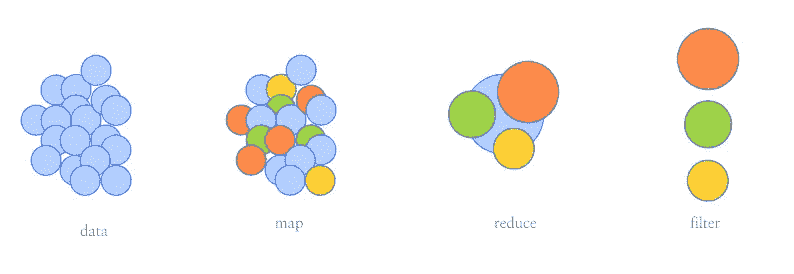
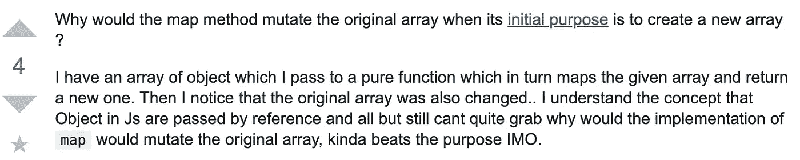

# JavaScript 中映射、简化和过滤的内部工作方式

> 原文：<https://javascript.plainenglish.io/inner-workings-of-map-reduce-filter-f06ba87f2509?source=collection_archive---------0----------------------->

figure 1.0 : illustration of map, reduce, filter

我在代码库中使用 map、reduce、filter 已经有一段时间了，但是阅读 Luis Atencio 的《Javascript 中的函数式编程》一书激发了我学习它的实现的兴趣。让我们更好地理解这些“不变的”(在引号中)宝石，并特别回答`why`和`how`问题？

为了更好地理解，让我们创建一个具有一些属性的类，我们可以在博客的其余部分引用这些属性。

步骤 1 :构建我们的示例

假设 XYZ 公司根据某些工作要求，聘请了新一批软件工程师。所以`Developer`类被定义来捕捉那些基本属性，

# **地图**🎯

公司决定给所有新雇佣的开发人员增加奖金。如果我们想对这个进行编码，那么我们可能会遍历所有这些对象，并添加额外的数量。

> 在我们的前两步中，我们可以重点回答*为什么是*地图？稍后我们可以研究一下*地图是如何工作的？*

**第一步:**命令式方法

虽然我们没有改变原始数据，也就是说，开发者，我们必须计算数组的长度，然后在添加奖金数额之前遍历每个元素。但是如果我们决定使用地图，那么这些东西就会从我们身边消失。即计算长度，循环遍历一个数组，将其推送到新的数组。所以我们可以专注于编写所需的逻辑。即增加奖励金额。最重要的是，它会返回一个新的数组。

**第二步:**声明式方法

第二种方法包括更强调组合的函数式编程，但在这两种情况下，循环、处理临时数组都与我们无关。也没有改动原来的`developers`阵。简而言之，它就像一个黑匣子。

> 比如说；使用地图，我们创造了新的比萨饼切片🍕用普通切片上的奶酪配料。作为一名美食家，我可以在任何时候吃普通的原味(左)或带奶酪配料的(右)片

**

*figure 1.1: map (black box) example*

*我希望这有助于推理为什么是谜题的一部分。接下来，我们将进一步了解地图的内部工作。*

***第三步:**地图解剖*

*让我们实现我们自己的`map`来更好地理解，但是首先在实现时我们需要考虑一些事情。(a) map 作用于一个数组，(b)它不改变原始数组，而是返回一个新数组，以及(c)将 function 作为一个参数来作用于任何给定的数组。基于这些*三个*支柱，如果我们要实现`map`，那么它看起来会像下面这样，*

*但是我们经常在一个数组上使用`map`，就像`array.map()`一样，但是在我们的例子中，我们将数组作为一个参数传递。嗯嗯…..我们能让我们的地图像 ECMAScript 地图一样吗？*

*让我们继续下一个，减少。*

# ***减少** ⚖*

*如果我们需要找到基于经验的每年平均工资增长，那么必不可少的方法是循环通过每个对象来计算所有开发人员的总经验和总工资，然后用总经验除以工资。*

***第一步:**命令式方法*

*虽然我们可以在一个循环中完成计算，但我们仍然要担心循环，声明临时变量来计算总数。*

***步骤 2:** 声明式方法*

*起初，这看起来有点吓人，但是这种方法更加模块化，并且仍然遵循不变的惯例。(*注:如果你有更好的方法来找出* `*averageSalPerYear*` *使用 reduce 请告诉我，乐意学习*)*

***第三步:**减少解剖*

*让我们先从更简单的例子(增加数字)开始，而不是直接解决我们的“每年平均工资增长”问题。*

*看起来不错，现在让我们利用“myReducer”来实现我们的开发人员阵列的平均工资收益。*

*很好，但是如果我们想使用`myReducer` 作为原型链，那么实现将更改如下(创建新的减速器作为`myNewReducer`，以保持所有实现彼此不同)，*

*对我们最新的原型链`myNewReduce`方法应用加法和平均工资增长。*

*很好，现在让我们开始过滤。*

# *过滤器🔎*

*如果我们想知道所有至少有 3 年经验的开发人员，那么我们可以通过筛选来实现，但首先让我们从命令式方法开始。*

***第一步:**命令式的方法*

*通过开发人员数组循环查找多年的经验，如果它符合所需的经验，然后我们将它添加到结果数组。*

*第二步:陈述式方法*

*快速验证以比较过滤的数据是否与命令式过滤器数组数据相同。*

***第三步:**过滤分离*

*正如我们之前所做的，我们将把我们的新过滤器定义为数组原型方法，这样我们就可以使用 like `array.myNewFilter`*

*也许，如果我们想同时处理所有这些场景，而不是独立操作。然后这打开了方法`chaining`的对话。*

# ***链接**🔗*

*在这一节中，我们将研究“增加我们所有开发人员的奖金数额，他们至少有 3 年的经验，并最终计算这些开发人员的总工资”*

*耶，我们完成了🙌*

*几乎，如果我们想找出初级或高级开发人员基于一些经验标准，然后我们会做如下使用地图，这将返回新的标题数组。*

*很好，这正是我们所期望的。让我们检查一下我们的`developersCopy`数组。*

*如果你注意到新的属性`title`已经被添加到每个对象中，但是`map`假设为 ***不可变*** 🤯。*

**

*figure 1.2: stack overflow question in 2016*

> *为什么这次对我们没用？因为对象是通过引用 访问的 ***。所以通过引用改变对象属性会改变对象的原始数组(即不纯的)。****

*如果我们在应用贴图之前克隆每个对象，就有可能避免突变。更多细节你可以参考这个 medium [博客](https://medium.com/front-end-weekly/immutability-in-array-of-objects-using-map-method-dd61584c7188)或者栈溢出[问题](https://stackoverflow.com/questions/34716651/js-array-prototype-map-happens-to-be-mutable#)。所以函数式编程是一种实现，而不是一个框架。*

*最后，这些宝石非常简洁、有效，但这也伴随着 ***高昂的价格*** 💰当用于大型数据集时。下面是一个这样场景的模拟，*

*快乐编码🦸🏽‍♂️*

*我不明白这种“鼓掌”的事情，但是如果你喜欢这个博客，那么按一下也无妨👏*