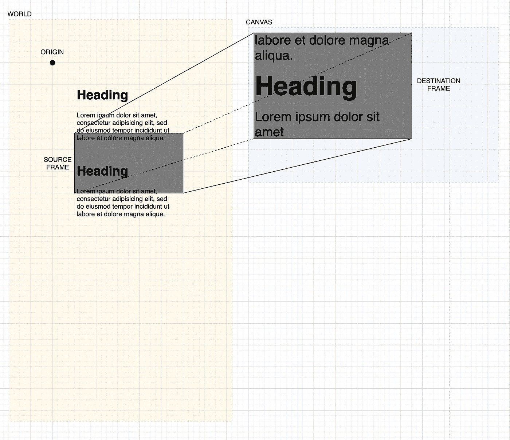

# PixiJS 的投影系统内部

> 原文：<https://javascript.plainenglish.io/inside-pixijs-projection-system-897872a3dc17?source=collection_archive---------6----------------------->

## 以及如何优化你的场景图！

投影矩阵允许你定义从你的“世界”到“画布”的一部分的转换。是的，你的场景图形生活在它自己的“世界”中，你可以移动它在画布上呈现的位置，而与你的世界中的对象是否移动无关。

默认情况下，为显示对象设置的位置与画布坐标相关。换句话说，“世界”和“画布”是相同的。然而，更灵活的模式是两者独立。

想象一个无限的平面，用一个点设定“原点”，用一个网格以像素为单位测量物体。你的场景图存在于这个 2D“世界平面”上，你从这个世界(源帧)渲染一个矩形，投影到画布上的一个矩形(目的帧)。



Projecting a world with blocks of text upscaled onto the user’s screen

> 你正在阅读 PixiJS: WebGL 渲染器中的[一章。](/@sukantk3.4/inside-pixijs-webgl-renderer-eca3357ad7f5)
> 
> 注意:本文包含的内容对于 5.3.1 之前的 PixiJS 版本可能不稳定！将投影变换与修改渲染纹理绑定但不支持源帧和目标帧的插件一起使用可能会有问题。

# 源帧→目标帧

渲染纹理系统提供了基本的源帧到目标帧的转换。渲染纹理的绑定设置两个帧。如果没有提供，两个框架都默认为画布的尺寸。

> 屏幕上的画布本身就是一个`null`渲染纹理。

您可以使用`bind`方法传递您的帧:

```
renderer.renderTexture.bind(null, sourceFrame, destinationFrame);
```

WorldContainer demo

上面的例子通过将画布渲染纹理绑定到矩形`(0,0,200,200)`中的渲染内容到矩形`(200,150,400,300)`来渲染画布中间的`WorldContainer`内容。

通过设置源帧和目标帧，可以实现两种类型的变换:

*   平移:矩形的( *x，y* )坐标之间的差异决定了移动或平移。这里,( 0，0)处的内容被转换为(200，150)
*   比例:宽度 *w* 和高度 *h* 的比值决定了水平和垂直比例。内容在两个方向上都升级了 2 倍。

## sourceFrame 和 destinationFrame 提供的剪辑

设置源帧确保*源帧之外的任何内容都不会被绘制到画布*。类似地，设置目标帧确保*画布上目标帧之外的任何内容都不会被修改*。

您可以使用这些保证在画布的不同部分(甚至是渲染纹理)分别渲染多个窗格。

# 投影变换

您可以提供一个附加的变换来应用于“世界”中的顶点。这是使用投影系统的`transform`属性设置的，当您提供添加旋转或倾斜效果时非常方便。

此变换在源帧到目标帧变换之前应用于顶点。

上面的例子通过计算一个每帧旋转增加的投影变换来旋转场景图形。

# 摄影机

投影技术是对基于动态摄像机或侧滚场景图形的优化。想法是显示对象本身不移动，因此，它们的世界变换/边界不在每一帧重新计算。

需要注意的是，投影场景和`app.stage`场景是分开的。在前面显示的例子中，`WorldContainer`没有将其内容添加到子容器中——这是为了使世界的变换不会影响内容的变换，而是希望投影内容，使它们出现在与世界容器相同的位置。然而，这有效地在世界容器边界将显示对象树分成两个场景图。

下面的笔是一个简单的例子，它展示了你可以投影一个显示对象的子树，使它们出现在摄像机的边界内。

蓝色背景不会投影，而白色背景中的“hello world”文本会投影。请注意旋转后白色矩形是如何裁剪到源帧(或相机的边界)的。

本例中实际上有两个独立的运动:

1.  世界摄像机本身在做圆周运动
2.  世界的内容和背景围绕着它们的中心旋转。但是，由于投影的原因，只有内容被剪切到相机的边界。

# 有什么好处？

量化优化的好处并将其与其他成本进行平衡总是一个好主意。当使用投影矩阵渲染一个相当简单的大约 50K 矩形的场景图形时，下面的笔展示了大约 10 FPS (+30%)的改进。

# 插件支持

[pixi-viewport](https://github.com/davidfig/pixi-viewport) 是 PixiJS 应用程序事实上的相机插件。我和维护者 David Figatner 正致力于在下一个主要版本中实现这一优化！

# 陷阱

投影系统在以前的版本中一直不稳定，我正在修补所有的错误。以下是我之前发现并修复的错误列表:

*   [https://github.com/pixijs/pixi.js/pull/6683](https://github.com/pixijs/pixi.js/pull/6683)
*   [https://github.com/pixijs/pixi.js/pull/6739](https://github.com/pixijs/pixi.js/pull/6739)
*   [https://github.com/pixijs/pixi.js/issues/6461](https://github.com/pixijs/pixi.js/issues/6461)
*   【https://github.com/pixijs/pixi.js/issues/6461 号
*   交互-系统没有对投影矩阵进行正确调整

> 注意:在 5.3.1 版本中，过滤器和交互管理器没有打补丁以与投影兼容！

随着我们越来越接近让投影成为一个一流的特性，这个帖子将会更新。

*大家好，我是 Shu Kant Pal——pix ijs 的维护人员和 WebGL 开发人员。在 Twitter 上关注我以获取更多我的内容:*[*https://twitter.com/ShukantP*](https://twitter.com/ShukantP)