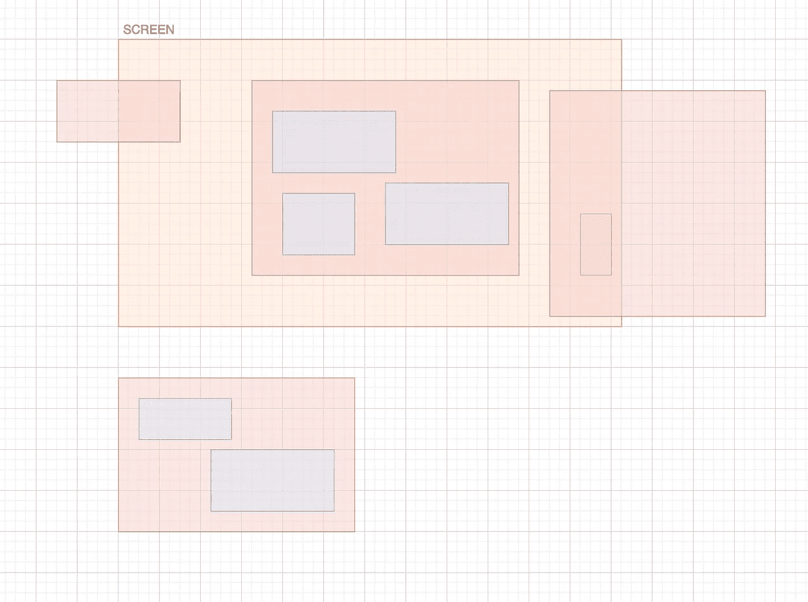

# PixiJS 内部:终极场景图优化

> 原文：<https://javascript.plainenglish.io/inside-pixijs-the-ultimate-scene-graph-optimization-35b62bb2153?source=collection_archive---------0----------------------->

## 剔除，以及如何用十行代码实现它！

如果您的 WebGL 应用程序有一个非常大的场景，但在任何时候都只有部分可见，那么您可以通过剔除不可见的显示对象来立即提高性能。

*你正在阅读 PixiJS: WebGL 渲染器* *里面的一章“* [*”。*](/@sukantk3.4/inside-pixijs-webgl-renderer-eca3357ad7f5)

# 选择

在计算机图形学中，“剔除”有多重含义。此处的术语用于描述评估对象是否“可见”以及是否应该渲染的过程。这允许渲染器跳过不需要绘制的对象，并减少每个节拍的绘制调用次数。这是第一次尝试 60 FPS 的优化。

最初的想法是受大卫·菲格纳特的 pixi-cull 包的启发；然而，这并没有提供基于世界边界的递归和健壮的解决方案。相反，它是为使用 pixi-viewport 插件而设计的，并基于局部边界比较进行挑选。

# @ pixi-essentials/精选

我专门为递归剔除构建了`[@pixi-essentials/cull](https://github.com/SukantPal/pixi-essentials/tree/master/packages/cull)`包。它使用优化的算法来评估哪些对象需要剔除。

对于大多数基本应用程序，您可以在每个渲染周期从舞台开始挑选整个场景图形。

```
import { Application } from 'pixi.js';
import { Cull } from '@pixi-essentials/cull';const app = new Application({ });// These options are the default.
const cull = new Cull({ recursive: true, toggle: 'renderable' });// Cull the entire scene graph, starting from the stage
cull.add(app.stage);// "prerender" is fired right before the renderer draws the scene
app.renderer.on('prerender', () => { // Cull out all objects that don't intersect with the screen
    cull.cull(app.renderer.screen);
});
```

上面的代码片段将评估每个显示对象是否应该被“剔除”,并相应地设置它们的`renderable`属性。

## 副作用

每当渲染器重绘场景时，就会触发`prerender`事件。如果您的应用程序需要在渲染之外使用显示对象的边界，这可能是一个问题。

这是因为容器的边界是其子级边界和自身边界的并集。如果其中一个孩子被剔除，那么它将不包括那个孩子的边界；因此，计算将是不正确的。

要纠正这一点，可以在渲染后取消场景图形的模糊:

```
app.renderer.on('postrender', () => {
  cull.uncull();
});
```

这将简单地使你的所有对象在一个过程中可见/可渲染。

> 注意:如果您需要保持某些对象不可见，即使它们的边界与屏幕相交，您也可以将剔除“切换”设置为不同于保持对象永久不可见的属性。例如，如果您在显示对象上设置了`visible=false`，您可以将剔除切换设置为`renderable`。这将确保对象的可见性保持为假，并且只评估可渲染性。

## “可呈现”与“可见”

剔除“切换”是在显示对象上设置的属性，指示它是“剔除”还是“未剔除”。

您可以为剔除设置两个“切换”:

*   `renderable`:如果显示对象不可渲染，则不会被绘制。然而，它的变换将在`updateTransform`中重新计算。
*   `visible`:如果一个显示对象不是“可见的”，那么它也不会被绘制；然而，它的转换不会在`updateTransform`调用中更新。如果你知道*何时变换已经改变*并且需要重新计算，这可能是一个有价值的优化。

## 与投影的兼容性

如果你在你的场景图中使用投影(这是一件非常特殊的事情)，剔除期望场景的投影和未投影部分是“断开的”。换句话说，您不能直接投影容器的子容器:

```
class Camera {
    constructor() {
        this.projectedContent = this.addChild(new Container());
    } render(renderer) {
        // Set projection
        this.projectedContent.render(renderer);
        // Unset projection
    }
}
```

上面的代码片段不能用于剔除。为什么？

它期望容器的子级的屏幕边界位于容器的内部。如果使用不同的投影变换投影子对象，则它们的屏幕边界不需要位于容器的屏幕边界内(即使它们的世界边界也是如此)。

要纠正这一点，您需要确保投影的内容不会作为容器的子容器添加:

```
class Camera {
    constructor() {
        this.projectedContent = new Container();
    }
}
```

由于“摄像机”和“投影内容”现在在场景图中是断开的，所以您可以在剔除器中单独添加它们:

```
cull.add(app.stage);
cull.add(camera.projectedContents);
```

# 在后台

递归剔除算法如下:

1.  取消缩放整个场景图形，以便正确计算显示对象的边界。
2.  对于当前显示对象，评估边界是否与“屏幕”相交，其中屏幕的边界是一个参数。
3.  如果有，保持物体不可见。如果对象完全位于屏幕内，不要在子对象上运行剔除。这是因为孩子也将完全躺在屏幕内(在他们的父母内)。如果对象只是部分可见，那么需要为孩子评估剔除(因为他们可能位于屏幕内部或外部)，然后我们再次转到步骤 2。
4.  如果没有，即对象位于屏幕之外，则剔除对象(使其不可见)。孩子们不需要被评估，因为画他们也会和他们的父母一起被跳过。

该算法的速度来自于这样一个事实，即递归只在显示对象“部分”可见时发生，并且与屏幕的边界线相交。

下面的示例演示了评估哪些对象的可见性。标记为红色的将被评估，而蓝色的将被跳过。



在这里，只有 50%的对象被剔除。因为很少有物体正好位于屏幕的边界，所以剔除通常非常快。

*我是舒坎特·帕尔(Shukant Pal)——*[*PixiJS*](https://github.com/pixijs/pixi.js)*的维护者，这是最快的网络 2D 渲染器。我喜欢优化和加速 WebGL 应用程序。在推特上关注我阅读更多我的内容:*[*https://twitter.com/ShukantP*](https://twitter.com/ShukantP)