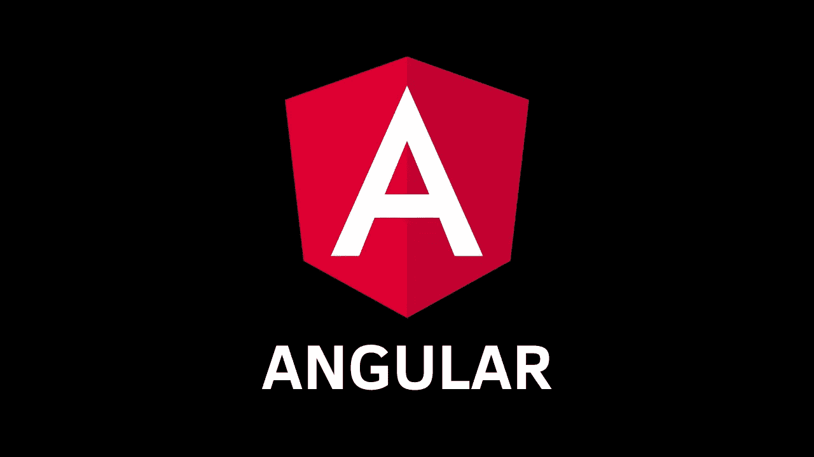

# 使用角度工厂提供者实例化服务

> 原文：<https://javascript.plainenglish.io/instantiate-a-service-using-an-angular-factory-provider-38670aea4a94?source=collection_archive---------4----------------------->

## 需要在服务中通过构造函数注入一个变量？

# 问题

有些情况下，我们需要在服务中注入一些东西，同时完全控制我们的服务在运行时如何实例化。

假设我们需要传递一个标志变量来指示我们的服务是否将运行特定的任务。Angular 的依赖注入(DI)不能指定值，因为它是我们需要明确提供的东西。

让我们看一个简单的 *LoggerService* 例子。

这里我们将一个 *isEnabled* 变量注入到构造函数中，以指示 *log* 函数是否会打印出消息。

如果我们运行这段代码，Angular 会给我们一个错误“没有为 Boolean 定义的提供者”，因为 Angular 不能从我们的 *LoggerService* 解析构造函数参数。

那么，我们如何提供这些值，并告诉角度 DI 使用所提供的值呢？🤔

# 解决办法

**厂家**来帮我们了！🙌

[pexels.com](https://www.pexels.com/photo/people-are-working-wearing-blue-shirt-3637786/)

在我们的 app.module.ts 中，我们可以定义我们的提供商，如下图所示:

基本上，我们告诉 Angular 无论何时使用 *LoggerService* 或者将 *LoggerService* 注入到某些构造函数中，都要使用 *loggerFactory* 。

*loggerFactory**是我们这样定义的函数名*

**

*这是一个工厂函数，我们用一个布尔参数手动实例化我们的*LoggerService*(*is enabled*)。*

*如您所见，现在我们可以完全控制对象的创建方式。*

**

*我们可以将值切换到**或*真或假。****

****

*如果*的布尔值被使能*应该是动态的，可以利用环境配置来动态地改变它。*

# *进一步讨论*

*那么，现在你可能会问，如果我们需要在工厂提供者中传递另一个服务作为我们的依赖怎么办？*

*为了确保这篇文章不会太长😃，让我们在下面的帖子中讨论它:*

* [## 在 Angular 中将依赖项传递给工厂提供者

### 需要将其他服务作为依赖项传递给工厂提供者吗？

medium.com](https://medium.com/@hengky.kaiqi/pass-dependencies-to-a-factory-provider-in-angular-9073502cae4) 

# 密码

如果你想看代码，你可以去我的 GitHub 库

 [## hengkysanjaya 123/角度-工厂-提供商

### 此项目是使用 Angular CLI 版本 9.1.10 生成的。为开发服务器运行 ng serve。导航到…

github.com](https://github.com/hengkysanjaya123/angular-factory-provider) 

一如既往，我希望您从这篇文章中获得一些新的见解。😃

干杯，

亨基·桑佳亚*