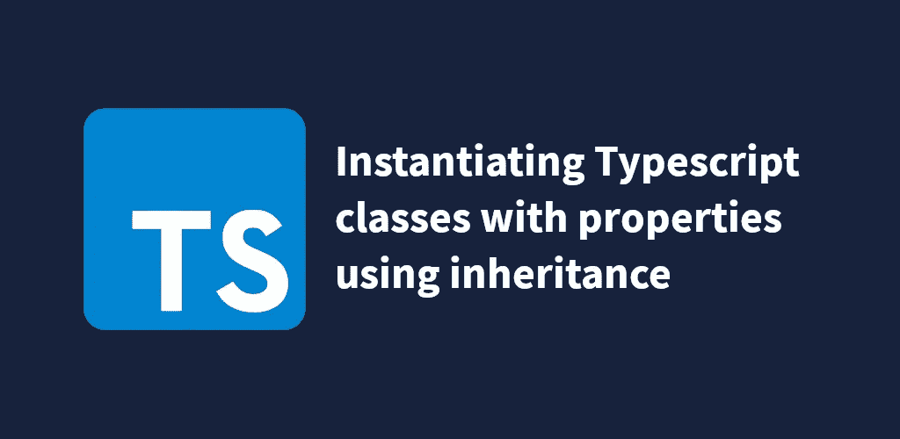

# 使用继承实例化具有属性的 Typescript 类

> 原文：<https://javascript.plainenglish.io/instantiating-typescript-classes-using-inherited-partials-46a2a72f67e5?source=collection_archive---------2----------------------->



今天，我将向您展示如何在 Typescript 中编写继承构造函数的类，该构造函数允许实例化该类并在一行中为其属性赋值。这对于希望将请求的 JSON 主体实例化为一个类而不必使用 Object.assign 或逐行分配属性的情况非常有用。它还允许我们将属性赋值严格地输入到类的构造函数中，而 Object.assign 不允许在类外使用。

首先，我们需要理解这种方法试图解决什么问题。假设您有一个用户类

```
export class User {
    public email: string;
    public firstName: string;
    public lastName: string;
}
```

现在，假设我们有一个 GET 请求，它返回一个 JSON 体，其中包含这些值。

```
fetch(myUserEndpoint)
    .then(res => res.json())
    .then((userData: Partial<User>) => {
        // Do something with userData
    });
```

只有上面的代码，我们只有两个选项来将请求返回的数据填充到新的用户类中。

选项 1:

```
fetch(myUserEndpoint)
    .then(res => res.json())
    .then((userData: Partial<User>) => {
        const user = new User();
        user.firstName = userData.firstName;
        user.lastName = userData.lastName;
        user.email = userData.email;
    });
```

显然，上面的方法有问题，首先，如果类用户需要添加更多的属性，您将不得不回到这个承诺，为新属性添加一行。这造成了长期的可维护性问题。

选项 2:

```
fetch(myUserEndpoint)
    .then(res => res.json())
    .then((userData: Partial<User>) => {
        const user = Object.assign(new User(), userData);
    });
```

这种方法要好得多，尽管调用 Object.assign(new Class()，partial)可能会变得很麻烦并妨碍可读性。这种特殊的方法也不能对提供给类的分部进行类型检查。

因此，我们需要一种干净的、可重用的方法来将常规的 JavaScript 对象转换成类。

创建将被继承的泛型类，并添加构造函数。

```
export class AbstractEntity<T> {
    constructor(protected partial: Partial<T>) {
        Object.assign(this, this.partial);
    }
}
```

您应该注意的第一件事是 AbstractEntity 旁边的<t>泛型声明。当我们声明继承这个类的另一个类时，我们将需要声明与泛型相同的类，以便构造函数(以及任何其他依赖于类类型的继承方法)可以根据继承这个类的类来输出分部。</t>

然后，编辑用户类以继承 AbstractEntity 类

```
export class User extends AbstractEntity<User> {
    public email: string;
    public firstName: string;
    public lastName: string;
}
```

对一些人来说，这可能会令人困惑。为什么我们要扩展 AbstractEntity 类，然后将 User 类传递到它的泛型声明中？回头看看 AbstractEntity 类来寻找答案。

构造函数使用泛型声明来输出部分参数，该部分参数将由用户类以及扩展我们的 AbstractEntity 类的任何其他类继承。

现在，让我们看看如何在上面的例子中使用这种方法

```
fetch(myUserEndpoint)
    .then(res => res.json())
    .then((userData: Partial<User>) => new User(userData))
    .then((user: User) => {
        // Do something with your new User class object
    });
```

使用这种方法，我们不需要重复使用 Object.assign，并且我们确保我们可以在不需要对应用程序的 API 层进行更改的情况下从我们的用户类中添加和删除属性。同样，在我们需要实例化新用户的任何其他领域，我们可以确保作为 partial 提供的参数类型正确！