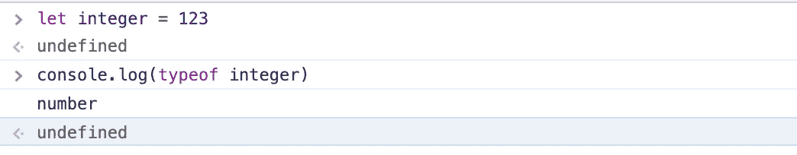
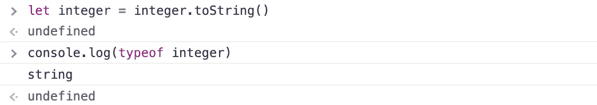
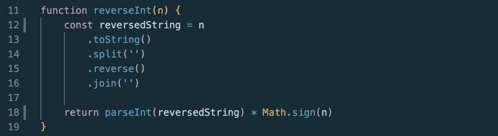
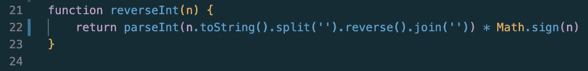

# 算法:整数反转

> 原文：<https://javascript.plainenglish.io/integer-reversal-ds-a-2-b771e2c38ac0?source=collection_archive---------20----------------------->

我的数据结构和算法学习/帮助博客的第二部分。在这篇文章中，我将回顾一些与上周的博客非常相似的东西，但是有一点小小的改变——整数反转！

Photo by [Nick Hillier](https://unsplash.com/@nhillier?utm_source=medium&utm_medium=referral)

上周，我讨论了串反转。本周，我们将转向与数字打交道。当我第一次看到这个问题的时候，我想象它会非常类似于弦反转。然而，使用整数反转有一些挑战。一旦我们检查了解决方案，这个问题将有望变得更有意义！

对于这个问题，我将讨论一个解决方案，因为前一篇博客讨论了其他一些类似的策略。请随意尝试使用我之前介绍的另一种方法来解决这个问题，以真正测试您的技能，我相信您可以做到！

***给定一个整数，编写一个函数，它接受一个整数的输入，然后对该整数求逆。例如，“-321”输入到函数中时，将返回“-123”，而“82”将返回“28”。***

解决这个问题的关键在于三个内置的 JavaScript helper 方法:toString、parseInt 和 Math.sign。

先说最简单的，toString！

根据 MDN， [toString()方法](https://developer.mozilla.org/en-US/docs/Web/JavaScript/Reference/Global_Objects/Number/toString)在数字上被调用时，返回一个表示指定数字对象的字符串。在使用数据类型时，强调它们之间的差异是很重要的。在我们当前的问题中，给我们的是一个数字而不是一个字符串。我计划稍后使用的方法之一是 split。您可能还记得以前的博客，split 可以用在字符串上。对数字使用 split 将导致一个未捕获类型的错误，并显示 split 不是函数的消息。这是因为 split 不是数字的内置函数，而是字符串的内置函数。

这里有一个关于 toString 方法如何工作的小例子。让我们从一个名为 integer 的变量开始，将其赋值为 123，然后使用 typeof 检查它的数据类型。如果您不熟悉 typeof，请在这里随意阅读。

如您所见，integer 的数据类型目前是 number。现在，如果我对整数变量调用 toString，您可能已经猜到会发生什么:

在第一行中，在 toString 应用于 integer 之后，我将它重新赋值给自身。然后，我再次检查 integer 的数据类型，得到的结果是 string，您可能已经猜到了。

下一个要介绍的助手方法是 parseInt()。对此的解释将会非常简短，因为它的工作方式本质上与 toString 完全相反——就我们需要理解它来解决这个问题而言。如果你想看看 MDN 是如何定义 parseInt 的，[这里是链接。](https://developer.mozilla.org/en-US/docs/Web/JavaScript/Reference/Global_Objects/Number/parseInt)然而，我确实认为 MDN 的定义可能比解决这个问题所必需的更加混乱。虽然我不会非常深入地研究这种方法，但真正理解这种方法是有帮助的，因为在处理数字时可能会有一些用例。

ParseInt 接受一个字符串参数，如果传入的字符串包含有效的数字，它将返回一个数字。如果传入的字符串包含数字和非数字字符的混合，或者只包含非数字字符，它将返回 NaN(不是数字)。如果字符串中的第一个字符是一个数字，它将只返回该数字。为了解决这个反向整数问题，我们将主要使用 parseInt 将字符串转换回数字。

使用 parseInt 的另一个有趣的例子是删除无效的非数字字符。数字前面的负号是有效的，但是数字后面的负号是无效的，因此要删除。如果我们调用 parseInt on ("875-")，它将返回 875。在你的主机上试试这个吧！记住输入一个字符串。(在数字之间有负号的情况下，它只会减去数字！)

我要解释的最后一个方法是 [Math.sign()方法](https://developer.mozilla.org/en-US/docs/Web/JavaScript/Reference/Global_Objects/Math/sign)。Math.sign 接受一个数字参数并返回+/- 1。如果作为参数给出的数字是正数，Math.sign 将返回 1(没有显式显示+)。如果为负，它将返回-1。如果传入 0，它将返回 0。

现在我们来深入探讨一下这个问题的解决方法。首先，我创建了一个变量， *reversedString* ，它将存储传递给函数的数字的修改版本。因为我打算对这个数字使用 split 函数，所以我知道我需要一个字符串。所以第一步是在数字上使用 toString，只有这样我才能在那个字符串上使用 split。如果我们的数字是-123，在调用 toString 之后，它将变成“-123”。对其使用 split 将得到["-"、" 1 "、" 2 "、" 3"]。之后，我在那个数组上使用 reverse，给出我们["3 "，" 2 "，" 1 "，"-"]。打电话。加入它将返回“321-”。我们的 *reverseInt* 变量的最终结果将是“321-”。

这是事情变得有趣的部分。我现在将忽略返回，继续处理 parseInt。通过在 *reversedString* 变量上调用 parseInt(当前是“321-”)，它实际上变成了一个数字，负号被去掉了。记住这是 parseInt 方法的属性之一。现在我们有 321 个了。那么我们如何让负号回到前面呢？

如果我们在原始数字-123 上调用 Math.sign，我们将得到返回值-1。如果我们将等式前半部分的最终结果(目前是 321)乘以-1，我们将得到-321。我再怎么强调这最后一部分也不为过:永远记得归还你的答案！

尽管这个方法看起来很容易理解，但实际上有一个解决这个问题的方法，就是删除临时变量。

reverseInt() one-liner solution

对于受过训练的人来说，加上适当的注释/描述，这个一行程序看起来可能不会太差，并且可以节省大量代码空间。尽管我建议作为初学者，拥有一个可读性更好的多行解决方案可能更有意义。

这就概括了整数反转。您可以尝试使用前一篇博客中提到的另一种方法来解决这个问题，比如使用 for..循环遍历数字中的每一位！如果你想出如何用另一种方式解决这个问题，或者对这里的任何事情有任何疑问，你可以随时通过 [LinkedIn](https://www.linkedin.com/in/jiangmichael1/) 联系我或者给我发电子邮件。我非常乐意聊天！

现在让我们先来看看下周的问题，关于回文的话题！

**给定一个字符串，写一个函数检查该字符串是否是回文。如果字符串是回文，函数将返回 true。如果不是回文，函数将返回 false。例如，“赛车”、“眼睛”和“夫人”将返回 true，而“苹果”、“水”和“窗户”将返回 false。**

提示:记住我们讨论过的内置 JavaScript 方法。你拥有解决这个问题所需的所有工具。你能行的！不要忘记休息！

*免责声明:这只是解决这个问题的一个方案。作为初学者的解决方案，这是我被教导的方式。然而，当涉及到运行时/空间复杂性时，有更好的解决方案。也有类似的问题，可能禁止使用语言助手方法，如 toString。稍后我将再次讨论这些解决方案。*