# 将谷歌地图集成到您的角度应用程序中

> 原文：<https://javascript.plainenglish.io/integrate-google-maps-to-your-angular-application-step-by-step-guide-3604aadb76d1?source=collection_archive---------1----------------------->

## 循序渐进的指南

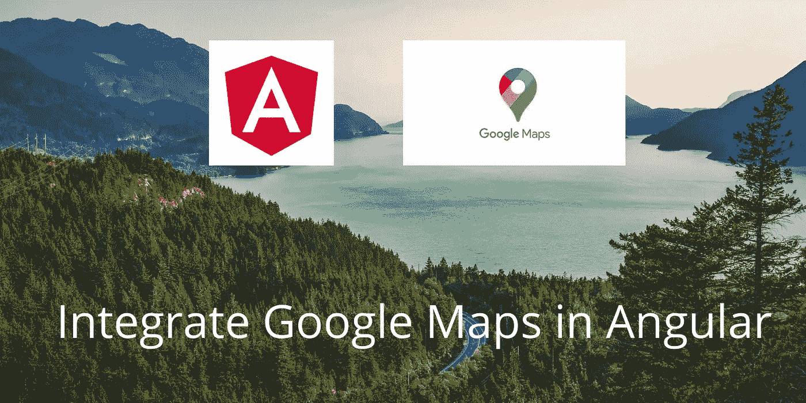

How to Integrate Google Maps in Angular

在地图上显示**位置**是大多数网络和移动应用程序的必备功能。ERP、CRM 等将需要地图服务。目录列表应用程序主要依赖于**地图服务。**

**谷歌地图**在开发者中很受欢迎。这是非常容易使用，并有许多丰富的功能。在本教程中，你将学习如何在 **Angular** 中**集成**谷歌地图。

以前的谷歌地图是免费使用的。**但是**截至目前，谷歌已经**限制** **访问**其地图服务。然而，许多公司仍然依赖谷歌地图，这是因为与其他地图服务提供商相比，最终用户更喜欢谷歌地图。

谷歌地图平台提供免费的****每月**200 美元的地图、路线和地点信用，绝大多数客户发现他们的使用案例完全免费。一个月内使用量超过 200 美元才收费。**

****您可以使用下面的链接查看账单详情。****

**[](https://developers.google.com/maps/billing/gmp-billing) [## 谷歌地图平台计费|谷歌开发者

### 了解 SKU 使用谷歌地图平台 API 的费用

developers.google.com](https://developers.google.com/maps/billing/gmp-billing) 

在本教程中，您将学习:

1.  如何获取谷歌地图 API 密钥？
2.  如何将谷歌地图整合到 Angular 应用中？

# **获取谷歌地图 API 密钥**

所以首先，我们需要从 Google Maps 获取**访问 api 密钥**。我将在一步一步的指南中解释这一点。如果你有 api 密匙，集成谷歌地图是非常容易的。

1.  使用以下链接转到 Google 开发者控制台:

[](https://console.developers.google.com/) [## 谷歌云平台

### Google 云平台让您可以在同一基础设施上构建、部署和扩展应用程序、网站和服务…

console.developers.google.com](https://console.developers.google.com/) 

您需要使用您的 **Google 帐户登录。**如果您已经登录，将显示如下页面:

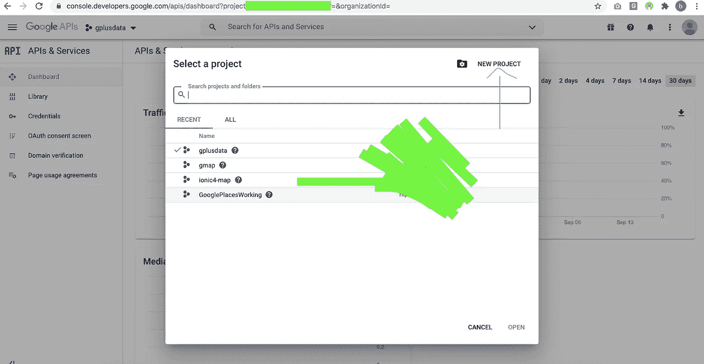

Google Maps API Key Example 1

2.首先，我们需要创建一个项目来启用谷歌地图服务。因此，点击上图中的**新建项目**按钮。

3.在您点击了新项目之后，它会要求您填写项目名称。您可以给出您想要的项目名称。然后点击**创建**按钮:

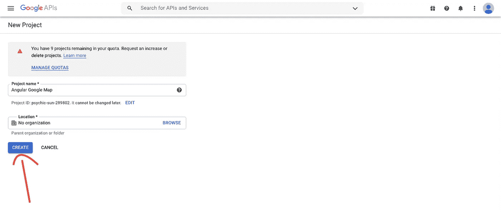

Google Maps API Key Example 2

4.一旦项目被创建，它将显示创建的项目名称。然后点击**选择项目:**

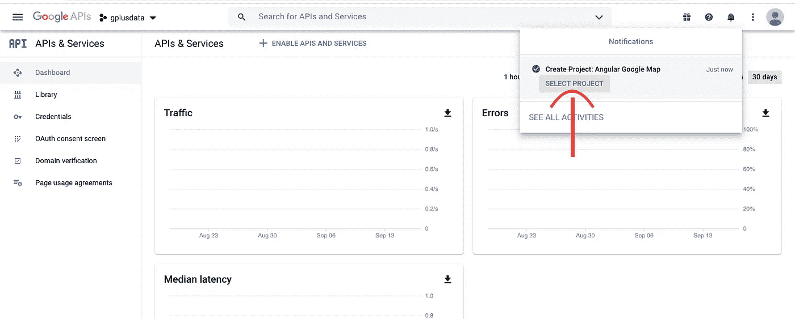

5.现在，我们需要为这个项目启用谷歌地图服务。所以点击**启用 API 和服务**按钮:

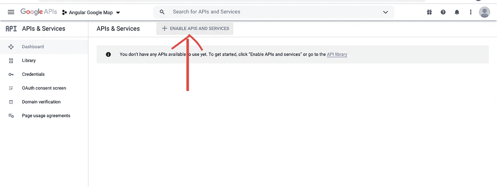

6.选择下图中的**地图 JavaScript API** 卡:

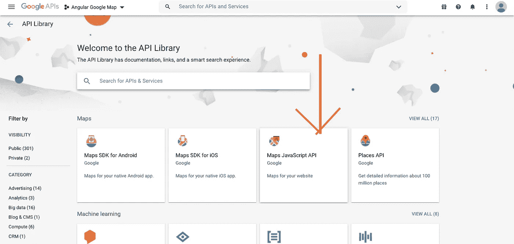

7.点击**启用**按钮，启用谷歌地图服务:

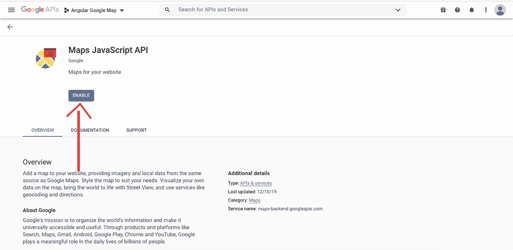

8.一旦谷歌地图启用，它将如下图所示:


9.现在，我们需要获得谷歌地图的 API 证书。所以首先点击三重水平栏并选择**API&服务- >凭证:**

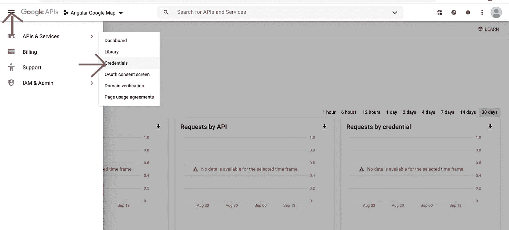

10.点击**创建凭证**按钮:


11.现在选择 **API 键:**

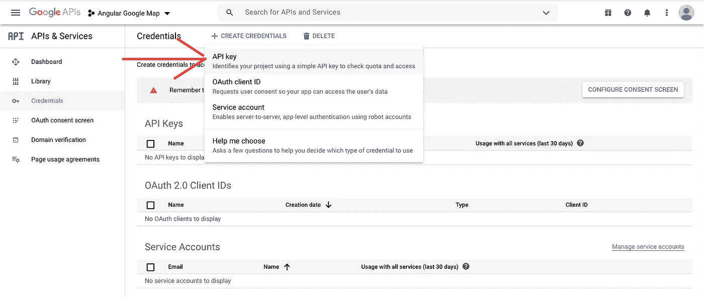

12.它将显示 API 键，如下所示。**复制这个 API 键**。此键将用于 Angular Google Maps 插件:

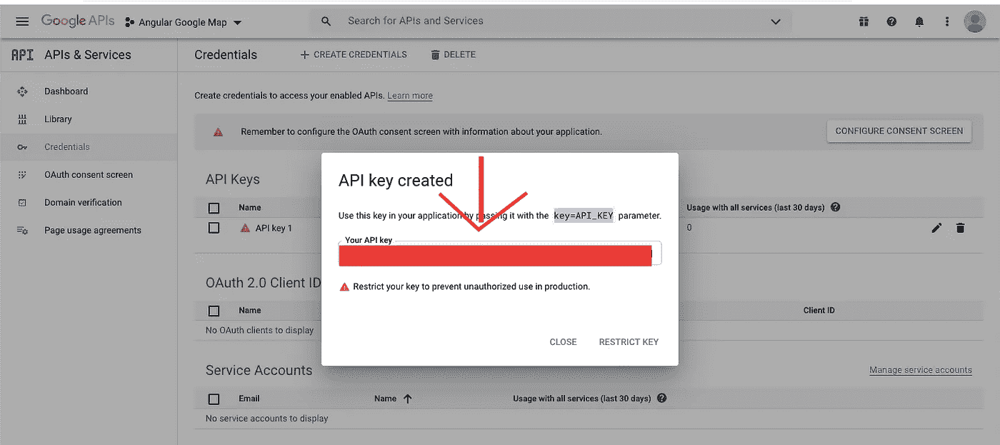

# 安装角度谷歌地图插件

## **第一步:**

使用以下方法创建角度项目:

```
ng new GoogleMapsExample
```

使用 VS 代码编辑器打开创建的 Angular 项目。

## **第二步:**

现在，使用下面的命令安装 Angular Google Maps 插件:

```
npm install [@agm/core](http://twitter.com/agm/core)
```

## **第三步:**

打开 **src/app/app.module.ts** 导入 **AgmCoreModule** 。你需要在这里提供一个**谷歌地图 API 键**才能看到地图。我们已经有了 API 密钥。所以把 API 密匙粘贴在这里。

## **第四步:**

打开**src/app/app . component . ts**文件，创建带值的纬度和经度变量。

## **第五步**:

打开 **src/app/app.component.html 文件**，调用`<agm-map>`标签在谷歌地图上显示位置。

打开 **src/app/app.component.scss 文件**，设置地图的高度。

## **第六步:**

仅此而已。一切都搞定了。现在，Google Maps 服务将在您的组件页面上显示地图。使用下面的命令预览应用程序。

```
ng serve --open
```

**输出:**

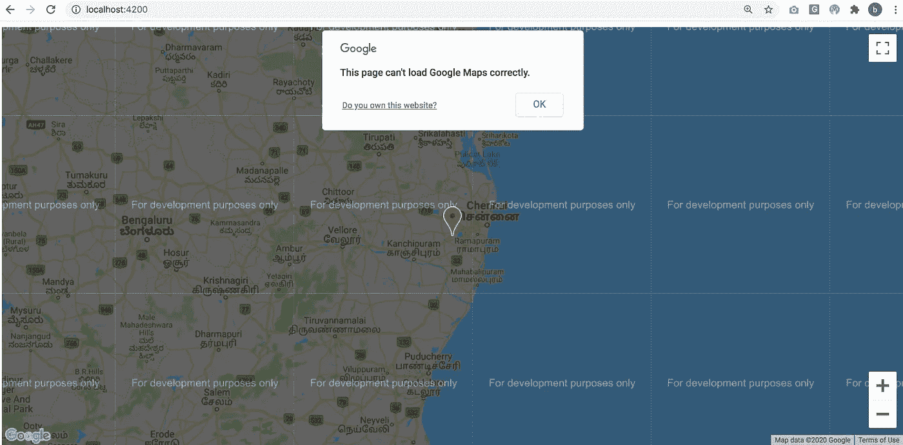

Angular Google Maps Example Output Screen

现在它将显示谷歌地图上的开发目的只有水印。为什么因为，你需要启用计费服务来使它用于生产目的。因此，如果您想删除水印，请使用下面的链接启用您的账单。

[](https://console.cloud.google.com/project/_/billing/enable) [## 谷歌云平台

### Google 云平台让您可以在同一基础设施上构建、部署和扩展应用程序、网站和服务…

console.cloud.google.com](https://console.cloud.google.com/project/_/billing/enable) 

## 可能的故障排除提示

如果您在预览时遇到错误消息***‘找不到名称空间‘Google’***，那么您需要做两件事。

1.  **安装谷歌地图插件**

```
npm install [@google/maps](http://twitter.com/google/maps)
```

2.只需将谷歌地图导入到 **app.component.ts** 文件中

```
import { google } from '@google/maps';
```

# 摘要

在本教程中，您学习了如何在 **Angular** 应用程序中**集成谷歌地图**服务。谷歌地图的整合对开发者来说非常容易。最终用户喜欢谷歌地图的外观和感觉。但是，从定价的角度来看，小型组织负担不起成本。

除了谷歌地图，我们还有另外一个选择。那是**的传单地图。**不久，我将尝试撰写关于如何在角度应用中集成传单地图的文章。

敬请关注更多与 Angular 相关的文章。

**感谢您阅读这篇文章！**

源代码:

[](https://github.com/bharathirajatut/angular-examples/tree/master/google-maps-example) [## bharathirajatu/angular-示例

### 此项目是使用 Angular CLI 版本 8.3.5 生成的。为开发服务器运行 ng serve。导航到…

github.com](https://github.com/bharathirajatut/angular-examples/tree/master/google-maps-example) 

## 进一步阅读

*   [棱角分明的谷歌地图网站](https://angular-maps.com/)
*   [角度谷歌地图 API 文档](https://angular-maps.com/api-docs/agm-core/index.html)
*   [谷歌地图 API 文档](https://developers.google.com/maps/documentation/javascript/tutorial)**