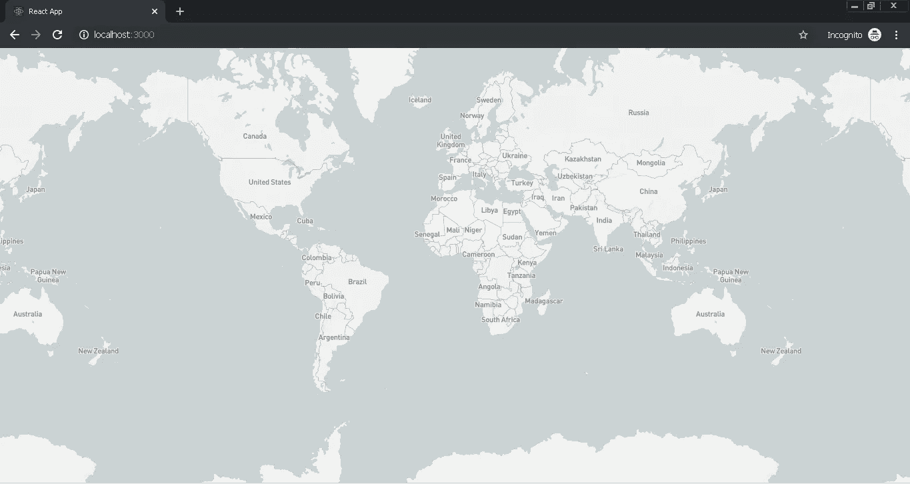

# 如何将 Mapbox 集成到 React 应用程序中

> 原文：<https://javascript.plainenglish.io/integrate-mapbox-to-reactjs-web-application-in-5-minutes-2621aafe835?source=collection_archive---------1----------------------->


Photo by [henry perks](https://unsplash.com/@hjkp?utm_source=medium&utm_medium=referral) on [Unsplash](https://unsplash.com?utm_source=medium&utm_medium=referral)

Mapbox 是除了著名的 Google Map 之外的一个开源地图平台。使用 WebGL 技术将大量数据(点、符号、多边形、线等)加载到地图中是一种强大而有潜力的方法。因此，它能够在不影响性能的情况下处理大量数据。此外，Mapbox 还支持自由层定价，这有利于创业，只会随着业务增长而增加成本。在本教程中，我们将把 Mapbox 集成到 ReactJS web 应用程序中，从头开始只需 5 分钟。

NPM (版本> 8.1)和[节点](https://nodejs.org/en/)(版本> 5.6)必须安装在本地机器上。首先，使用 npx 命令创建 ReactJS 应用程序，如下所示:

```
npx create-react-app my-react-mapbox
cd my-react-mapbox
```

接下来安装 mapbox 官方 npm 软件包作为依赖:

```
npm i mapbox-gl
```

在我们开始修改代码之前，我们需要去 [Mapbox](https://www.mapbox.com/) 创建一个帐户来获取 Mapbox API 密钥，在后面的例子中我们将需要把它放入代码中。接下来，使用代码编辑器修改 app.js 代码。在本例中，我们使用 Visual Code Studio 来修改代码。将代码复制并粘贴到 app.js 中，如下所示:

File: App.js

一切准备就绪后，我们可以使用 react-script build in 命令在本地服务器中运行 build 来查看结果:

```
npm start
```

编译成功后，浏览器应该会自动打开并导航到 [http://localhost:3000](http://localhost:3000) ，显示结果如下:



http://localhost:3000

当然，在这个例子中，我们只展示了如何将 Mapbox 集成到 ReactJS web 应用程序中。Mapbox 可以做更多的事情，并创建更强大的应用程序，以我的经验来看，它与谷歌地图不相上下，而且更便宜。