# 将 Watson 集成到您的 React/Rails 项目中，看起来像一个真正的智能人

> 原文：<https://javascript.plainenglish.io/integrate-watson-into-your-react-rails-project-and-look-like-a-real-smart-like-person-yeah-31e350babcaf?source=collection_archive---------1----------------------->

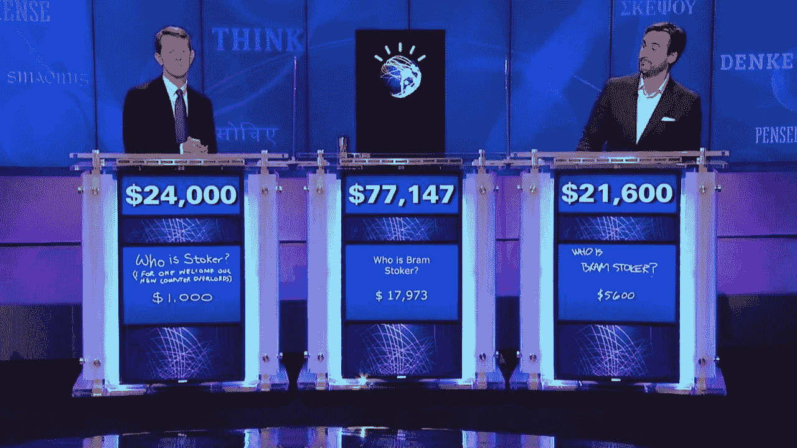

Puny humans, mwahaha….

作为一名刚刚从[fancy WeWork-子公司](https://www.complex.com/life/2019/09/wework-ceo-threw-party-run-dmc-tequila-layoffs)和[排名第一的编码训练营](https://www.coursereport.com/best-coding-bootcamps)熨斗学校毕业的学生，我目前在[一个免费的合作空间](https://medium.com/@nicholas.feitel/how-to-code-at-a-free-co-working-space-in-soho-nyc-64b62461b4b3)编写代码，用我的借书证从 Lynda 那里免费学习 Python 和 Flask for [，在申请(阅读:乞讨)工作时吃着 Trader Joe's 的预包装沙拉。](https://medium.com/@diego_martinez/learn-to-code-for-free-26d9fe364aad)

然而，回到几周前，我正试图通过精疲力竭在学校创建我的最终项目，并决定我要实现一些我见过人们在他们的最终项目中实现的非常酷的东西: [IBM Watson](https://en.wikipedia.org/wiki/Watson_(computer)) 。

现在，沃森是一个超级计算机和人工智能学习系统，由 IBM 创建，在医疗保健，教育甚至广告方面有许多应用。如上图所示，即使没有连接到互联网，它也在《危险边缘》占据了主导地位。然而，它也可以用作学生和企业的 API。

同为程序员的天才 Sukrit Walia 使用 Watson 对新闻文章进行分类，以确定它们属于哪个“类别”,然后每天通过电子邮件将它们作为摘要发送出去。我决定效仿另一位天才程序员，他是我在学校的学长[罗布·梅希亚](https://medium.com/@rmeji1)，用沃森创建一个聊天机器人来增强现有的应用程序，所以这就是我在这里要做的。

第一步:注册 IBM Cloud

Ignore how many tabs I have open!!!

很简单，只要去 IBM 创建一个免费账户就行了。

第二步:[查看本入门教程](https://cloud.ibm.com/docs/services/assistant?topic=assistant-getting-started) -

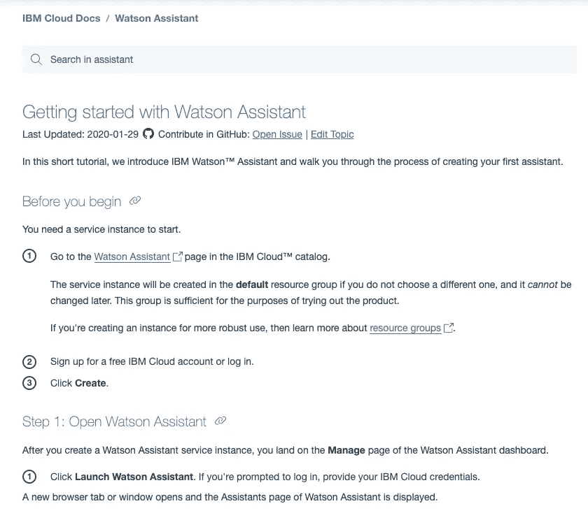

Easy-peasy

入门页面将帮助您熟悉如何创建新的助手。我建议阅读它，但我会和你简单谈谈沃森助手中的一些概念。我用的是最新的测试版，所以我用的是**动作，**但是如果你用的是旧版本，请遵循他们的教程**意图。**

第三步:学习概念-

基本上，您将使用 Watson Assistant 处理一些概念:

1.  **动作**——Watson Assistant 里的大部分东西基本上都是来自编程语言的巨型 if/else 语句。沃森的助手非常擅长“模糊匹配”，能够判断输入给它的一个东西是否像它学习的另一个东西，但它需要知道如何处理这些输入。**动作**是当沃森接收到特定输入时要做的事情。

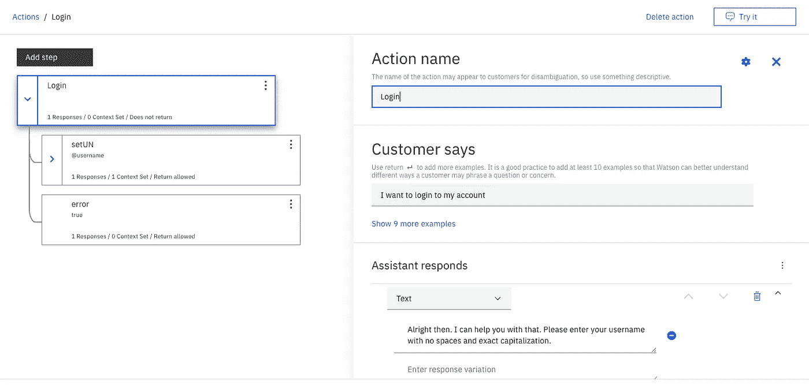

Action time!

让我们看看这个。有一个**动作名称**供您参考，然后有一个**数组**显示客户/用户可能会说些什么来启动这个动作，接着是一个**响应**，它可以是一条文本消息，跳转到另一个动作或者什么都不做。

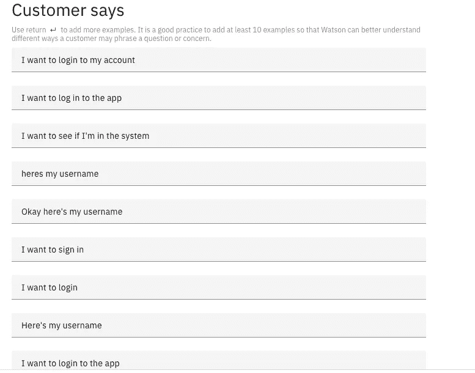

login examples

为了触发这个动作，用户可能会说一些类似的事情，这就是 Watson 发挥其魔力的地方，因为它将使用这些例子来判断用户输入是否是类似“用户名”的东西(这里没有完全包括)，它可以判断这看起来像数组中的东西，并将其路由到该动作。

你还会有一些叫做**步骤**的东西，它是一种子动作。如果我们回头看看我最初的动作照片，你会发现我的“登录”动作有两种不同的可能性。我喜欢把这想象成一个[“选择你自己的冒险”](https://en.wikipedia.org/wiki/Choose_Your_Own_Adventure)类型的模型，基于读者或用户或顾客的选择，故事的不同分支发生了。但是这种选择是什么，沃森又是如何认识到这一点的呢？

Entities! Scary!

2.**实体-** 为了让 Watson 识别用户是否输入了初始**动作**之外的东西，Watson 使用了一种叫做**实体的东西。**这是一种识别不同模式或输入的方式。

以上是一个简单的**实体**为“是”表示为“@是”的例子。就像“登录”**动作**一样，有一个同义词的**数组**，Watson 使用“模糊匹配”来确定某个东西是否接近是。

在最初的“登录”**动作的另一个例子中，**有关于什么是用户名的检测，但是有许多关于什么是用户名的不同例子，那么我们如何检测呢？答案是 [**正则表达式。**](https://www.regular-expressions.info/)

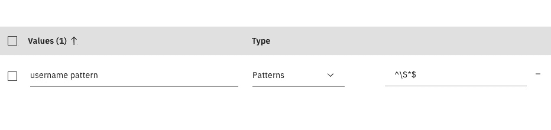

Regular isn’t… regular.

迷路了？我知道我在这一点上。在训练营结束时，我对 React/Redux 很有信心，我从未与 [**regex**](https://www.regular-expressions.info/) **打过交道。我很幸运，我聪明的同学格里芬·普尔在那里指导我。对于这个版本的**实体**，我试图检测一个包含任何不带空格的**字符串**的**模式**，这是我的 Rails 数据库能够检测到的用户名。但是如果我检测到这个用户名，我能做什么呢？**

Some context on context.

3.幸运的是，Watson 有一种称为 Context 的存储变量的方法，这样它们可以在应用程序的整个生命周期中重用。

上面是在我的“登录”**动作之后的**步骤**。**您可以看到它有一个“if”条件，设置为等于“用户名”**正则表达式模式**的**实体**。如果 Watson 能够根据给定的模式检测到用户名，它可以将它存储为一个变量，然后在下面返回给它。

注意，您将看到一些存储变量的时髦符号，如果您使用过 [PHP](https://www.php.net/) (我没有！).这实际上是 Java 的 SPeL，我当然不知道，但是我可以在网上很好的查找来理解它。

重要的是，我能够保存变量并使用它向我的用户传递消息。但是让我们更进一步！我想做的不仅仅是在 Watson 中本地存储一个变量！我想为我的项目与我的后端 Rails 服务器通信，看看那个用户是否在我的数据库中，我需要一个新的工具来完成这项工作。

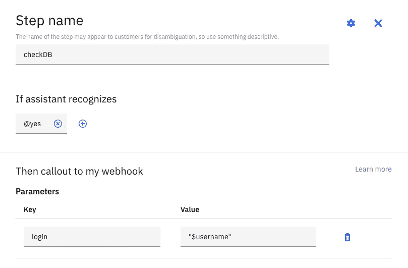

4.Webhooks- Watson 不仅仅是一个虚拟实体，它还能够调用单个 API 端点(至少在免费版本中)在**动作**或**步骤**中发出 POST 请求。

从上面我们可以看到，如果我收到一个“@ yes”**实体**，我就告诉沃森“调出”我的 **webhook** 。你的 webhook 可以在“选项”下配置，应该是当前在互联网上的后端**的 URL**，所以我建议如果你还在开发你的 Rails/Django 后端，使用 [**ngrok**](https://ngrok.com/) 测试它，它有一个免费的计划[我的同行 Hope 有一个关于如何使用它的好博客](https://medium.com/@hopegiometti/the-magic-of-ngrok-aka-how-i-show-code-to-my-mom-c7338b3151f3)。

但是，您只有一个 URL 和一个 post 请求，因此可能有许多方法来处理这个问题。我选了这个。

第四步:用 Watson 配置你的后端

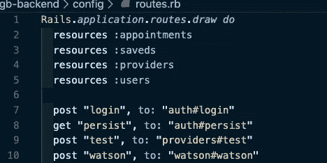

custom routing!

首先，我在我的 Rails 应用程序的 config/routes.rb 文件中创建了一个自定义路由，这样到[http://myapp.com/watson](http://myapp.com/watson)的 POST 将通过一个名为“watson”的方法发送到 WatsonController。

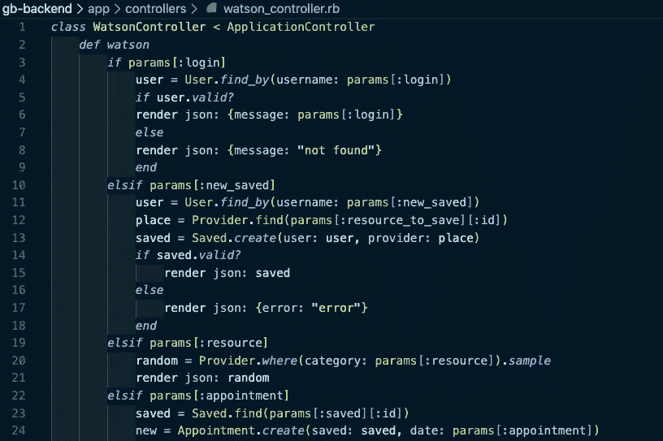

I am the one controlling Watson… not the other way around, I think!

然后我创建了一个巨大的 if/else 语句！因为在 Watson 中，我对单个端点的 post 请求的唯一选项是 POST 的参数，所以我知道我可以执行一个巨大的 if/else 语句来路由我想对数据库和 ActiveRecord 模型做的事情，给定要发送的数据和参数。

对于那些告诉我我本可以用一个[案例陈述](https://www.rubyguides.com/2015/10/ruby-case/)的人:闭嘴，我恨你！但是，是的，我可能有。我觉得这样做很舒服，所以我来了。回到我们之前的 Watson 例子，当我的**步骤**识别出**实体** "@yes "时，它对 **webhook** 作出一个标注，带有 **params** 键/值对“login ”,然后是**上下文**变量“$username”。

了解 Rails 的人可以看到，这是我的 if 语句的第一种情况，在登录参数存在的情况下，它会检查数据库以查看用户名是否存在，如果存在，它会在 JSON 对象中返回用户名，否则它会提供一个错误，我的 Watson 会使用其**多响应**功能来处理该错误。

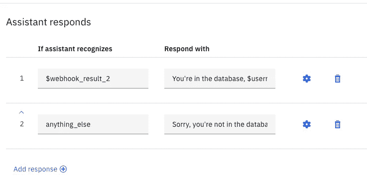

If/else again!

在这个语句中，我已经看到了我是否从我的 **webhook** 得到了有效的响应，只要 post 请求没有返回错误，我就会告诉用户他们在数据库中并继续使用应用程序，否则，我会要求他们重试或退出。

这有很多后端，对于大多数聊天机器人来说，你会希望有一个 if/else 语句、**实体**、**步骤**和**上下文**变量的渐进循环，以便为你的用户创建一个动态体验，在那里他们可以持久存储数据。

你也可以在任何时候使用 Watson Assistant UI 中大多数控制台上的 **Try It** 按钮来测试这些功能。

但这对我来说太多了，我想我已经给了你一个开始的框架。那么如何将它集成到你的 react 应用中呢？

你可以用聊天机器人小工具做一些很酷的事情，把 Rails API 连接到 Watson，然后获取到你的后端，但是在我的项目中，这花了我好几天时间，我已经筋疲力尽了。那我做了什么？我作弊了。

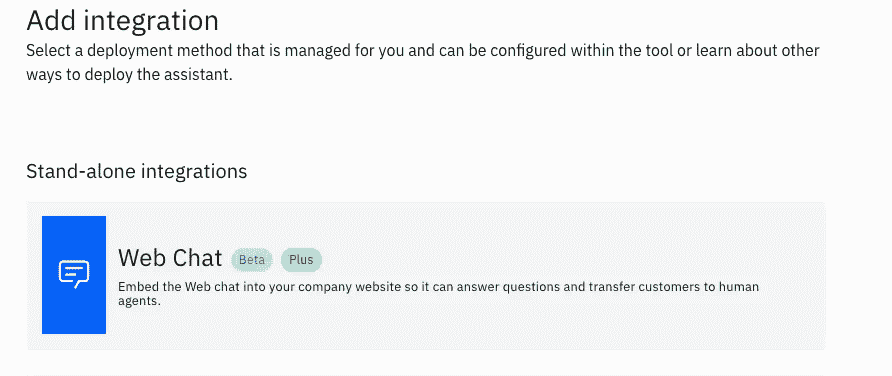

步骤 5:将你的 Watson 机器人与 React 集成

IBM Cloud PLUS 的试用版免费 30 天，所以我使用了它。它允许你使用一个普通 JS 网络机器人的测试版本！使用这个选项实际上会给你一个基于你到目前为止所做的所有工作的片段。它看起来会像这样:

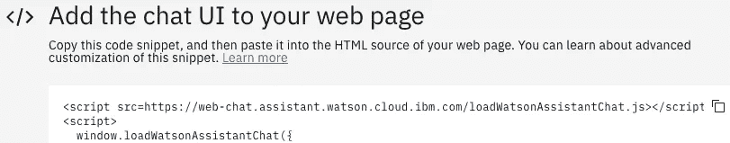

cheaty IBM code

看起来不错！但是等等！如果你正在使用 [React 和它的虚拟 DOM](https://reactjs.org/docs/faq-internals.html) ，这将导致你从 Watson 导入的 JS 脚本无法工作，因为你的应用程序的不同脚本是异步加载的！如果有一个我可以为 IBMWatson 导入的 React 模块就好了，但是哇，没有，尽管有 Node！我不想返工我的整个应用程序，所以它是在香草 JS！幸运的是，我聪明的教练尼基·多佛能够教我如何将它集成到我的应用程序中。

首先，我简单地将脚本 src 标签粘贴到我的 index.html 的顶部，这样它会尽快加载。

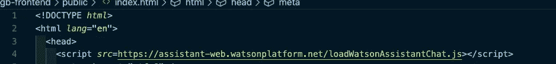

load damn you!

然后，我将 IBM 提供的 JS 函数放在 App.js 项目的顶部。

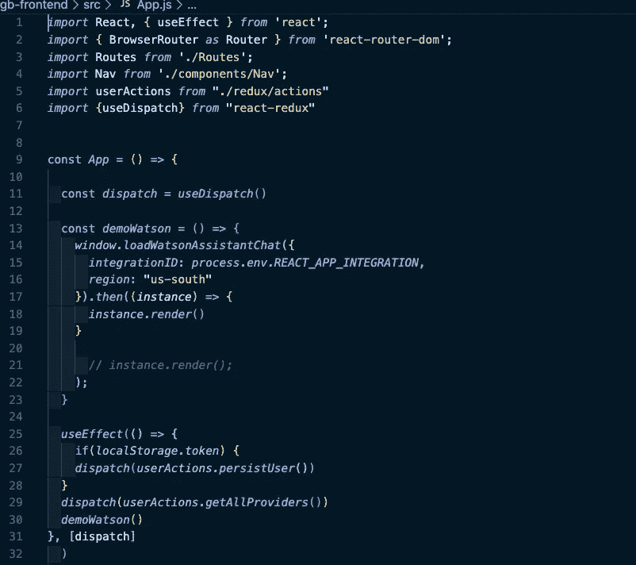

Hide yo API keys!

我使用一个 ENV 文件隐藏了我所有的 PWN-able 值[,我强烈推荐使用这个文件](https://create-react-app.dev/docs/adding-custom-environment-variables/),并使用 [useEffect 钩子](https://medium.com/javascript-in-plain-english/redux-hooks-profit-bf3f576e066d)在我的应用程序组件和我的获取装载到后端时加载 IBM 函数。

最终的结果是一个看起来很专业的聊天机器人，拥有来自我的 Watson 控制台 UI 的所有信息，并与我的后端通信，在我的网站加载后立即加载。

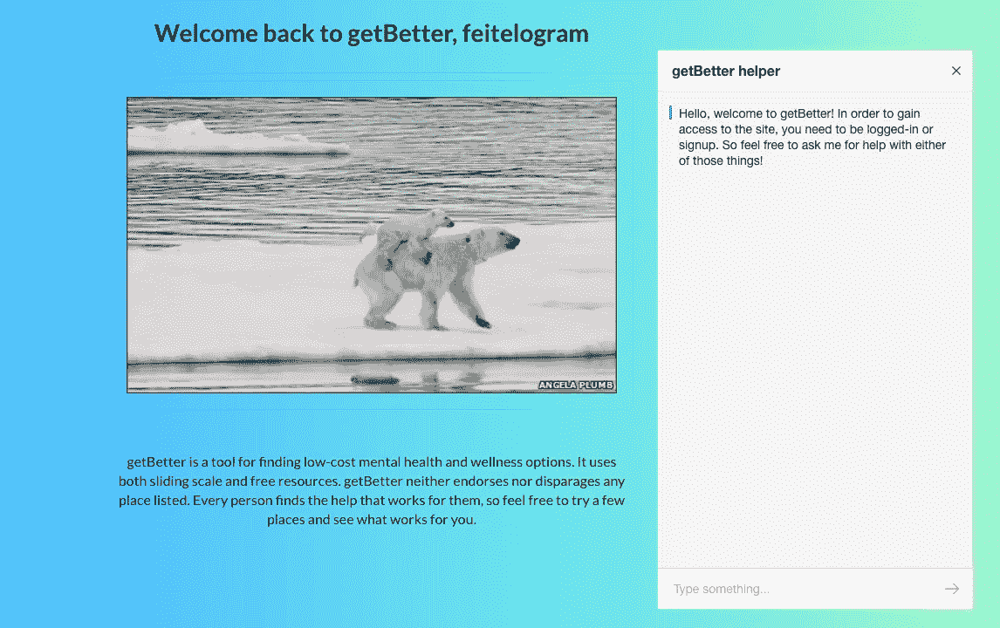

success!

最后，当我使用 Watson 更新我的数据库时，我是如何对更新做出反应的？罗伯特·梅希亚推荐查看推送通知和服务人员。在 Watson 的早期实现中，我考虑过通过我的 Rails 应用程序使用获取的消息响应来进行条件渲染，但最后，我做了一些更愚蠢的事情。我藏起来了。

sneaky

我只是这样做，当有人去检查他们保存的实例时，另一个获取将在后台执行到我的服务器，以查看是否有更新。懒！业余的。功能性。

所以你有它。有些人可能会说这是草率或懒惰或蹩脚的，但实际上，我并不自称是天才或完美的机器学习工程师。

我所声称的是一个遛狗的人，他在 2019 年 7 月根本不知道任何代码，面对他的 32 岁生日，他决定学习一些，到 2020 年 1 月，能够将一个功能性的 IBM Watson AI 与全栈 React/Redux/Rails 集成到互联网上，您自己可以使用它！我对此很自豪。

如果你想看看它的样子或我的其他应用程序，[看看我的作品集](https://wonderful-jackson-9e020f.netlify.com/)或 [LinkedIn](https://www.linkedin.com/in/nicholasfeitel/) 上的 HMU。

祝你的项目好运，当你筋疲力尽时，做我做的事情，拥抱一只好狗。

june!

这是朱尼珀又名朱恩又名朱尼厄斯。她很可爱，有长长的舌头，喜欢拥抱和亲吻，但如果你不给她零食，她会抱怨。虽然她有卷曲的尾巴，但她值得拥有它们。

战争。