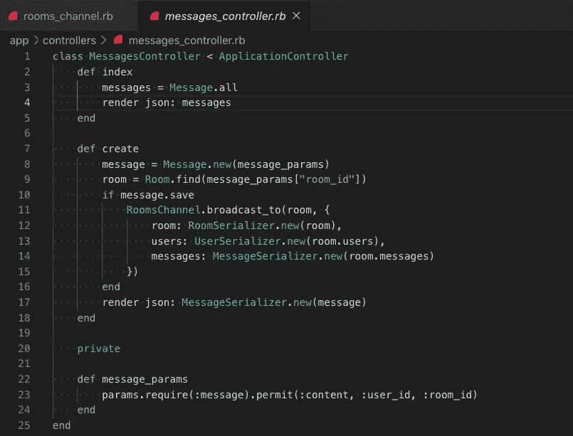

# 将 ActionCable 与 React 集成

> 原文：<https://javascript.plainenglish.io/integrating-actioncable-with-react-9f946b61556e?source=collection_archive---------2----------------------->

## Action Cable 是 Ruby on Rails 提供的一个框架，允许开发人员在他们的应用程序中使用 WebSockets。

WebSockets 自 2008 年就已经出现，是一种完全独立于超文本传输协议(或 HTTP)的协议。我非常熟悉使用 HTTP 的客户端和服务器之间的通信——客户端(我的浏览器)打开一个连接，向服务器发送某种请求(可能是加载网站，或者处理来自表单的输入)，服务器处理该请求，并以某种信息做出响应，然后连接关闭。这种来回操作在大多数情况下都非常有效。然而，有时应用程序需要非常频繁地从服务器获得更新的信息。一个例子是聊天功能。

如果我属于一个聊天室，我的计算机(客户端)知道我的朋友是否给我发送了任何消息(如果我使用 HTTP)的唯一方法是频繁地、定期地调用我的服务器来检查任何更新。这就是所谓的*轮询，*，我相信你能猜到，这是非常低效的。WebSockets 通过在客户端和服务器之间创建一个*保持开放的 TCP 连接来消除这种低效。然后，不再是客户端一遍又一遍地向服务器请求更新，而是服务器一收到任何更新，*就会自动将它们推送到*该连接上的所有客户端。就像从对讲机升级到手机。*

# 行动电缆和反应

Action Cable 的文档和大多数 Rails 文档一样，非常全面。但是，它假设您使用 Rails 作为全栈框架。如果你计划将一个 Rails 后端和一个独立的前端框架结合起来，那么关于如何整合 ActionCable 的资源是很稀缺的。这个博客是我试图澄清一些困惑，并帮助其他人开始。我已经创建了一个简单的聊天室应用程序，并将向您展示我是如何设置的。如果你想看完整的代码，这里有我在 Github 上的回复链接…

后端—[https://github.com/jennyjean8675309/chitter_chat](https://github.com/jennyjean8675309/chitter_chat)

前端—[https://github.com/jennyjean8675309/chitter_chat_frontend](https://github.com/jennyjean8675309/chitter_chat_frontend)

## 入门指南

我的 Rails 后端相当简单——我想将我的应用程序设计成有三个聊天室。每个聊天室都有许多消息(来自许多用户)，消息充当聊天室和用户之间的连接表。所以我的后端只有三个模型——房间、消息和用户，以及相应的控制器。

**我的应用程序还包含了用于用户图像上传和授权的 ActiveStorage(使用 bcrypt gem 和 jwt 令牌)，这导致了一些额外的控制器，但这些对于理解 Action Cable 是不必要的——在本文中，我将尝试只引用与 Action Cable 相关的代码。*

## 路线

我的第一步是为后端设置我的路线。在 routes.rb 文件中，您需要指定以下内容:

```
resources :rooms, only: [:index, :show]
resources :messages, only: [:index, :create]
resources :users, only: [:index, :create]
mount ActionCable.server => '/cable'
```

如果您以前使用过 Rails，那么前三行应该相当熟悉。最后一个有点奇怪——先说一下。记住 WebSockets 是它们自己的协议——它们不需要指定请求的类型(即 get、post、put 等)。)就像我们处理 HTTP 一样。相反，我们简单地*为我们的服务器安装*一个路由来处理 WebSocket 连接——我们的前端将连接到“/cable”端点来实例化一个连接——但是我们将稍后再做。

## 连接

连接，我相信你可能已经猜到了，将客户机连接到服务器。每当服务器接受 WebSocket(来自客户端)时，就会初始化一个连接。为了让 WebSocket 被接受，Rails 提供了一个父 ApplicationCable::Connection 类(可以在 channels-> application _ cable-> Connection . Rb 中找到),它唯一的工作就是对当前用户进行身份验证和授权。因为我的前端正在为我的应用程序处理身份验证，所以我在后端忽略了这个过程，将类留空。


单个动作有线服务器可以处理多个连接，并且单个用户(即客户端)可以简单地通过打开新的浏览器标签或窗口来打开多个连接。用有线电视的话说，通过 WebSocket 连接到你的服务器的客户被称为*消费者*。

为了说明我的意思，在上面的视频演示中，我有一个客户端(我的 Chrome 浏览器)通过打开两个窗口，实例化了两个单独的 WebSocket 连接到我的后端 Action Cable 服务器。他们都连接到我的服务器，但在右边我以“betty”登录，在左边以“harold”登录。因为两个用户都订阅了爱猫空间(单一频道)，所以有源源不断的交流来回流动。这意味着当贝蒂发送信息时，哈罗德会自动接收。这就是所谓的发布/订阅链接(或发布-订阅)。信息的*发布者*(即发送者)将数据推送到该特定频道的*所有订阅者*(不直接识别个人接收者)。这意味着，如果有一群其他用户订阅了爱猫室，他们将同时收到贝蒂的信息。

## 频道

您可以将通道视为一个单独的通信流，信息在其中来回流动。我有三个聊天室，每个聊天室都有自己的频道——每个想聊猫的用户都可以订阅爱猫人士频道，可以向订阅该频道的所有其他用户发送信息，也可以从订阅该频道的所有其他用户那里接收信息。我的 Trekkies 频道和阴谋论者频道也是如此。

与 ApplicationRecord 和 ApplicationController 类似，Rails 创建了一个父 ApplicationCable::Channel 来处理通道之间的所有共享逻辑。

正如 Rails 中的控制器对应于模型一样，通道也是如此。因为我的三个通道都是房间模型的实例，所以我只需要创建一个通道类，我将其命名为 RoomsChannel。那么，你可能会问，我的应用程序如何知道用户预订了哪个房间？答案是，我的前端将把关于房间的信息发送到后端(以 params 的形式)，然后我的 RoomsChannel 类将找到指定的特定房间，并只传输那个房间的信息。


注意，我的 RoomsChannel 继承自 ApplicationCable::Channel。现在让我们转到前端(客户端)来看看这一切是如何关联的。

## 作为消费者的前端

我已经为我的前端创建了一个基本的 React 应用程序。为了利用 WebSockets，我需要做的第一件事是将我的前端客户端设置为一个*消费者*。请记住，一个用户(即一个自然人)可以同时打开多个连接，因此可以有多个消费者(将消费者想象成浏览器标签或窗口)。

首先，跑步

```
npm install actioncable --save
```


安装 actioncable 节点包允许我们使用 createConsumer()函数。还记得我们在后端安装 WebSockets 的路由吗？—这是我们打开连接的地方。注意，url 的前缀是*而不是* http，而是 ws——这是因为我们现在处于 WebSocket 协议的世界中！

一旦我们将前端客户端创建为消费者，请注意，我现在将 CableApp 对象作为道具传递给我的应用程序组件。

## 数据结构

我在应用程序中有很多事情发生，但我们现在将忽略其中的大部分。首先，我想让大家关注一下 App 组件的状态。


这里需要注意的重要部分是 currentRoom 的*数据结构*——我将在整个应用程序中坚持使用相同的数据结构。认识到这种数据结构也匹配来自后端的广播信息是很重要的。回头参考 rooms_channel.rb …


## 发送信息

现在事情变得有点棘手了，但是我会尽可能的说清楚…现在继续听我说！

我想关注的主要组件是我的 RoomShow 组件。我在 App.js 中为这个组件声明了一个路由。


这是我的 RoomShow 组件在浏览器中的样子…


注意，我的 RoomShow 组件保存了用户提交新消息的表单。它也是我的 ChatFeed 组件(灰色框)的父组件，该组件是各个 ChatMessage 组件的父组件。RoomShow 也是另一个我们看不见的组件——RoomWebSocket——的父组件。

请注意我从应用程序中作为道具发送的内容…


第一个是 router props，第二个是 cableApp，我们已经看到了，是到我们从 index.js 创建的 WebSocket 的连接。接下来的两个，getRoomData 和 updateApp 是函数…


roomData 和 currentUser 都是状态片段，分别跟踪我的用户正在查看的当前房间和当前登录的用户。

现在回到我上面提到的那个不可见的 RoomWebSocket 组件…

## WebSocket 组件

从我们的 RoomShow 组件呈现的最后一个组件是 RoomWebSocket。尽管这个组件是不可见的(也就是说，它没有在浏览器中呈现任何东西)，但它是至关重要的。它收到了来自 RoomShow 的三个道具…


所有的动作都发生在这个组件挂载的时候。第一个被调用的函数是 getRoomData()。这是我的应用程序中唯一调用这个函数的地方。它将房间 id(从我的窗口位置获取)作为参数传入，对我的后端进行 fetch 调用，并为我的用户正在查看的当前房间设置状态。

## 创建订阅

我们的 RoomWebSocket 组件也是(惊喜！惊喜！)我们的客户机和服务器之间的通信(通过我们在 index.js 中打开的连接)发生了。


注意上面的第 8–11 行——在这里，我们的消费者通过创建订阅成为订阅者。有两个参数(对象)传递给了 subscriptions.create()函数。第一个对象有两个键— channel(必需的)，它指定我们正在为其创建订阅的频道(' RoomsChannel ')，以及 room，它的值是我们从窗口位置获取的房间 id。

如果我把一个 byebug 放在我房间频道的订阅动作中，像这样…


…当我导航到一个 RoomShow 页面时，我可以在我的代码中暂停一会儿，以期待来自终端的参数。


请注意，我们从 RoomsChannel 订阅的操作首先找到我们想要连接到其通道的特定房间，然后使用 stream_for 命令创建一个通信流。移除 byebug 后，您应该可以在终端上看到一条消息，表明您正在直播信息！！！


现在不要太骄傲了…

## 广播

现在，我们知道我们确实在将信息从前端消费者传输到后端，但是这些更新是如何被推出的呢？答案来自我们处理信息的方式。

当用户提交新消息时，会向后端发出一个 HTTP post 请求，由 MessagesController 处理…



在我的 MessagesController 的 create 操作中，如果成功地创建了一条新消息并保存到我的数据库中，那么我会向为其创建该消息的特定房间频道发送一条新的广播。


my subscriptions.create()函数的第二个参数是一个带有一个键 received 的对象，它指向一个回调函数。当在该通道上接收到新信息时，就像上面我创建新消息的例子一样，这个回调函数被调用并自动更新我的应用程序中的状态！

## 结论

总之，WebSockets 和 Action Cable 非常可爱！我希望对 Action Cable 和 React 的介绍能帮助到一些人！