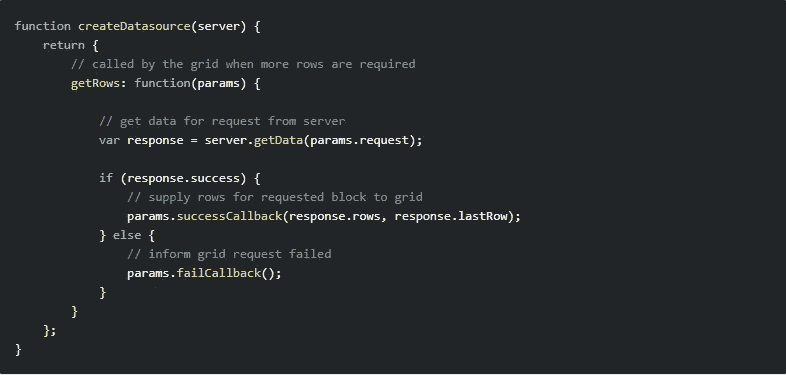

# 将 ag-Grid 集成到 React 应用程序中

> 原文：<https://javascript.plainenglish.io/integrating-ag-grid-into-your-react-application-53f430a3ab05?source=collection_archive---------7----------------------->

如果您正在尝试学习如何将 ag-Grid 整合到 React 应用程序中，那么您已经找对了地方。

在本文中，我将介绍 ag-Grid 的客户端和服务器端实现。我将解释所有必要的部分，以及如何将这两个实现集成到 React 应用程序中。

对于不熟悉 ag-Grid 的人来说，它是一个功能丰富的 JavaScript 数据网格，支持 React、Angular 和 Vue 等主流 JavaScript 框架。

我链接了 ag-Grid 文档中列出的一些流行功能:

*   [布局&造型](https://www.ag-grid.com/javascript-grid-row-styles/)
*   [选择](https://www.ag-grid.com/javascript-grid-selection-overview/)
*   [过滤](https://www.ag-grid.com/javascript-grid-filtering-overview/)
*   [渲染](https://www.ag-grid.com/javascript-grid-rendering-flow/)

# 客户端实现

客户端实现非常简单。下面是客户端实现所需的内容:

*   银栅反应元件
*   ongriddready
*   网格选项
*   ColumnDefs
*   RowData

还有一件事我们要添加，但是**别担心，**我会解释的。

## ongriddready

我们添加的第一个道具是`onGridReady`，这是一个提供网格和列 API 的事件回调。这里我们用它来设置局部变量`gridApi`的状态，稍后我们可以用它在网格上执行操作，比如获取一个选中的行。

## 网格选项

`gridOptions`是整个电网接口的*【一站式】*。所有网格属性都可以通过该对象获得。这里指向`GridConfig.gridConfig`。

下面是我创建的名为`GridConfig`的文件，其中包含一个对象，该对象具有网格所需的一些属性。

> 注意:没有必要为网格创建单独的文件。我这样做只是为了分散关注

## ColumnDefs

如前所述，`columnDefs`是网格所必需的。它是一个包含要显示的`headerName`和对应行数据的`field`的属性。

通过`gridOptions`，我们正在设置列定义。我们可以很容易地将`rowData`属性放在配置文件中，或者直接将其作为道具添加。

## RowData

`rowData`是用于设置数据在网格中显示为行的属性。

## 获取数据

剩下要解释的就是`getGridData`函数了。它向 public 文件夹中的一个文件发出 GET 请求，我在这个文件夹中为网格添加了数据(*这可以用一个真正的端点*来替换)。一旦数据被返回，我们将`rowData`设置为它的结果，网格就会被这些数据填充。

# 服务器端实施(仅限企业)

在使用 ag-Grid 的服务器端实现时有一些不同。首先我们要介绍一些新道具，它们是`rowModelType`和`cacheBlockSize`。我们还必须提供一种新的机制来为网格提供数据。

当使用客户端行模型实现时，我们所要做的就是向网格的`rowData` prop 提供数据。然而，这个属性只适用于客户端实现。

当使用服务器端行模型实现时，应用程序需要实现一个数据源，用于向网格提供数据。这个实现必须符合服务器端数据源接口。

以下代码片段显示了一个简单的数据源实现:

下面是我们的实现:

## RowModelType

`rowModelType`设置了将数据加载到网格中的策略。默认设置为`clientSide`。

## CacheBlockSize

`cacheBlockSize`属性决定每个请求获取多少数据

## 注册数据源

除了网格需要的新道具之外，我们还需要引入一些其他的新东西:

*   getRows(参数)
*   params.successCallBack()
*   parms . API . setserversidedata source()

当网格需要数据时，调用`getRows(params)`函数。从服务器获取的行通过`params.successCallback()`提供给网格。`params.api.setServerSideDataSource()`将数据源注册到网格中。

## 获取数据

在这个`getGridData`函数中，我们首先向行数据所在的公共文件夹中的位置发出一个 GET 请求。然后，我们使用返回的数据数组通过`params.successCallback()`向网格提供行。最后，我们使用`params.api.setServerSideDataSource()`注册数据源。

# 结论

我们现在已经讨论了将行数据加载到网格中的两种不同策略。对于客户端实现，应用程序将完整的数据集加载到客户端，然后将它全部传递到网格。对于服务器端实现，数据保存在服务器上，并分部分加载到网格中。归根结底，是决定哪种实现最适合您的应用程序的需求。更多关于 ag-Grid 及其所有功能的信息，请查阅[官方文件](https://www.ag-grid.com/documentation-main/documentation.php)。