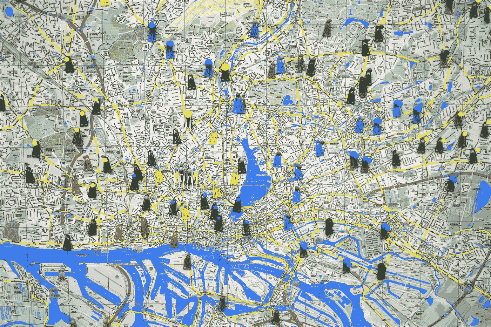
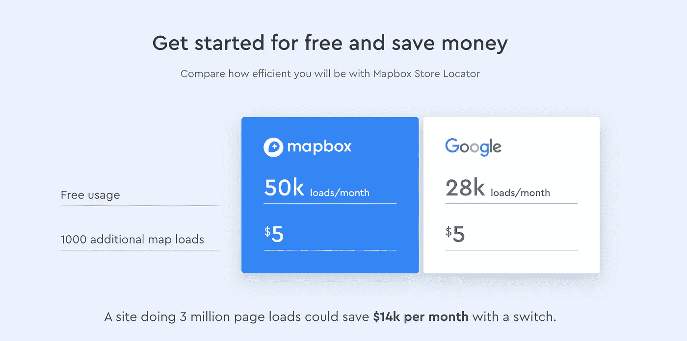
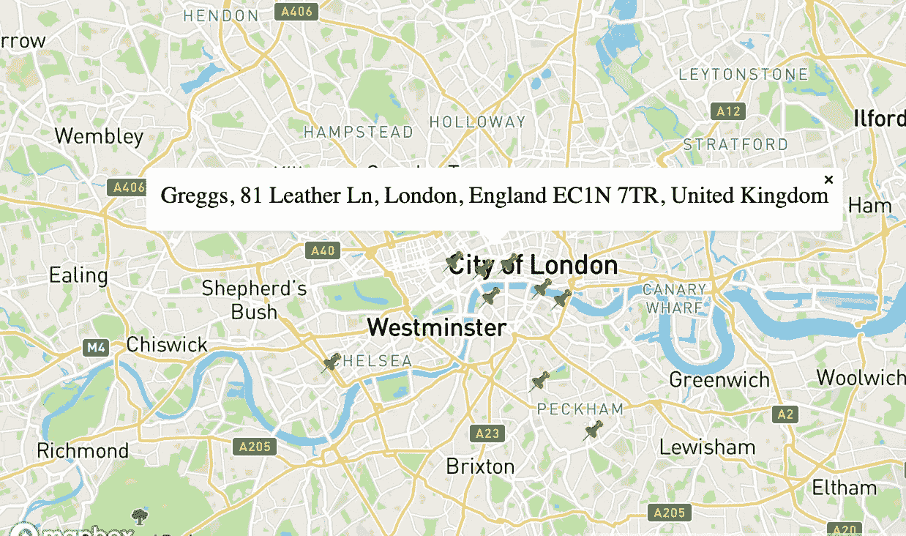
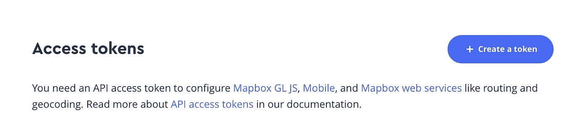

# 整合 MapBox 和 next . js——谷歌地图的廉价替代品

> 原文：<https://javascript.plainenglish.io/integrating-mapbox-with-next-js-the-cheaper-alternative-to-google-maps-460e4c2e6efc?source=collection_archive---------1----------------------->

## 使用 MapBox 的搜索 API 和地图 API 构建一个带有可点击图钉的交互式地图



Photo by [Waldemar Brandt](https://unsplash.com/@waldemarbrandt67w?utm_source=unsplash&utm_medium=referral&utm_content=creditCopyText) on [Unsplash](https://unsplash.com/s/photos/google-maps?utm_source=unsplash&utm_medium=referral&utm_content=creditCopyText)

最近，我一直致力于创建一个[生态旅游平台](https://sustaynably.com)，并发现自己需要用一些可点击的标记针来绘制地图(我们将在本教程中重现)。在搜索了互联网上可能的解决方案后，两个直接的选择出现了——谷歌地图和地图盒子。虽然我们大多数人都熟悉谷歌地图，因为它在我们的生活中无处不在，但我发现，将它集成到应用程序中并不理想。建立一个自举项目，我想保持成本最低，谷歌地图的[定价结构](https://cloud.google.com/maps-platform/pricing)将意味着成本将开始增加。

# **进入 MapBox！**

凭借具有竞争力的[定价结构](https://www.mapbox.com/pricing/)(网上前 50，000 个请求是免费的)和易于使用且记录良好的 API，MapBox 是谷歌地图的一个很好的替代品。它也是建立在开源地图项目 [OpenStreetMap](https://www.openstreetmap.org/) 之上的。赢了，赢了！



Comparison between MapBox and Google Maps. [Source](https://www.mapbox.com/use-cases/store-locator/).

# **我们在建造什么？**

我们将查询 MapBox 的搜索 api，以获取一家名为 Greggs 的臭名昭著的咖啡店的一些位置，将我们的搜索集中在大伦敦地区。然后，我们将在我们的 MapBox `<Map>`组件中用一串可点击的标记来呈现这些地方。点击时，这些标记会显示一些可忽略的弹出窗口。



The finished project will look something like this

# 我们来编码吧！

## 创建一个 MapBox 帐户以获取您的访问令牌

你需要做的第一件事是[创建一个 MapBox 帐户](https://account.mapbox.com/auth/signup/)，这样你就可以获得一个访问令牌。我们将使用这个令牌向各种 MapBox APIs 发出请求。



This is usually the first thing you will see when you sign up for a MapBox account

一旦有了访问令牌，就该建立自己的 Next.js 项目并集成 MapBox 提供的所有有趣功能了。

## 建立一个新的 Next.js 项目(如果您已经有了自己的项目，请跳过这一步)

建立一个 Next.js 项目很简单，你可以按照[官方文档](https://nextjs.org/learn/basics/create-nextjs-app)中的说明或者运行下面的命令来建立一个新的 Next.js 项目(确保你已经安装了 Node.js)。

```
npx create-next-app mapbox-project
```

然后，cd 进入`mapbox-project`目录，并通过运行`npm run dev`或`yarn dev`来运行开发服务器。瞧啊。您的 Next.js 项目已经启动并运行了！

## 设置地图框地图

接下来，是时候在我们的项目中渲染一个 MapBox 地图了。我们通过添加一个由优步团队`react-map-gl`编写的[地图框库](https://github.com/visgl/react-map-gl)来实现这一点。这包含一套用于 MapBox 的 React 组件。通过运行以下命令将此库添加到您的项目中:

```
yarn add react-mapbox-gl
```

这样，我们将创建一个位于`components/Map.js`的地图组件。

创建 Map.js 文件，并向其中添加以下代码:

```
import { useState } from "react";
import ReactMapGL from "react-map-gl";export default function Map() {
  const [viewport, setViewport] = useState({
  width: "100%",
  height: "100%",
  *// The latitude and longitude of the center of London* latitude: 51.5074,
  longitude: -0.1278,
  zoom: 10
});return <ReactMapGL
  mapStyle="mapbox://styles/mapbox/streets-v11"
  mapboxApiAccessToken={process.env.MAPBOX_KEY}
  {...viewport}
  onViewportChange={(nextViewport) => setViewport(nextViewport)}
  >
</ReactMapGL>
}
```

这还不行。Next.js 最大的特性之一是它提供的服务器端渲染。然而，MapBox 需要全局窗口对象才能正常工作。如果您在服务器端渲染您的应用程序，您将需要动态地将其导入到您的页面。这意味着不是像常规组件一样导入它，

```
import Map from '../components/Map'
```

我们将不得不动态导入它。我们将通过使用 Next.js `dynamic imports`来做到这一点。

在您的`pages/index.js`文件中(或者您正在渲染地图组件的任何地方)添加以下代码。

```
const Map = dynamic(() => import("../components/Map"), {
  loading: () => "Loading...",
  ssr: false
});
```

这意味着我们的 MapBox 组件现在将有选择地呈现在客户端。完美！

我们现在唯一需要做的就是将 MapBox 的 CSS 文件添加到我们的项目中。最简单的方法是修改现有的`_app.js`或者添加一个定制的`_document.js`文件。然后在你的渲染函数中添加一个 CSS 到`<Head>`的链接。你可以在他们的 [API 文档](https://docs.mapbox.com/mapbox-gl-js/api/)中获得 CSS 文件的最新版本。

```
<head>
<link href='https://api.mapbox.com/mapbox-gl-js/v1.12.0/mapbox-gl.css' rel='stylesheet' />
</head>
```

完美。您的地图现在应该已经启动并运行了！让我们更进一步，尝试在地图上绘制一些可点击的大头针。

## 使用 MapBox 的搜索 API 获取地标列表

MapBox 有一个非常方便的地理编码 API，你可以用它来获取一个位置列表，包括它们的纬度和经度。我们将获取伦敦 Greggs(一家外卖快餐和咖啡店)的列表，并将它们作为图钉呈现在我们的地图上。

首先，让我们通过向 Mapbox 地理编码 API 添加一个简单的 fetch 调用来查询我们的列表。我们希望在伦敦的地理范围内进行搜索，并希望我们的搜索结果不超过 10 个(伦敦很大，伦敦人喜欢他们的格雷格素食香肠卷。我们不想被所有的可能性淹没！).MapBox 的地理编码地点搜索 API 采用以下参数，以及一些附加的查询字符串。在这里阅读文档！

```
/geocoding/v5/mapbox.places/**{search_text}**.json
```

我们将使用`limit`查询参数将结果限制在 10，使用`bbox`参数指定伦敦的纬度和经度范围。

考虑到这一点，我们的搜索 url 将如下所示:

```
https://api.mapbox.com/geocoding/v5/mapbox.places/greggs.json?access_token=${process.env.MAPBOX_KEY}&bbox=-0.227654%2C51.464102%2C0.060737%2C51.553421&limit=10
```

我们可以使用这个 url，在我们的页面中进行一个简单的获取调用。我们修改后的页面现在看起来像这样，

```
const Map = dynamic(() => import("../components/Map"), {
  loading: () => "Loading...",
  ssr: false
});const url = `https://api.mapbox.com/geocoding/v5/mapbox.places/greggs.json?access_token=${process.env.MAPBOX_KEY}&bbox=-0.227654%2C51.464102%2C0.060737%2C51.553421&limit=10`;export default function IndexPage() { const [locations, setLocations] = useState([]); useEffect(() => {
    const fetchLocations = async () => {
      await fetch(url).then((response) =>
        response.text()).then((res) => JSON.parse(res))
      .then((json) => {
        setLocations(json.features);
      }).catch((err) => console.log({ err }));
    };
    fetchLocations();
  }, []); return (<Container>
    <Map />
  </Container>);
}
```

我们现在有 10 个格雷格的位置列表！

## 使用我们的搜索结果在地图上呈现图钉

现在我们有了一个地点列表，我们可以在地图上呈现这些地点。`react-map-gl`带有一个方便的`<Marker>`组件，使得我们的任务非常简单。首先，我们需要将这些位置传递给我们的`<Map>`组件。

```
return (<Container>
    <Map locations={locations} />
  </Container>);
```

现在，在我们的地图组件中，我们需要通过将这些位置的纬度和经度传递给`<Marker>`组件来呈现每个位置的 pin。

我们最终的地图组件看起来会像这样，

```
import { useState } from "react";
import ReactMapGL, { Marker } from "react-map-gl";export default function Map({ locations }) {
  const [viewport, setViewport] = useState({
    width: "100%",
    height: "100%",
    *// The latitude and longitude of the center of London* latitude: 51.5074,
    longitude: -0.1278,
    zoom: 10
  });return <ReactMapGL
  mapStyle="mapbox://styles/mapbox/streets-v11"
  mapboxApiAccessToken={process.env.MAPBOX_KEY}
  {...viewport}
  onViewportChange={(nextViewport) => setViewport(nextViewport)}
  >
  {locations.map((location) => (
    <div key={location.id}>
      <Marker
      latitude={location.center[1]}
      longitude={location.center[0]}
      offsetLeft={-20}
      offsetTop={-10}>
        <span role="img" aria-label="push-pin">📌</span>
      </Marker>
    </div>
  ))}
</ReactMapGL>
}
```

## 使大头针可点击

我们快到了！我们要做的最后一件事是添加一个带有地名的弹出窗口，以使这些地图完全发挥作用并具有交互性。同样，Mapbox 附带了一个方便的`Popup`组件，使得这一点很容易做到。我们将简单地向我们的 pins 添加一个 onClick 处理程序，它将捕获所选位置的细节，然后我们将把所选位置的纬度和经度传递给我们的`<Popup>`组件。一会儿就清楚了！

在地图组件中，添加一个`useState`钩子来捕获所选位置。

```
export default function Map({ locations }) { // UseState hook
  const [selectedLocation, setSelectedLocation] = useState({}) const [viewport, setViewport] = useState({
    width: "100%",
    height: "100%",
    *// The latitude and longitude of the center of London* latitude: 51.5074,
    longitude: -0.1278,
    zoom: 10
  });......
```

我们还将修改 render 块，添加一个 onClick 处理程序和我们刚刚提到的`<Popup>`组件。

```
......return <ReactMapGL
  mapStyle="mapbox://styles/mapbox/streets-v11"
  mapboxApiAccessToken={process.env.MAPBOX_KEY}
  {...viewport}
  onViewportChange={(nextViewport) => setViewport(nextViewport)}
  >
  {locations.map((location) => (
    <div key={location.id}>
      <Marker
      latitude={location.center[1]}
      longitude={location.center[0]}
      offsetLeft={-20}
      offsetTop={-10}>
        <a onClick={() => {
          setSelectedLocation(location);
        }}>
          <span role="img" aria-label="push-pin">📌</span>
        </a>
      </Marker>
      {selectLocation.id === location.id ? (
      <Popup
      onClose={() => setSelectedLocation({})}
      closeOnClick={true}
      latitude={location.center[1]}
      longitude={location.center[0]}>
        {location.place_name}
      </Popup>) : (false)}
    </div>
  ))}
</ReactMapGL>
}
```

`<Popup>`组件接受一个 onClose 处理程序，该处理程序将 selectedLocation 设置为`{}`。

仅此而已！我们已经成功地绘制了一张地图，在地图上绘制了一些图钉，并成功地用弹出窗口点击它们！这是我们的最终结果:


The finished project

我还为整个项目制作了一个[代码沙箱，所以如果有什么不合理的地方，请随意查看！](https://codesandbox.io/s/loving-frost-7nhgn)

编码快乐！