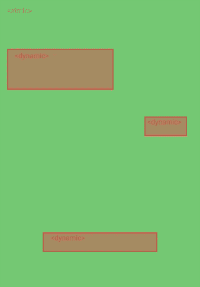

# 如何在静态页面上集成独立的 React 组件

> 原文：<https://javascript.plainenglish.io/integrating-stand-alone-react-components-on-a-static-page-21dd4fd3074?source=collection_archive---------3----------------------->

## 仅对您需要的东西使用 React

如今，速度才是王道。众所周知，普通的 HTML 站点比 JavaScript 驱动的站点表现更好。但是对于我们提供给用户的所有交互内容，几乎无法想象一个没有 JavaScript 的网站。那么，中间立场是什么？

# 你不喜欢反应？

不要误解我的意思，我是前端框架的忠实支持者，但有时我们在实现中会受到限制。这意味着，在某些情况下，我们无法在普通的 React 应用程序中工作。例如:

*   你的网站是由内容管理系统驱动的
*   多个团队控制着网站的不同部分
*   技术决定已经做出，这不是你说了算的
*   性能和搜索引擎优化是非常重要的
*   您没有对您的应用程序进行 SSR 的基础设施

这个清单还可以继续，但关键是，**你并不总是处于控制中**。

# 使用案例

我们有一个静态网站，我们想在那里注入动态内容的微小片段。我们不想要一个完全动态的页面，因为动态的内容比静态的内容要少。

这些动态内容可以是传送带、价格显示、通知、CTA 等等

这些由我们的 React 组件表示。这些组件通常依赖 API 来执行操作或显示数据。

现在的问题是，我们如何以结构化和可维护的方式将它们显示在页面上。我们希望避免每次集成新组件时都必须手动编写代码。

# 整合组件

如果我们看看如何启动一个普通的 React 应用程序，它看起来像这样。

其中 *< App/ >* 是入口组件，而 *root* 是我们将在 DOM 中放置该组件的位置。如果你这样说，你可能会问，**我们能对多重根这样做吗？答案是肯定的。了解了这一点，我们就可以建立一些基本框架，在特定的根上呈现特定的组件。**

## 根

让我们从定义组件根在 DOM 中的外观开始。我们需要识别哪个 React 组件将呈现，以及将什么数据传递给该组件。数据属性将定义我们的组件将如何呈现。 *data-react-component* 将引用 react 组件映射到的键。 *data-react-props* 是我们可以传递给组件的数据的 JSON 表示。

## 映射

映射是自动匹配 HTML 根和 React 组件的关键。为了提高可维护性，可以利用一些助手方法来注册和获取组件。

当获取一个组件时，在失败的情况下返回空值*是很重要的，因为与呈现未定义的*相反，呈现空值*不会导致反应错误。*

# 渲染

现在，我们将结合 React 渲染方法应用前面的示例。我们将通过在 DOM 中查询一个 *data-react-component* 属性来获得所有的根。然后我们遍历每个根，从 HTML 元素的数据集中获取组件 id 和 JSON 属性。

为了在组件中插入道具，我们[析构](https://medium.com/javascript-in-plain-english/destructuring-demystified-76884866ba30)组件中被解析的 JSON 道具作为单独的道具。

# 我们能让这些组件交流吗？

如果我们不能，我会问吗？当然可以！组件交互最常见的方式之一是通过传递道具。然而，有了我们的独立组件，就没有父母可以从中获取道具，也没有孩子可以向其传递道具。

作为一个例子，我们可以使用 Redux 来解决这个问题。可以使用许多其他的状态管理库，但是这个例子展示了将共享状态与独立组件集成的概念。

Redux 利用了一个提供者，它向连接的组件公开存储。由于这个提供者是你的应用程序的包装器，许多人认为如果你想让你的组件使用同一个存储，它们需要在同一个应用程序中。不对！

通过用提供者包装我们想要呈现的每个组件，并将相同的存储引用传递给该提供者，我们实际上向所有这些单独的组件公开了同一个存储。

请注意，当您使用一个函数来设置您的商店时，请确保您总是返回相同的商店实例来传递给您的提供者。否则，每个组件都有一个单独的存储。

好了，你可以随意使用 React，但是请记住，当渲染更多单独的组件时，性能会降低。然而，当需要呈现那么多组件时，您应该真正尝试改变为单个应用程序的方法。

## 进一步阅读

 [## 用 React 和 Bit 设计组件中的令牌

### 现场演示更好。在我们深入细节之前，让我们看一下使用 Bit 设计令牌如何帮助我们构建…

比特云](https://bit.cloud/blog/design-tokens-in-components-with-react-and-bit-l28qlxq6) 

*更多内容请看*[***plain English . io***](https://plainenglish.io/)*。报名参加我们的* [***免费周报***](http://newsletter.plainenglish.io/) *。关注我们关于*[***Twitter***](https://twitter.com/inPlainEngHQ)[***LinkedIn***](https://www.linkedin.com/company/inplainenglish/)*[***YouTube***](https://www.youtube.com/channel/UCtipWUghju290NWcn8jhyAw)***，以及****[***不和***](https://discord.gg/GtDtUAvyhW) *对成长黑客感兴趣？检查* [***电路***](https://circuit.ooo/) ***。*****