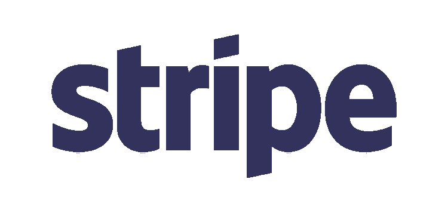

# 集成 Stripe 和 Vue -客户端改进

> 原文：<https://javascript.plainenglish.io/integrating-with-stripe-client-improvements-33c9e16c29d2?source=collection_archive---------4----------------------->

## 将 Vue 中简单的客户端条带集成提升到新的水平



TM [www.stripe.com](http://www.stripe.com/) The Stripe name and logos are trademarks of Stripe, Inc. or its affiliates in the U.S. and other countries.

*免责声明:本文与 Stripe 无关，也不由 Stripe 赞助。它独特地传达了我作为独立开发人员将 Stripe 服务集成到我的平台中的知识和经验。*

TL；博士:
+你可以做很多事情让条纹元素变得更好，阅读这篇文章了解更多

# 更多介绍

{螺母和螺栓开始于**改进过程**

我已经在我的[上一篇文章](https://medium.com/@marcusthesmith/integrating-with-stripe-client-basics-c9f188329143)中介绍了将 Stripe 集成到你的 Vue 客户端的要点，如果你还没有开始，你会想从那里开始。这篇文章包含了几个关于在你的 web 应用程序中改进 Stripe 元素使用的金块。很明显，您可以使用最少的资源，但是如果您发现自己在这里，您可能正在试图找出如何最大限度地利用条带集成。因为我希望这个内容在选项上相当全面，它可能会是一个活的作品。如果您有任何问题、想法或建议，请评论，我会考虑修改以纳入它们。合作得越好，资源对未来的读者就越有价值。

# 改进流程

## API 驱动键:

硬编码按键总是很诱人的。我强烈反对这样做。比把你的键放在配置文件中更好的一步是让它只能被 API 访问。这不需要太多的努力，并且允许您在 API 配置中的相同位置保存 Stripe 的键值。在我的[服务器基础文章](https://medium.com/@marcusthesmith/integrating-with-stripe-server-basics-54a928a7c13b)中，我有一个提供公共 API 密钥的例子。在您的客户端实现这个 API 访问公钥，在您挂载的钩子中看起来会像下面这样:

# 改进用户界面

## 条纹元素风格:

因为 Stripe 元素实际上不是 DOM 的一部分，所以它们不受应用于代码其余部分的任何 CSS 的影响。为了弥补这一缺陷，提供了一种在创建时将样式传递给元素的方法。大多数标准样式都可以应用，但还是有些局限。它不接受依赖于视图的大小调整，并且不能使用在您的代码中定义的任何 CSS 变量。在挂载的钩子中创建元素时，样式作为参数对象传递。这意味着对象格式和一些名称与标准 CSS 中的不同。

您将看到，在进行 CSS 定制时，我们有两个控制点需要考虑，一个是在[元素实例](https://stripe.com/docs/stripe-js/reference#stripe-elements)中添加字体，另一个是在元素创建方法中添加样式。如果不添加字体 cssSrc，您可能无法访问您想要的字体，但是如果您对默认字体满意，您可以删除这一部分。请注意用于传入自定义 CSS 的对象符号。可以操作的选项的完整列表可以在[这里](https://stripe.com/docs/stripe-js/reference#element-options)找到。它提供了字体样式、颜色、填充等选项。你可以看到，用一点 JS 的魔力，甚至可以做窗口驱动的样式和访问 CSS 变量。遗憾的是，你不能仅仅复制&粘贴 CSS 类，但是样式定制仍然使它们的元素非常有用。

## 多个元素:

尽管卡片单一元素选项非常好，但是您可能会发现它对于某些用例来说有点宽泛。非常方便的是，Stripe 还为每个必要的收费细节提供了单独的元素。当由同一个 Stripe 实例注册时，这些元素都绑定在一起，因此对令牌的检索完全相同。不过，要使用多个元素，您需要在模板中添加额外的挂载点，并在挂载的钩子中初始化/挂载它们。它可能看起来像这样:

额外的挂载点如下所示:

## 显示收据:

所以，你拿了你顾客的钱…我相信他们会很乐意看到费用的核实。这就是 Stripe 为您提供收据链接的原因，该链接会路由到 Stripe 管理的数字收据。您将希望确保它被添加到从您的服务器返回的数据对象中，然后一个可能的收据流可能看起来像这样:

在本例中，收据按钮仅在收据数据值不为空时显示。因此，一旦我们收到已处理的交易，我们可以更新它，Vue 的反应系统将显示按钮。

# 提高能力

## 数据驱动定价:

显然，有一个像我在[客户基础文章](https://medium.com/@marcusthesmith/integrating-with-stripe-client-basics-c9f188329143#446b)中那样的硬编码支付金额是一种选择。但是，如果您打算对多种东西收费(或者只是不想在每次更改价格时都要重新部署)，或者如果用户决定价格(就像在捐赠平台中一样)，您就需要向条带元素传递一个值。这是非常直接的，如果你熟悉 Vue，你可能已经知道这笔交易了。要将外部价值带入 Vue 组件，您将需要使用[道具选项](https://vuejs.org/v2/guide/components-props.html)。这些值暴露于您的 Vue 组件，但由其父组件控制。一个简单的实现是从数据选项中删除您的工资金额，并在中添加以下内容:

```
var StripeVueCard = Vue.component("StripeVueCard",{
...
props: { payAmount:{type: String,required:true}},
...
});
```

然后在父级中，您可以有类似以下的内容:

当然，您可能会有单独的页面和驱动项目和定价的数据库，但基本原则是相同的。请注意，对于捐赠支付金额，它以冒号(:)作为前缀，这意味着引号中的值是作用于父代的数据值或方法。对我们来说，它是由输入控制的“金额”数据值，允许我们直接从用户输入中提取费用金额。

## 可配置目的地(向他人收费):

如果您正在为他人创建一项交易管理服务，您将希望使用 [Stripe Connect](https://stripe.com/connect) 在您的帐户和他们的帐户之间转移资金。Connect 非常强大，为收取服务费用和支付费用提供了多种选择。在这里，我将提到最基本的用例，但是这些可能性远远超出了这个范围，将在另一篇文章中全面讨论。
在本例中，要为他人收费，您需要设置一个单独的目的地。这将保存您的客户端连接的帐户之一的帐户 ID(从您的数据库传入)。转到[这里](https://stripe.com/docs/connect/standard-accounts)了解更多关于使用标准连接账户的详细信息，下面我将展示对连接账户进行收费所需的代码，但是要正确设置 Stripe Connect 还有很多工作要做。
因为您实际上只需要一个额外的参数，并且因为对已连接账户的收费和所有不同的处理都可以在后端完成，我只使用与常规收费相同的前端呼叫结构。不同之处在于，我们添加了一个片段，可以将请求发送到不同的端点，并将目的地作为 URI 的一部分发送，正如您在粗体字中看到的:

```
{
...
processTransaction: function() {
      var self = this;
      dt = {
        amount: stripCurrency(self.payAmount), 
        currency: self.currency,
        description: self.description,
        token: self.transactionToken
      };
      var route = self.api + "/charge/card";
     ***if (self.destination !== undefined) {
        route = route + "/direct/" + self.destination;
      }***
      self.$http
        .post(route, dt, {
          headers: {}
        })
        .then(response => {
          if (response.status == 200) {
            self.transaction = response.data.transaction;
            self.receipt = response.data.receipt;
            self.lockSubmit = false;
          } else {
            throw new Error("failed charge");
          }
        })
        .then(() => {
          self.showForm = false;
          self.$emit("transaction-success", self.transaction);
        })
        .catch(err => {
          alert("error: " + err.message);
          self.lockSubmit = false;
        });
    },
    ...
    }
```

这将转到您的服务器实现中的一个 API 路径。在我的文章中的 Flask 服务器中，处理连接请求的代码如下所示:

```
@app.route('/charge/card/direct/<destination>', methods=['POST'])
def charge_card_direct(destination):
	if not destination.startswith("acct"):
		abort(404, description="Resource not found")

	stripe.api_key = app.config['STRIPE'].get("sec")
	data=request.json
	amnt=data.get('amount')
	charge = stripe.Charge.create(
		amount=amnt, 
		currency=data.get('currency'),
		description=data.get('description'),
		source=data.get('token'),
		application_fee_amount=int(amnt * 0.01),
		stripe_account=destination
	)
	transaction=stripe.BalanceTransaction.retrieve(charge.get('balance_transaction'),stripe_account=destination)
	return {"receipt":charge.get('receipt_url'),"transaction":{'id':transaction.get('id'),'status':transaction.get('status'),'net':transaction.get('net')}}
```

这里的主要附加内容是随费用一起发送的 stripe_account 和 application_fee_amount。剩下的就交给 Stripe 了。您还将看到返回的交易信息。这对于你的应用程序来说是很有价值的信息，下面将会介绍。

## 处理其他交易数据:

在我的用例中，我将某些结果事务数据传递到我的元素之外，供其他元素和流程使用。这让我对细节有了更多的了解，并允许我显示平台成本等信息。如果这对您来说是必要的，请考虑执行以下操作:

您可以更深入地了解如何使用发射功能[这里是](https://vuejs.org/v2/guide/components-custom-events.html)，但是基本上您可以将一个触发器(连同内部数据)发送到父组件。然后可以调用父类中的方法来处理事务数据。查看“可配置目的地”部分的数据，您可以看到我返回了净花费(支付金额减去平台费用)。这是通过使用在创建的收费对象和目标帐户中返回的 balance_transaction 值来过滤到我们的条带帐户中我们需要的一个交易来完成的。通过它，您可以将各种相关数据传递到您的前端，您可以设置这些数据并将其发送到父组件。

目前，这就是我给你的全部内容，但我可能会继续添加更多内容。如果这里丢了什么东西，请告诉我。感谢您的时间；

总是编码；
马库斯