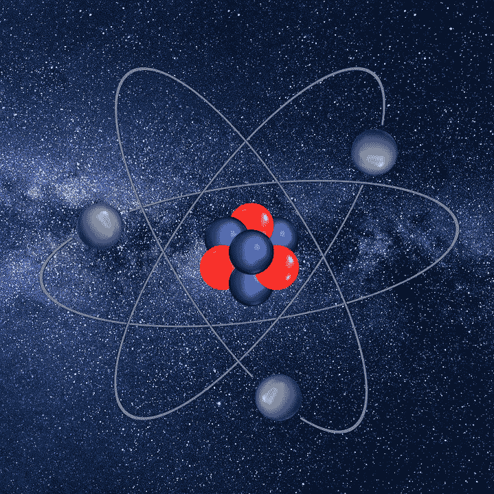
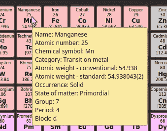

# JavaScript 中的交互式周期表

> 原文：<https://javascript.plainenglish.io/interactive-periodic-table-in-javascript-d7cf7177883a?source=collection_archive---------4----------------------->

Milky way: [Pixabay](https://pixabay.com/photos/milky-way-starry-sky-night-sky-star-2695569/) Atom: [Pixabay](https://pixabay.com/illustrations/lithium-atom-isolated-atomic-2784853/)

每个学校化学实验室的墙上都贴着一个交互式网络版的周期表。

## 元素周期表

周期表显示了每种元素或每种原子的各种信息。这些信息非常紧凑，通常难以阅读和理解，所以我决定开发一个基于 web 的交互式 JavaScript 版本，它比静态的纸质版本更容易使用和理解。

我不想花太多时间来解释元素周期表背后的原理——在研究这个项目时，我发现了几本关于这个主题的大书，所以我将只做一个简要的概述，包括我所包含的数据的细节。

如果你观察上面横幅中的原子，你会注意到它的中心有三个红色的球体。用正确的术语来说，它的原子核中有三个质子，这意味着它是一个锂原子。它也有四个蓝色的球或中子，但电子数量相同，灰色的球绕着原子核转。对于特定元素的任何给定原子，中子和电子的数量可以变化，但质子的数量决定了它属于特定元素。只有使用大量能量才能改变质子的数量:核裂变或“分裂原子”产生两个或更多不同元素的较小原子，聚变或结合原子核将两个或更多原子结合成一种不同元素。

元素周期表用彩色方块显示每种元素，其中包括原子序数或原子核中的质子数。

这些是我版本的周期表中显示的每个元素的属性。

*   **名称** —元素的全名。有些像金子一样为人熟知，而有些像奥格尼森一样不为人知，但由于只有五六个奥格尼森原子被发现过，它很难说是一个家喻户晓的名字。
*   **原子序数** —正如我上面提到的，这是原子核中质子的数量，例如锂的原子序数为 3，如标题图形中的红色球体所示。
*   **符号** —一个简短的一两个字母的符号。有些来源于 Co 这个名字，如 Co 代表钴，有些来源于另一种语言，如 Pb 代表铅，来源于拉丁语中的铅。
*   原子量——一个复杂的概念可以构成一本书的一章，甚至是一整本书！简而言之，它是一个元素样品相对于一个碳-12(中子数与质子数相同的碳原子)样品的质量。这被加权以允许一种元素的不同原子具有不同数量的中子。甚至碳本身也没有 12 的原子量；其实是 12.011。这是因为更重的碳同位素也存在，你可能听说过碳-14 在考古学中用于确定有机物的年代。
*   **类别** —元素分为金属、非金属和非金属。这些元素被分为九个子类(加上未知元素)，在元素周期表中以不同的颜色显示。
*   **族**——有 18 个族，在周期表中用数字列表示，尽管有几个也有名字。每一族的元素都有相似的化学性质。
*   **周期**——通常由 7 行表示，尽管在传统的表格中，大量的元素被从它们适当的位置推到底部额外的两行。围绕原子核旋转的电子是在“壳”或层中运动的；特定时期的所有元素都有相同数量的壳层。
*   **区块** —在一段从维基百科*借来的文字中“元素周期表的特定区域可以被称为区块，以识别元素电子层填充的顺序。每个块都是根据“最后”电子名义上所在的子壳层来命名的。*与类别一样，块用颜色显示，因此不可能同时显示两者。我的实现默认显示类别颜色，但可以选择显示块颜色。
*   **物质状态** —在 0 <摄氏度和 1 个大气压下
*   **产状**——原始，来自衰变或合成
*   **标准原子量**——除了已经列出的平均值

暂时说够了:让我们看看这个项目的 UI。

“中间的大块”当然是元素周期表本身。左边是过滤控件，右边是颜色编码的单选按钮和按键:这些使它具有交互性。

现在让我们仔细看看其中的一些元素。

以左上角的氢气为例，我们看到以下内容:

*   氢这个名字
*   原子序数 1
*   化学符号 H
*   原子量 1.008
*   第 1 组(栏)碱金属
*   期间(行)1
*   类别:活性非金属(用颜色表示)
*   如果我们选择显示方块颜色，我们会看到氢在 s-方块中

如果你把鼠标放在其中一个元素上，你会看到它的全部数据。

那些浏览器生成的弹出窗口不是很吸引人，所以我也提供了一个更大的对话框来显示相同的数据。如果您单击某个元素，就会出现这种情况。

## 该项目

该项目由以下文件加上一个 HTML 页面、一个 CSS 文件和一个图形组成，所有这些都可以克隆/下载 [Github 库](https://github.com/CodeDrome/interactive-periodic-table-javascript)。

*   数据网站
*   periodictable.js
*   periodictabledisplay.js
*   periodictablepage.js
*   periodictableinfobox.js

数据被硬编码到一个单独文件中的对象数组中。出于实际目的，这些数据可以被认为是静态的，但是如果有人设法用足够的能量将一些原子撞在一起，使 118 个以上的质子粘在一起(如果只是一秒钟的一小部分)，我将需要编辑这个文件。

## HTML 元素和原子元素

不可避免地，我将不得不在整篇文章中大量使用**元素**这个词。希望从上下文中可以明显看出我指的是哪种类型的元素！

这是第一个(原子！)元素，氢，在 **data.js** 中。

这是 **periodictable.js** 中`PeriodicTable`类的源代码。

`PeriodicTable`类代表元素周期表中的底层数据，独立于 **data.js** 中的数据本身，以及由`PeriodicTableDisplay`类处理的可视化表示，我们稍后将会看到。

我们再来详细看看`PeriodicTable`类。

## 性能

`rowcount`和`columncount`属性指的是表示周期表的 HTML 表格中的行数和列数，而不是周期数或组数。数据被设置为 **data.js** 中的数组，当表的过滤被改变时，我们也有一个函数数组被调用。

## AddFilterChangedEventHandler

此方法将提供的函数添加到事件处理程序数组中。任何显示周期表的 UI 都可以添加事件处理程序，这样它就知道何时更新显示。

## 应用过滤器

对数据应用一个以上的过滤标准，特别是当一些可能设置或可能不设置时，总是有点复杂，我在这里提出的解决方案是为每个元素创建一个布尔值数组。这些是使用我稍后将描述的`_Match`函数设置的，只有当数组中的所有项都为真时，元素的 show 属性才被设置为真。如果元素的 visible 属性已更改，它将被添加到一个数组中，该数组构成了 filter changed 事件处理程序的参数。这确保了 UI 只需要显示/隐藏实际上已经改变的元素。

## 透明过滤器

此方法迭代所有元素，将不可见的元素更改为可见的，并将它们添加到一个数组中，以传递给 filter changed 事件处理程序。

## _FireFilterChangedEvent

这里我们用改变后的数组调用`_FilterChangedEventHandlers`中的所有函数。(目前只有一个函数，但随着这个项目的扩展，我们可能需要更多，因此使用了数组。)

## _ 匹配

该函数根据值参数(即数据项)是否与标准参数匹配返回一个布尔值。第三个参数 wildcard 指定是查找精确匹配还是数据只需要包含筛选条件。目前只有元素名称和化学符号使用通配符匹配。

现在我们来看看**periodictabledisplay . js**中的`PeriodicTableDisplay`类。

## 构造器

首先，我们将`periodictable`和`tableid`参数保存为属性。这些元素告诉学生它所显示的元素周期表和显示它的 HTML 表。我们还需要添加一个函数到周期表的 filter changed 事件数组中，我们很快就会看到实际的函数。

接下来是几个对象，它们提供了数据值和它们对应的 CSS 类之间的映射。这些用来对单个元素进行颜色编码。

之后，我们调用四个函数，它们一起创建并填充 HTML 表。

最后，我们向 HTML 表添加一个 click 事件处理程序。这将检查事件是否从其中一个元素冒泡，如果是，它将显示相关元素的`PeriodicTableInfoBox`。(*这种向父元素添加单个事件处理程序来捕获来自许多子元素的事件的技术，我将在以后的文章中探讨。*)

## _onFilterChanged

这用作元素周期表被过滤时的事件处理程序。它的参数是一个元素数组，这些元素的 visible 属性已经改变，所以我们只需要迭代它并切换相关的 CSS 类。

我对单元格使用了一个变量(实际上是`<td>`元素),只是为了避免很长的代码行。

不可见元素的类叫做`elementcellfaded`，不透明度为 0.1，这意味着它们仍然是可见的，我认为这比完全隐藏它们要好。

## _ 创建单元格

**periodictable.htm**文件包含一个空的 HTML 表格，该函数创建并向其中添加`<tr>`和`<td>`元素。注意，每个`<td>`都有数据属性来标识它的行和列。

这些当然可以硬编码到 HTML 中，但是让它们动态生成会使增强和添加更容易实现。

## _createColumnHeadings 和 _createRowHeadings

这里我们简单地设置行和列标题文本，并应用相关的 CSS 类。

## _ 填充

这个函数迭代所有元素，并用这段代码为每个元素选取`<td>`:

`document.querySelector(`[data-row=’${element.row}’][data-column=’${element.column}’]`)`

这是一个相当晦涩但对数据属性有用的语法。

然后，在应用`elementcell`类之前，我们将`innerHTML`设置为所需的值。

在循环之后，我们调用`ColorByCategory`来设置颜色。

## 颜色分类

该函数迭代所有元素，选取相应的单元格，删除所有块类，并应用相关的类别类。

## ColorByBlock

这里我们镜像前面的函数，但是删除所有类别类并添加正确的块类。

**periodictablepage.js** 文件将所有之前的代码与 HTML 页面绑定在一起。

## windows . onload

首先，在创建一个`PeriodicTable`和一个`PeriodicTableDisplay`对象之前，我们调用一个函数来设置一些`onclick`事件处理程序。最后，我创建了一个包含过滤器输入的对象。这并不是绝对必要的，但是可以避免重复`document.getElementById`调用。

## SetEventHandlers

这里我们只是设置了几个`onclick`处理程序。

## ColorByBlock

该函数在调用`PeriodicTableDisplay`的`ColorByBlock`方法之前，分别隐藏和显示类别和块颜色键。

## 颜色分类

除了类别之外，这相当于前面的函数。

## 应用过滤器

该函数创建一个包含用户设置的各种过滤标准的对象，然后传递给`ApplyFilter` methd。

## 透明过滤器

这里我们将所有的过滤器输入设置为空字符串，并调用`ClearFilter`。

最后，我们有一个名为`PeriodicTableInfoBox`的短类，它位于**periodictableinfobox . js**中。

信息框实际上永久存在于 HTML 文档中，因此这些元素的 id 被传递给构造函数，以便我们可以操作它们。

同样在`constructor`中，我们设置了事件处理程序，这样用户可以使用按钮或 **Esc** 键隐藏盒子。

`Hide`和`Show`方法做了您所期望的事情，`Show`按钮也用指定元素的数据填充框。

## 已完成的项目

编码完成后，在浏览器中打开**periodictable.html**。您应该会看到上面截图中的页面。

您可以使用过滤器和单选按钮；下面显示的是名称过滤器设置为“s”的表格，因此我们只能看到名称中带有字母“s”的元素，其他元素显示为不透明度为 0.1。

这个项目有很大的改进潜力，所以如果你能以任何方式改进它，请随意使用 Github 库。