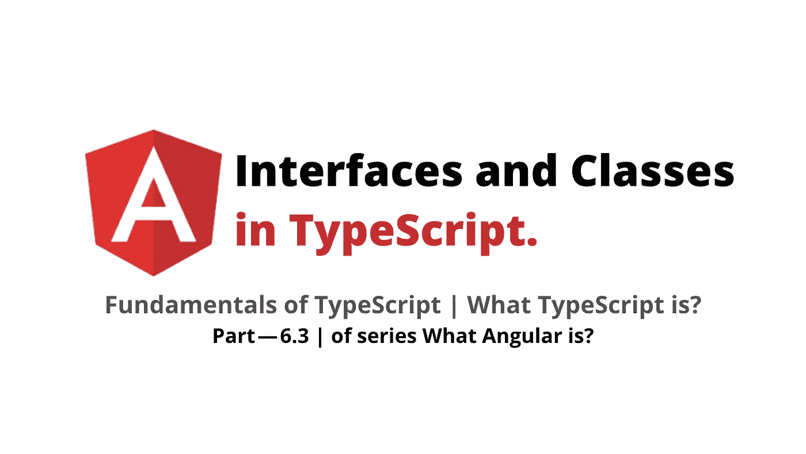
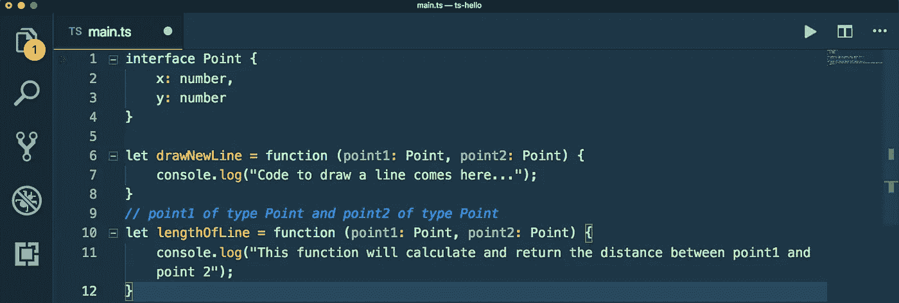
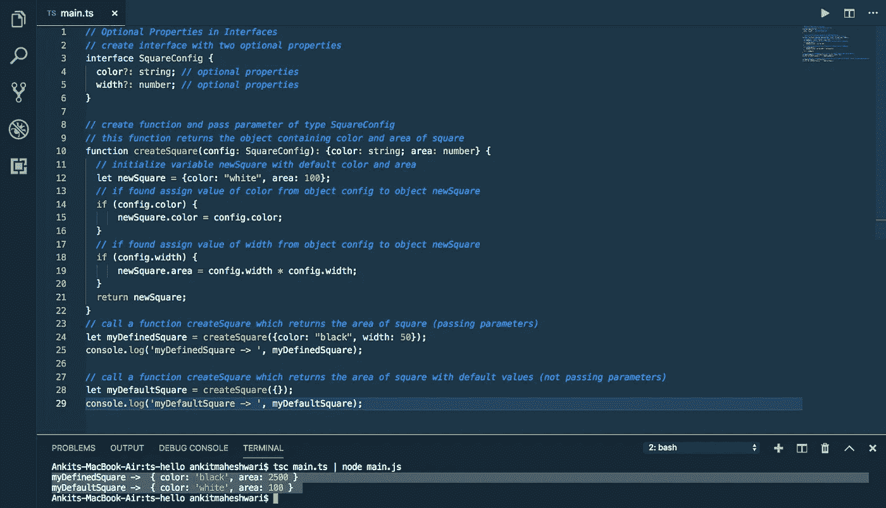
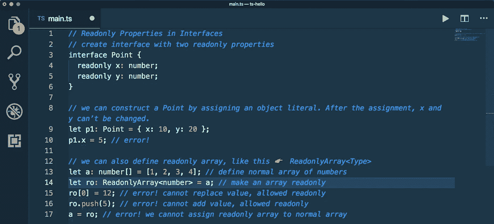
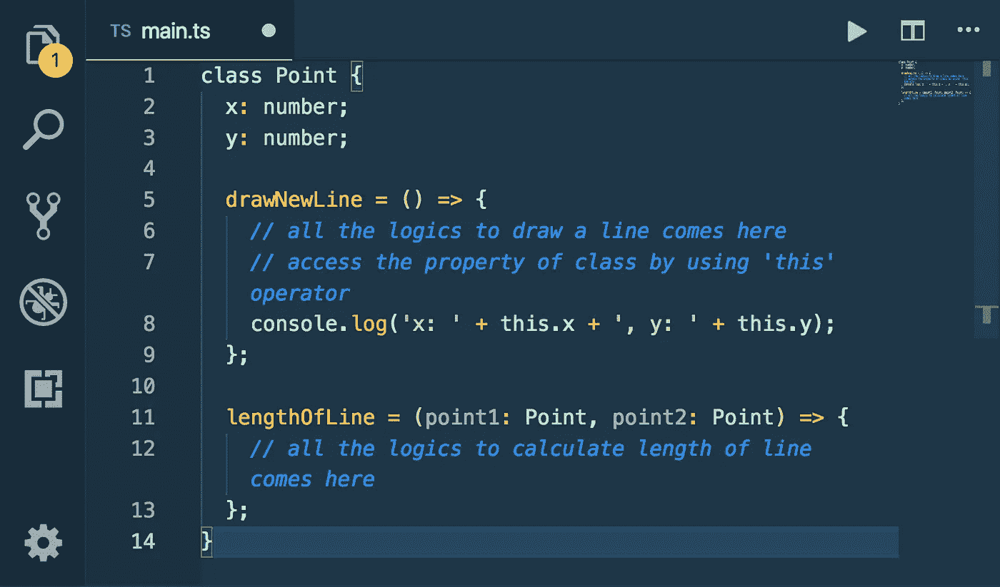
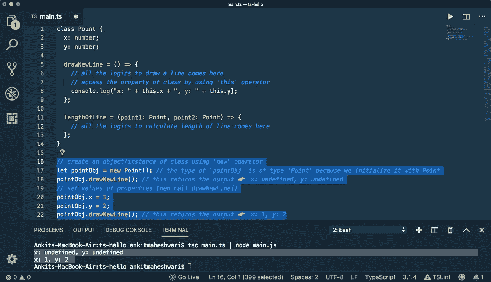
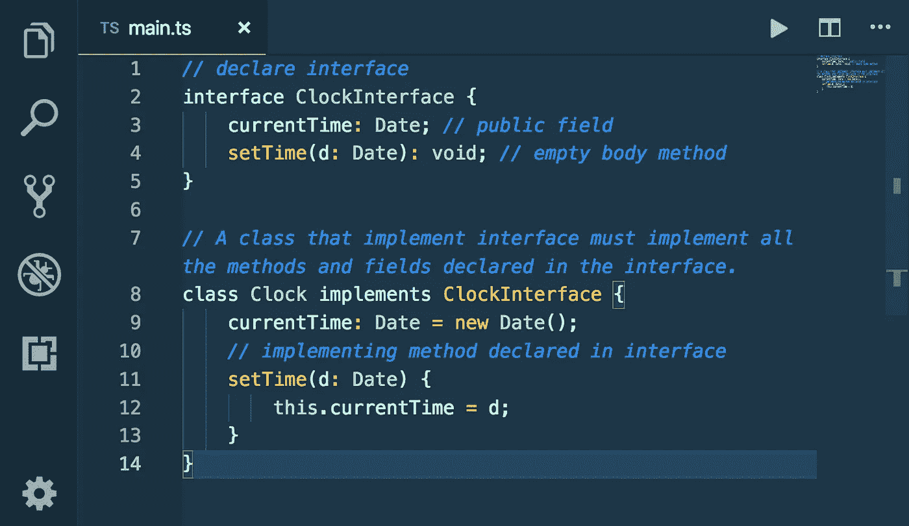
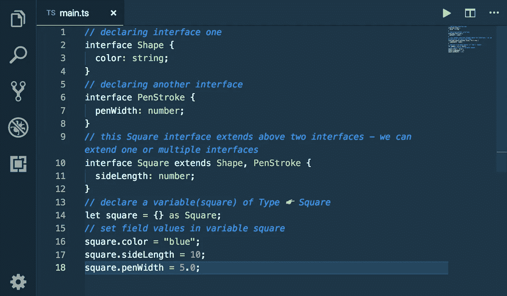

# TypeScript/Angular 中的接口和类

> 原文：<https://javascript.plainenglish.io/interfaces-and-classes-in-typescript-part-6-3-7fee77b7518b?source=collection_archive---------0----------------------->

## 什么是 Angular(第 6.3 部分)/什么是 TypeScript？

工作原理… |如何开始…

> 如果*你还没有涉及到本系列的*[*Part—6.2*](https://medium.com/@AnkitMaheshwariIn/arrow-functions-in-typescript-part-6-2-of-series-what-angular-is-%EF%B8%8F-what-typescript-is-d4584d87d01b)*我推荐你查看一下这个链接→*[Arrow Functions in TypeScript | Part—6.2 |什么是 Angular？🤷🏻‍♂️什么是打字稿？](https://medium.com/@AnkitMaheshwariIn/arrow-functions-in-typescript-part-6-2-of-series-what-angular-is-%EF%B8%8F-what-typescript-is-d4584d87d01b)



In this part covered Interfaces and Classes in TypeScript

# 打字稿基础👇

1.  [类型标注](https://medium.com/@AnkitMaheshwariIn/type-annotations-fundamentals-of-typescript-part-6-1-823ab6f62ead)
2.  [箭头功能](https://medium.com/@AnkitMaheshwariIn/arrow-functions-in-typescript-part-6-2-of-series-what-angular-is-%EF%B8%8F-what-typescript-is-d4584d87d01b)
3.  **接口**
4.  **跟班**
5.  构造器
6.  访问修饰符
7.  性能
8.  模块

# 6.3 接口

在 TypeScript 中使用自定义类型的更好方法是使用接口。一个**接口**是一个为类定义语法的结构。除了函数，**接口**也可以**用于**一个类来定义定制类型。接口是一个抽象类型，它不像类那样包含任何代码。

***TypeScript 中接口和类有什么区别？***

一个**类**是一个蓝图，从中我们可以创建共享相同配置的对象——属性和方法。一个**接口**是一组描述一个对象的相关属性和方法，但是既不为它们提供实现也不为它们提供初始化。

👉让我们定义一个接口

*   接口名称:`Point`
*   然后在界面块中添加属性为`x`和`y`
*   接口的名称应该总是使用以大写字母开头的 Pascal 命名约定。看下面`**P**`的名字界面`**Point**`是以大写字母开头的。

```
interface **Point** {
    x: number,
    y: number
}
```

请看下面的**内联注释示例—** 检查此链接👉[点击此处](https://medium.com/@AnkitMaheshwariIn/arrow-functions-in-typescript-part-6-2-of-series-what-angular-is-%EF%B8%8F-what-typescript-is-d4584d87d01b)阅读更多关于行内注释的信息。

```
let drawNewLine = function (**point1: {x: number, y: number}, point2: {x: number, y: number}**) {
    console.log("Code to draw a line comes here...");
}
```

我们可以通过声明接口来简化上面的代码。

*   它干净多了，而且
*   可以在多个地方重复使用

```
let drawNewLine = function (**point1: Point, point2: Point**) {
    console.log("Code to draw a line comes here...");
}
```

看上面👆`point1`和`point2`对象指向界面`Point`。

# 内聚力

**衔接的概念:**意为有关联的事物应该永远是一个单位的一部分。他们应该走在一起，这就是所谓的凝聚力。

这个界面的例子定义了一个点对象的形状(看👇第一行)和下面我们有独立的功能(看👇第 6 行)，这就是我们违反衔接原则的地方。

所以，`drawNewLine`的概念与`Point`接口高度相关。现在，当我们创建另一个函数`lengthOfLine`(看👇10 号线)。我们再次违反了内聚原则:我们有两个函数(`drawNewLine`和`lengthOfLine`)，它们与`Point`对象是分开的。他们都应该是一个单位的一部分。



**x**, **y** and `**drawNewLine**, **lengthOfLine** all should be a part of single unit`

在面向对象编程中，我们称这种单元类为高度相关的类、组、属性、函数。

相关的事物应该总是一个单元的一部分，但是在这种情况下，我们不能在接口内移动这些函数，因为接口纯粹是用于声明的，它们不能包含实现。

⭐️现在，看看我们能做什么…

*   我们可以在接口中添加一个**函数声明，它不接受任何参数，返回 void 意味着这个函数不返回任何东西。看👇下面。**
*   因为参数`x`和`y`已经是接口`**Point**`的一部分，所以我们不需要在`drawNewLine`函数中传递参数。这些函数可以直接访问同一个单元中的属性`x`和`y`。
*   在接口中，我们不能有实现，我们只能有函数的签名。

```
interface **Point** {
    x: number,
    y: number,
    drawNewLine: () => void;
}
```

编译器从接口中了解到它声明了两个属性(`x`、`y`)和一个方法(`drawNewLine`)——它的实现在其他地方。

正如我们所知，我们只能在接口中声明，不能在接口中实现，而实现需要类。

# ⭐️更在接口道

*   **可选属性:**并非接口的所有属性都是必需的。有些在特定条件下存在，有些可能根本不存在。我们可以通过在属性名后面加上 `? (question mark)`来指定这一点。看👇下面第 4 行& 5 —这些可选参数可以在调用函数时随意传递。看👇下方 24 号线& 28 处。



We can specify **Optional Properties** by putting `? (question mark)` after the name of the property

*   **只读**我们可以通过在遗产名称前加上`readonly`来说明这一点。看👇在 4 号线下方& 5 处。



We can specify **Readonly** **Properties** by putting `readonly` before the name of the property

*   **Readonly vs Const:** 记住是使用`readonly`还是`const`的最简单方法是询问你是在变量还是属性上使用它。变量使用`const`，而属性使用`readonly`。现在，`**variable**`可以是一个局部`variable`，定义在一个过程中，并且只在该过程中可用。而`**property**`是类、结构和接口的成员。

# 6.3 课程

一个**接口**有完全抽象的方法，即没有任何人的方法。一个**接口**在语法上类似于**类**，但是在**类**和**接口**之间有一个主要的**区别**，即**类**可以被实例化，但是**接口**永远不能被实例化。**类**的成员可以是私有的、公共的或受保护的。并且一个**接口**的成员总是公共的。一个**接口**说需要做什么。一个**类**说明了它是如何完成的。

**类**是高度相关的变量(属性)和函数(方法)的组。

# ⭐️运用衔接原则

用类代替接口应用内聚原则。这里`x`和`y`是存储数据的字段，`drawNewLine`和`lengthOfLine`是函数。



现在，我们有一切都在一个类。我们有两个字段和两个方法。当一个函数是类的一部分时，我们称它为方法。

# ⭐️是时候了⏳创建类和调用方法的对象

*   创建一个`class` — *外观的对象👇17 号线下方*
*   调用一个没有设置属性`x`和`y` — *Look 值的方法👇下面的第 18 行—这将返回输出👉x:未定义，y:未定义*
*   设置属性`x`和`y` — *Look 的值后调用方法👇下面第 22 行—这将返回输出👉x: 1，y: 2*



Creating Class | Create an object of Class | & call methods

看上面👆这就是我们在程序中定义和使用类的方式。

```
let pointObj = new Point();
```

这里`Point`是类，`pointObj`是对象，或者我们可以说它是类`Point`的实例。

⭐️ **类和对象的最佳例子:**想想人类——这里`Human`是一个类，当我们创建这个类的实例`Human`时，我们得到`John`、`Paul`、`Bob`、`Mary`——这些都是对象。

*   人类👤— `Human`是一个类。
*   `John`👨‍🌾，`Paul`👨‍🎓，`Bob`👨‍💻，`Mary`👩‍💼—是类别`Human`的对象。

> 下一个重要概念…

# ⭐️实现接口/类实现接口:

**接口**中的所有方法都是用空体声明的，都是公共的，默认所有字段都是公共的、静态的、最终的。实现**接口**的**类**必须实现**接口**中声明的所有方法和字段。

*   我们不能在接口的方法中编写任何代码，也不能初始化变量👇下面第 3 行和第 4 行 —空体，即只允许*申报。*
*   我们可以在类的方法中编写代码，也可以初始化变量👇下面第 9 和 11 行 —方法实施。



`Please carefully read all the comments in the image`

> 下一个重要概念…

# ⭐️扩展一个接口/接口扩展另一个接口:

一个**接口**可以**扩展**另一个**接口**，就像一个类可以**扩展**另一个类一样。这允许我们将一个接口的成员复制到另一个接口中，这为我们如何将接口分成可重用的组件提供了更多的灵活性。**扩展**关键字用于**扩展**一个**接口。**

*看👇下面第 10 行* —类型**S*square****的变量(Square)可以访问其他接口(Shape 和 PenStroke)的成员，因为 Square 具有扩展的形状和 PenStroke。*



`Please carefully read all the comments in the image`

> 以前要记住的事情👋👋

> ***类扩展了另一个*** (涵盖于此👇文章)[*https://medium . com/@ ankitmaheshwarin/constructors-and-access-modifiers-in-typescript-222d 6188780 # 09ed*](https://medium.com/@AnkitMaheshwariIn/constructors-and-access-modifiers-in-typescript-22a2d6188780#09ed)
> 
> ***类实现了一个接口*** (在本👇[*https://medium . com/@ ankitmaheshwarin/interfaces-and-classes-in-typescript-part-6-3-7 fee 77 b 7518 b # EBD 8*](https://medium.com/@AnkitMaheshwariIn/interfaces-and-classes-in-typescript-part-6-3-7fee77b7518b#ebd8)
> 
> ***接口扩展了另一个接口*** (在本👇[*https://medium . com/@ ankitmaheshwarin/interfaces-and-classes-in-typescript-part-6-3-7 fee 77b 7518 b # 0b2d*](https://medium.com/@AnkitMaheshwariIn/interfaces-and-classes-in-typescript-part-6-3-7fee77b7518b#0b2d)

这是关于**接口**和**类**——下一部分见👋👋来涵盖另一个概念**构造函数。**

> 如果*你还没有涉及到本系列的*[*Part—6.2*](https://medium.com/@AnkitMaheshwariIn/arrow-functions-in-typescript-part-6-2-of-series-what-angular-is-%EF%B8%8F-what-typescript-is-d4584d87d01b)*我推荐你查看一下这个链接→*[Arrow Functions in TypeScript | Part—6.2 |什么是 Angular？🤷🏻‍♂️什么是打字稿？](https://medium.com/@AnkitMaheshwariIn/arrow-functions-in-typescript-part-6-2-of-series-what-angular-is-%EF%B8%8F-what-typescript-is-d4584d87d01b)
> 
> 敬请期待第 6.4 集
> [https://medium.com/@AnkitMaheshwariIn](https://medium.com/@AnkitMaheshwariIn)

如果你不介意给它一些掌声👏 👏既然有帮助，我会非常感谢:)帮助别人找到这篇文章，所以它可以帮助他们！

永远鼓掌…


# 了解更多信息