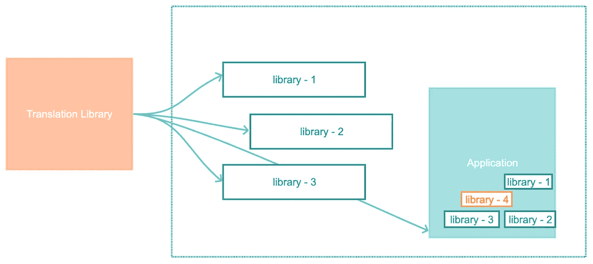
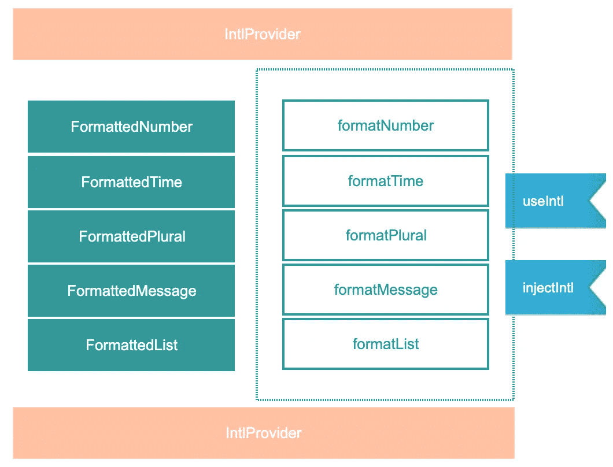

# 使用 react-intl 在 React 应用程序中实现国际化

> 原文：<https://javascript.plainenglish.io/internationalization-in-react-apps-using-react-intl-1d72a6f14053?source=collection_archive---------0----------------------->


fig(a): Internationalization ( credit: [source](https://wallpaperaccess.com/map) )

# **剧情简介**:

在这篇博客中，我们将研究 i18n 可用的不同库，选择首选库的原因，库中可用的组件/api 及其用法，最后构建单独的翻译库，使其模块化，以便可以跨不同的应用程序使用。

调查从寻找合适的国际化库开始，该库易于采用，具有强大的社区支持、受欢迎程度、文档和灵活性。我们并不生活在完美的世界中，所以也将列出一些关注点。



fig(b): goal: abstraction of translation from applications & libraries

# **必须有**:

*   翻译文本应该从代码中提取。即把静态内容从代码库中移走。
*   如果有一个独立的翻译库，开发者和翻译人员都可以参考，那就太好了。
*   每个应用程序和/或库负责根据地区提供完整的翻译解决方案。

这些必须具备的条件与我们选择的国际化库无关，但是我们决定使用 react-intl，因为它支持日期和时间、货币、数字的翻译以及*synopsis 中提到的基本要求。我们可以使用的其他有竞争力的翻译库有阿里巴巴的 [i18next](https://www.i18next.com/) 、LinguiJS、 [react-intl-universal](https://github.com/alibaba/react-intl-universal) 。

# 反应-国际:

简要概述一下，`react-intl`提供了在 react 应用程序中实现 i18n 的声明式和命令式方法。声明性组件易于实现，并且是比命令性低级 api 更受欢迎的使用方式。然而，在某些情况下，我们只能使用命令式方法(api)进行翻译，因此只能使用替代选项。

要使用`react-intl`，应用程序的根组件需要用`<IntlProvider/>`包装，它设置整个应用程序所需的 i18n 上下文，所以我们需要在这里设置`locale`和`messages`道具。一旦默认完成，来自 react-intl 的声明性组件就可用，但是*命令性的低级 api 不可用。然而，每当我们需要低级 api 时，我们需要用更高级的组件`injectIntl`包装*相应的*组件。这将允许我们通过`intl` prop 访问这些低级 api。(*提示*:此处注意道具名称`intl`)。*

> 测试提示:Inject-intl 将包装器组件添加到我们定义的组件中，因此一级浅层呈现不会提供对我们组件的访问。

现在我们有了一些了解，我们可以尝试在 react 应用程序中实现它。

# **实施:**

示例应用程序是使用 [CRA](https://reactjs.org/docs/create-a-new-react-app.html) 创建的，这里是它的[提交](https://github.com/citta-lab/react-internationalization-exmple/tree/f60d084f2927840162cac3736c5520339bd44148/internationalized-app)。随着我们的进展，我们将添加和移动翻译到它自己的库中，讨论模块化。让我们从安装`react-intl`开始，

## 1.<intlprovider>:</intlprovider>

一旦我们使用`yarn add react-intl`安装了`react-intl`。应用程序根组件由 i18n 上下文提供程序包装，即`<IntlProvider>`，我们将在其中添加浏览器检测到的区域设置和翻译的消息。

> 到目前为止，翻译文件托管在应用程序中，不同的翻译(英语和西班牙语)由它们的名称空间分开。

为了更好地理解，下面引用了完整的英文翻译文件，并将在整个博客中引用。

## 2.<formatted>:</formatted>

现在，应用程序中的其余组件必须进行修改，以适应`react-intl`。如果我们向最终用户显示任何文本、日期、数字等，那么这些组件内容或消息需要用由`react-intl`提供的各自的`<Formatted*>`组件包装。下面是一个这样的改编的例子，完整的例子你可以检查[这个](https://github.com/citta-lab/react-internationalization-exmple/tree/f917d6371dcbbb5b3c323c12bd5b8291b0c53495/internationalized-app)提交。

让我们为用户添加一些帮助消息，在我们的例子中，我们希望用户知道每个卡片标题的意思，即在`<h3>`标签中添加标题。格式化后的代码如下所示，

现在的问题是我们如何根据从`IntlProvider`传来的地区翻译`titleMessage`？

## 3.injectIntl():

为了解决这个问题，我们将注意力转移到 react-intl 提供的命令式 api 上(在这里阅读更多关于低级 api 的)。当我们用`injectIntl`高阶组件包装`Card`组件时，利用`formatMessage`翻译通过 props 注入上下文的文本。

让我们更新卡组件以反映我们刚才提到的更改(为了完成实现检查[这个](https://github.com/citta-lab/react-internationalization-exmple/tree/194b74f0e0ce050ace297edae2198d319d052c90)提交)，

瞧，现在我们可以将鼠标悬停在卡片标题上来查看翻译后的信息。

由于 ***React 16.8*** 我们可以利用钩子来编写功能组件，`react-intl`包含了这个钩子实现，因为它是命令式 api，并且不需要任何选项。这使得使用起来更加容易和简单，但是*只能用在功能组件上*。

## 4.使用说明:

在本节中，我们将使用`useIntl`挂钩代替卡组件示例中的`injectIntl` hoc。简而言之，我们不需要用 injectIntl 包装组件，因此`intl`不能作为 prop 使用。然而翻译所需的`intl`由`useIntl()`提供。

这个例子的完整提交可以在[这里](https://github.com/citta-lab/react-internationalization-exmple/tree/15c51205c78e699dc948061d302ec59f2ad8a92c)找到。这符合在 react 应用程序中使用`react-intl`的基本思想。



fig(c): summarizing the declarative & imperative api’s

> 每当我们必须翻译与`html`标签和/或`aria-label`属性一起使用的静态文本时，我们就使用命令式 api。

# 翻译:

到目前为止，我们一直使用翻译作为我们的 react 应用程序的*部分，也许我们可以从应用程序代码库中提取它们。通过这样做，我们可以独立于应用程序维护翻译，可以轻松地与翻译团队合作进行任何更新或新的语言添加，有助于防止重复等。*

这个想法是用所有的翻译创建基本的`npm`包，并用不同的解决方案将它们分开。您可能会考虑不按应用程序拆分翻译，但我们希望提供完整的解决方案(以及翻译)，而不是让宿主应用程序为其提供翻译。

> **示例**:您的 react 应用程序可能会使用不同团队或公司创建的不同 react 库(第一个库用于处理由“a”团队创建的用户会话，第二个库由“b”团队创建，用于下订单)。然后，一种方法是让 react 应用程序为所有消费库提供翻译。

重新构建的新翻译库如下所示，如果消费应用程序对从库中获取所有英语翻译感兴趣，他们可以通过访问`/translation-lib/bylang/en.js`来实现

我们的应用程序的`index.js`被更改为使用来自`translation-lib`的翻译。

如果你已经厌倦了这个，但是还想看看其他的国际化库，那就去看看维克多·舍甫琴科在 i18next 上的博客。

# 区域设置:

## 1.浏览器检测:

在我们示例应用程序中，我们已经手动设置了区域设置，并将其作为属性传递给了`<IntlProvider/>`，但是在实际应用程序中，我们可能需要自动处理这一点。一种这样的方式是从浏览器进行检测，

```
var locale = (navigator.languages && navigator.languages[0]) || navigator.language || navigator.userLanguage || 'en-US';
```

请注意，如果我们未能检测到浏览器的区域设置，我们将退回到英语(即 en-US)。如果我们在一个库(而不是一个应用程序)中实现它，那么我们会希望应用程序设置 locale prop，并且消费库会遵守它。下面是示例应用程序中更新后的 index.js 示例。

## 2.默认消息:

我们已经在`<Formatted*/>`组件中使用了`defaultMessage` prop，以在区域检测失败或 id 丢失的情况下提供回退消息。这是`react-intl`团队推荐的方式。

> 默认情况下在源中保留默认消息的主要原因是为了让 UI 可以回退到不依赖于网络请求的东西(这是人们加载区域数据的常见方式。)—埃里克·费拉约洛

然而，从代码中保留翻译信息有它自己的好处，同时维护/更新翻译，而不是膨胀代码库等。我能想到两种方法，我更喜欢后一种。

通过这样做，我们将需要在所有组件中导入英语翻译文件，并用各自提取的英语翻译(基于 id)替换静态文本。另一种方法是在用`<IntlProvider/>`包装应用程序的根时立即处理这个问题。

# 缺点:

1.  `react-intl`的解压缩大小几乎是 1.1MB，而`i18next`大约是 481KB。
2.  如果我们决定不在声明性组件中使用`defaultMessage`，需要处理一种提供默认翻译的方法。
3.  `react-intl`不喜欢嵌套的 json 结构，所以翻译 id 必须是一级名称空间。举例:`"card.welcome.title"` vs `"card":{ "welcome": { "title": " " }}`
4.  `injectIntl`添加一个包装组件，因此在测试一个级别时，浅渲染将无法访问所需的组件。

# **最后:**

我们应该翻译每个用户可见的字符串。例如工具提示、警告消息、标题、文本等。简而言之，申请表上出现的任何东西都应该被翻译。

完成 github 项目库。

我之前的三篇博客:

1.  [对输入字段的变化做出反应&按钮](https://medium.com/javascript-in-plain-english/react-onchange-with-input-field-button-854f0035b94a)
2.  [Map 的内部工作方式，减少 JavaScript 中的&过滤器](https://medium.com/javascript-in-plain-english/inner-workings-of-map-reduce-filter-f06ba87f2509)
3.  [在 React 中思考:在 React 应用中管理用户交互](https://medium.com/javascript-in-plain-english/thinking-in-react-manage-user-interaction-in-react-apps-611074e004b8)