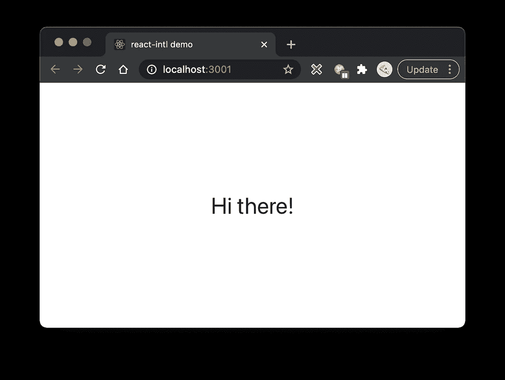
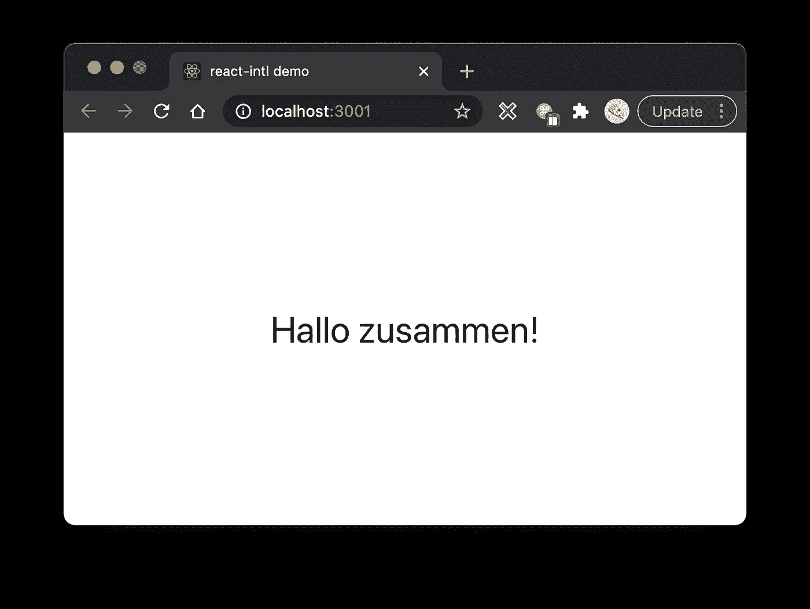

# 使用 React Intl，通过 5 个简单步骤国际化您的 React 应用程序

> 原文：<https://javascript.plainenglish.io/internationalize-your-react-app-in-5-easy-steps-with-react-intl-f854ad08cab7?source=collection_archive---------6----------------------->

Photo by [Kenji Rikitake](https://unsplash.com/@jj1bdx?utm_source=medium&utm_medium=referral) on [Unsplash](https://unsplash.com?utm_source=medium&utm_medium=referral)

**国际化**是一个术语，用于使一个网站适合多个地区(即一个或多个地方和/或语言)。

国际化通常缩写为 **i18n** ，因为它以“I”开头，以“n”结尾，中间还有 18 个其他字符。开发者就是喜欢他们的缩写，不是吗？

一个好的国际化框架应该提供一个体面的 DX(开发者体验),而不占用大量的实现时间。

本文介绍的库名为 React Intl。每月下载量超过 800，000 次，是 React 世界中使用最多的国际化工具之一。

React Intl 能做的不仅仅是根据地区选择消息/字符串。它还可以基于它格式化数字和日期！然而，在本文中，只讨论了它的消息方面，因为这是大多数人主要寻找的。

React Intl 现在将在一个用`create-react-app`引导的 React 应用程序的上下文中呈现，使用英语和德语作为演示语言。

带有工作代码的库可以在这里找到:[https://github.com/adamkss/react-intl-demo](https://github.com/adamkss/react-intl-demo)。

## 1.添加依赖项

首先，必须通过运行`yarn add react-intl`将`react-intl`添加为依赖项。

我们还需要添加一个依赖项，那就是`extract-react-intl-messages`。这种开发依赖性将用于将国际化的消息提取到它们自己的语言文件中。于是，跑:`yarn add -D extract-react-intl-messages`。

为了让`extract-react-intl-messages`工作，请确保在您的项目的根目录下创建一个包含以下内容的`.babelrc`文件:

## 2.创建特定于语言环境的文件

要支持的每个语言环境都需要有自己的文件，以 JSON 格式存储本地化的消息。

创建一个名为`translations`的新文件夹，并创建`en.json`和`de.json`。目前，两者都应该是空的:

让我们也在`translations`文件夹中创建一个`index.js`，它将导出翻译本身:

## 3.用 React Intl 的提供者包装你的 React 树

React 树必须用 react-intl 的`IntlProvider`包装，这样国际化的消息在每个组件中都可以访问。

期望两个重要的道具:实际的语言环境和由语言环境选择的国际化消息。

在上面的例子中，语言环境是硬编码的。一般来说，您应该检查浏览器的默认语言(通过 navigator 对象:`navigator.language`)、地理定位用户或者让他们简单地从语言列表中选择。

## 4.开始定义消息

每个国际化消息至少应该有一个 ID 和一个默认值。定义一个默认值不是强制性的，但是如果你开始用一种语言来构建你的网页，这是很好的。

定义国际化消息就像使用`react-intl`的`FormattedMessage`组件一样简单:

让我们定义一个简单的 React 组件来显示这条问候消息，并在应用程序中使用它:

这将向我们显示默认消息:

## 5.用另一种语言添加邮件

正如本文开头所指出的，所有消息都存储在语言特定的文件中(在本演示中是`en.json`和`de.json`)。

我们必须使用我们添加的开发依赖项(`extract-react-intl-messages`)来用我们的消息的键(id)填充它们。比如我们上面用的`greetingsMessage`。

为此，我们需要在`react-scripts`下面的`package.json`的`scripts`键中添加一个名为`extract-intl`的新脚本:

这个脚本`extract-intl`使用几个参数运行`extract-messages`:

1.  `-l`:定义可用的语言环境，在本演示中为`en`(通用英语)和`de`(通用德语)
2.  `-o`:定义国际化 JSONs 的位置(`de.json`和`en.json`)
3.  定义默认的语言环境，在我们的演示中它被设置为英语。基于这个参数，`extract-messages`将我们在代码中定义的默认消息复制到默认语言环境的 JSON 中，在我们的例子中是`en.json`

通过`yarn extract-intl`运行这个命令后，看一下两个 JSON 文件:

您可以看到，默认语言的本地化文件已经用代码中的默认消息填充，而另一种语言的文件只有密钥。现在也可以在那里定义值了！

德国版的`greetingsMessage`可以通过修改`de.json`手动设置:

现在，为了进行试验，需要将德语地区(`de`)传递给 IntlProvider，它将依次使用在`de.json`中定义的所有德语消息:

通过这样的修改(交换传递给`react-intl`的区域设置)，我们现在得到了德语消息，而不需要实际接触组件的代码:

太好了！这里总结了国际化需要做的事情:

1.  定义语言和语言文件
2.  使用带有国际化消息 ID 的`<FormattedMessage>`组件来获取基于当前所选语言环境的消息
3.  运行`yarn extract-intl`用现有的消息 id 填充您的本地化 JSONs。这也自动将默认消息(在代码中定义)插入默认语言的 JSON(在`extract-intl`命令中设置)
4.  用正确的值填写其余的 JSONs(语言)
5.  根据您的需要更改传递给`IntlProvider`的`locale`(根据用户的区域、手动、浏览器的语言等。)会自动在你的应用程序中插入来自所选语言环境的正确消息！

## 访问消息的其他方式

有时你不能使用`<FormattedMessage>`标签来获取/定义消息。考虑一下必须在 HTML 元素上设置 title 属性的情况。

别担心！React Intl 为我们提供了一个钩子和一个 HOC(你用它包装你的组件的高阶组件)，我们可以用它来访问`intl`对象(钩子用于功能组件，而一个 HOC，`injectIntl`用于基于类的组件):

# 最后

React Intl 提供了一种清晰简单的方法来国际化您的应用程序🌍。随时可以试一试！

谢谢你一路看完这篇文章，你真棒！