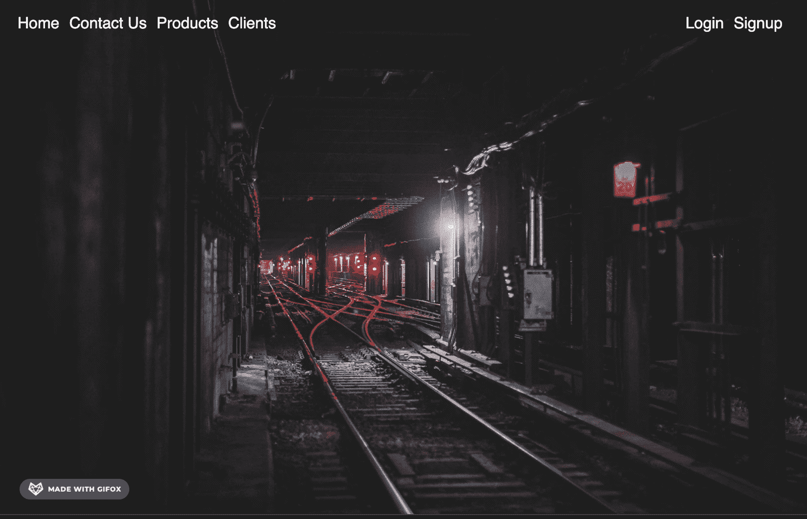
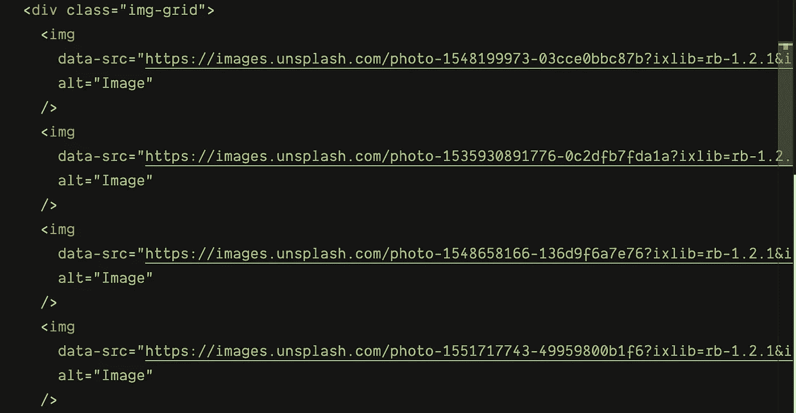
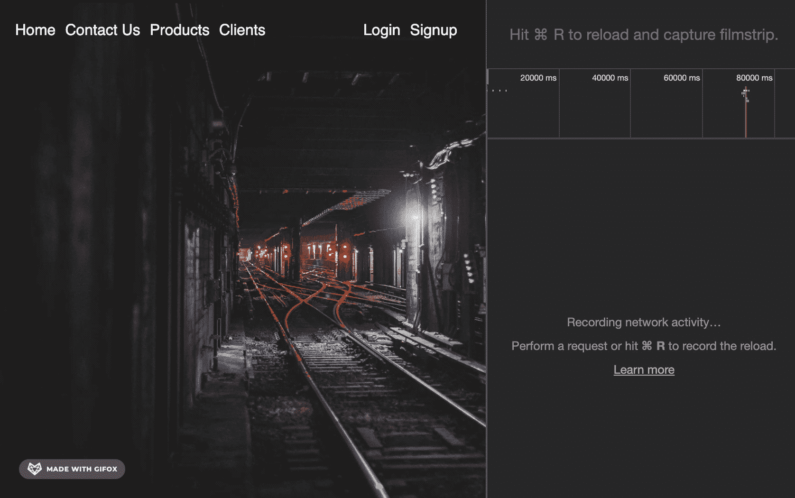

# 交叉观测器

> 原文：<https://javascript.plainenglish.io/intersection-observer-928a0ce309?source=collection_archive---------6----------------------->


Photo by [Denys Nevozhai](https://unsplash.com/@dnevozhai?utm_source=medium&utm_medium=referral) on [Unsplash](https://unsplash.com?utm_source=medium&utm_medium=referral)

## 导航风格和惰性加载变得很容易

这篇文章旨在用例子解释交集观察者 API，这样你就可以了解如何在生产现场使用它们。我最近开始研究这个惊人的 API，并发现了一些非常好的资源。其中之一是凯文·鲍威尔(Kevin Powell)的《T2》，这篇文章很大程度上是受他的视频启发。

因此，我们将基本上从概念的介绍开始，并以一些例子结束。

## 那么什么是交叉点观察者呢

交集观察者 API 提供了一种简单的方法来观察和注册回调，以便在页面上的元素进入视图时触发。

我们只需创建一个交叉点观察器对象，如下所示:

`let observer = new IntersectionObserver(callback, options);`

`IntersectionObserver`对象的构造函数采用**两个参数**。第一个是一个**回调**函数，一旦观察者注意到一个交集就执行这个函数，并且异步传递了关于该交集的一些数据。

第二个(可选)参数是**选项**，一个有信息来定义什么是“交叉点”的对象。我们可能不想知道某个元素什么时候会出现，但是只有当它*完全*可见的时候。类似的东西是通过 options 参数定义的。

**选项**有三个属性:

*   **根**-被观察元素将相交的祖先元素/视口。
*   **根边距**-值的格式与 CSS 边距或填充值相同的字符串。例如:“3rem 2rem”。这将在根元素周围创建一个指定大小的边距，以有效地为交叉点创建一个插图或开始。默认为“0px”。
*   **阈值** —一个值数组(0 到 1.0 之间)，每个值代表一个元素在根中相交或交叉的距离，回调将在该距离处被触发。如果回调为 0.5，则在元素处于或超过其半可见阈值时触发回调。

# Navbar 背景更改

在网站上工作时，我们经常会有导航栏，一开始是透明的，但是当我们滚动到一定高度时，我们希望它们有一个合适的背景和根据页面的对比。您可以在下面的演示中注意到这个问题。一旦我们到达**随机栏**部分，背景似乎与该部分融合在一起，使得阅读其内容变得困难。


Observe the header here

我们可以在这里使用交叉点观察器，使导航条的背景更加直观。

让我们先抓住标题和顶部容器元素:

```
const header = document.querySelector(“header”);
const topContainer = document.querySelector(“.top-container”);
```

**这里顶层容器是交集将触发**的父元素或祖先元素。我们还将在**选项**中定义一个阈值，以允许标题在离开父元素之前获得背景样式。

`const topContainerOptions = { threshold: 0.1 };`

创建交叉点观察点:

```
const topContainerObserver = new IntersectionObserver(function(entries) {
    entries.forEach(entry => {
        // code to add/remove background from header
    });
  },
topContainerOptions);
```

观察者接受回退中的条目，我们简单地遍历它们。回调接收到的条目列表包括每个目标的一个条目，这些条目报告了其交集状态的变化。

在循环内部，通过检查 entry 对象上的**is intersection**属性，我们可以完成所需的行为。

```
const topContainerObserver = new IntersectionObserver(function(entries) {
    entries.forEach(entry => {
         if (!entry.isIntersecting) {
             header.classList.add("nav-scrolled");
         } else {
             header.classList.remove("nav-scrolled");
         }
    });
  },
topContainerOptions);
```

如果找到的条目不相交，只需添加`nav-scrolled`类，否则删除它。这个类只是给标题添加了背景样式。

```
.nav-scrolled {
    background: #999;
    z-index: 2;
}
```

最后观察目标元素:

`topContainerObserver.observe(topContainer);`

以下是最终输出:



您可以根据希望何时应用样式或何时触发交叉点来调整阈值。


threshold set to 0.5 here

代码沙箱:

# 延迟加载图像


Photo by [Holger Link](https://unsplash.com/@photoholgic?utm_source=medium&utm_medium=referral) on [Unsplash](https://unsplash.com?utm_source=medium&utm_medium=referral)

这仅仅意味着在页面加载时不加载图像，而是按需加载。我们将在交叉点观察器的帮助下在卷轴上使用它。

最初，HTML 将在所有 img 标签上使用 data 属性作为 data-src，而不是 src，因为我们不想一开始就加载它们。



下面是该脚本的样子:

```
const images = document.querySelectorAll(“.gallery img”);const imagesObeserver = new IntersectionObserver(function(entries) {
    entries.forEach(entry => {
        if (entry.isIntersecting) {
            showImages(entry.target);
            imagesObeserver.unobserve(entry.target);
        }
    });
  },
{});
```

如果 entry object `isIntersecting`为真，我们只需在下面定义的 showImages 函数中加载图像，然后不观察目标，因为加载后我们不需要观察它。

输入图像标签的数据-src 到 src 属性:

```
function showImages(el) {
    el.src = el.dataset.src;
}
```

由于要观察多个图像，我们需要遍历它们:

```
for (let image of images) {
    imagesObserver.observe(image);
}
```

下面是惰性负载的运行情况:



Images being lazy loaded. See the network tab to see the loading of resources

下面是代码沙箱:

## 交叉点观察器 API 的一些其他用例

*   实现“无限滚动”网站，当你滚动的时候，越来越多的内容被加载和呈现，这样用户就不需要翻页了。
*   报告广告的可见性，以便计算广告收入。
*   根据用户是否会看到结果来决定是否执行任务或动画过程。

# 资源

[](https://developer.mozilla.org/en-US/docs/Web/API/Intersection_Observer_API) [## 交叉点观察器 API

### 交叉点观察器 API 提供了一种异步观察目标元素交叉点变化的方法…

developer.mozilla.org](https://developer.mozilla.org/en-US/docs/Web/API/Intersection_Observer_API) [](https://alligator.io/js/intersection-observer/) [## 使用交叉点观察器 API 触发动画和转换

### 随着浏览器支持的迅速增加，交叉点观察器 API 引起了人们的极大兴趣，它…

鳄鱼. io](https://alligator.io/js/intersection-observer/)