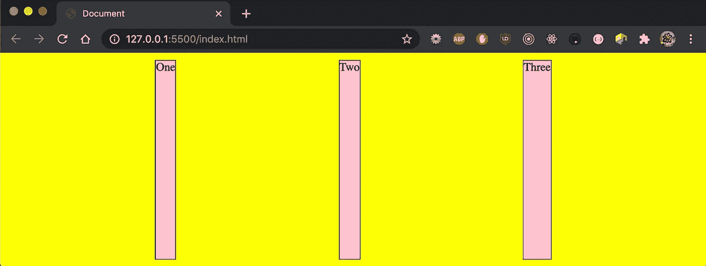

# 面试准备:使用 HTML、CSS 和 JavaScript 构建 Web 应用程序

> 原文：<https://javascript.plainenglish.io/interview-prep-build-web-application-using-html-css-and-javascript-d6489132daaf?source=collection_archive---------7----------------------->

## 关于如何使用 HTML、CSS 和 JavaScript 构建 Web 应用程序的实践指南

Image credit: Author

Web 开发已经进入框架时代。然而，面试是一种有时间限制的经历。通常，前端工作面试要求构建一个简化的 Web 应用程序，使用有限的 HTML、CSS 和 JavaScript 资源，并且可能无法访问互联网来检查语法。

在本文中，我们使用有限资源来构建一个 Web 应用程序。

# vs 代码准备

我们使用 VSCode 为 HTML、CSS 和 JavaScript 建立工作环境。

*   创建一个目录，命名为`js`。
*   在目录中创建两个空文件:`index.html`和`style.css`。

打开空的`index.html`，键入`!`。选择上图中的第一个选项，HTML 搭建就生成了:

我们添加到上面的模板。

在第 7 行，到`style.css`的链接被添加到`head`部分。如果您不记得`link`语法，请键入`link`并回车。VSCode 将生成`link`元素。这个方法适用于所有的 HTML 标签。

在第 10 行，在`body`部分内增加了一个`Hello, world!`的`div`。

就是这样。我们已经构建了我们的`Hello, world!` Web 应用程序！

那么，我们如何查看 Web 应用程序呢？

VSCode 扩展 Live Server 可以提供帮助。

下载 Live Server，这是一个本地开发服务器，具有静态和动态页面的实时重新加载功能。

右击`index.html`，选择选项`Open with Live Server`。正如所料，我们看到一个浏览器会话与 Web 应用程序一起启动:

# CSS 布局

我们在浏览器上有`Hello, world!`。面试过程的下一步可能是使用 CSS 来设计页面布局。

第一个问题:如何让`Hello, world!`充满整个屏幕？

这可以通过`style.css`完成:

在第 3 - 4 行，我们设置了`width`和`height`来使`body`元素充满屏幕。

在第 5 行，`margin: 0`覆盖了浏览器的默认边距。

设置`box-sizing: border-box`(第 10 行)在元素宽度和高度中包含边框和填充通常是个好主意。

对于`div`元素，通常的做法是设置`width: 100%`和`height: 100vh`来接管整个视口(第 14 和 15 行)。尽量改成`height: 100%`。你会看到什么？`div`元件变成一条细带。设置`background: yellow`(第 16 行)效果明显。

在第 17 行和第 18 行，设置`display: grid`和`place-items: center`使文本居中。

我们已经回答了第一个问题。现在我们多做一点。

在`body`部分增加一个`container`(第 5 - 9 行)，包含三个项目。

规则集在`style.css`中相应调整:

`container` id 使用`flex`布局(第 17 行)。

`item`类设置`width: 100px`(第 23 行)。

第 19 行的声明将项目均匀地分布在屏幕上:

代替硬编码`width`，我们可以使项目宽度响应容器的宽度:

在第 2 行，`flex-grow`被设置为 1。

到目前为止，我们已经使用`grid`来居中文本。`flex`显示器可以实现相同的效果:

由于多了一行，第 6 - 8 行也使文本居中。

我们来看看 2 号线的`[flex](https://developer.mozilla.org/en-US/docs/Web/CSS/flex)`属性。其语法定义如下:

*   `none | [ <’flex-grow’> <’flex-shrink’>? || <’flex-basis’> ]`
*   `<’flex-grow’>`:定义弹性项目的`flex-grow`。负值被视为无效。省略时默认为 1。
*   `<’flex-shrink’>`:定义弹性项目的`flex-shrink`。负值被视为无效。省略时默认为 1。
*   `<’flex-basis’>`:定义柔性项目的`flex-basis`。首选大小 0 必须有一个单位，以避免被解释为灵活性。省略时默认为 0。

我们已经看到将`flex`设置为`1`会增加条目。那就是`flex-grow`值。

以下是潜在的面试问题:

> 如果`flex`没有设置，`width`也没有设置会怎么样？

则宽度被设置为内容宽度。因此，项目`Three`比项目`One`宽。

> 如果我们在下面的代码中从`container`(第 6 行)中移除`justify-content`，会发生什么？

多余的宽度不再分配。

> 如果我们在下面的代码中设置`flex: 0 1 200px`(第 2 行)会发生什么？

在此设置下，`flex-grow` 为 0，`flex-shrink`为 1，`flex-basis`为`200px`。每个项目的宽度固定在`200px`不变。

> 如果我们在下面的代码中设置`*flex: 1 1 200px*`(第 2 行)会发生什么？

在此设置下，`flex-grow` 为 1，`flex-shrink`为 1，`flex-basis`为`200px`。这些项目占据整个宽度。

> 如果`flex-basis`是`500px`(下面代码中的第 2 行)，其中有 3 个项目比视窗宽，会怎么样？

当容器设置为`flex-wrap: wrap`时，额外的项目流向下一行。在这种情况下，所有项目都会叠加起来。

> 如果我们在第 2 行关闭 flex-grow 会怎么样？

然后，堆叠的项目不会增长。

我们已经使用 [flex](https://developer.mozilla.org/en-US/docs/Learn/CSS/CSS_layout/Flexbox) 探索了各种布局。构建一个简单的 Web 应用程序应该足够了。我们也可以使用[网格](https://developer.mozilla.org/en-US/docs/Web/CSS/grid)布局来完成同样的任务。传统的相对或绝对位置也可以工作。简单地选择一种你最舒服的方式。

作为练习的一部分，您能使用以下布局创建一个 Web 应用程序吗？

很简单，对吧？

这里是`index.html`:

这里是`style.css`:

# JavaScript 操作

JavaScript 用于对网页的行为进行编程。Web 应用程序面试通常由一些交互方面组成。

对于前面的 Web 应用程序，我们将添加交互部分。当每个项目被点击时，它的背景颜色会变成蓝色。1 秒钟后，颜色将恢复为粉红色。

添加交互部分有 4 个步骤:

1.  创建`script`标签。
2.  访问脚本标签中的元素。
3.  实现事件处理程序。
4.  添加视觉指示。

## 创建脚本标签

可以将脚本标记添加到标题部分或正文部分。我们应该把它放在哪里？

如果脚本在被调用时执行，或者当事件被触发时执行，则将脚本标记放在`head`部分。否则，把它放在`body`里。当它在`body`部分时，为了不延迟 HTML 内容的加载，把它放在`body`部分的底部。

一般来说，建议将所有脚本放在`head`部分，以便于管理。

## 访问脚本标记中的元素

可以从事件处理程序参数中检索目标元素。或者可以从许多 API 中检索:

*   `document.getElementById()`
*   `document.getElementsByClassName()`
*   `document.getElementsByName()`
*   `document.getElementsByTagName()`

`document.getElementById()`方法返回具有指定值的`id`属性的元素。其他 API 返回文档中具有指定特性的所有元素的集合。该集合是一个类似于[数组](https://medium.com/better-programming/the-technical-interview-guide-to-dynamic-programming-3ce755d99849)的对象。需要将其转换为数组，以便访问数组 API。

CSS 选择器也可以检索一个或多个元素:

*   `document.querySelector()`
*   `document.querySelectorAll()`

JavaScript 检索元素 x 后，可以访问它来更改属性，如`x.innerHTML = ‘New Value’`、`x.style.color = ‘blue’`等。

## 实现事件处理程序

有三种处理事件的方法:

*   在 HTML 元素中，它可以由`on<event>`属性来处理。比如`
`和`
`。
*   在 JavaScript 中，它可以被创建为指定元素的`on<event>`函数。以元素 x 为例，事件处理程序可以写成`x.onclick = event => {}`。
*   在 JavaScript 中，`addEventListener()`方法将一个事件处理程序附加到指定的元素上。以元素 x 为例，事件处理程序可以写成`x.addEventListener(‘click’, event => {}, useCapture)`。

## 添加视觉指示

向用户提供视觉指示总是一个好主意。在本练习中，当鼠标输入一个项目时，将它变为指针会提醒用户该项目的可点击性。在下面的代码中，第 11 行实现了这种效果。

我们已经解释了向 Web 应用程序添加交互部分的 4 个步骤。你准备好尝试了吗？

## 解决方案 1:使用 HTML 元素的`onclick`属性

事件处理程序`myHandler`在 head 部分实现(第 9 - 14 行)。

在第 19、28 和 33 行，`onclick`属性被添加到`div`元素中。`“this”`作为当前元素传入。或者，`event.currentTarget`以同样的方式工作(第 20 行)。

## 解决方案 2:使用 JavaScript 的 addEventListener()方法

在这个解决方案中，元素的`onclick`属性被替换为`body`部分第 43 - 46 行的代码。

如果您将 JavaScript 从`body`部分移动到`head`部分，它会报错因为 DOM 还没有加载，所以没有定义项目。

然而，当 JavaScript 代码被分成`head`和`body`两部分时，很难维护。有办法解决这个问题吗？

## 解决方案 3:使用 JavaScript 的 window.onload 方法

在第 15 - 20 行，JavaScript 初始化代码被包装在`window.onload`中，当整个页面加载时被触发。

现在，所有的 JavaScript 代码都整齐地列在了`head`部分。

# 结论

我们已经使用 HTML、CSS 和 JavaScript 建立了一个 Web 应用程序。还会有更多的问题，比如:

*   `window.onload`和`document.onload`有什么区别？
*   如果有多个事件处理程序，如何防止事件冒泡？
*   如何实现事件委托？

这是一个典型的长达 1 小时的面试的起点。熟能生巧。享受编码。

感谢阅读。我希望这有所帮助。你可以在这里看到我的其他媒体出版物。