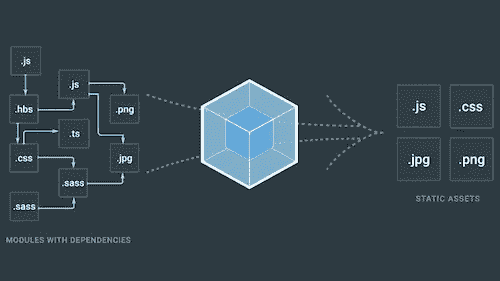

# 模块捆扎机简介

> 原文：<https://javascript.plainenglish.io/intro-to-module-bundlers-fd3df36925e5?source=collection_archive---------5----------------------->

## 最强大的 web 开发工具之一的详细介绍

现代 web 应用程序极其复杂。有了像 [React](https://reactjs.org/) 、 [Angular](https://angular.io/) 这样的 Javascript 工具，像 [Sass](https://sass-lang.com/) 或 [Less](http://lesscss.org/) 这样的 CSS 工具，以及像 [pug](https://pugjs.org/api/getting-started.html) 这样的 HTML 工具，任何 web 项目都在实现各种库和技术。


Photo by [Clément H](https://unsplash.com/@clemhlrdt?utm_source=medium&utm_medium=referral) on [Unsplash](https://unsplash.com?utm_source=medium&utm_medium=referral)

所有这些工具都运行在 Javascript 上。在 [ECMAScript 2015+](http://www.ecma-international.org/ecma-262/6.0/) 中，您可以将您的代码分成多个文件，并在需要使用它们的功能时将这些文件`import`到您的应用程序中。例如，当构建一个 React 应用程序时，你总是在每个 JS 文件的顶部写`import React from 'react'`。

默认情况下，浏览器中没有内置这种功能，所以现代代码捆绑器以几种形式提供这种功能:根据需要异步加载 javascript，或者将所有 javascript 合并到一个文件中，通过一个`<script>`标签加载。

如果没有模块捆绑器，您将不得不手动组合文件或将 Javascript 加载到带有无数`<script>`标签的 HTML 中，这是可行的，但有几个主要缺点:

*   您必须跟踪需要哪些代码以及正确的加载顺序
*   多个`<script>`标签意味着对服务器的更多调用，从而降低性能
*   大量的手工工作

如果你考虑使用 NPM 模块，这需要数百个`<script>`标签和手工工作来实现你正在使用的所有第三方依赖。

这就是**模块捆绑器**的用武之地，它自动完成组合、缩小(使代码更小/更有效)、代码分割(减少初始加载时间)和加载 Javascript 的过程。它直接与 npm 或 bower 等包管理器一起工作，将第三方代码与您的代码有效地结合起来。

在最基本的层面上，模块包将多个 JS 文件(比如您的源代码和第三方源代码)组合成一个称为“Javascript 包”的大文件。如果你使用的是 NPM 的包，它会处理依赖项的导入和依赖项的依赖，创建一个依赖图来跟踪如何将所有代码放在一起。让我们通过使用当今最流行的模块捆绑器`webpack`来看看这在实际项目中是如何工作的



How the bundler combines JS modules into static assets

# 创建基本 Webpack 项目

打开你的工作区，在`src`文件夹中创建一个名为`index.js`的文件。目前这个文件没有依赖项，所以没有理由使用模块捆绑器。在 index.js 文件中写入`console.log('hello world')`。由于不依赖外部模块，这在 Node 或浏览器中也能很好地工作。

现在，创建一个 NPM 模块并引入一些依赖项。在你的终端上运行`npm init -y`来初始化一个 NPM 项目。

让我们安装最流行的 npm 库，`lodash`。运行`npm i -s lodash`。这将为您安装`lodash`。

在`public`文件夹中创建一个`index.html`文件。这是你的应用程序的前端。将以下代码添加到该 html 文件中:

```
<!doctype html>

<html lang="en">
<head>
  <meta charset="utf-8">

  <title>Document</title> <script *src*="../src/index.js"></script></head>

<body>
</body>
</html>
```

目前，我们的`index.js`文件没有使用`lodash`，所以如果您在浏览器中查看`index.html`文件并打开控制台，您将在控制台中看到“hello world”。这很好，但是如果我们想使用`lodash`呢？

让我们用以下内容更新我们的`index.js`文件:

```
import {camelCase} *from* 'lodash';console.log(camelCase('Hello World'))
```

现在，我们从`lodash`导入`camelCase`函数，并在我们的控制台日志中使用它。

如果你打开控制台，你会看到一个错误:`Uncaught SyntaxError: Cannot use import statement outside a module`。

我们得到这个错误的原因是因为浏览器不知道在哪里可以找到`lodash`。这就是 Webpack 帮助我们的地方。运行`npm i --save-dev webpack webpack-cli`安装 Webpack。

现在，在`package.json`中设置一个脚本来实际运行`webpack`。将以下内容插入您的`package.json`:

```
{
   ...
   "scripts": {
      "build": "webpack"
   },
   ...
}
```

如果运行`npm run build`，它会执行`webpack`命令，并自动将`src/index.js`文件编译成`dist/main.js`文件。现在，如果我们改变我们的`index.html`文件，在`<script>`标签中引用这个`main.js`文件:

```
<!doctype *html*>
<html *lang*="en">
<head>
  <meta *charset*="utf-8">
  <title>Document</title>
  <script *src*="../dist/main.js"></script>
</head>
<body></body>
</html>
```

在我们的浏览器中打开`index.html`，我们应该看到`helloWorld`打印在我们的控制台上。恭喜你。你已经完成了你的第一份申请！

请注意，这是使用默认的 Webpack 配置。如果您想对这个项目进行更多的配置，并使用模块加载器(加载非 JS 资产)、开发服务器或其他特性，请在这里参考 Webpack config [的文档。](https://webpack.js.org/configuration/)

# 结论

正如我们所见，模块捆绑器是构建现代网站的不可思议的工具。我们研究了如何构建一个基本的 Webpack 项目，并将源代码和外部库捆绑到一个高效的文件中。这是对 Webpack 的一个非常基本的介绍，你可以通过阅读 [Webpack 文档](https://webpack.js.org/)来探索大量强大的功能。

# 保持联络

有很多内容，我很感谢你读我的。我是一名年轻的企业家，我写的是软件开发以及我经营和发展公司的经历。你可以在这里注册我的简讯

请随时联系我，在 Linkedin 或 Twitter 上与我联系。