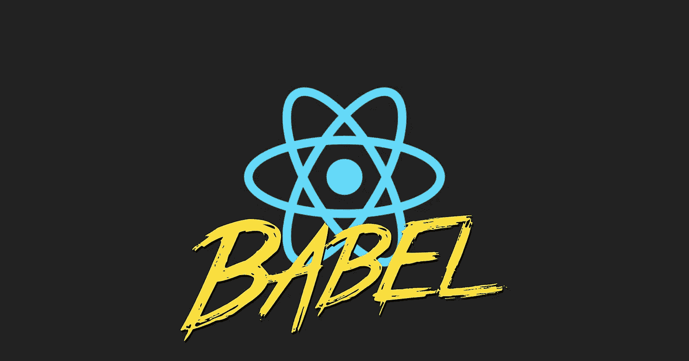

# 在 Babel 中引入新插件来创建 react 应用程序

> 原文：<https://javascript.plainenglish.io/introduce-babel-new-plugins-to-create-react-app-ea55f56c3811?source=collection_archive---------1----------------------->



[create react app v3.0.0](https://github.com/facebook/create-react-app/releases/tag/v3.0.0) ，2019 年 4 月底发布，新增功能包括支持[钩子](https://reactjs.org/docs/hooks-intro.html)。react-scripts v3.0.0 包括`@babel/core@7.4.3`、`babel-loader@8.0.5`和`babel-eslint@10.0.1`，这意味着它可以与一些很棒的[实验插件](https://babeljs.io/docs/en/plugins#experimental)一起使用。

在本文中，我将介绍一些实验性插件以及如何在`create react app`中使用它们。

## 用 react-app-rewired 设置一个 create react app

使用 babel 插件而不弹出，需要安装 [react-app-rewired](https://github.com/timarney/react-app-rewired) 和 [customize-cra](https://github.com/arackaf/customize-cra/blob/3046d395878afc0e6ad8508f9be5a90edb46b9ef/readme.md) 。

在您的项目中安装 create-react-app:

```
yarn create react-app my-app
```

移动`my-app`目录，增加`react-app-rewired`和`customize-cra`:

```
yarn add -D react-app-rewired customize-cra
```

在根目录下创建一个`config-overrides.js`文件:

`useBabelRc()`用于在您的项目中使用`.babelrc`。默认情况下，create react app 不允许你使用`.babelrc`，所以你需要在这里打开。(Webpack 配置可以在这里看到[。)](https://github.com/facebook/create-react-app/blob/a2ae8a79c0f6c0d07c6c2f1155d63f10efce9089/packages/react-scripts/config/webpack.config.js#L361)

并将`package.json`中的`scripts`改为这样:

好了，现在您可以用`yarn start`启动开发服务器，并看到它工作正常。

## 创建一个巴别塔配置

接下来，您将在项目中添加一个 babel 配置文件。

在根项目中添加`.babelrc`:

现在，你没有任何插件，但我将在稍后解释如何添加它们。

## 创建 ESLint 配置

对于 babel 特性和代码格式化，您希望在项目中使用 ESLint。

安装一些配置插件:

```
yarn add -D eslint eslint-config-prettier eslint-plugin-babel eslint-plugin-prettier prettier
```

在根项目中添加`.eslintrc.js`。我的 ESLint 配置是这样的，但是你可以随意编辑它:

好了，现在你需要做的事情都完成了，让我们开始`yarn start`吧。接下来我要说的是巴别塔插件。

## 实验插件

所有的巴别塔外挂都可以在这里[看到](https://babeljs.io/docs/en/plugins#experimental)。我已经把其中一些介绍给我的真实项目，发现它们真的很有帮助。所以我要谈以下几点:

*   [@ babel/plugin-proposal-pipeline-运营商](https://babeljs.io/docs/en/babel-plugin-proposal-pipeline-operator)
*   [@ babel/plugin-proposal-可选-链接](https://babeljs.io/docs/en/babel-plugin-proposal-optional-chaining)
*   [@ babel/plugin-proposal-logic-assignment-operators](https://babeljs.io/docs/en/babel-plugin-proposal-logical-assignment-operators)
*   [@ babel/plugin-proposal-do-expressions](https://babeljs.io/docs/en/babel-plugin-proposal-do-expressions)

## @ babel/plugin-proposal-pipeline-operator

首先，我要去找管道运营商。管道方案应配置有`proposal`选项，包括:

*   `minimal` [最小管道](https://github.com/tc39/proposal-pipeline-operator/)
*   `smart` [智能管道](https://github.com/js-choi/proposal-smart-pipelines)
*   `fsharp` [F#型管道](https://github.com/valtech-nyc/proposal-fsharp-pipelines)(尚未实施)

并且现在可以使用`minimal`和`smart`选项(截至 2019 年 4 月)。

安装插件:

```
yarn add -D @babel/plugin-proposal-pipeline-operator
```

在`.babelrc`中添加配置:

管道操作符是带有单个参数的函数调用的一个有用的语法糖。在函数式编程中，管道用于将几个函数链接在一起，以获得更好的可读性。

先说以下功能:

通常你可以这样使用它们:

将它们与管道运算符一起使用时:

它更好，可读性更强。

多重论证呢？给定以下函数:

将它们与管道运算符一起使用时:

`_`代表输入参数，因此您可以随意更改名称。

这似乎有点多余。它可以使用目前处于第一阶段的`[partial application proposal](https://babeljs.io/blog/2019/03/19/7.4.0#partial-application-9343-https-githubcom-babel-babel-pull-9343-and-9474-https-githubcom-babel-babel-pull-9474)`进行改进(最后一次提交是在 2018 年 7 月)。

不错！但是你现在不能在`create react app`项目中使用它，因为`babel-loader@8.0.5`是基于`@babel/core@7.2.0`的，它需要上面的`7.4.0`。

异步函数呢？现在，您不能使用`minimal`选项。你很快就可以用`fsharp`选项来试试了，就像这样:

可读性好得多，而且它是如此的声明性。很快就要使用`await`了，我真的很兴奋。

## @ babel/plugin-proposal-可选-链接

可选链接目前处于阶段 1。可选的 chaining 运算符允许您深入访问嵌套对象，而无需在临时变量中重复分配结果。如果你熟悉 Ruby，你就把它当成像[安全导航操作符](https://rubyinrails.com/2017/11/17/safe-navigation-operator-ampersand-dot-in-ruby/)。

让我们安装它:

```
yarn add -D @babel/plugin-proposal-optional-chaining
```

并在`.babelrc`中进行配置:

让我们访问深度嵌套的属性:

和访问可选方法:

没有未定义的错误。酷！你可以点击查看所有例子[。](https://github.com/tc39/proposal-optional-chaining)

## @ babel/plugin-proposal-logical-assign-operators

逻辑运算符和赋值目前处于第一阶段，受到了 [Rubys](https://docs.ruby-lang.org/en/2.5.0/syntax/assignment_rdoc.html#label-Abbreviated+Assignment) 的高度启发。

安装它:

```
yarn add -D @babel/plugin-proposal-logical-assignment-operators
```

并在`.babelrc`中进行配置:

测试一下:

如果`a`的值为空或未定义，则将`b`分配给`a`。如果`c`有真值，将`d`赋值给`c`。这里可以看到详细的。

## @ babel/plugin-proposal-do-expressions

do 表达式当前处于阶段 1，该阶段执行一个块，块内的最终值成为 Do 表达式的值。

安装它:

```
yarn add -D @babel/plugin-proposal-do-expressions
```

并在`.babelrc`中进行配置:

您可以用面向表达式的方式编写:

在 JSX，您可以使用`do`，它有条件地显示一个组件。通常情况下，您可以像这样实现条件组件:

但是当像这样使用`do`时:

其他用法见[此处](https://github.com/tc39/proposal-do-expressions)。

## 结论

在`create react app`中，你必须要么使用 react-app-rewired 要么弹出自定义巴别塔配置。但是作为另一种选择，你可以把它安装成一个 [babel-plugins-macro](https://github.com/kentcdodds/babel-plugin-macros) 。对于管道操作员，可以使用我介绍的`[pipeline.macro](https://github.com/Andarist/pipeline.macro)`。项目中有一堆宏[，所以你会找到你想要的。](https://github.com/jgierer12/awesome-babel-macros)

我已经在我的真实项目中使用了这些插件，它们真的很有用。我希望你能从这件作品中找到一些灵感。