# 为数据驱动表单引入碳成分映射器

> 原文：<https://javascript.plainenglish.io/introducing-carbon-component-mapper-for-data-driven-forms-c9221b604d8e?source=collection_archive---------7----------------------->

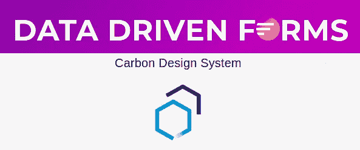

[数据驱动表单](https://data-driven-forms.org/)团队刚刚发布了[碳成分映射器](https://data-driven-forms.org/mappers/carbon-component-mapper)，它将 IBM React 碳成分集成到数据驱动表单中。

## 关于数据驱动表单

[数据驱动表单](https://data-driven-forms.org/)是一个[开源](https://github.com/data-driven-forms/react-forms/) React 库，它使用[数据驱动方法](https://medium.com/javascript-in-plain-english/data-driven-approach-to-forms-with-react-c69fd4ea7923)构建[React 表单。这种方法基于将 JSON 模式呈现为 React 表单，由](https://medium.com/javascript-in-plain-english/data-driven-form-building-in-react-30768b49e625)[呈现器](https://data-driven-forms.org/components/renderer)提供所有需要的功能。它包括诸如[验证](https://data-driven-forms.org/schema/introduction#validate)、[条件字段](https://data-driven-forms.org/schema/introduction#condition)等许多功能。它帮助 web 开发人员更快、更简单地编写表单，并在整个应用程序中实现一致性。

## 关于地图绘制者

映射器是一组与数据驱动表单 API 集成的组件。这个集合允许用户编写表单，而不需要实现他们自己的组件，因此他们可以立即编写具有广泛功能(显示错误、向导表单等)的完整工作表单。)您还可以检查其他映射器，包括来自 [MaterialUI](https://data-driven-forms.org/mappers/mui-component-mapper) 、 [Ant Design](https://data-driven-forms.org/mappers/ant-component-mapper) 或 [BlueprintJS](https://data-driven-forms.org/mappers/blueprint-component-mapper) 的组件。

## 关于碳设计系统

[Carbon Design System](https://www.carbondesignsystem.com/) 是一套用于构建现代 web 应用的模式、规则和组件。这个系统是完全开源的，由 IBM 维护。

## 提供的功能

*   [表单状态管理、验证、条件等等](https://data-driven-forms.org/introduction)。
*   [**摇树**](https://data-driven-forms.org/optimization) :在 CommonJS、ESM 或 UMD 包中选择，以达到最小的包大小。
*   Typescript 定义。
*   附加组件和附加道具:
*   所有组件都支持 helperText，
*   所有组件都显示错误文本。
*   向导表单(见下文)。)

# 提供的组件

## [文本字段](https://data-driven-forms.org/mappers/text-field?mapper=carbon)(文本输入)

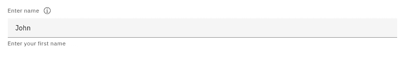

## [文本区](https://data-driven-forms.org/mappers/textarea?mapper=carbon)

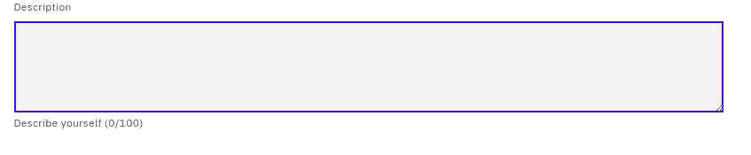

## [收音机](https://data-driven-forms.org/mappers/radio?mapper=carbon)


## 复选框

*   [单个](https://data-driven-forms.org/mappers/checkboxmapper=carbon) / [多个](https://data-driven-forms.org/mappers/checkbox-multiple?mapper=carbon)变体


Multiple variant

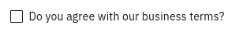

Single variant

## [日期选择器](https://data-driven-forms.org/mappers/date-picker?mapper=carbon)

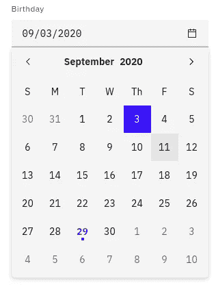

## [时间选择器](https://data-driven-forms.org/mappers/time-picker?mapper=carbon)

*   包括上午/下午和时区选择器

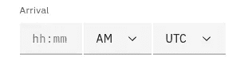

## [开关](https://data-driven-forms.org/mappers/switch?mapper=carbon)(拨动)


## [选择](https://data-driven-forms.org/mappers/select?mapper=carbon) / [多选](https://data-driven-forms.org/mappers/select?mapper=carbon)

*   允许延迟加载初始数据

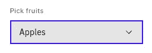

Single select

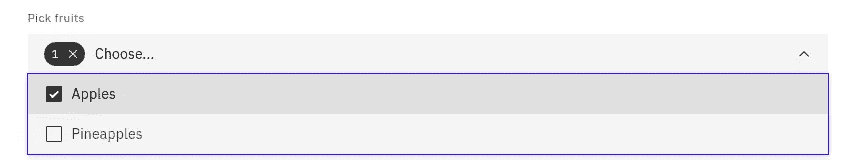

Multiple select

## [子表单](https://data-driven-forms.org/mappers/sub-form?mapper=carbon)

*   允许将表单分成子组

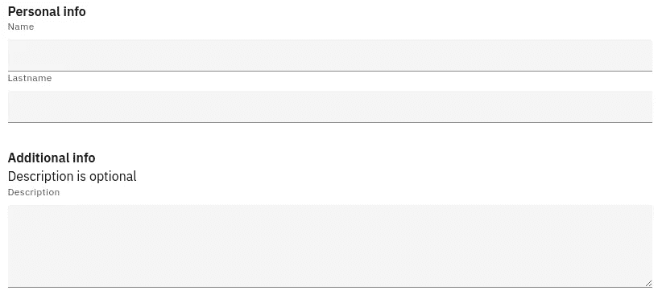

## [明文](https://data-driven-forms.org/mappers/plain-text?mapper=carbon)

*   允许呈现任何文本


## [滑块](https://data-driven-forms.org/mappers/slider?mapper=carbon)

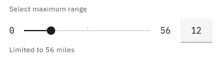

## [标签页](https://data-driven-forms.org/mappers/tabs?mapper=carbon)

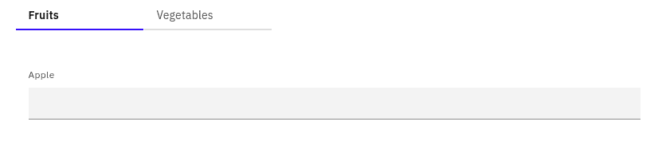

## [向导](https://data-driven-forms.org/mappers/wizard?mapper=carbon)(自定义组件)

*   分支路径
*   交互式导航
*   仅提交访问过的值

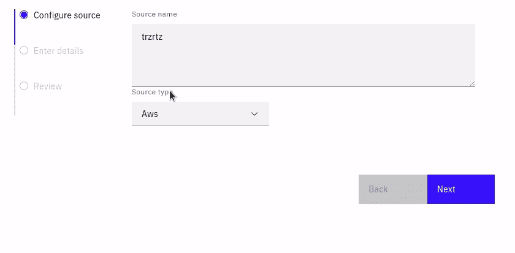

## [双重列表选择](https://data-driven-forms.org/mappers/dual-list-select?mapper=carbon)(自定义组件)

*   允许在两个列表之间移动选项
*   过滤、分类

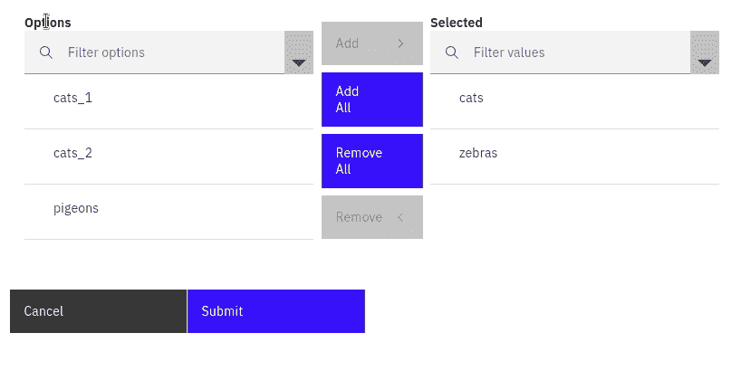

## [FieldArray](https://data-driven-forms.org/mappers/field-array?mapper=carbon) (自定义组件)

*   允许将表单域动态添加到表单中
*   即一次注册多个用户

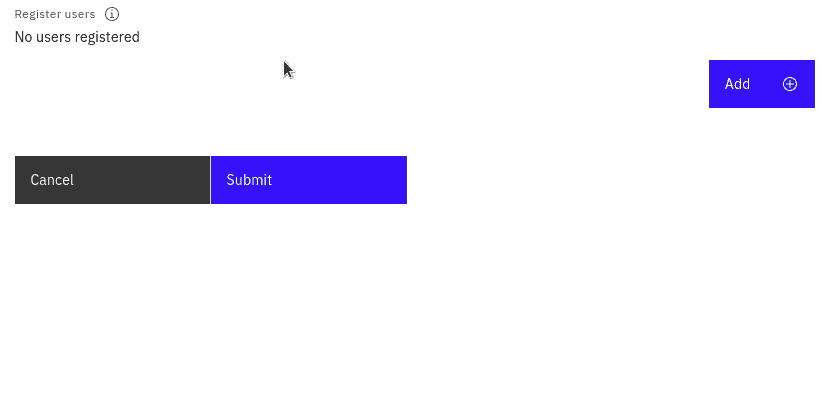

## [表单模板](https://data-driven-forms.org/components/form-template)

*   表单(间距、按钮)是根据 Carbon 的指导方针设计的

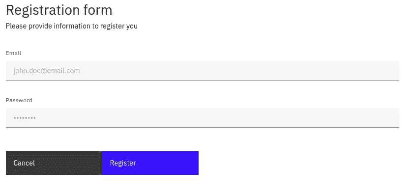

## [安装](https://data-driven-forms.org/mappers/carbon-component-mapper#installation)

```
npm install --save @data-driven-forms/carbon-component-mapper
```

或者

```
yarn add @data-driven-forms/carbon-component-mapper
```

欲了解更多信息，请访问[文档页面](https://data-driven-forms.org/)。

# 贡献

数据驱动表单是一个开源项目，欢迎所有社区贡献。如果您遇到任何问题，请在 [GitHub](https://github.com/data-driven-forms/react-forms) 问题页面上告诉我们，或者打开一个 PR。您也可以在 Twitter[@ DataDrivenForms](https://twitter.com/DataDrivenForms)上关注该项目，或者通过我们的 [Discord 服务器](https://discord.gg/6sBw6WM)联系我们。