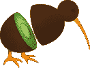

# Kiwis 简介:JavaScript 中的数据争论工具包🥝

> 原文：<https://javascript.plainenglish.io/introducing-kiwis-data-wrangling-toolkit-in-javascript-fdf1d54adc01?source=collection_archive---------9----------------------->

© Michal Klajban — *Wikimedia Commons*

我很高兴向你们介绍 [**奇异果**](https://www.npmjs.com/package/kiwis) 🥝，我用 JavaScript 创建的数据操作库。但是在我们开始之前，让我告诉你一些关于我自己的事情。

我是[一名 22 岁的法国新闻专业学生，拥有计算机科学和网络开发的背景](https://tomfevrier.io)。在我们的工作中，像我这样的数据记者经常需要处理数据，以便在网络上提取故事和创建交互式图表。为此，我们大多数人使用电子表格或 JavaScript 中的有限数组方法，使得数据透视表或连接等常见数据操作技术变得相当痛苦*(是的，我说的就是你*[*VLOOKUP*](https://support.microsoft.com/en-us/office/vlookup-function-0bbc8083-26fe-4963-8ab8-93a18ad188a1)*！).*

> 等等……但是你为什么不用熊猫呢？

[Pandas](https://pandas.pydata.org/) 很棒:它速度快、功能强大、功能多样、文档丰富，在数据科学社区中非常受欢迎。但是 Pandas 是 Python 库，Python 是……姑且说它不是我喜欢的编程语言。此外，使用同一种语言来操作和可视化数据会更加方便。

我喜欢 JavaScript，我希望能够用 JavaScript 处理数据。但是不要误会我的意思:**几维鸟不是熊猫的克隆**。虽然它们的基本特性是相同的，并且使用相同的术语(“数据帧”和“系列”)，Kiwis 是为 JavaScript 程序员创建的，模仿了众所周知的 JavaScript 方法，如`toString()`、`forEach()`、`map()`、`filter()`等。因此，无论你是熟悉熊猫还是精通 JavaScript，新西兰人都应该有相当直观的感受。

此外，让我们实话实说:95%的熊猫的方法你没有听说过，可能永远不会使用。Kiwis 虽然意在未来扩展，但它提供了你需要的基本和高级数据操作工具——不多也不少。

# 入门指南

与 Python 类似，Kiwis 使用“数据帧”来存储多维数据。DataFrame 有点像电子表格，是由命名列和索引行组成的表格。Kiwis 允许你在数据帧上执行各种操作，比如插入、删除和过滤行和列，计算给定列的和或平均值，或者生成一个数据透视表。

您可以从对象数组创建数据帧:

如果使用 Node.js，还可以将 CSV 文件(或任何分隔符分隔的值)加载到数据帧中，并将数据帧保存为 JSON 或 CSV 文件:

访问行和列以及迭代数据帧非常简单:

添加新的行和列也是如此:

想要更详细地展示几维鸟的特征，请查看[这本可观察的笔记本](https://observablehq.com/@tomfevrier/kiwis)。npm 上的[和 GitHub 上的](https://www.npmjs.com/package/kiwis)[都有完整的文档。](https://github.com/TomFevrier/kiwis)

请注意，Kiwis 仍处于测试阶段，因此如果您遇到任何错误或意外行为，请告诉我。还有，欢迎大家提出建议，让奇异果变得更好！

# 简单英语的 JavaScript

喜欢这篇文章吗？如果有，通过 [**订阅解码，我们的 YouTube 频道**](https://www.youtube.com/channel/UCtipWUghju290NWcn8jhyAw) **获取更多类似内容！**