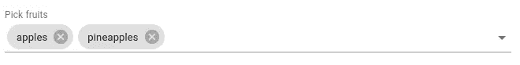

# 介绍用于数据驱动表单的材质-UI 组件映射器

> 原文：<https://javascript.plainenglish.io/introducing-material-ui-component-mapper-for-data-driven-forms-bb05076f7c8?source=collection_archive---------10----------------------->


最受欢迎的设计系统之一 [Material-UI](https://github.com/mui-org/material-ui) 被集成到数据驱动表单中，以尽可能快地用最少的样板文件构建 React 表单。通过数据驱动表单 [mui-component-mapper](https://www.npmjs.com/package/@data-driven-forms/mui-component-mapper) 用户可以开始使用 Material React 组件[在几秒钟内编写复杂的表单](https://medium.com/javascript-in-plain-english/data-driven-form-building-in-react-30768b49e625)。

## 关于数据驱动表单

[数据驱动表单](https://data-driven-forms.org/)是一个[开源](https://github.com/data-driven-forms/react-forms/) React 库，它使用[数据驱动方法](https://medium.com/javascript-in-plain-english/data-driven-approach-to-forms-with-react-c69fd4ea7923)构建[React 表单。这种方法基于将 JSON 模式呈现为 React 表单，由](https://medium.com/javascript-in-plain-english/data-driven-form-building-in-react-30768b49e625)[呈现器](https://data-driven-forms.org/components/renderer)提供所有需要的功能。它包括诸如[验证](https://data-driven-forms.org/schema/introduction#validate)、[条件字段](https://data-driven-forms.org/schema/introduction#condition)等许多功能。它帮助 web 开发人员更快、更简单地编写表单，并在整个应用程序中实现一致性。

## 关于地图绘制者

映射器是一组与数据驱动表单 API 集成的组件。这个集合允许用户编写表单，而不需要实现他们自己的组件，因此他们可以立即编写具有广泛功能(显示错误、向导表单等)的完整工作表单。)您还可以检查其他映射器，包括来自[语义 UI 反应](https://data-driven-forms.org/mappers/suir-component-mapper)、[蚂蚁设计](https://data-driven-forms.org/mappers/ant-component-mapper)或[蓝图 JS](https://data-driven-forms.org/mappers/blueprint-component-mapper) 的组件。

**关于素材-UI**

拥有超过 61k 颗星的 Material-UI 是最受欢迎的 React 库之一，它提供了数十个灵活的组件，用于按照谷歌的[材质设计](https://material.io/design)构建各种类型的 UI。

# 提供的功能

*   [表单状态管理、验证、条件等等](https://data-driven-forms.org/introduction)。
*   [**树摇动**](https://data-driven-forms.org/optimization) :在 CommonJS、ESM 或 UMD 包之间选择，以获得最小的包大小。
*   所有组件的类型脚本定义。
*   附加组件和附加道具。
*   向导表单(见下文)。)
*   双重列表选择器。
*   所有输入都正确显示错误。

# 提供的组件

## [文本字段](https://data-driven-forms.org/mappers/text-field?mapper=mui)


## [文本区](https://data-driven-forms.org/mappers/textarea?mapper=mui)


Textarea using [resolveProps](https://data-driven-forms.org/schema/resolve-props) to dynamically change the helper text

## [收音机](https://data-driven-forms.org/mappers/radio?mapper=mui)


## 复选框

*   [单个](https://data-driven-forms.org/mappers/checkbox?mapper=mui) / [多个](https://data-driven-forms.org/mappers/checkbox-multiple?mapper=mui)变体


Single variant checkbox


Multiple variant checkbox

## 日期选择者


DatePicker

## [时间选择器](https://data-driven-forms.org/mappers/time-picker?mapper=mui)


TimePicker

## [开关](https://data-driven-forms.org/mappers/switch?mapper=mui)


A switch with on text and off text

## [选择/多选](https://data-driven-forms.org/mappers/select?mapper=mui)


Single select



Multi select

## [子表单](https://data-driven-forms.org/mappers/sub-form?mapper=mui)

*   允许将表单分成子组


A form splitted to two groups

## [明文](https://data-driven-forms.org/mappers/plain-text?mapper=mui)


Header and overline variants

## [滑块](https://data-driven-forms.org/mappers/slider?mapper=mui)


## [标签页](https://data-driven-forms.org/mappers/tabs?mapper=mui)


## [向导](https://data-driven-forms.org/mappers/wizard?mapper=mui)

*   分支路径
*   仅提交访问过的值


## DualListSelect(自定义组件)

*   允许在两个列表之间移动选项
*   过滤、分类


A dual list component lets users to move values between two lists

## FieldArray(自定义组件)

*   允许将表单域动态添加到表单中
*   即一次注册多个用户


FieldArray component allows to add another fields into the form. In the GIF, you can see that this form is allowing to add more users to a users list and these users’ groups can be then changed via using [conditions](https://data-driven-forms.org/schema/condition-schema) to verify/not to verify the email.

## [表单模板](https://data-driven-forms.org/components/form-template)


FormTemplate component provides title, description and buttons.

## 错误示例


Using [validate](https://data-driven-forms.org/schema/introduction#heading-validate) is it simple to set any kind of inline validation.

# [安装](https://data-driven-forms.org/mappers/carbon-component-mapper#installation)

```
npm install --save @data-driven-forms/mui-component-mapper
```

或者

```
yarn add @data-driven-forms/mui-component-mapper
```

材质-UI 组件和图标必须分开安装。请遵循他们的[指南](https://material-ui.com/getting-started/installation/)。

欲了解更多信息，请访问[文档页面](https://data-driven-forms.org/)。

# 贡献

数据驱动表单是一个开源项目，欢迎所有社区贡献。如果您遇到任何问题，请在 [GitHub](https://github.com/data-driven-forms/react-forms) 问题页面上告诉我们，或者打开一个 PR。您也可以在 Twitter[@ DataDrivenForms](https://twitter.com/DataDrivenForms)上关注该项目，或者通过我们的 [Discord 服务器](https://discord.gg/6sBw6WM)联系我们。

喜欢这篇文章吗？如果有，通过 [**订阅获取更多类似内容解码，我们的 YouTube 频道**](https://www.youtube.com/channel/UCtipWUghju290NWcn8jhyAw) **！**