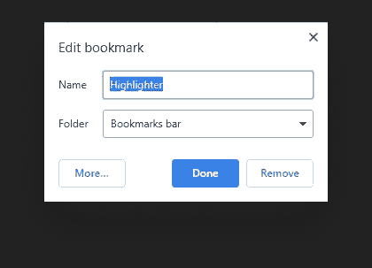
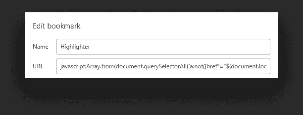
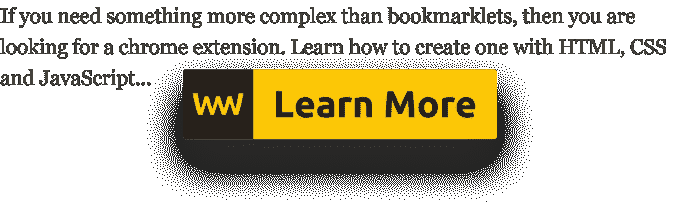

# 了解如何轻松制作书签

> 原文：<https://javascript.plainenglish.io/introduction-to-bookmarklets-cf0ad59462bd?source=collection_archive---------7----------------------->

## Chrome 扩展的一个较小的替代品

Photo by [Ben White](https://unsplash.com/@benwhitephotography?utm_source=medium&utm_medium=referral) on [Unsplash](https://unsplash.com?utm_source=medium&utm_medium=referral)

最近我写了关于如何[创建自己的 Chrome 扩展](https://www.webtips.dev/how-to-make-your-very-first-chrome-extension)来提高工作流的吞吐量，我想知道是否有更轻量级的替代品。

如果我们只想复制/突出显示文本，做不超过 10 行代码的事情呢？你能想到每天一遍又一遍地写同样的东西吗？我肯定可以。

重复性的事情总是可以自动化的。如果有机会实现自动化，我们应该投资。时间是我们拥有的最宝贵的资源。它是有限的，不像其他资产，它不能赚取。

所以下次如果你发现自己每天都在做同样的事情，想想这些步骤是否可以被书签或者其他自动化工具所取代。

# 什么是书签？

> bookmarlet 是一个包含 JavaScript 代码的书签，可以增强您的浏览体验

bookmarklets 的好处是可以将任何 JavaScript 代码转换成一个。您一直放入控制台的代码段可以被它们替换。

那么如何创建一个呢？假设我们想突出显示网站上的链接。

# 如何把 JavaScript 代码变成 Bookmarklet？

首先，像往常一样在控制台中编写 JavaScript 代码。按照上面的例子，可以使用下面的方法来完成:

我故意写了多行。一个 bookmarklet 需要被压缩成一行才能工作。要简化 JavaScript，有各种在线工具，所以你不必额外下载任何东西。我在用 Javascript-minifier.com 的。

书签总是通过链接指向一个网站。为了使 bookmarklet 有效并使用 JavaScript 而不是链接，我们需要在它前面加上前缀`javascript:`。有两种方法可以将一个脚本转换成一个有效的 bookmarklet。使用立即调用的函数或`void`操作符。

最后将它添加为书签，打开一个新标签，点击地址栏内的星形图标。

命名您的书签，并将其放入书签栏。完成后，右键单击新创建的书签并单击 edit，然后用我们创建的脚本替换 URL。就是这样！您刚刚创建了您的第一个书签。

# 实际例子

我最近开始使用 Quora，我注意到统计菜单下的数字并不等同于我个人主页上的浏览量总和。

这是合理的，这将需要大量的资源来保持每个用户的统计数据实时更新，因此它们会在给定的时间间隔内更新。但是如果我想在我的个人资料页面上看到它们呢？每个问题的浏览次数相加。我们在 DOM 中有它们，所以我们可以很容易地查询它们。问题是，只有当答案不成立时，它们才会出现。要全部取消，我们可以在每个“ *more* ”链接上触发一个点击事件:

一旦我们有了 DOM 中的视图，就只需要收集它们的值并为其创建一个新元素:

这将创建一个新元素，就在个人资料页面的关注者数量旁边。

但是现在，我们有了另一个问题。如果我们尝试在“ *more* ”链接被点击后立即运行这段代码，我们将得到 0 的视图，因为在代码运行时请求还没有发出。幸运的是，我们在 Quora 上有 jQuery，这意味着我们可以使用`ajaxStop`。`ajaxStop`在没有未决请求时运行——这就是我们想要的。

在我们触发链接点击后，我们等待`ajaxStop`被调用。所有答案成功加载后，它将运行。然后我们统计浏览量并显示出来。

最后但同样重要的是，我们可以解除对`ajaxStop`的订阅，以避免在使用 bookmarklet 后出现其他请求时多次添加相同的元素。

整个剧本不到 15 行。在缩小并添加了`javascript:`前缀后，我们可以开始使用我们全新的书签了。

# 摘要

可能性是无限的，复杂性可以达到无限。写一个只做一件事的 bookmarklet 怎么样？—将外部脚本注入站点。然后，外部资源可以引入整个应用程序，通过添加关于站点和新用户功能的各种统计数据，使用户体验加倍。

您可以每天使用 bookmarklets 来提高工作效率的其他一些例子包括:

*   根据票据自动生成分行名称
*   自动生成拉式请求描述
*   显示仅在 DOM 中可用的项目的信息
*   删除超过 x 天的电子邮件
*   凡是你能想到的

感谢您花时间阅读本文，编码快乐！

