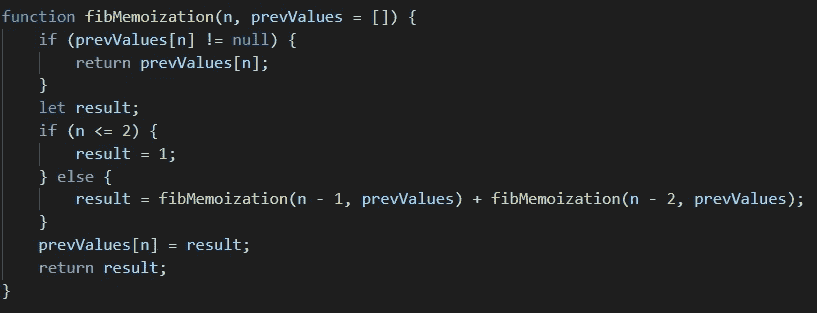

# 动态编程导论——记忆化

> 原文：<https://javascript.plainenglish.io/introduction-to-dynamic-programming-memoization-3fb2236dd5db?source=collection_archive---------6----------------------->

Introduction to Dynamic Programming — **Memoization**

动态编程仅仅意味着通过简单的递归优化你的代码。这个想法是存储子问题的结果，并在以后需要做同样的计算时重用它。

让我们看看动态编程是如何通过使用记忆化来提高程序效率的。我们将编写寻找“第 n 个”[斐波那契数](https://en.wikipedia.org/wiki/Fibonacci_number)的程序来实现这一点。

> **斐波那契问题——一般方法**

下图显示了我们大多数人解决斐波那契数问题的一般方法。这里我们有一个函数 fib(n ),它接受一个参数“n ”,并给出斐波那契数列中第 n 个元素的输出。

Fibonaci Program General Approach.

只要您试图计算较小的“n”值的斐波那契数，上面的代码就可以很好地工作。然而，对于较大的“n”值，需要更多的时间来执行。这是不同“n”值所用时间的比较。

Time taken for execution before Memoization.

> **斐波那契问题——记忆方法**

下面是重写的斐波那契数问题的方法，稍作修改。

Fibonacci Program with Memoization.

上面的程序和我们的第一个程序完全一样，但是执行时间更快。函数 **fibMemoization** 接受两个参数，“n”和“prevValues”，默认设置为空数组。

每次调用递归函数时，我们都会传递一个额外的参数，这个参数存储了之前计算的 Fibonacci 值。这个优点？让我们在程序执行时间里看看。

Time taken for execution after Memoization.

所以很明显，性能提高了。但是我们做了什么才到达那里呢？让我们以使用 or 第一种方法和第二种方法计算第 5 个斐波那契元素为例。

在第一种方法中，为了计算 **fib(5)，**必须经历至少重复一次的多次迭代。例如，fib(0)至少重复 4 次，如下图所示。

General Iterations in calculating Fibonacci number at 5-th position.

但是在第二种方法中，由于我们在计算下一个迭代值之前传递先前计算的值，所以可以消除大量的迭代，如下所示。

Elimination of iterations using memoization.

> **结论**

*记忆化是一种通过权衡你的* ***空间*** *来达到* ***时间效率的方式。*** *所以应该只在你知道同一个函数被递归调用多次的时候使用。否则，你最终交易的* ***空间和时间都毫无效率可言。***