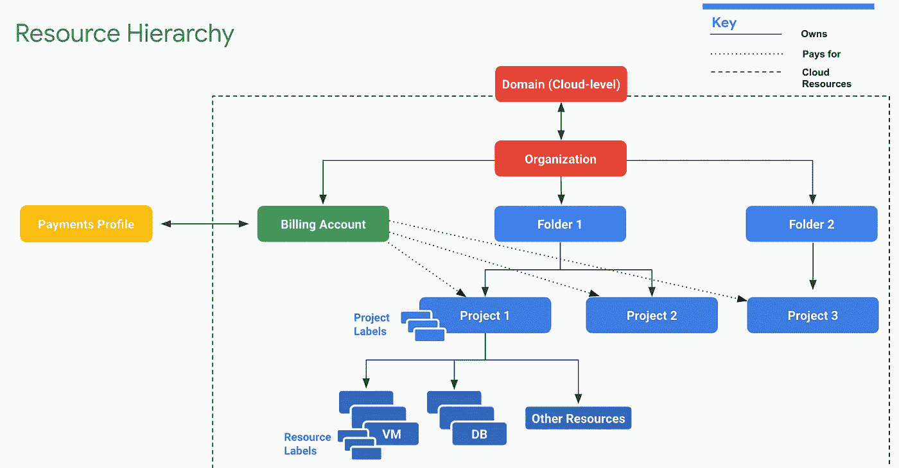
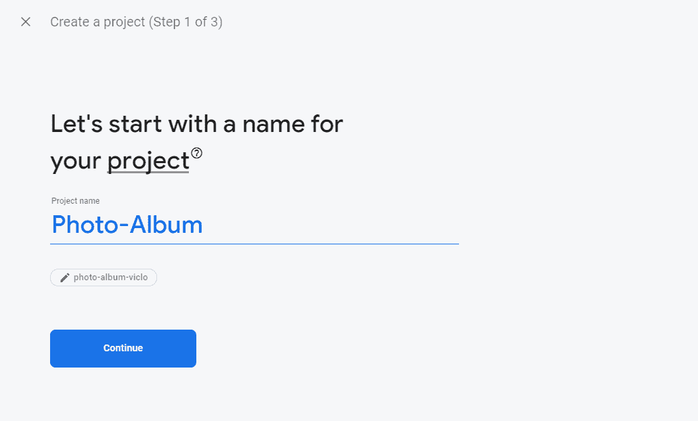
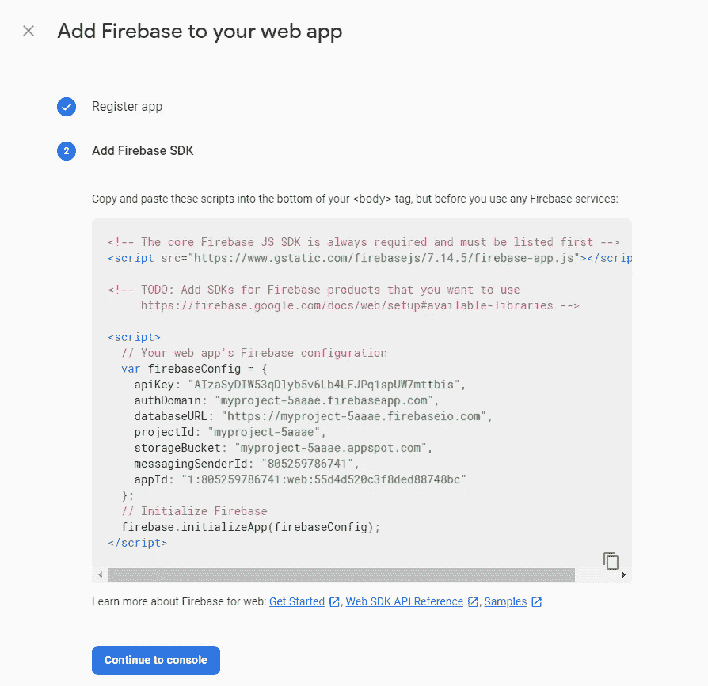
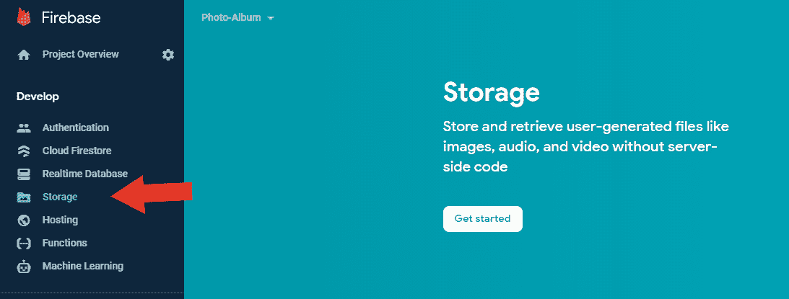
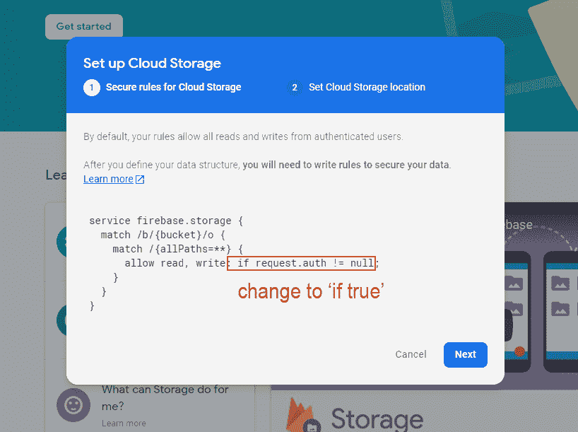
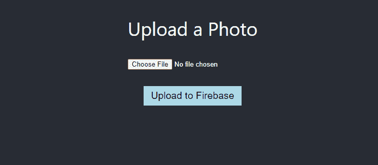

# Firebase 存储简介#1:上传文件

> 原文：<https://javascript.plainenglish.io/introduction-to-firebase-storage-1-upload-files-25e63a74a8c2?source=collection_archive---------8----------------------->

一些应用程序允许用户上传图片和文件，阅读，删除，甚至可以随时下载。这种功能对于社交媒体平台、博客平台或存储服务可能是有用的。Firebase 云存储提供了一个解决方案来轻松存储用户生成的内容。

各位开发者好，在本文中，我们将讨论 Firebase 云存储，以及我们如何实现它来安全地上传、检索和存储用户文件。


# 什么是 Firebase 云存储？

Firebase 云存储是一种服务，开发人员可以使用它来存储和下载客户端直接生成的文件。不需要服务器端代码。

它使用谷歌云存储桶来存储文件，允许从谷歌云和 Firebase 访问。这些存储桶是在分层结构中形成的。例如:



我真正喜欢 Firebase 云存储的是它与 Firebase 身份验证的无缝集成，因此您可以根据每个用户组织上传的文件，并在需要时应用访问控制。

此外，它可以自动扩展，因此当存储的数据变得太大时，不必担心会转移到另一个提供商。

现在我们知道了 Firebase 存储可以做什么，让我们试着在我们的项目中使用它。对于本教程，我正在制作一个简单的相册应用程序，允许用户上传、查看和删除图像。

# 步骤 1:创建一个新的 Firebase 项目

前往 firebase.google.com[创建一个新项目。](http://firebase.google.com/)



在仪表板上，单击 Web 图标为 Web 应用程序初始化 Firebase。


按照 Firebase 的步骤，你会看到一个显示配置变量的页面(见下图)。这很重要，所以复制并保存在某个地方。我们很快就会用到它。



接下来，转到“存储”选项卡，单击“开始”按钮。



您将看到一个弹出窗口，询问您是否同意某些设置。更换`request.auth !=null`到`true`。为了本教程的简单性，这确保了我们被允许上传文件到 Firebase 而不需要认证。

单击“下一步”继续。



这就对了。Firebase 云存储现已启用。让我们将它集成到我们的应用程序中。

# 步骤 2:创建一个 React 应用程序

对于这个例子，我使用 react 项目模板。你可以使用任何你喜欢的前端框架。

要创建 React 项目，只需运行:

```
npx create-react-app <app-name>
```

创建项目后，运行:

```
npm install firebase
```

这是一个包，其中包含了在我们的应用程序中设置 Firebase 所需的必要工具和基础设施。

# 第三步:config.js

创建一个名为`config.js`的文件来存储我们之前复制的 Firebase 配置变量。

我们的`config.js`会是什么样子:

```
import firebase from "firebase/app";
import "firebase/storage";const app = firebase.initializeApp({
  apiKey: process.env.REACT_APP_API_KEY,
  authDomain: process.env.REACT_APP_AUTH_DOMAIN,
  databaseURL: process.env.REACT_APP_DATABASE_URL,
  projectId: process.env.REACT_APP_PROJECT_ID,
  storageBucket: process.env.REACT_APP_STORAGE_BUCKET,
  messagingSenderId: process.env.REACT_APP_MESSAGING_SENDER_ID,
});// Get a reference to the storage service, export it for use
export const storage = firebase.storage(); export default app;
```

注意，我将实际的配置值存储在我的`.env`文件中，并作为`process.env.VARIABLE_NAME`访问它们。

> 如果你是环境变量的新手，我发现这篇很好的文章解释了如何使用它。

# 步骤 4:将文件上传到存储器

在`App.js`中，我们可以导入从`config.js`文件中导出的存储引用。

```
import {storage} from "./config";
```

为了上传文件，我们需要有一个用户输入字段。我们可以像这样创建一个输入元素:

```
<input type="file" accept="image/x-png,image/jpeg" />
```

通过指定`type`到文件，输入字段将是一个文件选择器。

对于这个例子，我们只接受文件为`.png`或`.jpeg`的文件。我们可以在`accept`属性中指定这个需求。

现在，让我们添加一个按钮，点击后会将我们的图像上传到 Firebase。

```
<button>Upload to Firebase</button>
```

此时，用户界面看起来应该很简单，如下所示:



# 1.创建图像状态

为了跟踪用户是否在输入中提供了文件，我们应该有一个`image`状态。首先，导入`useState`钩子。

```
import React, { useState } from "react";
```

并将状态初始化为空:

```
const [image, setImage] = useState(null);
```

# 2.onImageChange

接下来，让我们创建一个`onImageChange`函数，它将在每次用户向输入字段提供新文件时更新`image`状态。

```
const onImageChange = (e) => {
    const reader = new FileReader();
    let file = e.target.files[0]; // get the supplied file
    // if there is a file, set image to that file
    if (file) {
      reader.onload = () => {
        if (reader.readyState === 2) {
          console.log(file);
          setImage(file);
        }
      };
      reader.readAsDataURL(e.target.files[0]);
    // if there is no file, set image back to null
    } else {
      setImage(null);
    }
  };
```

然后，我们将把这个函数传递给 input 元素的`onChange`处理程序。

```
<input type="file" accept="image/x-png,image/jpeg" onChange={(e) => {onImageChange(e); }}/>
```

# 3.上传至防火墙

现在让我们为按钮创建一个`uploadToFirebase`函数，这样当用户点击按钮时，图像将被上传到 Firebase。

这是我们实现函数的方法:

1.  检查`image`状态是否为空。如果是，请用户首先提供一个文件。
2.  如果`image`是一个文件，我们将为我们的存储创建一个根引用。
3.  然后我们创建一个子引用来存储我们的文件。我们可以通过图像的`name`属性来命名该引用。
4.  最后，使用`put(image)`将我们的文件存储在引用中。
5.  然后有一个回调函数让用户知道文件已经成功上传到 Firebase。

下面是代码实现:

```
const uploadToFirebase = () => {
    //1.
    if (image) {
      //2.
      const storageRef = storage.ref();
      //3.
      const imageRef = storageRef.child(image.name);
      //4.
      imageRef.put(image)
     //5.
     .then(() => {
        alert("Image uploaded successfully to Firebase.");
    });
    } else {
      alert("Please upload an image first.");
    }
  };
```

# 应该可以了！

让我们检查它是否工作。


太棒了。上传的图像在 Firebase 存储器中。

# 结论

有了 Firebase 云存储，你可以做很多事情来处理、组织和存储用户的数据和文件。请继续关注下一篇关于如何从 Firebase 存储中检索、显示和删除文件的文章。

感谢您的阅读，我希望它对您有所帮助。欢迎在下面的评论中提出任何问题，并参考 Firebase [文档](https://firebase.google.com/docs/storage)亲自阅读更多信息。保重，干杯！