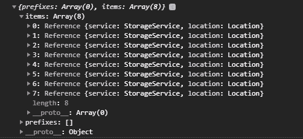

# Firebase 存储简介#2:检索和删除文件

> 原文：<https://javascript.plainenglish.io/introduction-to-firebase-storage-2-retrieve-delete-files-3875f11e6a89?source=collection_archive---------5----------------------->

大家好，在这篇文章中，我们将从上一篇文章[如何将文件上传到 Firebase 云存储](https://victoria2666.medium.com/introduction-to-firebase-storage-1-upload-files-25e63a74a8c2?sk=43d07e7f5f4c7e474c4afb0bd2502372)的地方继续。我们现在将学习如何从 Firebase 云存储中检索和删除文件。


# 从 Firebase 中检索文件

参考上一篇文章，了解如何设置 Firebase 云存储并创建我们将在本文中继续构建的项目。

# 步骤 1:创建 allImages 状态

初始化一个名为`allImages`的数组。该数组将保存从 Firebase 中检索到的所有图像 URL。

```
const [allImages, setImages] = useState([]);
```

# 第二步:getFromFirebase

让我们创建一个名为`getFromFirebase`的函数，它将处理从 Firebase 中检索所有文件。

在此功能中，我们希望:

*   1:参考我们的储物桶
*   2:使用`listAll()`获取里面所有的引用对象

`listAll()`返回对图像的引用，而不是图像本身。它有两个属性:`items`和`prefixes`。项目是图像引用，而前缀是文件夹，以防存储中有嵌套文件夹。

下面是一个例子，当我在存储器中有 8 个图像时，`listAll()`返回什么。



*   3:然后用`forEach()`遍历每个`items`引用，用`getDownloadURL()`获取图像 URL
*   4:最后，用`setImages()`将这个 URL 添加到`allImages`数组中

```
const getFromFirebase = () => {
    //1.
    let storageRef = storage.ref();
    //2.
    storageRef.listAll().then(function (res) {
        //3.
        res.items.forEach((imageRef) => {
          imageRef.getDownloadURL().then((url) => {
              //4.
              setImages((allImages) => [...allImages, url]);
          });
        });
      })
      .catch(function (error) {
        console.log(error);
      });
  };
```

# 第三步:显示图像

然后，我们可以创建一个组件，在这个组件中，我们可以显示来自`allImages`数组中的 URL 的图像。

```
<div id="photos">
     {allImages.map((image) => {
        return (
           <div key={image} className="image">
              
              <button onClick={() => deleteFromFirebase(image)}>
               Delete
              </button>
           </div>
         );
     })}
</div>
```

在每张图片上，我们可以有一个删除按钮，允许用户删除他们点击的图片。让我们看看如何实现按钮的`deletedFromFirebase()`。

# 步骤 4:从 Firebase 中删除

我们的`deleteFromFirebase`函数接受我们的图像 URL 作为参数，并从 Firebase 中删除该 URL。

下面是我们实现该函数的方法:

1.  使用`refFromURL()`，我们可以从 Firebase 存储中获取我们想要删除的图像的图像引用。
2.  然后使用`.delete()`从 Firebase 中删除图像。
3.  最后，我们从我们的`allImages`数组中删除这个 URL。

```
const deleteFromFirebase = (url) => {
    //1.
    let pictureRef = storage.refFromURL(url);
   //2.
    pictureRef.delete()
      .then(() => {
        //3.
        setImages(allImages.filter((image) => image !== url));
        alert("Picture is deleted successfully!");
      })
      .catch((err) => {
        console.log(err);
      });
  };
```

# 而结果呢！


这就是我们上传、检索、显示和删除图像的方式！

要查看我为这个教程做的项目，请访问 repo [这里](https://github.com/victoria-lo/photo-album)。请阅读 [Firebase 文档](https://firebase.google.com/docs/storage)了解更多信息。

感谢您的阅读。我希望这是一个有帮助的 2 部分阅读，以帮助您开始使用 Firebase 云存储。一如既往，请不要犹豫，在下面的评论中分享你的想法。下次再见，干杯！

【https://lo-victoria.com】最初发表于[](https://lo-victoria.com/introduction-to-firebase-storage-retrieve-delete-files)**。**