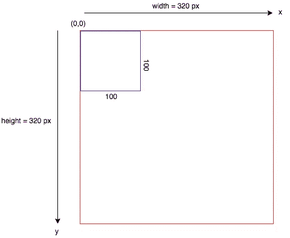
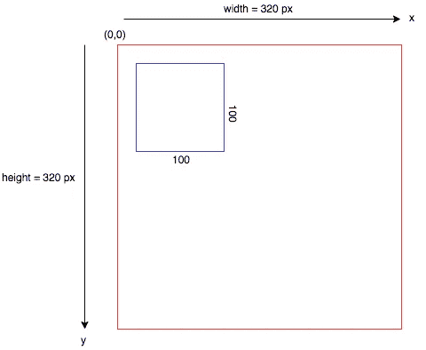

# 用 HTML 画布和 JavaScript 创作艺术

> 原文：<https://javascript.plainenglish.io/introduction-to-html5-canvas-for-generative-art-f8093e3c5ba2?source=collection_archive---------2----------------------->


First attempt at creative coding

# **动机**

在过去的几个月里，除了创作 [Koonchi](https://koonchi.com) ，我对生殖艺术产生了浓厚的兴趣。

> “生成艺术通常指的是[算法艺术](https://en.wikipedia.org/wiki/Algorithmic_art)(由算法决定的计算机生成的艺术作品)”—维基百科

也被称为创造性编码，它是创造性和现代计算机所能提供的一切的结合。我已经作为软件工程师专业工作了 8 年多，但我仍然很难理解为什么我不认为写代码是创造艺术。但正如他们所说的，迟到总比不到好，所以让我们开始我们的冒险吧。

我计划写一系列关于我的创造性编码之旅的文章，这个过程的第一步是探索 HML5 `<canvas>`元素。

你可能会问为什么`<canvas>`元素如此特别，简单的答案是:它可以用来用 JavaScript 绘制图形。它提供了操纵照片的 API，创建游戏和动画的工具，并且它使得创建生成性艺术变得非常容易。

这是否意味着我们只能在网络上使用 JavaScript 进行艺术创作？绝对不行！所有语言都有大量的库、资源和框架。你可能需要做一些调查，但是我在 github 上找到了一个很棒的列表。

# HTML5 画布如何入门？

这是一个分两步走的过程。

**步骤 1** :在你的 HTML 文档中添加`<canvas>`元素，比如

`<canvas id="myCanvas"></canvas>`

**第二步**:在 JavaScript 中使用 canvas 的 context API 进行绘制

```
const canvas = document.querySelector("#myCanvas")
const ctx = canvas.getContext("2d")
```

如果你想跳过实现细节，转而看一个完整的工作示例 check out[codepen](https://codepen.io/varunio/pen/NWWXvVg)&[codepen](https://codepen.io/varunio/pen/wvvpPaY)。

# 什么是语境？

Canvas 允许使用 JavaScript API 进行绘图和像素操作。这幅画必须在画布上进行。把 context 想象成一个要绘画的页面，把 API 想象成可用的工具(或者画笔)。上下文可以是“2d”或“web GL”(3d)。出于介绍的目的，我们将始终假设“2d”上下文。

# 如何设置画布的宽度和高度？

canvas 元素的维度可以在 HTML 中静态设置，也可以使用 JavaScript 动态设置，或者两者结合使用。

使用 HTML:

```
<canvas id="myCanvas" width="200" height="300"></canvas>
```

使用 JavaScript:

```
const canvas = document.querySelector("#myCanvas")canvas.width  = 200
canvas.height = 300// To set width and height of current viewport do// canvas.width  = window.innerWidth
// canvas.height = window.innerHeight
```

# 网格或坐标空间



1: A rectangle on canvas at position 0, 0

如果您希望按照需要定位元素，理解画布的坐标空间是很重要的。画布左上方代表 **(0，0)** 或**原点**坐标。画布上的所有元素都是参照这个原点放置的。网格上的 1 点大致相当于 1px。
图 1 进一步阐述:我们的画布周围有红色边框，我们用蓝色的*笔画*绘制了一个*宽*高*100 像素的矩形*。



2: A rectangle on canvas at position 20, 20

提供 x 和 y 坐标会相对于画布的原点坐标平移元素。如图 2 所示，我们的矩形向右下方移动了 20 个像素，因为我们将 x 和 y 的值设置为 20。

# 怎么画基本形状？

很容易画出基本的形状，如矩形、三角形、正方形、圆形、多边形或两点之间的简单直线。但是默认情况下 Canvas 只提供了绘制矩形的方法。然而，形状的其余部分可以通过使用路径 API 以及直线和圆弧 API 的组合来连接点来创建。让我们看一些代码示例来进一步阐述。

**矩形:**矩形可以根据上下文使用`fillRect(x, y, width, height)`和`strokeRect(x, y, width, height)`方法绘制。`fill`和`stroke`是**墨水**方法，每种情况都意味着用填充颜色画一个矩形，或者画一个颜色的矩形轮廓。默认颜色是黑色。

```
const ctx = canvas.getContext("2d")// fill color of rectangle
ctx.fillStyle = "tomato" // draw rectangle, and fill it with "tomato" color  
// x = 10  
// y = 20  
// width = 200  
// height = 300  
ctx.fillRect(10, 20, 200, 300)// now change style to stroke 
ctx.strokeStyle = "green" // draw rectangle with "green" color stroke (no fill)  
ctx.strokeRect(100, 100, 200, 100)
```

**Circle:** 正如我们之前提到的，没有直接的方法来创建一个圆，但是我们可以使用**path API**和 **arc** 方法的组合来绘制我们的圆。再多了解一点**路径:**

> “路径是连接起来形成不同形状的点的列表”。

这意味着可以在屏幕上的两个给定点之间形成一条路径。它可以是直线或弧形，也可以是任何形状或颜色。使用路径创建形状需要遵循三个步骤:

1.  在上下文 a 上调用`beingPath()`方法创建一个新路径。一旦创建了一个路径，所有将来要绘制的命令都将应用于该路径。
2.  接下来使用绘图方法创建一个路径，比如`lineTo`、`moveTo`、`arc`、`rect`等等。[请参考 MDN](https://developer.mozilla.org/en-US/docs/Web/API/CanvasRenderingContext2D#Paths) 获取与 path 一起使用的所有可用方法的列表。
3.  一旦创建了路径，它就需要实际呈现在画布上；我们可以使用**墨水**方法`fill`和`stroke`来实现。

让我们继续画我们的圆圈。我们必须在上下文中使用`arc(x, y, radius, startAngle, endAngle)`方法来画我们的圆。如果我们试图回忆基本的几何图形，用量角器画一个圆，我们需要一个**半径、**和一个**开始&结束角度**。半圆从角度 0 开始，到 180 度或π弧度结束。所以一个完整的圆延伸得更远，刚好在 2*PI 或 360 度处结束。这个确切的概念可以用来使用`arc`方法画圆。

```
 // Step 1\. Invoke path method
  ctx.beginPath()

  // Step 2\. Creating a circular path
  // x = 300
  // y = 320
  // start angle =  0
  // end angle = 360 or 2*PI
  ctx.arc(300, 320, 75, 0, 2*Math.PI)

  // Fill with Lavender color
  ctx.fillStyle = "Lavender"

  //Step 3\. Now ink on canvas 
  ctx.fill()
```

**线:**我们使用`moveTo(x, y)`和`lineTo(x, y)`方法在两点之间画一条线。如果我们考虑两个点 A & B 分别有 x 和 y 坐标，那么`moveTo`作为 A 在画布上的位置，而`lineTo`作为 B 点的位置。

```
 ctx.beginPath(); // Point A
  ctx.moveTo(350, 50);
  // Point B
  ctx.lineTo(400, 100);

  ctx.strokeStyle = "DeepPink"
  ctx.stroke();
```

**三角形:**三角形简单来说就是三条线连在一起。我们将使用一种叫做`closePath()`的特殊路径方法来完成我们的三角形。`closePath`基本上是在路径内添加一条从终点坐标到起点坐标的直线。如果我们假设一个三角形由三个点 A，B & C 组成，那么我们可以把我们的三角形画成:

```
 ctx.beginPath();

  // Point A
  ctx.moveTo(250, 250);

  // Point B
  ctx.lineTo(500, 400);

  // Point C
  ctx.lineTo(100, 25);

  // Join C & A
  ctx.closePath() ctx.strokeStyle = "Navy"
  ctx.stroke();
```

原来如此！创造性编码要复杂得多，我们只是触及了表面。在接下来的几篇文章中，我们将看看如何添加随机性、噪声、矢量和更多的概念来生成一幅艺术作品。敬请关注！

下面的 CodePen 提供了本帖中提到的所有代码的完整示例:

这是一支额外的钢笔，所有的基本元素都配有令人愉悦的颜色:

自从我开始探索以来，我对基础数学的理解越来越丰富。我总是想知道我将在哪里应用我在学校学到的物理、几何和复杂算法的概念。现在我想我有答案了！

# 资源

1.  [MDN 上的画布 API](https://developer.mozilla.org/en-US/docs/Web/API/Canvas_API/Tutorial)
2.  [苹果在画布上的文档](https://developer.apple.com/library/archive/documentation/AudioVideo/Conceptual/HTML-canvas-guide/Introduction/Introduction.html#//apple_ref/doc/uid/TP40010542-CH1-SW1)
3.  [对 Youtube 上的火车频道进行编码](https://www.youtube.com/channel/UCvjgXvBlbQiydffZU7m1_aw)

让你的创造力发挥到极致，创造出令人惊叹的东西！

合十礼🙏🏾