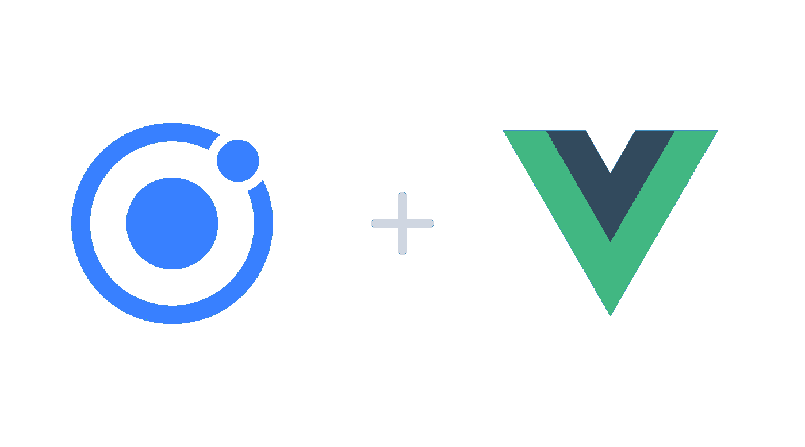

# Ionic Vue 简介

> 原文：<https://javascript.plainenglish.io/introduction-to-ionic-vue-10cd55e67753?source=collection_archive---------11----------------------->

## 这是什么？



[Source](https://ionicframework.com/blog/announcing-the-ionic-vue-beta/)

# 什么是 Ionic Vue？

Ionic Vue 将 Ionic 框架的经验与来自 Vue.js 的工具和 API 结合在一起。Ionic Vue 构建在最近发布的 Vue 3 之上，利用了 Vue 3 的新功能，如 Composition API 和 TypeScript 支持。除了 virtual scroll 之外，您还可以使用 Ionic 框架中的所有组件。

# 装置

为了能够开始用 Ionic Vue 构建应用，你首先需要安装 Ionic CLI。这可以通过运行以下命令来完成:

```
npm install -g @ionic/cli@latest
```

一旦安装完成，您就可以开始使用 Ionic Vue 了！

# 创建您的第一个项目

要创建您的第一个项目，请运行以下命令:

```
ionic start {appName} {template} --type vue
```

只需将`{appName}`替换为您的应用程序名称，将`{template}`替换为您希望应用程序使用的启动模板。`tabs`将创建一个带有简单选项卡式界面的项目，或者`blank`将创建一个空白项目。也可以通过移除 TypeScript npm 包并将`.ts`文件重命名为`.js`(以及其他一些配置更改)来禁用 TypeScript。

# 运行您的应用

要运行您的应用程序，您只需运行`ionic serve`。现在让我们注意一下传统 Vue 应用程序和 Ionic Vue 应用程序之间的一些差异。

# 生命周期方法

支持以下四种 Ionic 框架生命周期方法:`ionViewDidEnter`、`ionViewDidLeave`、`ionViewWillEnter`和`ionViewWillLeave`。

```
methods: {
    ionViewDidEnter() {
      // Fired when the component routing to has finished animating.
    },
    ionViewDidLeave() {
      // Fired when the component routing to has finished animating.
    },
    ionViewWillEnter() {
      // Fired when the component routing to is about to animate into view.
    },
    ionViewWillLeave() {
      // Fired when the component routing from is about to animate.
    }
}
```

# 按指定路线发送

路由是使用`vue-router`处理的，但是为了能够处理 Ionic Framework 的动画，路由器的 API 已经通过`ion-router-outlet`组件进行了扩展。使用路由器几乎与`vue-router`相同，但导入方式不同:

```
import { createRouter, createWebHistory } from ‘@ionic/vue-router’;
```

# 结论

鉴于已经介绍的主要差异，您现在可以开始使用 Vue 构建您的第一个本机(和跨平台)应用程序了！