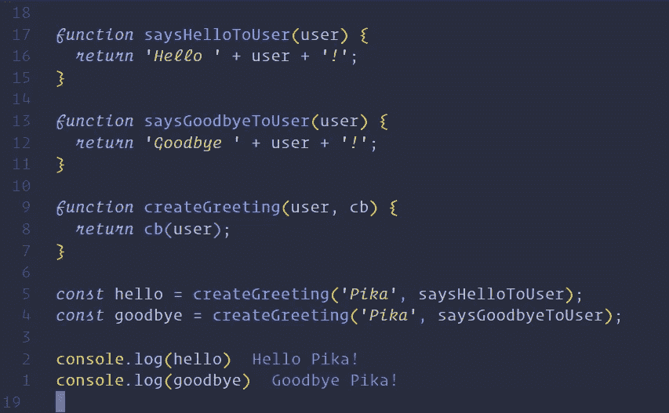
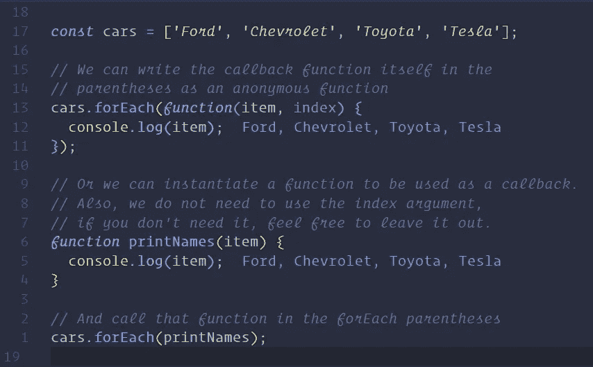
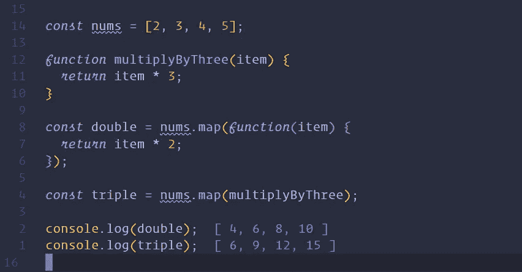

# JavaScript 简介:回调

> 原文：<https://javascript.plainenglish.io/introduction-to-javascript-callbacks-4bcfd0ffd84d?source=collection_archive---------7----------------------->

在这些文章中，我们一直在使用变量，我们知道如何创建和分配变量，也知道如何在代码中传递变量。有一点你可能没有意识到，函数也是变量。我们可以将函数作为值传递给对象，甚至可以将函数作为参数传递给其他函数。在本文中，我们将学习如何使用一个叫做`callbacks`的概念来实现这一点。

**完成本文后，您应该能够:**

*   理解并实施回调。
*   使用两个使用回调的基本数组方法。

# 要求

*   [JavaScript 简介:基础知识](https://medium.com/swlh/introduction-to-javascript-basics-cf901c05ca47)
*   [JavaScript 简介:控制流](https://medium.com/javascript-in-plain-english/introduction-to-javascript-control-flow-6272f92b75fa)
*   [JavaScript 简介:函数](https://medium.com/javascript-in-plain-english/introduction-to-javascript-functions-a0a1687f2318)
*   [JavaScript 简介:数据结构](https://medium.com/@iampika/introduction-to-javascript-data-structures-af1ecb2d38eb)
*   [JavaScript 简介:类](https://medium.com/javascript-in-plain-english/introduction-to-javascript-classes-26010eabd6eb)

# 学习

> 学会理解和实现回调。

# 复试

Javascript 中一个非常重要的概念是将一个函数作为参数传递给另一个函数的能力。这些功能被称为`callbacks`。这些函数可以随时调用，并在函数中传递参数。我们很快就会发现为什么回调对 Javascript 如此重要。惯例是使用`callback`或`cb`参数变量作为回调，尽管你可以随意命名它们。

在`createGreeting`中，我们将参数`cb`设置为等于作为第二个参数传入的值。在上面的例子中，我们看到在第一个`createGreeting`调用中，函数`saysHelloToUser`作为第二个参数被传递。这给了我们在`createGreeting`函数中调用`cb`(等于函数`saysHelloToUser`)的能力。

*   **注意**:当你把函数作为回调函数传递时，不要调用它，这一点很重要。现在，在将函数作为参数传递时，您永远不会想要包含括号。如果您调用您的函数，函数返回的任何内容都将作为参数传递(通常会破坏您的代码)，而不是函数本身。

# 学习

> 通过回调学习使用两个基本的数组方法。

# 概观

现在我们知道了什么是回调，以及如何使用它们，让我们学习一些有用的利用回调的数组方法。

# 更多数组方法

我们已经知道了数组方法，使用过的数组方法有`.push`、`.pop`、`.shift`、`.unshift`、`.length`。但是在一个数组上有更多的方法可供我们使用。我们这里要讲的方法叫做高阶方法，因为它们以回调作为参数。

## 。为每一个

`.forEach`是每个数组的内置 for 循环。`.forEach`将回调作为唯一的参数，遍历数组中的每一项并调用回调函数。回调可以带两个参数，第一个是项本身，第二个是项的索引，这个参数是可选的。

## 。地图

当我们想以同样的方式改变数组中的每一项时，使用`.map`。`.map`将回调作为其唯一参数。像`.forEach`方法一样，回调有可选的参数 item 和 index。与`.reduce`不同，`.map`将返回整个数组。

# 资源