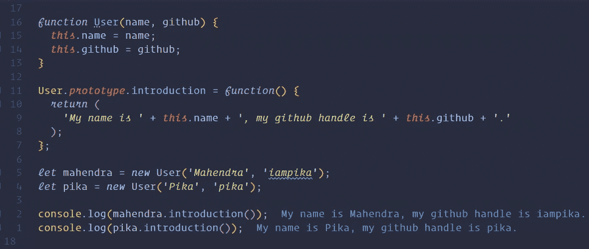

# JavaScript 简介:类

> 原文：<https://javascript.plainenglish.io/introduction-to-javascript-classes-26010eabd6eb?source=collection_archive---------4----------------------->

现在我们已经讨论了基础知识，我们将开始讨论更高级的概念。这里我们将向您介绍类的概念。类只是具有更多功能的对象。当我们想用相同的键和方法创建许多对象时，就会用到类。

**完成本文后，您应该能够:**

*   理解何时使用类，以及编写和使用 ES5 类语法。
*   解释原型，我们如何以及为什么使用它。

# 要求

*   [JavaScript 简介:基础知识](https://medium.com/swlh/introduction-to-javascript-basics-cf901c05ca47)
*   [JavaScript 简介:控制流](https://medium.com/javascript-in-plain-english/introduction-to-javascript-control-flow-6272f92b75fa)
*   [JavaScript 简介:函数](https://medium.com/javascript-in-plain-english/introduction-to-javascript-functions-a0a1687f2318)
*   [JavaScript 简介:数据结构](https://medium.com/@iampika/introduction-to-javascript-data-structures-af1ecb2d38eb)

# 学习

> 学习理解什么时候使用类，以及编写和使用 ES5 类语法。

# 概观

就像函数对于代码块一样，类允许我们通过重用某些对象创建代码来保持代码干爽。类是学习高级 Javascript(框架等)的核心概念。)，尽早了解它们将有助于您理解更高级的概念以及整个 Javascript 语言。

# 班级

很多时候，当我们创建一个对象时，我们也在创建一个模板。Javascript 让我们可以访问我们称之为构造器或`class`的东西，而不是一遍又一遍地复制那个模板。类与常规对象共享许多相同的功能，但也大大扩展了这些功能。类对于创建许多共享一些相同属性和方法的对象(如网站上的用户)非常有用。

## 类和伪经典实例化

如果你有面向对象语言(如 Java 或 C#)的经验，你可能对类的概念很熟悉。虽然 Javascript 没有提供一个“真正的”类系统，但有一些非常熟悉的东西。为了便于讨论，我们将把我们的类对象称为“类”。它使用关键字`new`以伪经典的方式实例化，并且可以接受参数。

在这个例子中，我们将创建一个`Cat`类。类的惯例是给任何可以用关键字`new`实例化的东西一个大写的名字。当我们使用`new`关键字时，Javascript 为我们做了一些很棒的幕后工作，自动创建并返回一个对象。

## `this`上课

当我们开始在课堂上使用关键字`this`时，它会变得非常混乱。在最后一个例子中，我们在 meows 方法中使用它。如果您不确定`this`指的是什么，一个很好的经验法则是查看方法被调用的位置，以及“点”左边的对象。那就是`this`所指的对象。

# 学习

> 学会解释原型，我们如何以及为什么使用它。

# 概观

原型是 Javascript 中的一个高级概念，但是尽早开始了解它是什么非常重要。

# 原型

创建函数是很昂贵的(以计算机内存的方式)，每次我们用方法创建一个新的类对象，我们就在内存中重新创建那些方法。你可以想象一下，如果你正在从一个有几十个方法的类中创建几千个类对象，那么内存会很快增加(20，000–40，000 个方法)。类有一种独特的方式，只需设置一次方法，就可以让该类的每个对象访问这些方法。这就是所谓的`prototype`。每个类都有一个原型属性，我们可以在其上设置方法:

原型方法确实可以访问`this`关键字，就像以前一样，它总是指向调用它的对象(点的左边)。

# 资源