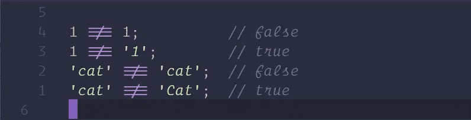

# JavaScript 简介:控制流

> 原文：<https://javascript.plainenglish.io/introduction-to-javascript-control-flow-6272f92b75fa?source=collection_archive---------2----------------------->

很多时候，我们希望我们的程序根据提供给它的信息做出不同的行为。这就是所谓的控制流，是软件开发不可或缺的一部分。

**完成本文后，您应该能够:**

*   理解并能够使用不同的运算符。
*   使用 if/else 语句编写控制流。
*   写一个基本的 for 循环。

## 要求

*   [JavaScript 简介:基础知识](https://medium.com/swlh/introduction-to-javascript-basics-cf901c05ca47)

# 学习

> 学会理解并能够使用不同的运算符。

# 概观

运算符允许软件开发人员比较变量，并使程序能够做出有关控制流的决策。为了理解控制流，我们必须首先理解一些基本的操作符。

# 未定义和空

有几个 JavaScript 对象并不适合任何类型。这些是值`undefined`和`null`。当你寻找一个不存在的东西，比如一个还没有值的变量时，你会得到`undefined`。`undefined`简单地说就是你要的东西不存在。

`null`是一个对象，我们作为开发者，当我们想要告诉其他开发者他们正在寻找的项目存在，但是没有与之相关联的值时，就设置这个对象。`undefined`由 JavaScript 语言设置，`null`由开发者设置。如果您曾经收到过`null`，请知道另一个开发人员已经将该值设置为`null`

最后要注意的是，`undefined`和`null`都不是字符串。它们就像布尔值一样，没有引号。

# 真实性

布尔值，`true`和`false`。当使用一个`if`语句或者其他期望布尔值的语句(比如`!`，NOT)，并且给定的表达式不是一个布尔值时，JavaScript 会做一些叫做类型强制的事情，把给定的任何东西转换成一个布尔值。这就是所谓的真假。每种数据类型都有其真实性。以下是一些例子:

# 比较运算符

比较运算符(`>` `>=` `<` `<=` `===` `!==`)。这些运算符的作用就像在数学课中一样:大于、小于等等。我们使用这些运算符来计算两个表达式。当计算机运行代码时，操作员将返回一个`true`(如果语句为真)或一个`false`(如果语句不为真)。

不得将“三重等于”符号(`===`)与单个等号(表示为变量赋值)混淆。triple equal 将比较两个项目的所有内容，包括类型，并返回它们是否完全相等:(需要注意的是:有一个“double equals”(`==`)符号将比较两个项目，但它不会考虑它们的类型(`1 == '1' // true`)。因此，使用双等号被认为是不好的做法。我们希望看到你总是使用三重等号，你也将总是看到我们使用它。)

我们要介绍的最后一个比较运算符有两个部分。

首先是“不”(`!`)。当您看到这一点时，这将意味着我们在问与表达式相反的问题(我们将在本课稍后重新讨论 NOT 运算符)。

考虑到这一点，我们可以引入“不等于”(`!==`)符号。如果这两项在任何方面都不相等，将返回 true。与三重等号一样，这也考虑了类型。

# 逻辑运算符

我们也可以把两个等式表达式组合起来，问其中一个为真，两个都为真，或者两个都不为真。为此，我们将使用逻辑运算符。

> `&&`

我们要看的第一个逻辑运算符是“AND”运算符。是用两个&符号(`&&`)写的。这将计算两个表达式，如果两个表达式都为真，将返回真。如果其中一个(或两个)为假，则该运算符将返回假:

> `||`

接下来是“或”运算符。用两个竖线写(`||`)。它将确定表达式之一是否为`true`。如果其中一个(或两个)表达式为`true`，它将返回`true`。如果两个表达式都是`false`，将返回`false`:

> `!`

最后一个逻辑运算符是“非”运算符。它被写成一个感叹号(`!`)。我们之前在确定等式时见过这个运算符(`!==`)。和以前一样，NOT 运算符将返回传递给它的相反的布尔值:

## 关于逻辑运算符的注释

关于逻辑运算符，有几点需要注意。

*   表达式按顺序计算，计算机将跳过任何多余的表达式。在一个`&&`语句中，如果第一个表达式是`false`，第二个表达式将不会被求值，因为两个表达式都需要是`true`。同样适用于`||`语句。如果第一个表达式是`true`，那么第二个表达式将不会被计算，因为只需要一个`true`语句来满足操作符的要求。
*   使用括号。正如我们在第二个`!`运算符示例中看到的，我们首先使用括号来计算括号内的内容，然后应用`!`运算符。我们可以将任何表达式用括号括起来，在对整个表达式求值之前，会先对它求值。

# 学习

> **学习使用 if/else 语句编写控制流。**

# 概观

我们在上一课中提到了控制流，现在我们将介绍一些更复杂的内容。事情并不总是非黑即白。有时会有第三个(或第四个，或第一百个，等等。)选项。

> 控制流(续)

在上一课中，我们学习了`if`运算符。我们可以使用`if`来检查一个表达式是否为`true`。如果是，运行一些代码。如果不是，跳过代码，继续运行程序。

为了添加到`if`中，我们也可以使用`else if`和`else`语句。这些语句必须与`if`一起使用，并且必须跟在其后。如果初始的`if`返回`false`，这些语句将被求值。我们可以把`else if`看作是另一个被链接的`if`语句(我们可以有任意多的 if 语句)。只会运行一个`if`或`else if`语句代码块。如果在任何时候一条语句返回`true`，该代码将被运行，其余的将被跳过:

`else`语句将总是出现在 if-else `if`链的末尾，并将作为默认值。如果没有表达式返回`true`，无论如何都将运行`else`代码块。如果前面的`if`或`else if`表达式中有任何一个是`true`，那么`else`语句代码块将不会运行。

> 为什么要用`else if`？

你可能会想，“为什么不使用一堆不同的陈述呢？为什么用`else if`？这是一个合理的问题，有时这是正确的做法。由你来决定哪种方法是正确的。记住，当使用`if/else if`块时，即使有多条语句为真，也只会运行其中一条语句。对于多个`if`语句，情况就不一样了；如果是真的，无论如何他们都会跑。举个例子:

在上面的例子中，即使`if`语句和`else if`语句都为真，也只会记录`older than 20!`。

在上面的例子中，第一个和第二个 if 语句将控制台日志，因为它们都为真。

如您所见，这将由您决定是基于您的数据进行多项操作还是只进行一项操作。

# 学习

> 学习写一个基本的 for 循环。

# 概观

循环是软件“运行”的方式。理解 JavaScript 中的基本循环和本机`for`循环实现。

# 环

大多数软件在循环中运行，一遍又一遍地计算表达式，直到它或者返回我们正在寻找的东西，或者在一段时间后停止。JavaScript 内置了两个循环表达式，今天我们来看看第一个，即“for”循环。

> 对于循环

`for`循环有一个独特的语法，类似于`if`语句，但是稍微复杂一些。首先，我们有`for`关键字，接下来是圆括号，然后是左大括号和右大括号。在括号内，我们需要三样东西。首先，我们必须声明一个变量。这是循环将要循环的内容。然后，我们会有一个条件表达式。该循环将继续发生，直到该语句为`false`。第三，我们将增加变量。这三个语句都用分号隔开。

在这个例子中，我们看到我们最初将`counter`变量设置为 0。循环将会运行，每次循环结束时，计数器都会加 1。然后，for 循环将计算条件表达式。如果是`true`，它将再次运行，但如果是`false`，它将停止运行。

> ++运算符

我们在上两个例子中看到了`++`操作符。这是“将变量的值设置为其当前值加 1”的 JavaScript 简写。还有更多这样的变量数学/赋值速记表达式。我们将在接下来的课程中访问它们。

> 无限循环。

有可能让你的循环陷入我们所说的“无限循环”。您必须确保有一种方法可以结束循环。以这个循环为例:

因为我们的条件表达式将永远是`true` ( `i`永远不会小于 0)，所以这个循环将永远运行下去。这将破坏你的程序，并可能使你的浏览器或电脑崩溃。

# 教程

# 后续步骤

*   [JavaScript 简介:函数](https://medium.com/@iampika/introduction-to-javascript-functions-a0a1687f2318)