# JavaScript 简介:数据结构

> 原文：<https://javascript.plainenglish.io/introduction-to-javascript-data-structures-af1ecb2d38eb?source=collection_archive---------0----------------------->

编写代码时，我们经常发现需要将数据分组在一起。有两种数据类型，对象和数组，可以帮助我们实现这一点。理解这些数据结构是学习 JavaScript 的必要条件。

**完成本文后，您应该能够:**

*   使用数组存储和访问数据。
*   使用对象存储和访问数据

# 要求

*   [JavaScript 简介:基础知识](https://medium.com/swlh/introduction-to-javascript-basics-cf901c05ca47)
*   [JavaScript 简介:控制流](https://medium.com/javascript-in-plain-english/introduction-to-javascript-control-flow-6272f92b75fa)
*   [JavaScript 简介:函数](https://medium.com/javascript-in-plain-english/introduction-to-javascript-functions-a0a1687f2318)

# 学习

> 学习使用数组存储和访问数据。

# 概观

数组允许我们将数据分组并存储在一起。通常这些数据是相关的，但这不是必需的。数组让我们能够将数据集合作为单个变量传递。

# 阵列简介

在[JavaScript 简介:基础知识](https://medium.com/swlh/introduction-to-javascript-basics-cf901c05ca47)中，我们讨论了 3 种基本数据类型(字符串、数字和布尔值)，以及如何将这些数据类型分配给变量。我们讨论了变量如何只能指向单个字符串、数字或布尔值。然而，在许多情况下，我们希望能够指向数据类型的集合。例如，如果我们想使用一个变量`studentNames`来跟踪这个班级中每个学生的名字，会怎么样呢？我们可以用数组来实现。我们可以将数组视为数据集合的存储容器。构建数组很简单:声明一个变量并将其设置为`[]`。然后，我们可以向容器中添加任意数量的字符串、数字或布尔值(用逗号分隔)，并随时访问这些项目。

## 。长度

就像字符串数据类型有一个内置的`.length`方法一样，数组也有一个内置的`.length`方法。事实上，该数组有许多有用的内置方法(我们将在后面的课程中讨论这些方法)。正如字符串`.length`计算字符数一样，数组`.length`将返回数组中的项数:

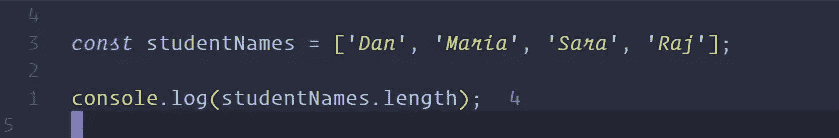

# 访问数组中的项目

我们可以在任何时候访问数组中的一个项，我们只需要通过它在数组中的位置来调用它。根据项目在数组中的位置，按顺序为其指定一个数字位置(索引)。一个数组的数字顺序总是从 0 开始，所以第一项在 0 索引中，第二项在 1 索引中，第三项在 2 索引中，依此类推(这一开始可能很棘手，但是要记住数组总是从 0 开始)。

为了访问该项，我们将输入名称或数组变量，后跟包含数字赋值的括号。

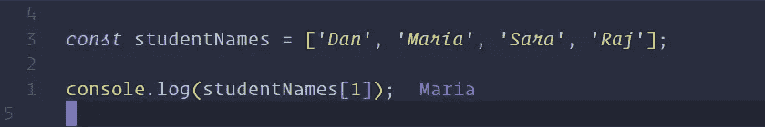

为了动态访问数组中的最后一项，我们将使用`.length`方法。在我们的`studentNames`数组中，长度是 4。我们知道第一项总是 0，之后的每一项都移动一个数。所以在我们的例子中，最后一项的索引是 3。使用我们的 length 属性，我们将展示当我们不知道数组中的项数时是如何实现的:

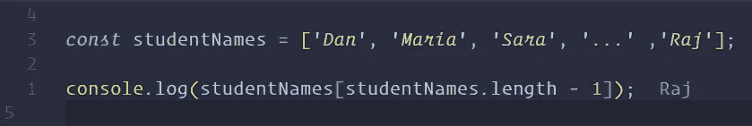

# 分配

我们可以使用括号/索引和=来分配和重新分配数组中的任何索引。

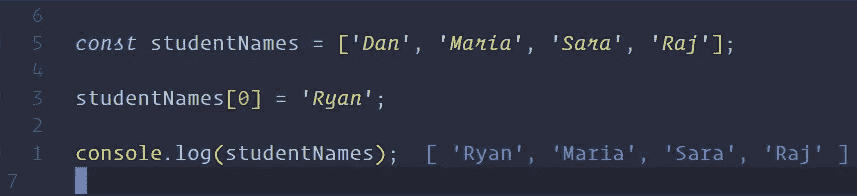

# 。推&。流行音乐

两个非常有用的内置数组方法是`.push`和`.pop`。这些方法指的是在数组的初始声明之后添加和移除数组中的项。

`.push`将一个项目添加到数组的末尾，使其长度增加 1。(`.push`返回新长度)

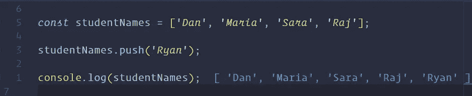

`.pop`删除数组中的最后一项，长度减 1。(`.pop`返回“弹出”的项目)

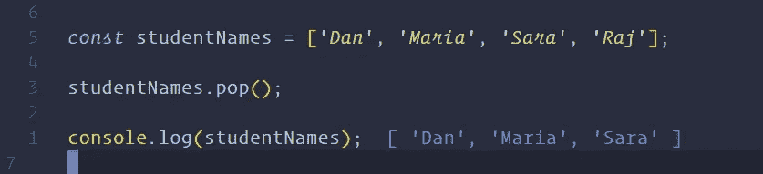

# 。未移位&。变化

`.unshift`和`.shift`与`.push`和`.pop`完全相同，只是它们对数组中的第一项进行操作。`.unshift(item)`会在数组的第一个位置放一个新的项目，`.shift()`会删除数组中的第一个项目。

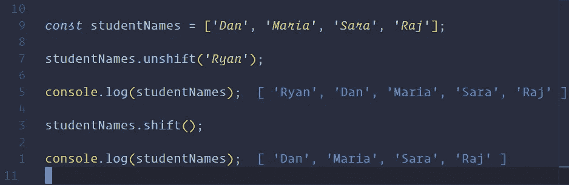

# 关于数组的注释

因为 JavaScript 不是强类型语言，所以数组也不需要类型化。JavaScript 中的数组可以在同一数组中包含多种不同的数据类型。

# 学习

> 学习使用对象存储和访问数据

# 概观

对象是 JavaScript 语言的核心。对象允许我们存储关于单一事物的大量不同数据。理解对象会让你从整体上更好地理解 JavaScript 语言。

## 对象简介

在上一课中，我们介绍了数组。数组是保存数据集合的容器。在这一课中，我们将介绍另一个数据容器，即对象。对象和数组在某些方面是相似的，而在另一些方面是非常不同的。数组保存多个彼此相关的项目，而对象将保存一个事物的大量信息。使用大括号(`{}`)实例化对象。

## 键:值对

与具有索引值项的数组不同，对象使用一个称为键:值对的概念。键是标识符，值是我们想要保存到那个键的值。语法是“键:值”。对象可以包含许多键:值对。它们必须用逗号分隔(对象中不能有分号！).键在对象中是唯一的。该名称只能有一个键。虽然，多个键可以有相同的值。值可以是任何 JavaScript 类型、字符串、数字、布尔值、数组、函数，甚至是另一个对象。在本演示中，我们将创建一个用户对象。

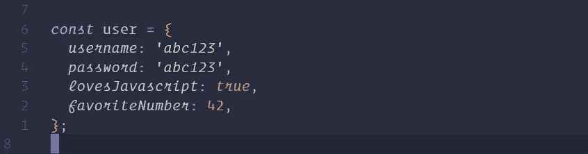

## 访问值

一旦我们有了键:值对，我们就可以通过调用对象名和键来访问这些值。有两种不同的方法可以做到这一点，点符号和括号符号。

使用点符号，我们可以只调用对象名、点和键名，就像我们调用数组的`.length`属性一样(提示:length 属性是一个键:值对):

括号符号就像调用数组中的一个项目，尽管使用括号我们必须使用字符串或数字，或者指向字符串或数字的变量。每个键都可以用引号括起来调用:

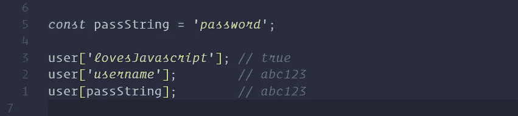

在野外，你会看到括号几乎总是和变量一起使用。

## 赋值

赋值就像访问它们一样。我们可以在创建对象时用点符号或括号符号来分配它们:

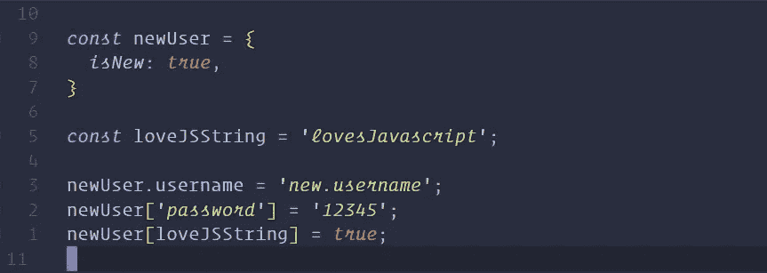

# 删除属性

如果我们想删除一个属性，我们可以使用`delete`关键字:

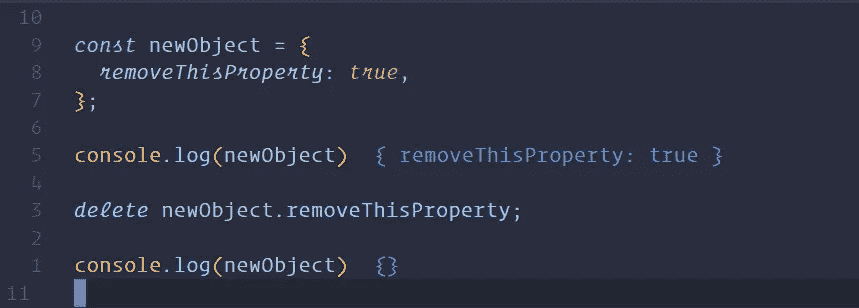

我们很少会看到`delete`关键字的使用。许多人认为将关键字的值设置为`undefined`是最佳实践。到时候就看你的了。

# 方法

在对象中，值可以设置为函数。保存在对象上的函数称为方法。在本课程中，我们已经使用了大量的方法。`.length`、`.push`、`.pop`等。，都是方法。我们可以为名称设置一个键，为函数设置一个值。就像我们调用方法的其他时候一样，我们将使用点符号和尾随括号来调用这个方法(注意:我们可以像调用普通函数一样调用带有参数的方法):

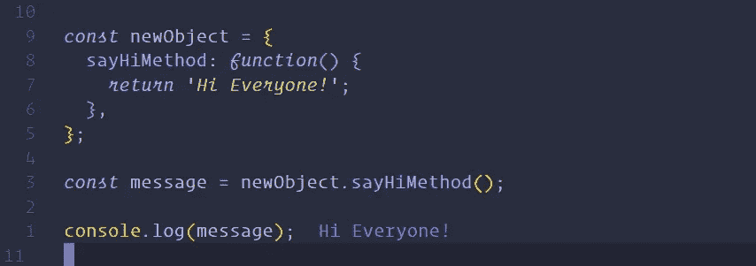

# 对于…循环

有时我们希望迭代对象中的每个键:值对。对于数组，我们使用了标准的 for 循环和索引号变量。对象不包含数字索引，因此标准循环不适用于对象。JavaScript 内置了第二种类型的 for 循环，称为“for…in”循环。它的语法略有不同..开始是一样的，但是在括号中，我们将声明一个变量、关键字`in`和对象的名称。这将遍历对象中的每个键，并在遍历完所有键后结束。我们可以在 for 循环中使用这个键和括号符号来访问与该键相关联的值。

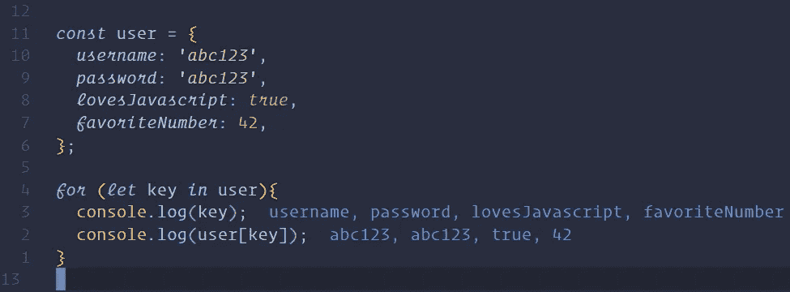

# “this”关键字

对象有一个自引用关键字，可以应用于每个名为`this`的对象。当在一个对象内部被调用时，它指的就是那个对象。`this`可以用来访问同一对象中的其他键，并且在方法中特别有用:

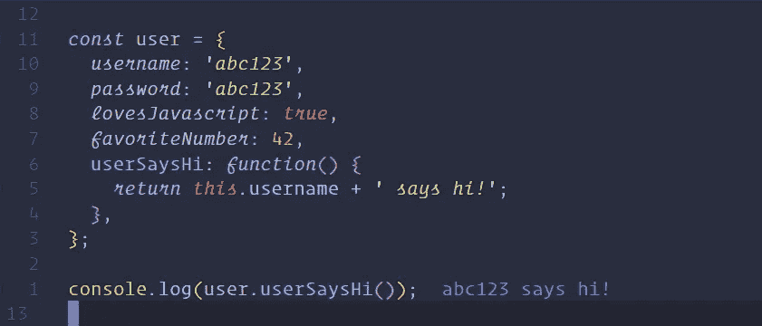

注意:`this`关键字有时可能是 JavaScript 中较难的主题之一。我们在这里使用它是非常基本的，但是这个主题很快会变得更加复杂。

# JavaScript 中的对象

在这一课中，我们学习了什么是对象，以及访问值、调用方法和赋值的许多方法。这些技巧中有许多看起来非常熟悉，就好像我们在迄今为止的学习中几乎每个方面都使用过它们。这里有一个模式，因为 JavaScript 中的一切都是对象。数组只是具有数字键的对象，字符串是具有内置方法的对象，函数实际上是具有自己特殊属性的对象，整个 JavaScript 运行时是一个对象(浏览器中的`window`，或者 Node.js 中的`global`)。你使用 JavaScript 越多，你就会越觉得它有意义。只要记住，一切都是物体。

# 资源