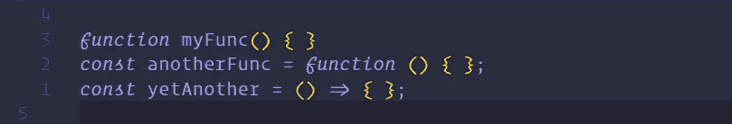
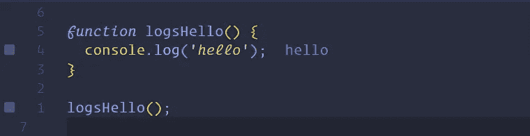
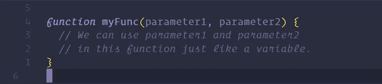
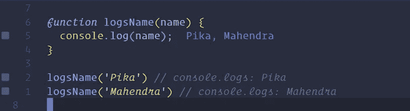
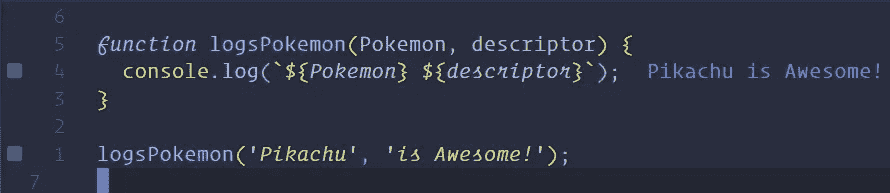
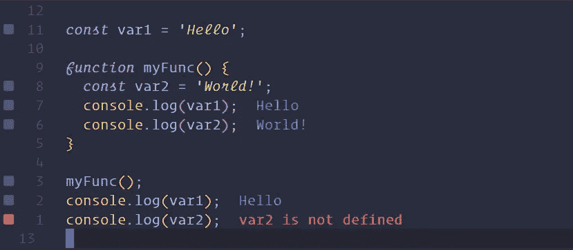
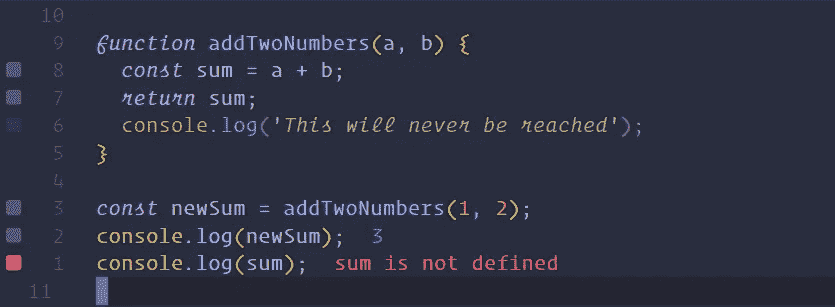

# JavaScript 简介:函数

> 原文：<https://javascript.plainenglish.io/introduction-to-javascript-functions-a0a1687f2318?source=collection_archive---------0----------------------->

需要函数来使我们的代码“运行”。函数将获取数据，计算数据，并返回计算出的数据。JavaScript 中“运行”的所有代码都是在函数内部运行的。

**完成本文后，您应该能够:**

*   理解 JavaScript 函数，我们为什么使用它们，并能够编写正确的函数语法。
*   使用实参和形参编写和调用函数。
*   解释函数作用域和返回语句。

# 要求

*   [JavaScript 简介:基础知识](https://medium.com/swlh/introduction-to-javascript-basics-cf901c05ca47)
*   [JavaScript 简介:控制流](https://medium.com/javascript-in-plain-english/introduction-to-javascript-control-flow-6272f92b75fa)

# 学习

> 学习理解 JavaScript 函数，我们为什么使用它们，并能够编写正确的函数语法。

# 函数介绍

现在我们已经有了 JavaScript 的基础，数据类型，条件语句和变量，我们需要函数来计算它们，改变它们，并对它们做一些事情。我们可以把函数想象成小的计算机程序。需要函数来让我们的代码在 JavaScript 中“运行”。虽然您可能没有意识到，但您一直在使用函数。函数允许我们编写将被反复使用的代码，保持我们的代码`DRY`。因此，函数经常会接受输入并给出输出，尽管这并不总是必需的。函数也有自己的“作用域”，在这个作用域中，我们可以在一个函数中指定一个在其他地方都不可用的变量。

# 如何编写函数

我们有三种方法可以构建一个函数。对于本文，我们将只关注第一个。就我们现在的目的而言，这三种方式都是一样的。

我们将在本文中使用第一种方法，并在以后的文章中讨论其他方法。

# 函数的剖析

一个函数将以关键字`function`开始。这告诉无论是什么在运行你的程序，接下来是一个函数，并把它当作一个函数。之后是函数的名字。我们喜欢给函数起一个描述它们做什么的名字。然后是左括号和右括号。最后，打开和关闭括号。在这些括号之间是我们所有函数代码的位置。

在这个例子中，我们声明了一个函数`logsHello`，并将其设置为`console.log` `'hello'`。我们可以看到，为了运行这个函数，我们需要编写或调用它的名字，名字后面要有括号。这是运行函数的语法。一个函数总是需要括号来运行。

# 学习

> 学习使用实参和形参编写和调用函数。

# 概观

参数和实参允许我们将数据传递给函数，并在函数中使用这些数据。在本目标中，我们将学习两者之间的区别以及如何使用它们。

# 将数据传递给函数

如前所述，我们使用函数的一个重要原因是代码重用。我们一直在寻找方法来保持我们的代码`DRY`(不要重复自己)。因此，函数允许我们将数据传递给它们，以便在函数内部使用。我们可以声明名为`parameters`的小函数变量，并在调用函数时传递数据(这些数据随后被称为`arguments`)。

# 因素

函数参数将表示我们传递给函数的数据，供函数使用。本质上，当我们写一个函数时，我们给数据变量赋值，甚至不知道数据是什么。当我们写函数时，我们把这些`variables`放在括号内。函数中可以包含的参数数量没有限制，但是每个变量名必须用逗号分隔。然后我们可以在函数中使用这些`variables`,就像使用其他变量一样。

# 争论

一旦我们在函数中设置了参数，现在就可以向函数中传递数据了。为了做到这一点，我们将在调用函数时使用我们写的括号。我们称这些数据为`arguments`。`arguments`可以是任何数据类型(字符串，数字，布尔，对象，数组，甚至其他函数！).与其他语言不同，JavaScript 不要求我们在编写函数时设置数据类型，尽管您应该努力理解什么类型的数据将进入函数(如果您使用的是预构建的函数，您应该知道该函数期望的数据类型)。

要使用参数，只需将数据放在函数调用括号中，如下所示:

如果您有多个参数，您将使用多个实参:

实参总是和形参按顺序排列，所以第一个实参就是第一个形参，依此类推。

如果一个参数没有给定实参，该参数将等于`undefined`。

# 学习

> 学会解释函数作用域和返回语句。

# 概观

为了有效地使用函数，我们必须能够从它们返回一些数据。为了从函数返回数据，我们必须理解函数的作用域。

# 范围

范围被定义为我们当前可以访问哪些变量以及在哪里访问。到目前为止，在这个课程中，我们一直在`Global`范围内工作，因为我们可以在代码中的任何地方访问我们创建的任何变量。有几个不同级别的作用域:你可能听说过`block`级别的作用域(用在`if`语句和`for`循环中)，其中使用`let`或`const`的变量只在语句或循环中可用。

# 功能级别范围

函数也有类似的东西，称为函数作用域。函数作用域允许我们在函数内部创建变量，这些变量本质上是函数的私有变量。我们不能从外部进入一个函数并访问这些变量。但是我们可以在函数中的任何地方自由使用这些变量。相反，我们可以访问函数之外的变量。这是一条单行道。函数可以触及并获取其作用域之外的变量，但我们不能触及函数来获取变量。

# `return`声明

我们不会 console.log 函数产生的所有内容。最有可能的是，我们想要返回一些东西。有一种方法可以从函数中访问数据。事实上，它是我们从函数中获取任何数据的唯一方法，那就是使用关键字`return`。将 return 语句视为数据对函数进行转义的唯一方式。除了返回的内容之外，不能在函数外部访问任何其他内容。还要注意，当函数遇到 return 语句时，它会立即停止正在做的事情并返回。

我们还可以将 return 语句的值赋给另一个变量，这样我们就可以访问函数返回的数据了。

*   **注意:**我们将永远无法访问在函数中创建的实际变量。我们只能访问变量被赋值的数据。

# 教程