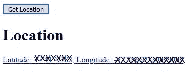

# JavaScript 地理定位 API 简介

> 原文：<https://javascript.plainenglish.io/introduction-to-javascripts-geolocation-api-b01ca61e47f8?source=collection_archive---------0----------------------->

## 地理编码入门

## JavaScript 的地理定位 API 是什么，如何使用客户端 API


Photo by AbsolutVision on [Unsplash](https://unsplash.com)

L 让我们探索一种简单的方法来获取我们网站上用户的纬度和经度，以及他们调用它的位置的地图。这个过程是所谓的[地理编码](https://en.wikipedia.org/wiki/Geocoding)的一部分。

> 有趣的是，在这篇文章中，你可以用你自己的位置做到这一点。

JavaScript 提供了一个 API，[地理定位 API](https://developer.mozilla.org/en-US/docs/Web/API/Geolocation_API) ，它为我们提供了一种获取纬度和经度等信息的方法。

有了这个，我们就可以使用我们最喜欢的地图软件，显示它们的位置，或者将它们存储在数据库中，以备日后分析。

在本文中，我们将只关注纬度和经度，并在 [OpenStreetMap](https://wiki.openstreetmap.org/wiki/About_OpenStreetMap) 中查看。

## 我们将使用地理定位 API 的哪一部分？

对于本文，我们将使用 **navigator.geolocation** 和方法 **getCurrentPosition()** 。

如 MDN 中所述，

> 通过调用`[Navigator.geolocation](https://developer.mozilla.org/en-US/docs/Web/API/Navigator/geolocation)`来访问地理定位 API 这将导致用户的浏览器询问他们是否允许访问他们的位置数据。如果他们接受，那么浏览器将使用设备上最好的可用功能来访问这些信息(例如，GPS)。

`[Geolocation.getCurrentPosition()](https://developer.mozilla.org/en-US/docs/Web/API/Geolocation/getCurrentPosition)`:检索设备的当前位置、纬度和经度。

为了使本文简短，我们将只提供所需的参数，这是一个成功时的回调函数。我们将为此使用一个箭头函数。

## HTML

创建一个叫做**geo.html 的页面。**根据需要保存。

```
<!DOCTYPE html>
<html lang="en">
<head>
<meta charset="UTF-8">
<meta name="viewport" content="width=device-width, initial-scale=1.0">
<meta http-equiv="X-UA-Compatible" content="ie=edge"><title>Location Test</title>
</head><body>
<button onclick='locate();' >Get Location</button>
<h1 id = 'posStatus'></h1>
<a id = 'locInfo' target="#"></a>
</body>
</html>
```

*   **posStatus** 将仅显示信息“定位…”但也可作为错误显示。
*   **locInfo** 将显示纬度和经度以及到 OpenStreetMap 的链接，带有纬度和经度参数。

## JavaScript

在标签中添加以下内容。

```
<script>function locate() {
   const posStatus = document.querySelector('#posStatus');
   const locInfo = document.querySelector('#locInfo'); posStatus.innerHTML='Locating...' if (navigator.geolocation) {
      navigator.geolocation.getCurrentPosition((position)=>{
      const lat  = position.coords.latitude;
      const long = position.coords.longitude; posStatus.innerHTML='Location'; // Display Latitude and Longitude
      locInfo.innerHTML = `Latitude: ${lat}, Longitude: ${long}`; // Create the link. Use map=15-19 for zooming out and in
      // Pass lat and long to openstreetmap
      locInfo.href = `https://www.openstreetmap.org/#map=19/${lat}  /${long}`; });
   }
}
</script>
```

## 运行它

在浏览器中打开 geo.html，然后单击“获取位置”按钮。

出现提示时，点按“允许访问”

过了一会儿，您应该会看到，



Your current location

> 如果你点击纬度或经度链接，它会以 19 倍的缩放比例显示你在 OpenStreetMap 中的位置。

# 结论

这是一个简单的例子，旨在向您介绍一个很酷的 JavaScript API。

我鼓励你探索其他一些很酷的选项，比如*高度、航向和速度*。可通过访问 [MDN](https://developer.mozilla.org/en-US/docs/Web/API/Geolocation_API) 获得。

**感谢您的阅读和快乐编码(定位和跟踪！)**

在 Medium 上阅读所有你想要的文章，并通过成为 Medium 会员来帮助我继续写作，每月只需 5 美元。

[](https://bobtomlin-70659.medium.com/membership) [## 通过我的推荐链接加入灵媒——重力井(罗伯·汤姆林)

### 作为一个媒体会员，你的会员费的一部分会给你阅读的作家，你可以完全接触到每一个故事…

bobtomlin-70659.medium.com](https://bobtomlin-70659.medium.com/membership) 

您可能还喜欢 node.js 中的一些服务器端地理编码。

[](https://medium.com/javascript-in-plain-english/an-introduction-to-geocoding-using-node-js-fe1a5d3aa05c) [## 使用 Node.js 进行地理编码简介

### 地理信息的服务器端访问

medium.com](https://medium.com/javascript-in-plain-english/an-introduction-to-geocoding-using-node-js-fe1a5d3aa05c)