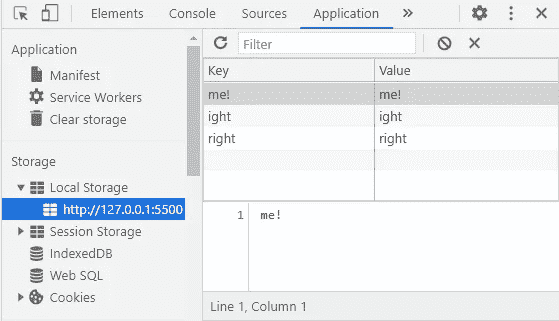

# JavaScript 本地存储简介

> 原文：<https://javascript.plainenglish.io/introduction-to-local-storage-with-javascript-821b7dfd25a?source=collection_archive---------11----------------------->

## JavaScript 本地存储 Web API 及实例

Photo by [Irvan Smith](https://unsplash.com/@mr_vero?utm_source=medium&utm_medium=referral) on [Unsplash](https://unsplash.com?utm_source=medium&utm_medium=referral)

# 什么是 LocalStorage？

JavaScript 中的 LocalStorage 是一个属性，即使用户刷新或关闭页面，它也允许我们保存要存储在浏览器中的数据。localStorage 中存储的数据没有到期时间，这有点类似于 cookies。它受所有主流网络浏览器的支持，我们可以通过浏览器开发工具访问它。

Photo by [National Cancer Institute](https://unsplash.com/@nci?utm_source=medium&utm_medium=referral) on [Unsplash](https://unsplash.com?utm_source=medium&utm_medium=referral)

# 句法

LocalStorage 是 JavaScript 中窗口对象的一部分。Web 存储 API 的存储接口提供对永久保存数据的本地存储的访问。让我们看看下面的例子:

LocalStorage in JavaScript.

这就是我们在 JavaScript 中访问本地存储的方式。

# 在 JavaScript 中使用本地存储

默认情况下，当使用 JavaScript 时，我们有一个 localStorage 对象。这将允许我们从 localStorage 中设置、获取和删除项目。正如我上面提到的，我们可以从浏览器开发工具中访问 localStorage。看看下面的例子:

LocalStorage from Dev Tools.

所以现在我们可以使用 localStorage 方法来设置、获取、清除和删除项目。考虑下面的例子:

Setting items to localStorage.

Getting items from localStorage.

Removing items and clearing the localStorage.

如您所见，localStorage 可以永久保存大量数据。您可以随时删除或访问它们。

# 结论

在用户浏览器中保存网页数据时，LocalStorage 非常重要。当您需要在页面上显示数据时，这也很有用。所以这只是对这个主题的介绍，你可以通过练习和从其他资源中学习来了解更多。