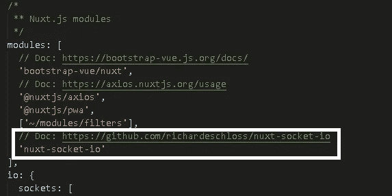
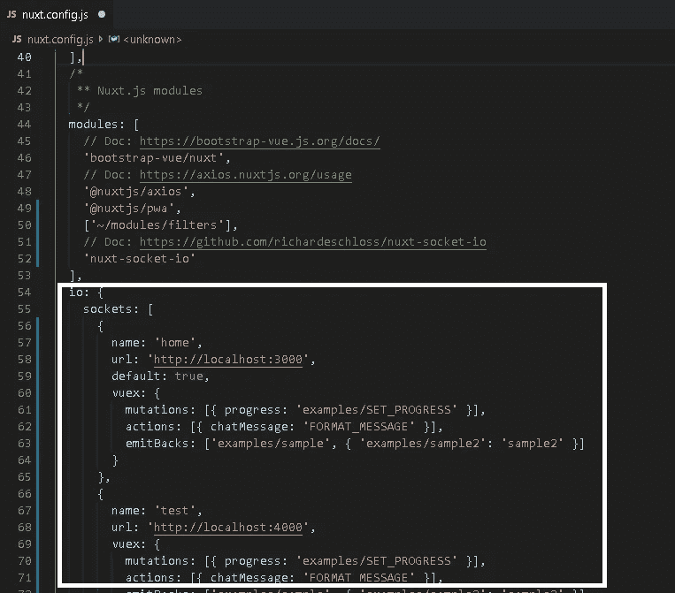
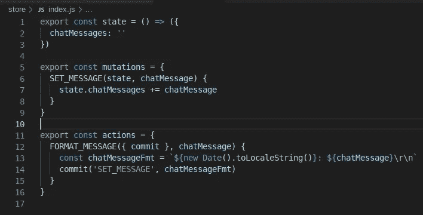
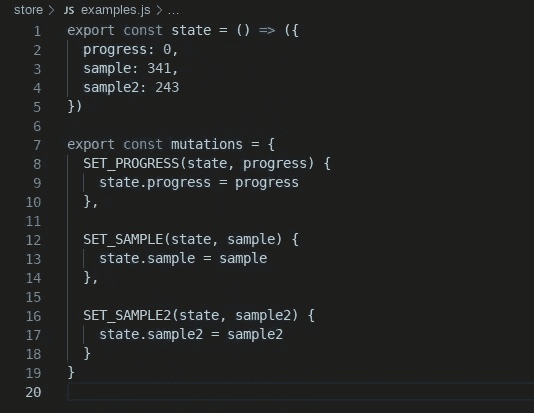
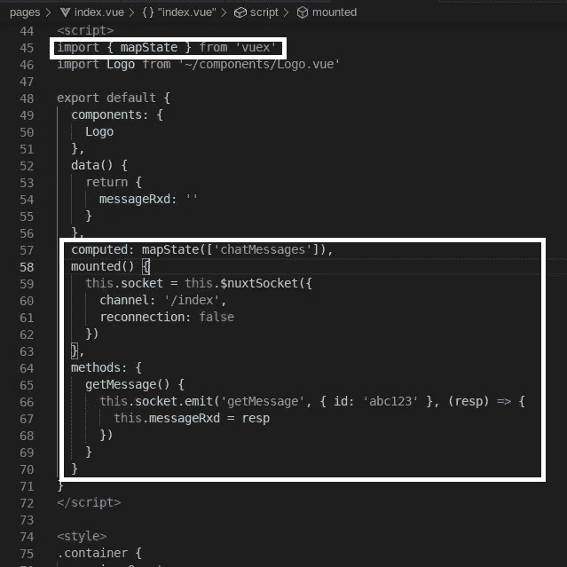
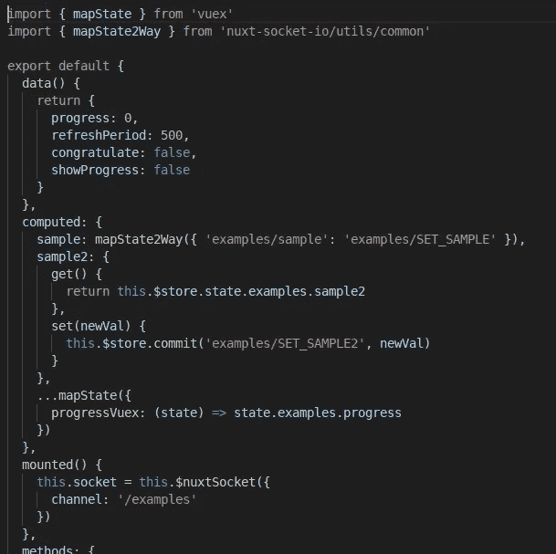

# Nuxt 套接字简介。超正析象管(Image Orthicon)

> 原文：<https://javascript.plainenglish.io/introduction-to-nuxt-socket-io-b78c5322d389?source=collection_archive---------1----------------------->

TL；DR — [nuxt-socket-io](https://npmjs.com/package/nuxt-socket-io) 是 [Nuxt](https://nuxtjs.org/) 框架的一个模块，允许您轻松配置 io:即配置您的套接字。IO 客户端一次，然后使用它们。它与 [Vuex](https://vuex.vuejs.org) 配合得很好，因此您可以将传入的数据直接流式传输到您的应用程序状态。本文解释了如何使用它。

免责声明:我是 nuxt-socket-io 模块的作者。

先决条件:(按顺序列出)

1.  [VueJS](https://vuejs.org/) :渐进式 JS 框架。对于不耐烦的人:专注于组件和计算属性。忽略安装指南，因为安装 Nuxt(下一个项目符号)将安装 VueJS。
2.  [Nuxt](https://nuxtjs.org/) :渐进式 **VueJS** 框架，便于组织和维护您的 VueJS 应用程序。不耐烦者:用`npm i -g npx`安装 npx。然后用`npx create-nuxt-app`创建您的 Nuxt 应用程序，并按照提示进行操作。阅读[模块指南](https://nuxtjs.org/guide/modules)可能会有所帮助，但不是完全必需的。
3.  [插座。IO](https://socket.io/) :网络实时 IO 引擎

推荐读数:

*   [Vuex](https://vuex.vuejs.org/) :【全球】应用程序状态管理。如需了解核心概念，请访问此处。不过，出于实际目的，最好了解 Nuxt 如何与 Vuex 交互，以帮助简化开发。也就是说，如果使用 Nuxt，请以“Nuxt 方式”配置您的商店(参见下一个项目符号)。
*   [Nuxt Vuex Configuration](https://nuxtjs.org/guide/vuex-store) :商店在“商店”文件夹中管理。一旦你掌握了窍门，就很简单了。
*   “[重新思考 Web IO](https://medium.com/@richard.e.schloss/rethinking-web-io-c7efbde0657e?sk=7f24b427802782acd933fc4a05093a58) ”:解释本模块开发背后的动机

从很高的层面来看，`nuxt-socket-io`是一个 Nuxt 模块，它包装了流行的`socket.io-client`。虽然想要直接使用该客户端可能很诱人，但您可能会发现自己必须在多个位置设置配置并重复执行其他常见任务。如果可能的话，开发人员希望努力提高效率和可维护性:代码更少，重复更少，完成更多更快。`nuxt-socket-io`模块允许您配置`nuxt.config.js`文件中的几乎所有内容，但仍然为您提供了`socket.io-client`实例，因此您可能已经熟悉的所有 API 方法都可以使用。对你来说更容易，对我来说维护插件也更容易。

使用该模块的**优点**是:

1.  直接在 nuxt.config.js 文件中用有意义的名称配置多个 IO 套接字。轻松地指定一个默认值，否则列表中的第一个套接字将是默认值。在设计组件时，您可能有兴趣看看数据注入组件后的样子。有多种选择，但是一个简单的选择可能是配置一个“测试”套接字，将虚拟数据注入到组件中。当注入的数据量很大时，这可能特别有用。
2.  直接在`nuxt.config.js`中配置 Vuex 选项。

*   当您的应用程序收到某些事件时，您可能希望简单地触发 Vuex 突变或动作。即，当数据进入时，它被写入应用程序状态。当元件需要这些数据时，只需从 Vuex 存储器中读取即可。
*   当 Vuex 状态改变时，您可能希望某些状态属性的改变触发通知*返回*给 IO 服务器。毕竟，谁说反应必须局限于浏览器？
*   它与您已经在存储文件夹中配置的内容配合良好。

**安装**:(简单)

```
npm i -S nuxt-socket-io
```

**注册模块**:

在`nuxt.config.js`中，只需将其添加到模块列表中:



Module Registration

一旦注册，`$nuxtSocket`将被注入到`context`中，这样你就可以轻松地在你的应用中使用它。但是，为了使用它，您还必须配置模块选项:



Module Options

**配置**

以下是每个插座所需的*和*:

*   **url** :客户端需要一个可以连接的 IO 服务器

以下是*推荐的*:

*   **默认**:指定默认插座。如果您不小心为多个套接字设置了此布尔值，将使用第一个找到的默认值。
*   **名称**:将用于查找所请求的套接字的名称。如果未提供名称，则默认设置为“true”的套接字。如果既没有设置名称也没有设置默认值，将使用第一个套接字。
*   **vuex**:IO 事件到 vuex 突变/动作/发射回的映射。

对于上述示例，将会发生以下情况:

*   **突变:**IO 客户端收到事件“progress”时，会触发 Vuex“examples/SET _ PROGRESS”突变，并将事件的数据传递给突变。(相反，如果选项只是字符串“examples/SET_PROGRESS”，那么当接收到*事件时，就会触发变异)*
*   **动作:**当 IO 客户端接收到事件“聊天消息”时，它将触发 Vuex 动作“‘格式 _ 消息’”。同样，如果只指定了字符串“FORMAT_MESSAGE ”,那么它将被视为事件名称和 Vuex 动作。
*   **emitBacks:** 当 Vuex 属性“examples/sample”改变时，它将发出 *back* 带有该属性数据的“examples/sample”事件。当 Vuex 属性“examples/sample2”发生变化时，它会将*映射的*事件与该属性的数据一起发送回 IO 服务器。`nuxt-socket-io`模块提供了一个实用程序来帮助映射这个状态数据，这样您的组件就可以很容易地使用它。见下文。

在这个例子中，商店被配置为“store”文件夹中的“Nuxt way”。所以，`store/index.js`包含“根商店”，而`store/examples.js`包含“示例商店”。



Root store configuration: When FORMAT_MESSAGE action is dispatched, it’s handled here



“Examples” store config. When state mutations are committed, it’s handled here.

**用法**

好了，所有无聊的工作都完成了！但是模块的想法是你只需要做一次；维护应该很简单。现在，在您的 Vue 组件中使用该模块变得轻而易举。以下是一些例子:

1.  第`index.vue`页:



Index Page

索引页面使用`mapState`助手将`this.chatMessages`绑定到存储在 Vuex 中的`chatMessages`。为了在商店中更新`chatMessages`，我们需要实例化一个套接字。IO 客户端。我们在`mounted()`生命周期挂钩中这样做。注意，我没有指定使用什么名称。通过省略，将使用默认插座，该插座设置了`vuex`选项。我也可以在`$nuxtSocket`中指定`name: home`来获得相同的实例。`$nuxtSocket`函数也接受一个通道作为选项，所有其他选项将作为[连接选项](https://socket.io/docs/client-api/#new-Manager-url-options)传递给底层`socket.io-client`。所以，`reconnection: false`才会荣幸。

虽然 Vuex 的便利性可能很好，但您可能并不总是希望您的数据存在于全球范围内；您只希望它在您的组件范围内。在这种情况下，`$nuxtSocket`实例是一个`socket.io-client`，所以您可以像预期的那样直接使用它:使用`.emit`方法并在回调中接收数据。这正是在`getMessage()`方法中正在做的事情。

2.第`examples.vue`页:



Example of examples.vue page

回想一下 vuex 选项，除了突变之外，我们还指定了“发射回”。因为 vuex 的`mapState`是“缺省的 getter”，如果想要双向绑定，必须提供一个 setter。有两种方法可以完成同样的事情。

1.  该模块提供了一个“mapState2Way”实用程序，可以从`nuxt-socket-io/utils/common`或`nuxt-socket-io/utils/esm`导入。前者是“CommonJS”格式，另一个是“ESM”格式。为了在计算属性“sample”之间建立双向绑定，`mapState2Way`方法需要将 Vuex 属性映射到执行更新的变异。所以在这里，当 Vuex 的“examples/sample”属性改变时，我们希望提交“examples/SET_SAMPLE”变异。
2.  这是一种更加手动的方法，但是给出了实用程序正在做什么的想法。当我们想要将组件的 sample2 属性绑定到 Vuex sample2 属性时，getter 会直接返回它。当我们想要更新属性时，我们提交“examples/SET_SAMPLE2”变异。

**边做边学**

1.  克隆 git 回购:[https://github.com/richardeschloss/nuxt-socket-io](https://github.com/richardeschloss/nuxt-socket-io)
2.  运行开发服务器:`npm run dev`
3.  在[玩 app http://localhost:3000](http://localhost:3000)

抓错了？自从这篇文章发表以来，事情已经并将会发生变化。最有可能的是，Git repo 拥有最新的入门信息，而更全面的文档可以在这里找到:[https://nuxt-socket-io . net lify . app](https://nuxt-socket-io.netlify.app/)。

**结论**

如上所述，Nuxt-socket-io 模块允许 socket.io-client 轻松集成和配置到您的 Nuxt 应用程序中。它使 IO 事件很容易直接映射到应用程序状态，但也公开了套接字。IO 客户端 API，如果你想使用它。希望这篇文章和实际的模块能够有所帮助。

下一篇: [Nuxt-Socket。IO:名称空间配置如何让你的生活变得无比简单](https://medium.com/javascript-in-plain-english/nuxt-socket-io-how-namespaces-config-may-make-your-life-insanely-easier-5d6947d2f9da?source=your_stories_page---------------------------)

**信用/鸣谢**

*   [Sebastian Lubke](https://github.com/SebastianLuebke) :用于打开请求 Vuex 选项支持的问题。