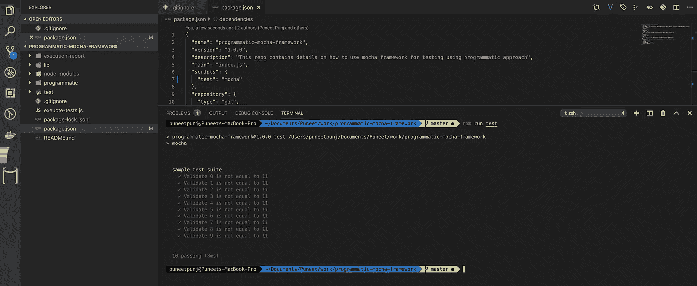
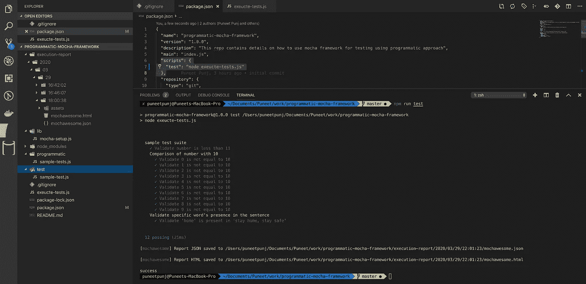
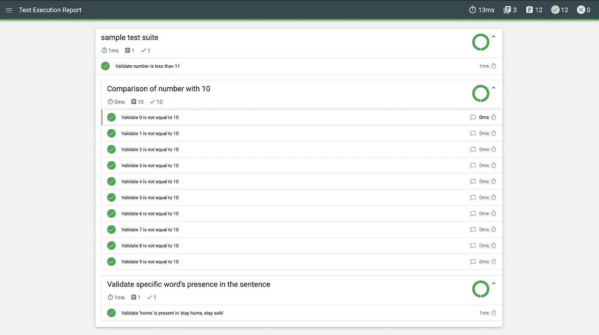

# 介绍使用 Mocha 进行测试的编程方法

> 原文：<https://javascript.plainenglish.io/introduction-to-programmatic-approach-to-mocha-testing-framework-e10d1947148e?source=collection_archive---------2----------------------->

## 使用 Mocha 框架的简单有效的自动化测试方法


Mocha — Testing Framework (simple, flexible, fun)

> Mocha 是一个功能丰富的 JavaScript 测试框架，运行在 [Node.js](https://nodejs.org/) 和浏览器中，使异步测试*变得简单*和*有趣*。Mocha 测试连续运行，允许灵活和准确的报告，同时将未捕获的异常映射到正确的测试用例。托管在 [GitHub](https://github.com/mochajs/mocha) 上。

让我们从了解如何快速设置 mocha 框架并执行一个示例测试开始。请确保已经安装了 [node.js](https://nodejs.org/en/) 。

打开你的终端，安装 mocha 和 chai(断言库)包。

```
mkdir programmatic-mocha-framework && cd programmatic-mocha-framework
npm init -y
npm i mocha chai//setup first testmkdir test
touch test/sample-test.js
```

打开 sample-test.js 并粘贴以下代码:

test/sample-test.js

更新`package.json`中的`scripts`。

```
"scripts": {
   "test": "mocha"
},
```

通过运行`npm run test`执行测试，当 0–9 的数字小于 10 时，将生成所有 10 个测试都通过的终端报告。



Mocha Execution Results

## **现在，让我们看看如何以** [**程序化**](https://github.com/mochajs/mocha/wiki/Using-mocha-programmatically) **的方式编写同样的测试。**


Photo by [Markus Spiske](https://unsplash.com/@markusspiske?utm_source=medium&utm_medium=referral) on [Unsplash](https://unsplash.com?utm_source=medium&utm_medium=referral)

# 第一步

通过运行`mkdir lib && touch lib/mocha-setup.js`在`lib`文件夹中创建新的`mocha-setup.js`。顾名思义，这将包含 mocha 测试所需的基本设置。该文件提供了创建新套件和测试的能力，并公开了执行它们的函数。

在将下面的代码复制到您的测试设置文件之前，安装基本设置所需的两个包`npm i moment-timezone mochawesome`

lib/mocha-setup.js

# 第二步

创建实际测试套件和测试的时间。首先，让我们通过运行`mkdir programmatic && touch programmatic/sample-tests.js`创建一个新文件来放置这些样本测试。在该文件中，我们将:

*   在测试目录下添加相同的测试，但是以编程的方式
*   在父套件下添加另一个测试套件，并在子套件中添加测试
*   在父套件下添加测试目录

将以下代码复制到 sample-tests.js

programmatic/sample-tests.js

# 第三步

一旦所有的测试套件都设计好了，就该看看如何执行它们了。

创建新文件`execute-test.js`并复制以下代码:

execute-test.js

# 第四步

更新`package.json`，用以下代码替换`scripts`

```
"scripts": {
     "test": "node execute-tests.js"
},
```

让我们通过运行相同的命令`npm run test`来执行测试。这将自动创建一个名为`execution-report`的新文件夹，并将基于当前日期时间创建子文件夹。Mochawesome html 和 json 可以在`currentime`文件夹中找到。我已经执行了几次测试，因此有多个时间戳文件夹。您的整个目录将如下所示:



Programmatic Mocha Execution

打开在最新时间戳文件夹`22:03:03`下生成的 mochawesome.html 报告(名称会根据执行时间而改变)。



Mochawesome Execution Report

就这样……在`programmatic/sample-tests.js`中随意添加更多的测试

# 利益

在研究这种方法时，我发现了一些好处:

*   从实际框架中抽象出测试
*   集中管理框架设计，并让每个计划/项目的测试归档
*   允许动态驱动测试数据——这是优于传统 mocha 的关键优势之一。通过这种方式，您可以动态地从 csv 文件中读取数据，并迭代生成相同数量的测试，而不是在代码中提供硬编码的值
*   不同团队使用的整个框架的一个地方的变化
*   我已经使用这种方法将文件上传到 S3 bucket，并通过提升 lib/mocha-setup.js 并传递 initiative name 作为参数来区分报告文件，从而在失败时通过电子邮件发送通知。

更多信息请访问“[以编程方式使用 Mocha】](https://github.com/mochajs/mocha/wiki/Using-mocha-programmatically)

代码可在我的 git [这里](https://github.com/puneetpunj/programmatic-mocha-framework)获得。如果有任何反馈，请随时联系我。

【JavaScript 用简单英语写的一句话:我们总是对帮助推广优质内容感兴趣。如果你有一篇文章想用简单的英语提交给 JavaScript，用你的 Medium 用户名给我们发邮件到[submissions@javascriptinplainenglish.com](mailto:submissions@javascriptinplainenglish.com)，我们会把你添加为作者。