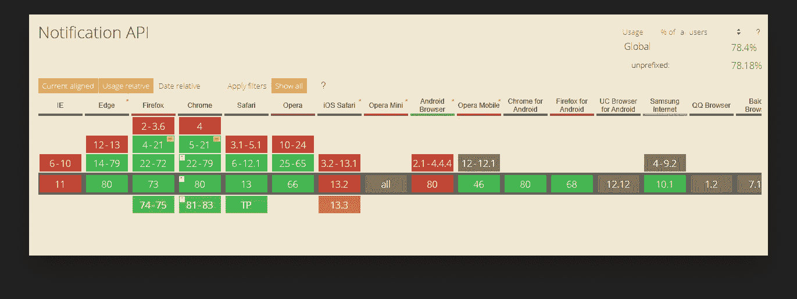
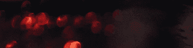
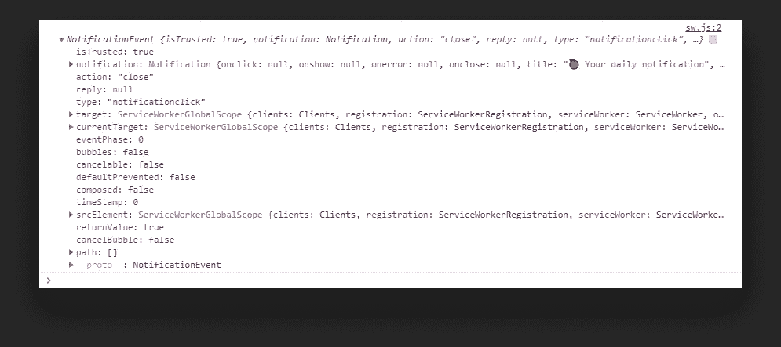
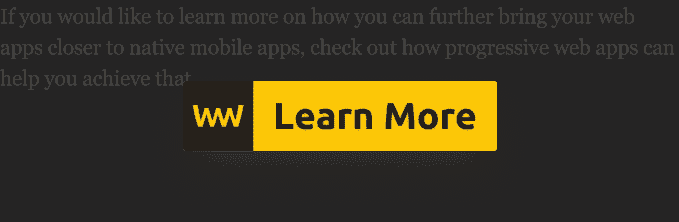

# 推送通知简介

> 原文：<https://javascript.plainenglish.io/introduction-to-push-notifications-c4a08186857e?source=collection_archive---------6----------------------->

## 让你的网络应用离原生应用更近一步

Photo by [Jamie Street](https://unsplash.com/@jamie452?utm_source=medium&utm_medium=referral) on [Unsplash](https://unsplash.com?utm_source=medium&utm_medium=referral)

推送通知是与用户群保持联系的好方法。它让您的 web 应用离原生桌面和移动应用更近了一步。

这些通知可以由正在运行的应用程序触发，甚至可以在应用程序未运行时由服务器触发。API 需要用户的许可，所以你可以确保你只发送通知给那些真正需要他们的人。

他们在一个[服务工作者](https://www.webtips.dev/going-offline-with-service-workers)之上工作，这是一种特殊类型的网络工作者，其目的是让你的应用在用户离线时可用。因此，为了使用推送通知，您必须有一个合适的服务人员。建立服务人员后，我们可以继续检查支持和用户权限。

# 检查支持和许可

如果我们检查对[can use](https://caniuse.com/#feat=mdn-api_notification)的支持，我们可以看到通知 API 还没有被广泛采用，它目前占 78%。

这就是为什么我们需要检查浏览器是否支持它。幸运的是，这可以用一条 if 语句来完成:

如您所见，我们还需要检查`serviceWorker`的存在，因为通知是通过它们发送的。除了支持之外，我们还需要检查权限，因为我们需要获得用户权限来显示通知:

如果第一个 If 语句已经完成，我们就可以开始向用户发送通知。

# 发送通知

正如本文开头提到的，要发送通知，我们必须注册一个`serviceWorker`。要显示通知，我们需要使用服务工作者注册对象:

注册并检查支持/许可后，我们可以呼叫`serviceWorker.getRegistration()`向服务人员请求注册对象，然后我们可以发出我们的第一个推送通知:

Make sure you test it with a webserver

看起来不错，但目前还没什么特别的。我们再增加一些选项。

## 添加更多选项

对于添加选项，您可以创建一个新对象，并将其作为第二个参数添加到`showNotification`:

在这种情况下，第一个参数成为标题。有关可用选项的完整列表，请参见 MDN 上的[文档。有许多有用的属性可以传递，例如:](https://developer.mozilla.org/en-US/docs/Web/API/notification/Notification)

*   `vibrate`:移动设备使用的振动模式
*   `silent`:布尔值，指定通知是否无声
*   `data`:包含任意值的任意数据，以便您可以识别与哪个通知进行了交互
*   `actions`:可供用户选择的`NotificationActions`数组，我们现在就来看看

Push notification with the provided options

## 添加操作

如果你想让用户与你的推送通知交互，你需要在你的选项中添加一个`actions`对象。添加以下对象将在通知中添加两个新按钮:

这里有三个属性可以使用:

*   `action`:用于识别用户采取的动作
*   `title`:这将是按钮上的文本
*   `icon`:如果标题没有足够的空间，将会显示一个图标

Buttons on push notification

## 监听事件

最后要做的事情是当用户点击其中一个按钮时进行监听，这样我们就可以相应地采取行动。为此，您需要在服务工作者内部附加一个事件监听器:

将以上几行添加到`sw.js` *(我们已经注册的服务人员)*中将会记录发出的事件:

在`NotificationEvent`中，您可以访问`action`，它可以告诉我们用户点击了哪个按钮。

# 摘要

现在，您可以在任何合适的时候向用户发送通知。这是与您的用户保持联系、提高参与度以及将更新直接发送到他们的设备中的绝佳方式。用户可以随时选择加入或退出，您可以为通知提供的选项数量可以丰富您的内容，并为您的用户量身定制。

现在到了困难的部分:做出好的商业决策，弄清楚什么，什么时候，怎么做。你应该通知用户什么，什么时候通知他们合适*(不要在半夜通知)*以及你的通知应该多频繁。这些问题的答案因应用而异，所以最好的方法是现在就开始试验。

