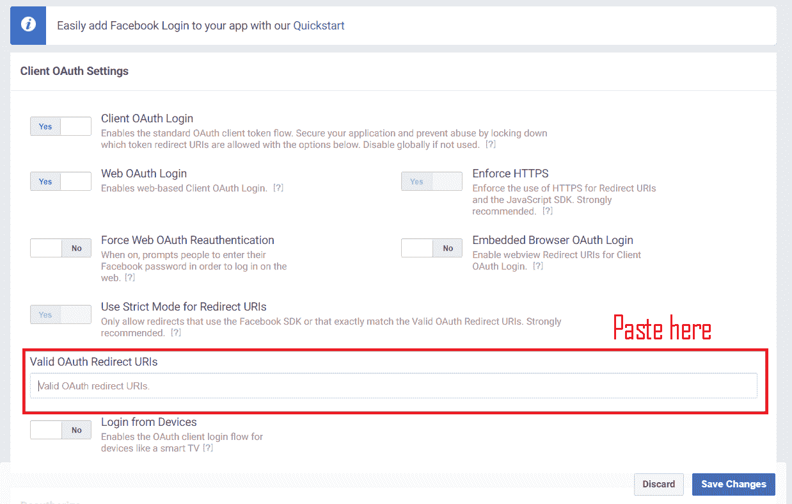
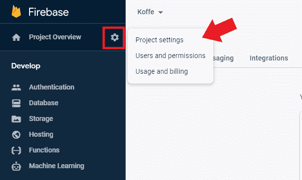

# 使用 Firebase 身份验证的 React 上下文 API 简介

> 原文：<https://javascript.plainenglish.io/introduction-to-react-context-api-with-firebase-authentication-92a6a3cf116d?source=collection_archive---------5----------------------->

大家好！今天的文章将是对 React Context API 的初学者介绍，因为我注意到这个概念对于 React 初学者来说很难掌握。我将使用 Firebase 身份验证来演示使用 React 上下文 API 的好处。我们开始吧！

**遵循本教程的一些先决条件:**

*   对 React(即道具、状态等)有基本的了解。)
*   对 Firebase 了解不多(但更多的知识会有所帮助)


# 什么是 React 上下文 API？

通常在 React 中，我们将名为`props`的东西从父组件传递给它的子组件。React 应用程序由组件组成，许多组件具有父子关系，因此应用程序的简单可视化如下所示:


大多数时候，我们只需要从父代传递到子代，所以使用通常的`state`和`props`就足够了。但是如果我们需要将一个`prop`传递给许多组件呢？即使是那些深深嵌套或在另一棵树上的？


**这样的** `**props**` **的例子有:**

*   用户的首选语言
*   用户选择的应用程序的主题或配色方案
*   经过身份验证的用户的属性

在这种情况下，必须手动将`prop`传入传出每个组件将会非常繁琐！这就是所谓的支柱钻探。因此，React Context API 来拯救我们了。根据他们的官方文件，

*React 上下文 API 提供了将属性传递给子组件的能力，而无需手动传递。*

好了，现在我们知道它是什么，何时需要使用它。

我现在将展示一个使用 **Firebase 认证**的简单例子。我们需要使用上下文 API，因此我们不必手动将经过身份验证的用户属性传递给每个子组件。让我们看看这是如何工作的。

# 步骤 1:创建一个 Firebase 项目

前往[firebase.google.com](https://firebase.google.com/)创建一个新项目。


在仪表板上，单击 Web 图标为 Web 应用程序初始化 Firebase。


按照 Firebase 的步骤，您将到达一个显示配置变量的页面。这很重要，所以复制并保存在某个地方。我们很快就会用到它。


# 步骤 2:设置 Firebase 身份验证

如下图所示，前往认证。


然后，您可以设置 app 的登录方式。以我为例，我将启用**谷歌、电子邮件和脸书。**


# 脸书登录设置

对于谷歌和电子邮件认证，你只需按下切换按钮，使其成为一种登录方式。对于脸书，你需要有一个**脸书开发者账户**来设置它。

> *这是可选的，因此如果您不打算使用脸书作为身份验证方法，请跳到步骤 3。*

前往[developers.facebook.com](https://developers.facebook.com/)创建一个开发者账户

然后创建一个新项目，您将看到这个页面。转到**设置>基本**。复制你的应用 ID 和应用密码。


现在回到 Firebase 并相应地粘贴它们。同时，复制如下图所示的 url。


回到开发人员的脸书，在“添加产品”下，找到一个名为**脸书的产品，登录**，点击**“设置”**按钮。


将你从 Firebase 复制的 url 粘贴到下图所示的字段中，然后点击**‘保存更改’**。



最后，前往**脸书登录>快速启动**并输入你网站的网址。在我的情况下，这只是一个测试应用程序，所以网址是`http://localhost:3000`。点击**‘保存’**就大功告成了！


你的用户现在可以使用脸书在你的应用中进行身份验证。

# 步骤 3:设置 React 项目

在我们的 3 种登录方式(即谷歌、电子邮件和脸书)的 Firebase 身份验证完成后，让我们设置 React 项目，以便能够使用 Firebase。

在我们项目的根目录中，运行:

```
npm install firebase react-firebaseui
```

*   `firebase`包含在 React 应用中设置 firebase 所需的工具和基础设施。
*   `react-firebaseui`提供预制组件来轻松处理和显示身份验证。

# 步骤 4: Firebase 配置

在 React App 的`src`文件夹中创建一个**‘Firebase’**文件夹，在里面创建一个名为`config.js`的文件。这是我们粘贴第一步中的配置变量的地方。如果你忘记复制它，你总是可以从你的 Firebase **项目设置**中找到你的配置变量(见下图)。



在`Firebase/config.js`中，我们将做 3 件事:

1.  导入依赖项
2.  使用`firebase.initializeApp(config)`创建一个 Firebase 应用程序实例
3.  导出此应用程序以供使用，我们将很快看到

在代码中，它应该类似于:

```
//1\. import the dependencies
import * as firebase from "firebase";
import "firebase/auth";

//2\. Initialize app with the config vars
const app = firebase.initializeApp({
  apiKey: process.env.REACT_APP_API_KEY,
  authDomain: process.env.REACT_APP_AUTH_DOMAIN,
  databaseURL: process.env.REACT_APP_DATABASE_URL,
  projectId: process.env.REACT_APP_PROJECT_ID,
  storageBucket: process.env.REACT_APP_STORAGE_BUCKET,
  messagingSenderId: process.env.REACT_APP_MESSAGING_SENDER_ID,
});

//3\. export it for use
export default app;
```

# 步骤 5: Firebase 上下文

现在让我们使用上下文 API 来创建一个 Firebase 上下文。在`Firebase`文件夹中，添加名为`context.js`的新文件。

我们将执行以下操作:

1.  从`config.js`导入 React 依赖项和**应用程序**
2.  使用`React.createContext()`创建并导出一个名为`AuthContext`的 React 上下文
3.  创建并导出包含 React 上下文提供者的`AuthProvider`。

每个上下文对象都有一个**提供者**，允许其他组件使用它的上下文。在这种情况下，我们的`AuthProvider`将向其他组件提供`user`的状态。这样，我们应用程序中的任何组件都可以确定用户是否已经登录并访问用户的属性。

使用`useState`钩子将`user`状态初始化为 null，并使用`useEffect`钩子和 Firebase 的`auth().onAuthStateChanged(setUser)`进行更新。

`onAuthStateChanged`基本上是一个观察器，监听认证的变化。这样，无论用户何时登录或退出，我们的`user`状态都会在我们的`AuthProvider`中自动更新。

代码如下所示:

```
//1.
import React, { useEffect, useState } from "react";
import app from "./config";

//2.
export const AuthContext = React.createContext();

//3.
export const AuthProvider = ({ children }) => {
  const [user, setUser] = useState(null);

  useEffect(() => {
    app.auth().onAuthStateChanged(setUser);
  }, []);

  return (
    <AuthContext.Provider value={{ user }}>{children}</AuthContext.Provider>
  );
};
```

# 步骤 6:将 AuthProvider 导入 App.js

现在，我们可以将`AuthProvider`导入到 **App.js** 中，并将所有组件放入其中。这样，它可以将上下文传递给应用程序中的任何组件(因为它是组件树的顶层节点)。

```
import { AuthProvider } from "./Firebase/context";

function App() {
  return (
    <AuthProvider>
      <Router>
        <div className="App">
          <Nav />
          <Switch>
            <Route path="/signin" exact component={SignIn} />
          </Switch>
        </div>
      </Router>
    </AuthProvider>
  );
}
```

# 步骤 7:登录组件

我们创建了一个 **SignIn.js** 来显示登录按钮，供用户登录我们的应用程序。从上面的 **App.js** 代码可以看出，我的应用程序将在路径`/signin`呈现签到组件。

在`Nav`组件中有一个“签到/注册”按钮，点击后链接到`/signin`路径，显示签到按钮。这之后我们再来看我们的 **Nav.js** 。

因此，我们的登录组件将导入以下内容:

```
import React, { useContext } from "react";
import "../App.css";
import firebase from "firebase";
import { FirebaseAuth } from "react-firebaseui";
import { AuthContext } from "../Firebase/context";
import { Redirect } from "react-router-dom";
```

*   `useContext`是一个 React 钩子，它允许组件使用上下文。
*   `FirebaseAuth`是我们登录方法的样式组件
*   `AuthContext`包含我们将被`useContext`使用的上下文
*   `Redirect`允许我们在登录成功后将用户重定向到主页

在我们的导入语句下面，我们将有:

```
export default function SignIn() {
  //get the user state from the context
  const { user } = useContext(AuthContext); 

  //this is our config for FirebaseAuth
  const uiConfig = {
    signInFlow: "popup",
    signInOptions: [
      firebase.auth.GoogleAuthProvider.PROVIDER_ID,
      firebase.auth.FacebookAuthProvider.PROVIDER_ID,
      firebase.auth.EmailAuthProvider.PROVIDER_ID,
    ],
    callbacks: {
      signInSuccess: () => false,
    },
  };

//if user exists or signed in, we redirect the page to home, else display the sign in methods with FirebaseAuth
  return (
    <div>
      {!!user ? (
        <Redirect to={{ pathname: "/" }} />
      ) : (
        <div>
          <p>Please Sign In</p>
          <FirebaseAuth uiConfig={uiConfig} firebaseAuth={firebase.auth()} />
        </div>
      )}
    </div>
  );
}
```

最后，我们让我们的`Nav`组件显示一个登录按钮，如果没有用户当前认证。如果用户确实存在，我们将通过访问用户的`displayName`和`photoURL`属性显示其姓名和图片。更多的用户属性可以在文档[中找到这里的](https://firebase.google.com/docs/reference/js/firebase.User)。

此外，我们还有一个“注销”链接，单击该链接时将执行`app.auth().signOut()`以注销用户。

以下是我们的 **Nav.js** :

```
import { AuthContext } from "../Firebase/context.js";

export default function Nav() {
   //get the user state from context
  const { user } = useContext(AuthContext);

//if user exists, display user name and picture.
//else, show a sign in button instead
  return (
      <div className="account">
        {!!user ? (
          <div className="dropdown">
            <p>{`Welcome, ${user.displayName}`}</p>
            <div className="dropdown-content">
              <Link to="/">Create Stories</Link>
              <Link to="/">My Stories</Link>
              <Link onClick={() => app.auth().signOut()}>Sign Out</Link>
            </div>
          </div>
        ) : (
          <Link to="/signin">
            <button>SIGN IN/ REGISTER</button>
          </Link>
        )}
      </div>
  );
}
```

# 我们的最终结果

总之，React Context API 提供了一种漂亮而简单的方法来创建上下文，以便将数据传递给应用程序中的其他组件。我希望本文对学习如何使用上下文 API 以及 Firebase 身份验证有所帮助。非常感谢阅读。请在下面留下任何问题或评论。或者，阅读下面的资源以了解有关我们今天讨论的内容的更多信息。下一次，干杯！

# 进一步阅读

*   [反应上下文 API 文档](https://reactjs.org/docs/context.html)
*   [网络应用文档 Firebase](https://firebase.google.com/docs/auth/web/start)

*最初发表于*[*https://lo-victoria.com*](https://lo-victoria.com/introduction-to-react-context-api-with-firebase-authentication)*。*

## 用简单的英语

喜欢这篇文章吗？如果是这样的话，获得更多类似内容由 [**订阅解码，我们 YouTube 频道**](https://www.youtube.com/channel/UCtipWUghju290NWcn8jhyAw) **！**