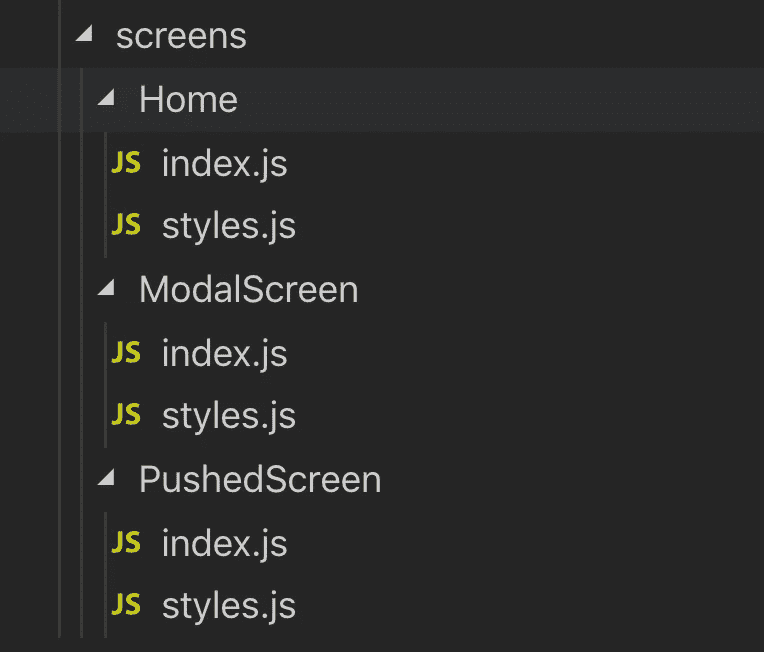
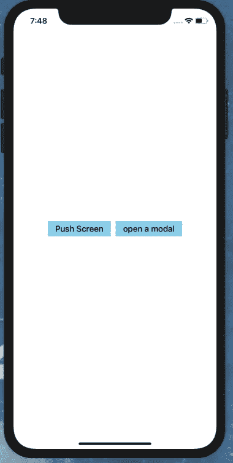
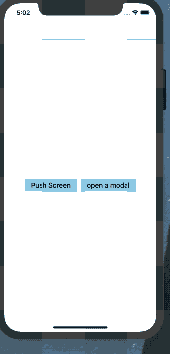
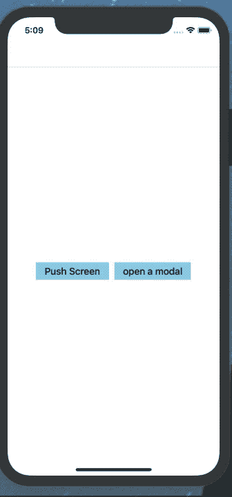

# 反应式本地导航简介

> 原文：<https://javascript.plainenglish.io/introduction-to-react-native-navigation-e453ec30c42f?source=collection_archive---------2----------------------->


在 react-native 中最具挑战性的事情之一是选择正确的导航，这是因为脸书使用了原生导航系统(一个有一些 RN 视图的原生应用)。因此，这将把我们带到两个最受欢迎的导航解决方案*Wix 的 react-native-navigation* 和 Airbnb 的 *react-navigation* 。当然，正如标题中提到的，我们将使用*反应-本地-导航。*要了解两种解决方案的区别，请查看[选择正确的本地导航](https://medium.com/hackernoon/how-to-choose-the-right-react-native-navigation-library-48679d63c9e9)。

## 首先什么是导航？

> 在我们开始之前，让我们先谈谈导航和我们试图解决的问题。基本上导航是应用程序的关键部分，它负责处理交互，允许用户在应用程序的不同内容区域之间移动。

## 为什么选择 react-native-navigation(RNN)？

正如 react-native [文档](https://facebook.github.io/react-native/docs/navigation#react-navigation)中提到的，RNN 在 Android 和 IOS 中都提供了原生导航。这正是我们最终要寻找的；我们的用户应该对导航感到熟悉。另外, *native* 这个词意味着这个库将会更有效率，并且在屏幕之间有平滑的过渡😃。

在那之后，他说让我们创建一个应用程序，集成 RNN，玩 RNN 的基础(堆栈、setRoot、推送、pop、模态等)

## 开始使用。

1-转到命令行，使用 react-native CLI 启动一个新的 react native 项目。我们使用 react-native init 而不是 expo init 的原因是，我们需要向我们的应用程序添加一些本机代码。

```
> react-native init RNNIntro
```

接下来，我们将使用 npm 或 yarn 安装 react-native-navigation 包。

```
> yarn add react-native-navigation# or> npm install --save react-native-navigation
```

然后，我们需要链接本机依赖项，并在项目中添加一些本机代码。

对于 IOS，请遵循这些[说明](https://wix.github.io/react-native-navigation/#/docs/Installing?id=ios)

对于 Android，请遵循这些[说明](https://wix.github.io/react-native-navigation/#/docs/Installing?id=android)

## 基础知识

成功添加 react-native-navigation 后，现在让我们看看如何实现导航。

**首先，让我们添加文件和文件夹:**

```
> cd RNNIntro && mkdir src 
> cd src && mkdir Navigation screens
```

这里👆我们添加了 src 文件夹，它将包含导航和屏幕文件夹

```
> cd Navigation && touch index.js screens.js
> cd ./screens && mkdir Home && cd Home && touch index.js styles.js
> cd .. && mkdir PushedScreen && cd PushedScreen && touch index.js styles.js
> cd .. && mkdir ModalScreen && cd ModalScreen && touch index.js styles.js
```

☝️:在这里，我们将 index.js 和 screens.js 添加到导航文件夹中，并添加了包含 index.js 和 styles.js 文件的主文件夹

现在，文件夹结构应该是这样的



在 Navigation/screens.js 中，我们将注册所有的屏幕，毕竟，每个屏幕组件都必须注册一个唯一的名称

**2。注册屏幕**

这里👆我们注册了 Home、pushedScreen 和 ModalScreen 组件，并给每个组件取了一个惟一的名称。

然后在 Navigation/index.js 中，我们调用 registerScreens 函数并初始化屏幕(应该在创建导航的根之前调用它)。然后，我们还通过 setRoot 命令启动了应用程序。

**3。初始化应用程序**

现在让我们更新 index.js 并调用 start 函数来初始化应用程序。

**添加主屏幕**

现在让我们给我们的主屏幕添加一些基本的样式

Home/index.js

Home/styles.js

现在，应用程序应该看起来像这样



## 推出您的第一个屏幕

为了推送一个屏幕，我们需要使用[导航。推送](https://wix.github.io/react-native-navigation/#/docs/screen-api?id=pushcomponentid-layout)这个方法期望从屏幕`props.componentId`接收当前显示的组件 id。

现在，让我们使用按钮屏幕按钮导航到下一个屏幕

下面是 Home/index.js 的样子

让我们向 pushScreen 组件添加一些基本样式

推送的 Screen/index.js

pushed screen/style . js

> 在继续阅读之前，请先去测试一下上面的代码

欢迎回来😜。正如所料，点击按钮屏幕按钮后没有任何反应，原因是我们应该使用`stack` [布局类型](https://wix.github.io/react-native-navigation/#/docs/layout-types?id=stack)进行导航。

更新 Navigation/index.js setRoot 命令

```
Navigation.setRoot({
 root: {
    stack: {
         children: [{
              component: {
                 name: 'HomeScreen',
              },
         }],
    },
 },
});
```

现在再试一次，瞧，你推出了你的第一个屏幕。



我知道我知道。这看起来很糟糕，但为了简单起见，让我们保持这种状态😛

请记住，当导航时，我们可以将道具传递到我们正在推动的屏幕，并且我们还可以使用[选项](https://wix.github.io/react-native-navigation/#/docs/options-migration?id=common-options)来设计导航器的外观。我们将在打开一个模型时探索它们

**弹出屏幕**

在按下当前屏幕后，用户应该能够回到上一个屏幕，这可以通过点击默认提供的顶部栏的返回箭头按钮来完成(如果我们想的话，我们可以使用选项隐藏顶部栏)，或者如果你在 IOS 中，通过从左向右滑动手指来完成。或者使用 Navigation.pop 方法

现在让我们用 goBack 按钮连接 navigation.pop

## 打开您的第一个模式。

在我们打开模态之前，让我们先谈谈 RNN 的 openModal 和 pushScreen 之间的区别，以及何时使用模态

基本上，模态只是推动屏幕的另一种方式，但它有一些独特的功能和行为，例如:

*   默认情况下，Modal 有一个向上滑动的动画(Android)
*   Modal 没有默认的后退按钮。

**何时使用情态动词。**

当需要用户立即注意时，使用模态，因为它会阻止用户与它下面的视图交互。模式的典型用例是警报、动作表以及简短的任务和流程。

现在让我们创建打开的模态。

**首先**，让我们将导航 openModal 方法与主屏幕中的按钮连接起来。

让我们分解一下 openModal 方法:

*   passProps:允许我将道具传递到推送的屏幕，在这种情况下，道具名称为*文本*，其值为*这是模态屏幕*
*   选项:在选项对象中，我们指定了顶栏标题并添加了左按钮

现在让我们转到 ModalScreen，给它一些基本的样式

正如你在这里看到的👆我们添加了*navigation button pressed*事件，每当用户按下 TopBar 按钮时都会调用该事件，然后当用户单击左按钮时，我们会消除该模式(我们将该按钮的 id 设为“left button”)。在 render 函数中，我们检索并显示了文本属性。



# 奖金

因为你是我最喜欢的读者，我想和你分享一个更好的方法来组织你的导航。让我们在`**Navigation/index.js**`中声明我们所有的函数，而不是在每个组件上声明导航函数。1-从`**Home/index.js**`中移除`**openModal**`和`**PushScreen**`功能。

2-打开`**Navigation/index.js**`，添加导航功能

3-为了方便导入该文件，我们将把`**package.json**`文件添加到导航文件夹中。

```
**{
	"name": "Navigation"
}**
```

4-现在转到`**Home/index.js**`，导入功能并替换

```
**import {Navigation} from 'react-native-navigation'**
```

随着

```
**import {pushScreen, openModal} from  'Navigation';**
```

# 感谢阅读📚！

我希望你和我一样喜欢这个关于 RNN 的快速介绍，祝你的 react-native-navigation 之旅好运。请查看[回购](https://github.com/Yassir4/react-native-navigation-intro)别忘了关注我的 [***推特***](https://twitter.com/hartaniyassir) 和[***Github***](https://github.com/Yassir4/)

> ***本文原载于*** [***Obytes 博客***](https://www.obytes.com/blog/2019/intro-to-react-native-navigation/) ***。***