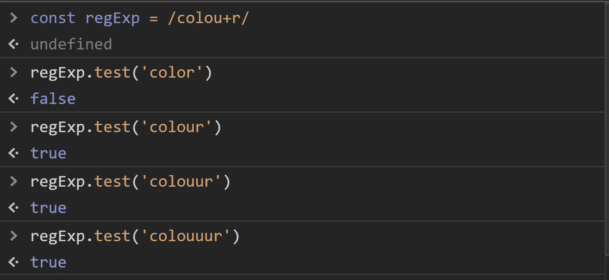

# 理解正则表达式第 5 部分

> 原文：<https://javascript.plainenglish.io/introduction-to-regular-expressions-8be3b2271af?source=collection_archive---------13----------------------->

特殊字符

在本系列的上一期中，我们从一些简单的模式匹配开始了正则表达式引擎。我们代码的第一次迭代可以匹配文字字符和通配符。为了更多地了解正则表达式的内部工作原理，让我们给引擎添加一些功能。更具体地说，让我们添加一些通用特殊字符:'？'，'+，' ' * '在我们开始了解引擎如何识别这些模式之前，我将简要介绍一下每个特殊字符的工作原理:


1.  '?'-问号表示匹配该字符一次或多次。只有当字符出现不止一次时，这种模式才会失败。
2.  +'-加号表示一个字符可以在一行中的给定位置出现一次或多次。如果字符没有出现在该位置，则失败。
3.  *-这种模式有趣而独特，因为它在技术上永远不会失败。' *特殊字符状态匹配在我前面 0 次或更多次的字符。

让我们来看一些例子，看看这些角色在实践中是如何工作的。


? special character

从上面可以看出，这个“？”特殊字符本质上使它前面的字符是可选的。对于最后一行,“u”字符出现了两次，打破了模式并返回 false。现在让我们看一些“+”的例子



+ special character

这个角色很有趣，因为只有当这个角色根本没有出现时，它才会失败。只要角色确实出现了，出现的次数就无关紧要了。只有在文本“颜色”中，测试才返回 false。测试只是简单地问“这个角色是否出现在这个位置？”


‘*’ special character

从我们的测试中，我们可以看到模式从不失败，这似乎与最后一行“coloxr”返回 false 相矛盾。然而，实际上，该模式会失败，因为引擎会将“x”与内联的下一个字符“r”进行比较


基础知识说完了，让我们深入研究正则表达式引擎的代码。

```
export default function regtest(pattern, text) {
  //pattern is the regular expression pattern to match against
  //text is the text with which to find the regular expression pattern
  //textCounter-the counter that points to the place in the text the engine is checking
  //patternCounter-the counter that points to the place in the regular expression patternCounter
  //being checked
  //innerCounter-the counter of the inner loop for the current place in the text being
  //checked against patternCounter
  const specialcharacters = ['?','+','*','^','$']
  let textCounter = 0
  //outer loop that**while(textCounter < text.length)**{
    let patternCounter = 0
    if(text[textCounter] === pattern[0]
      || pattern[0] === '.'
      ){
      let innerCounter = textCounter
      **while(patternCounter < pattern.length &&
        (pattern[patternCounter] === text[innerCounter]
          || pattern[patternCounter] === '.'
          || specialcharacters.includes(pattern[patternCounter + 1])
        ))**{
        **if(pattern[patternCounter + 1] === '?')**{
          if(pattern[patternCounter] !== text[innerCounter]){
            innerCounter -= 1
          }
          patternCounter += 1
        }
       ** else if(pattern[patternCounter + 1] === '*')** {
            if(pattern[patternCounter] !== text[innerCounter]){
              innerCounter -= 1
            }
            else {
              while(pattern[patternCounter] === text[innerCounter + 1]){
                innerCounter += 1
              }
            }
            patternCounter += 1
        }
        **else if(pattern[patternCounter + 1] === '+')** {

            if(text[innerCounter] !== pattern[patternCounter]){
              break
            }
            else {
              while(pattern[patternCounter] === text[innerCounter + 1]){
                innerCounter += 1
              }
            }
            patternCounter += 1
        }
        innerCounter += 1
        patternCounter += 1
      }
      if(patternCounter >= pattern.length){
        return true
      }
    }
    textCounter += 1
  }
  return false
}
//exports.regtest = regtest;
//module.exports = regtest
```

在上面的代码中，我将最重要的部分加粗，以突出逻辑流的最关键方面，就像之前外部 while 循环遍历每个字符以寻找匹配一样。如果在找到匹配之前到达了字符串的末尾，则返回 false。一旦引擎找到第一个匹配，内部循环就扫描本地字符，寻找完整的模式匹配。在 if-else 分支中，三个特殊字符有自己的逻辑分支:' *，' '？'和“+.”对文字字符和通配符的测试在内部 while 循环的条件中。

回顾 if-else 分支的逻辑，特殊字符的简单公式是一个简单的两步过程:

1.  如有必要，引擎会确定字符是否与模式匹配。
2.  如果模式不匹配，则中断并返回 false。
3.  如果模式匹配，确保 innerCounter 和 patternCounter 变量在下一次循环迭代中处于正确的位置。换句话说，下一步必须比较正确的字符。

## 结论

构建这些特殊角色的逻辑的主要要点是位置决定一切。至少到目前为止，让引擎工作的困难是确保在逻辑流中的正确点比较正确的字符和模式。到目前为止，我们还不需要任何帮助方法。代码可以很好地处理 while 循环和 if-else 语句。

我们是怎么知道的？在我们的下一期文章中，当我们回顾 jest 单元测试引擎时，我将回答这个问题。

# 更多资源

RegExpr-学习、构建和测试正则表达式的在线工具

[RegEx One](https://regexone.com/)-通过简单的互动练习学习正则表达式

[正则表达式信息](https://www.regular-expressions.info/refcharacters.html)-特殊字符

著名的 JavaScript 书《雄辩的 JavaScript》中有一章非常精彩地讲述了正则表达式。

[GitHub](https://github.com/GreatDeveloper66/RegExp-Engine)——GitHub 储存库，用于本文中回顾的代码。